## ScenarioView
1. UseCase — Scenario View: Use Case Diagram
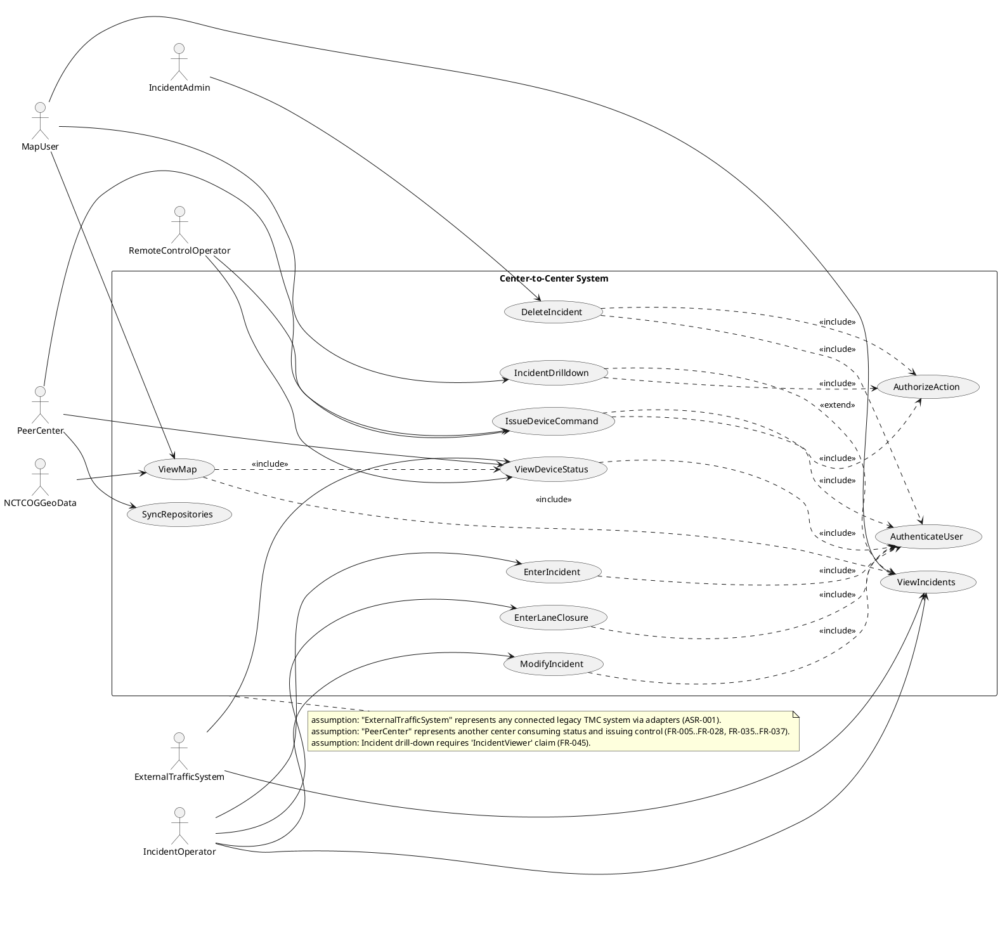

## LogicView
2. Class — Logic View: Class Diagram
```plantuml
@startuml Class_LogicView
skinparam classAttributeIconSize 0

class Network <<persisted>> {
  +networkId: String
  +name: String
  +getTopology(): Topology
}

class Topology <<persisted>> {
  +topologyId: String
  +networkId: String
  +getLinks(): List<Link>
  +getNodes(): List<Node>
}

class Link <<persisted>> {
  +linkId: String
  +name: String
  +type: String
  +speedKph: Integer
}

class Node <<persisted>> {
  +nodeId: String
  +name: String
  +typeDescription: String
}

class Incident <<persisted>> {
  +incidentId: String
  +networkId: String
  +description: String
  +roadway: String
  +geo: String
  +timestamp: String
  +impact: String
  +create(): void
  +update(): void
  +delete(): void
}

class LaneClosure <<persisted>> {
  +laneClosureId: String
  +networkId: String
  +description: String
  +create(): void
  +delete(): void
}

abstract class Device <<persisted>> {
  +deviceId: String
  +networkId: String
  +name: String
  +location: String
  +status: String
  +getStatus(): String
}

class DMS <<persisted>> {
  +beaconsOn: Boolean
}

class LCS <<persisted>> {
  +laneAssignment: String
}

class CCTV <<persisted>> {
  +videoChannelInputId: String
}

class DeviceCommand <<persisted>> {
  +commandId: String
  +networkId: String
  +deviceType: String
  +deviceId: String
  +operation: String
  +payload: String
  +requestedBy: String
  +requestedAt: String
  +status: String
  +validate(): Boolean
}

class CommandTimeframe <<persisted>> {
  +networkId: String
  +deviceType: String
  +daysAccepted: String[*]
  +timesAccepted: String[*]
}

class UserAccount <<persisted>> {
  +userId: String
  +username: String
  -passwordHash: String
  +mfaEnabled: Boolean
  +lockedUntil: String
  +verifyPassword(password: String): Boolean
  +isLocked(): Boolean
}

class AuthSession <<persisted>> {
  +sessionId: String
  +userId: String
  +issuedAt: String
  +expiresAt: String
  +claims: String[*]
}

class AuditEvent <<immutable>> {
  +eventId: String
  +timestamp: String
  +type: String
  +userId: String
  +action: String
  +targetId: String
  +details: String
  +hashPrev: String
  +hashThis: String
}

class TrafficRepository <<persisted>> {
  +saveIncident(i: Incident): void
  +saveLaneClosure(lc: LaneClosure): void
  +saveDevice(d: Device): void
  +saveCommand(cmd: DeviceCommand): void
  +queryIncidents(networkId: String): List<Incident>
  +queryDeviceStatus(networkId: String, deviceType: String): List<Device>
}

interface IExternalTrafficSystemAdapter {
  +connect(): void
  +pullUpdates(): void
  +pushCommand(cmd: DeviceCommand): void
}

class TMDDCodec {
  +encode(message: String): String
  +decode(payload: String): String
  +validateSchema(payload: String): Boolean
  +negotiateVersion(peer: String): String
}

class SecurityGateway {
  +enforceTlsMutual(): void
  +redactSecrets(input: String): String
  +authorize(claim: String, session: AuthSession): Boolean
}

Network "1" o-- "1" Topology
Topology "1" *-- "0..*" Link
Topology "1" *-- "0..*" Node

Network "1" o-- "0..*" Incident
Network "1" o-- "0..*" LaneClosure
Network "1" o-- "0..*" Device
Network "1" o-- "0..*" CommandTimeframe

Device <|-- DMS
Device <|-- LCS
Device <|-- CCTV

DeviceCommand "0..*" --> "1" Device : targets
UserAccount "1" --> "0..*" AuthSession
UserAccount "1" --> "0..*" AuditEvent
TrafficRepository "1" --> "0..*" AuditEvent : writes

IExternalTrafficSystemAdapter ..> TMDDCodec : uses
SecurityGateway ..> UserAccount : verifies
SecurityGateway ..> AuditEvent : logs
TrafficRepository ..> SecurityGateway : uses

note right of TMDDCodec
NFR-001/002/003/013/ASR-004:
TMDD v3.0+ over DATEX/ASN v1.5 over TCP/IP with TLS 1.2+.
Schema validation + version negotiation at session start.
end note

note right of SecurityGateway
NFR-004/NFR-006/ASR-008:
- Password min 12, lockout 5 attempts/30 min
- bcrypt/scrypt hashes
- MFA enforced when enabled
- mTLS for password-field APIs
- audit logs must never contain password
end note

note bottom of TrafficRepository
ASR-003: relational repository (PostgreSQL/MySQL),
indexed by networkId, deviceId, timestamp.
end note
@enduml
```

3. Object — Logic View: Object Diagram
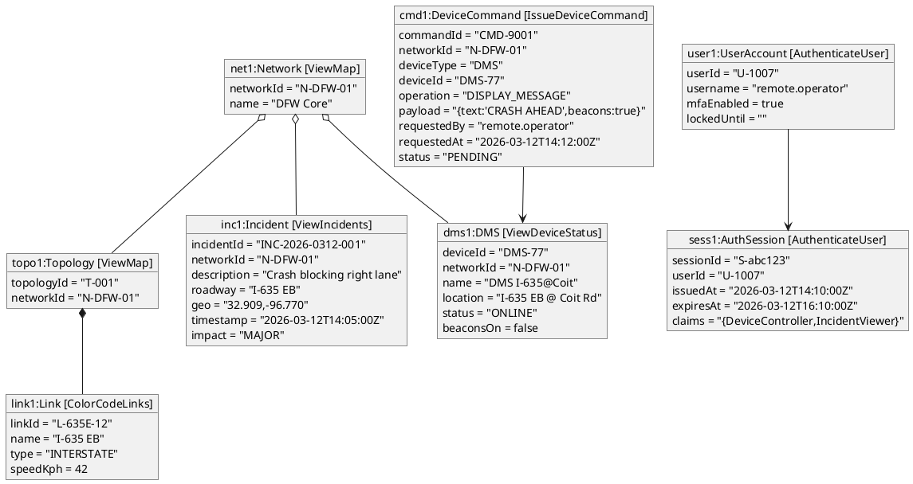

4. State — Logic View: State Diagram
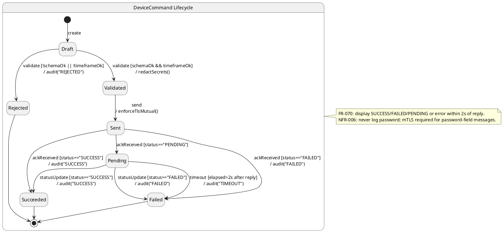

## ProcessView
5. Activity — Process View: Activity Diagram
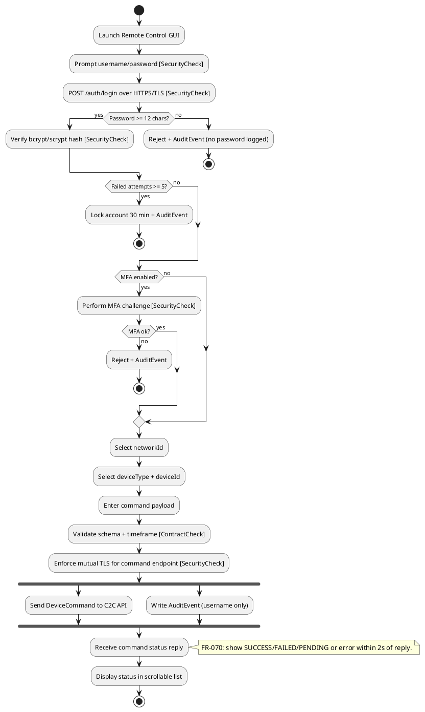

6. Sequence — Process View: Sequence Diagram
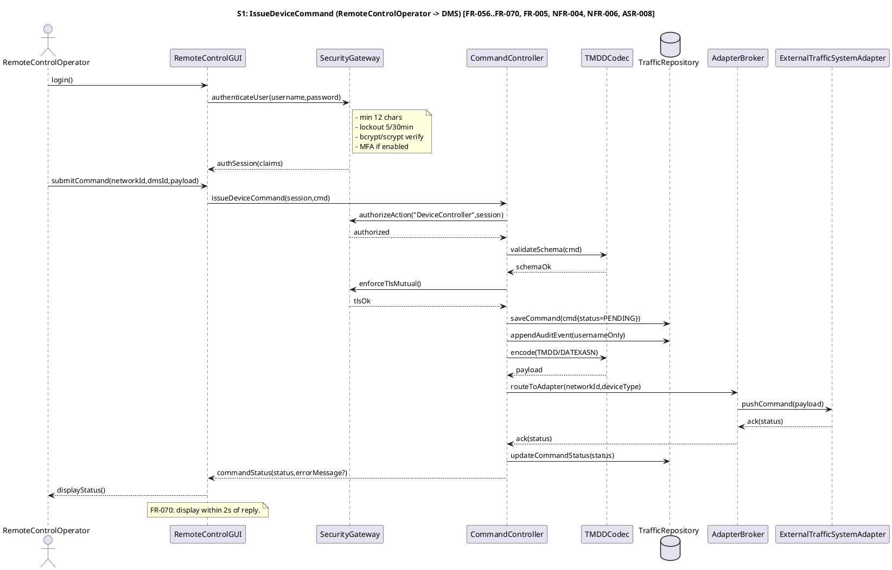

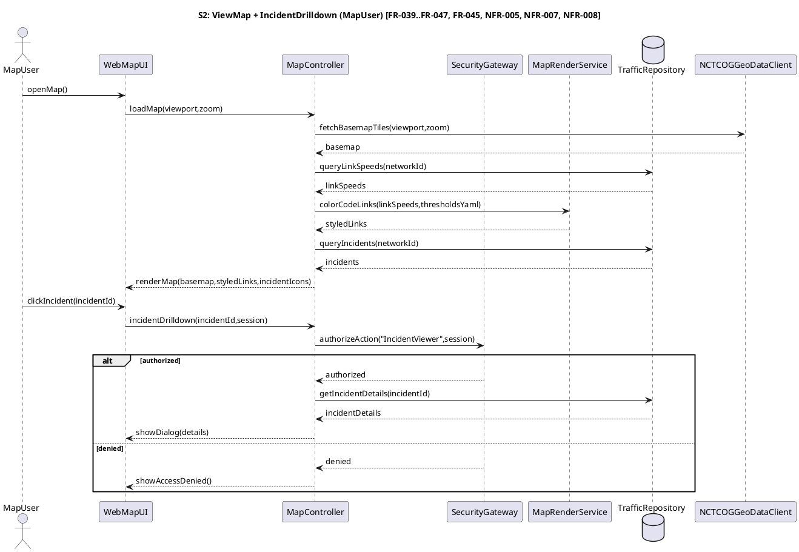

7. Collaboration — Process View: Collaboration Diagram
```plantuml
@startuml Collaboration_ProcessView_S1_IssueDeviceCommand
title Collaboration S1: IssueDeviceCommand

object RemoteControlOperator
object RemoteControlGUI
object SecurityGateway
object CommandController
object TMDDCodec
object TrafficRepository
object AdapterBroker
object ExternalTrafficSystemAdapter

RemoteControlOperator -- RemoteControlGUI
RemoteControlGUI -- SecurityGateway
RemoteControlGUI -- CommandController
CommandController -- TMDDCodec
CommandController -- TrafficRepository
CommandController -- AdapterBroker
AdapterBroker -- ExternalTrafficSystemAdapter

RemoteControlOperator -> RemoteControlGUI : 1 login()
RemoteControlGUI -> SecurityGateway : 2 authenticateUser()
SecurityGateway -> RemoteControlGUI : 3 authSession()
RemoteControlOperator -> RemoteControlGUI : 4 submitCommand()
RemoteControlGUI -> CommandController : 5 issueDeviceCommand()
CommandController -> SecurityGateway : 6 authorizeAction()
CommandController -> TMDDCodec : 7 validateSchema()
CommandController -> TrafficRepository : 8 saveCommand()+audit()
CommandController -> TMDDCodec : 9 encode()
CommandController -> AdapterBroker : 10 routeToAdapter()
AdapterBroker -> ExternalTrafficSystemAdapter : 11 pushCommand()
ExternalTrafficSystemAdapter -> AdapterBroker : 12 ack()
AdapterBroker -> CommandController : 13 ack()
CommandController -> TrafficRepository : 14 updateStatus()
CommandController -> RemoteControlGUI : 15 commandStatus()
RemoteControlGUI -> RemoteControlOperator : 16 displayStatus()

note right of CommandController
Origin: FR-005 + FR-056..FR-070
Constraints: NFR-004 auth, NFR-006 redaction+mTLS
end note
@enduml
```

```plantuml
@startuml Collaboration_ProcessView_S2_ViewMapAndIncidents
title Collaboration S2: ViewMapAndIncidents

object MapUser
object WebMapUI
object MapController
object NCTCOGGeoDataClient
object TrafficRepository
object MapRenderService
object SecurityGateway

MapUser -- WebMapUI
WebMapUI -- MapController
MapController -- NCTCOGGeoDataClient
MapController -- TrafficRepository
MapController -- MapRenderService
MapController -- SecurityGateway

MapUser -> WebMapUI : 1 openMap()
WebMapUI -> MapController : 2 loadMap()
MapController -> NCTCOGGeoDataClient : 3 fetchBasemapTiles()
MapController -> TrafficRepository : 4 queryLinkSpeeds()
MapController -> MapRenderService : 5 colorCodeLinks()
MapController -> TrafficRepository : 6 queryIncidents()
MapController -> WebMapUI : 7 renderMap()

MapUser -> WebMapUI : 8 clickIncident()
WebMapUI -> MapController : 9 incidentDrilldown()
MapController -> SecurityGateway : 10 authorizeAction(IncidentViewer)
MapController -> TrafficRepository : 11 getIncidentDetails()
MapController -> WebMapUI : 12 showDialog()/deny

note right of MapController
Origin: FR-039..FR-047, FR-045
Constraints: NFR-007 basemap source, NFR-008 thresholds YAML, RBAC for drilldown
end note
@enduml
```

## DevelopmentView
8. Package — Development View: Package Diagram
```plantuml
@startuml Package_DevelopmentView
skinparam packageStyle rectangle

package "ui" as pkg_ui {
  note bottom
  WebMapUI (ESRI ARC IMS) + IncidentGUI/RemoteControlGUI (ESRI Map Objects)
  Constraints: ASR-007, NFR-014, NFR-016
  end note
}

package "api" as pkg_api {
  note bottom
  Controllers for status, incidents, commands, auth
  Enforce TLS/mTLS + RBAC
  end note
}

package "kernel" as pkg_kernel {
  note bottom
  Microkernel runtime: plugin loading, config, gatekeeping
  ASR-005 building blocks; startup checks
  end note
}

package "domain" as pkg_domain {
  note bottom
  Canonical ITS/TMDD domain model
  end note
}

package "persistence" as pkg_persist {
  note bottom
  Relational repository + indexes + audit log
  ASR-003
  end note
}

package "integration" as pkg_integ {
  note bottom
  Adapters implementing IExternalTrafficSystemAdapter
  TMDD/DATEXASN codec + version negotiation
  ASR-001/004
  end note
}

package "security" as pkg_sec {
  note bottom
  AuthN/AuthZ, MFA, redaction, mTLS enforcement
  NFR-004/NFR-006/ASR-008
  end note
}

pkg_ui ..> pkg_api
pkg_api ..> pkg_sec
pkg_api ..> pkg_domain
pkg_api ..> pkg_persist
pkg_kernel ..> pkg_integ
pkg_integ ..> pkg_domain
pkg_integ ..> pkg_sec
pkg_persist ..> pkg_domain
pkg_api ..> pkg_kernel

note right of pkg_kernel
Platform constraints: Windows Server 2019+ certified (NFR-012),
core modules in C/C++ (NFR-015).
end note
@enduml
```

9. Component — Development View: Component Diagram
```plantuml
@startuml Component_DevelopmentView
skinparam componentStyle rectangle

interface "IAuthAPI" as IAuthAPI
interface "IIncidentAPI" as IIncidentAPI
interface "IDeviceStatusAPI" as IDeviceStatusAPI
interface "IDeviceCommandAPI" as IDeviceCommandAPI
interface "IAdapterPlugin" as IAdapterPlugin
interface "ITMDDCodec" as ITMDDCodec
interface "ITrafficRepository" as ITrafficRepository

component "WebMapUI\n[ViewMap]" as WebMapUI
component "IncidentGUI\n[EnterIncident]" as IncidentGUI
component "RemoteControlGUI\n[IssueDeviceCommand]" as RemoteControlGUI

component "API Gateway\n[HTTPS/mTLS]" as APIGateway
component "AuthService\n[AuthenticateUser]" as AuthService
component "IncidentService\n[ViewIncidents]" as IncidentService
component "DeviceStatusService\n[ViewDeviceStatus]" as DeviceStatusService
component "DeviceCommandService\n[IssueDeviceCommand]" as DeviceCommandService
component "MapService\n[RenderMap]" as MapService

component "MicrokernelRuntime\n[BuildingBlocks]" as MicrokernelRuntime
component "AdapterBroker\n[RouteAdapter]" as AdapterBroker
component "ExternalTrafficSystemAdapter\n[Plugin]" as ExternalTrafficSystemAdapter
component "TMDDCodec\n[DATEX/ASN]" as TMDDCodec

database "TrafficRepositoryDB\n[Relational]" as TrafficRepositoryDB
component "AuditLog\n[HashChained]" as AuditLog

APIGateway - IAuthAPI
APIGateway - IIncidentAPI
APIGateway - IDeviceStatusAPI
APIGateway - IDeviceCommandAPI

AuthService ..|> IAuthAPI
IncidentService ..|> IIncidentAPI
DeviceStatusService ..|> IDeviceStatusAPI
DeviceCommandService ..|> IDeviceCommandAPI

TMDDCodec ..|> ITMDDCodec
ExternalTrafficSystemAdapter ..|> IAdapterPlugin

TrafficRepositoryDB - ITrafficRepository
AuditLog ..> TrafficRepositoryDB : stores

WebMapUI ..> APIGateway
IncidentGUI ..> APIGateway
RemoteControlGUI ..> APIGateway

IncidentService ..> ITrafficRepository
DeviceStatusService ..> ITrafficRepository
DeviceCommandService ..> ITrafficRepository
MapService ..> ITrafficRepository

DeviceStatusService ..> AdapterBroker
DeviceCommandService ..> AdapterBroker
AdapterBroker ..> IAdapterPlugin
AdapterBroker ..> ITMDDCodec
ExternalTrafficSystemAdapter ..> ITMDDCodec

MicrokernelRuntime ..> AdapterBroker
MicrokernelRuntime ..> ExternalTrafficSystemAdapter : loads
MicrokernelRuntime ..> TMDDCodec : configures

note right of APIGateway
NFR-003/NFR-006: TLS 1.2+; mTLS for password-field endpoints; fail-closed.
end note

note bottom of MicrokernelRuntime
ASR-005: multi-instance building blocks via configuration.
Startup gatekeeping: Windows/ESRI/DATEX runtime presence.
end note
@enduml
```

## PhysicalView
10. Deployment — Physical View: Deployment Diagram
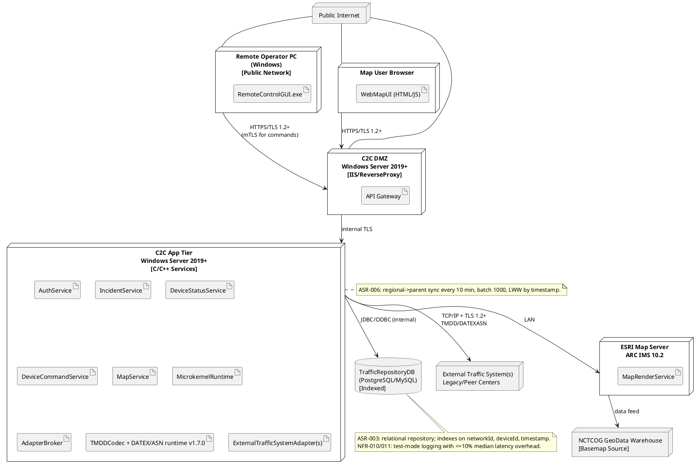

11. Container — Physical View: Container Diagram
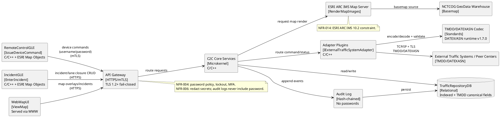