## ScenarioView
1. UseCase — Scenario View: Use Case Diagram
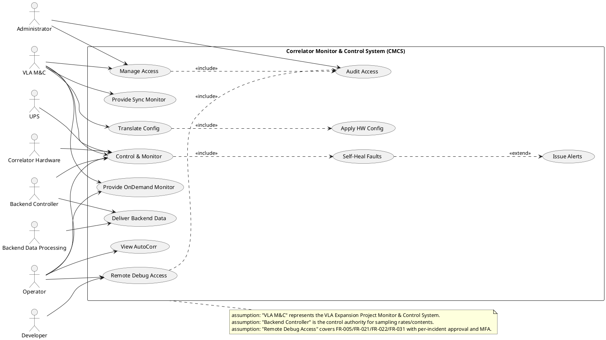

## LogicView
2. Class — Logic View: Class Diagram
```plantuml
@startuml Class_LogicView
skinparam classAttributeIconSize 0

class VirtualCorrelatorInterface <<gateway>> {
  +translateConfig(extConfig: ExternalConfig): ConfigTableSet
  +submitControl(cmd: ControlCommand): Ack
  +queryState(query: StateQuery): SystemState
  +streamMonitor(filter: MonitorFilter): MonitorStream
}

class MasterControlNode <<ha>> {
  -nodeId: String
  -role: String  <<primary|secondary>>
  -stateVersion: long
  +applyConfig(tables: ConfigTableSet): Ack
  +routeControl(cmd: ControlCommand): Ack
  +aggregateMessages(msg: Message): void
  +replicateState(delta: StateDelta): void
  +failoverToSecondary(): void
}

class CMIBController <<realtime>> {
  -cmibId16: int
  -ipAddress: String
  -watchdogEnabled: boolean
  +executeRegisterWrite(cmd: ControlCommand): Ack
  +readbackRegisters(): RegisterSnapshot
  +interrogateHardware(): HardwareState
  +reboot(warmBoot: boolean): Ack
}

class ConfigTableSet <<immutable>> {
  +requestId: String
  +createdUtc: String
  +tablesHash: String
  +targetRackId: String
}

class MonitorSample {
  +timestampUtc: String
  +wallclockLocal: String
  +locationId: String
  +metric: String
  +value: String
  +isTimeSynchronous: boolean
}

class Message {
  +timestampUtc: String
  +wallclockLocal: String
  +locationId: String
  +messageId: String
  +severity: String
  +content: String
  +category: String
  +detailLevel: String
}

class SpoolBuffer <<persisted>> {
  +retentionHours: int
  +maxBytes: long
  +enqueue(sample: MonitorSample): void
  +dequeueBatch(max: int): List
  +overrunAlert(): void
}

class EventQueue <<persisted>> {
  +retentionHours: int
  +enqueue(cmd: ControlCommand): void
  +dequeue(): ControlCommand
  +size(): long
}

class BackendDataPublisher {
  +publishDataSet(data: BackendDataSet): Ack
}

class BackendDataSet {
  +dataSetId: String
  +createdUtc: String
  +payloadRef: String
}

class HealthManager {
  +evaluateHealth(): HealthStatus
  +attemptSelfHeal(fault: Fault): Ack
  +issueAlert(fault: Fault): void
}

class PowerControlNode {
  +remoteReboot(target: String): Ack
  +reportPowerEvent(evt: PowerEvent): void
}

class PowerEvent {
  +eventType: String
  +timeRemainingSec: int
  +timestampUtc: String
}

class AuthService <<security>> {
  +authenticate(cert: X509Cert, mfa: MfaProof): Session
  +authorize(session: Session, action: String): Decision
  +revokeUser(userId: String): void
}

class RBACPolicy <<security>> {
  +roles: List
  +privileges: List
  +isAllowed(role: String, action: String): boolean
}

class AuditLog <<persisted>> {
  +write(event: AuditEvent): void
  +purge(olderThanDays: int): void
}

class AuditEvent {
  +timestampUtc: String
  +actorUserId: String
  +actionType: String
  +outcome: String
  +target: String
}

class ControlCommand {
  +commandId: String
  +timestampUtc: String
  +targetId: String
  +type: String
  +payload: String
}

class SystemState {
  +stateVersion: long
  +masterRole: String
  +rackStates: String
  +lastUpdatedUtc: String
}

VirtualCorrelatorInterface --> MasterControlNode : uses
MasterControlNode "1" o-- "1..*" CMIBController : coordinates
MasterControlNode --> BackendDataPublisher : uses
MasterControlNode --> SpoolBuffer : uses
MasterControlNode --> EventQueue : uses
MasterControlNode --> HealthManager : uses
MasterControlNode --> PowerControlNode : uses
MasterControlNode --> AuthService : uses
AuthService --> RBACPolicy : uses
AuthService --> AuditLog : writes
VirtualCorrelatorInterface --> AuthService : uses
VirtualCorrelatorInterface --> AuditLog : writes

CMIBController --> Message : emits
MasterControlNode --> Message : aggregates
SpoolBuffer --> MonitorSample : stores
BackendDataPublisher --> BackendDataSet : publishes
PowerControlNode --> PowerEvent : receives

note right of AuthService
NFR-014/NFR-015/FR-041..FR-050:
- mutual TLS/SSH, MFA for privileged actions
- deny access if CRL check fails
- session expiry policy
end note

note right of SpoolBuffer
FR-013: spool monitor data up to 24h at peak rate; overrun triggers alert.
end note

note right of EventQueue
FR-039/ASR-009: store config/control events for >=96h during comms loss.
end note

note right of CMIBController
FR-025: IP mapping 10.24.<high8>.<low8> from 16-bit id.
FR-032: hardware watchdog reboot and return to service.
end note
@enduml
```

3. Object — Logic View: Object Diagram
```plantuml
@startuml Object_LogicView
skinparam classAttributeIconSize 0

object vci1 as "vci1:VirtualCorrelatorInterface [TranslateConfig]" {
}

object masterP as "masterP:MasterControlNode [ControlMonitor]" {
  nodeId = "MCC-PRIMARY"
  role = "primary"
  stateVersion = 18422
}

object masterS as "masterS:MasterControlNode [Failover]" {
  nodeId = "MCC-SECONDARY"
  role = "secondary"
  stateVersion = 18422
}

object tables1 as "tables1:ConfigTableSet [TranslateConfig]" {
  requestId = "REQ-2026-03-13-001"
  createdUtc = "2026-03-13T02:10:00Z"
  tablesHash = "sha256:ab12..."
  targetRackId = "RACK-07"
}

object cmd1 as "cmd1:ControlCommand [ControlMonitor]" {
  commandId = "CMD-7781"
  timestampUtc = "2026-03-13T02:10:02Z"
  targetId = "CMIB-0x12AF"
  type = "SetSampleRate"
  payload = "rateHz=10;metrics=temps,voltages"
}

object cmib1 as "cmib1:CMIBController [ControlMonitor]" {
  cmibId16 = 4783
  ipAddress = "10.24.18.175"
  watchdogEnabled = true
}

object spool1 as "spool1:SpoolBuffer [ProvideSyncMonitor]" {
  retentionHours = 24
  maxBytes = 50000000000
}

object queue1 as "queue1:EventQueue [OfflineQueue]" {
  retentionHours = 96
}

vci1 --> masterP
masterP --> masterS : replicateState
masterP --> tables1 : applyConfig
masterP --> cmd1 : routeControl
masterP --> cmib1
masterP --> spool1
masterP --> queue1
@enduml
```

4. State — Logic View: State Diagram
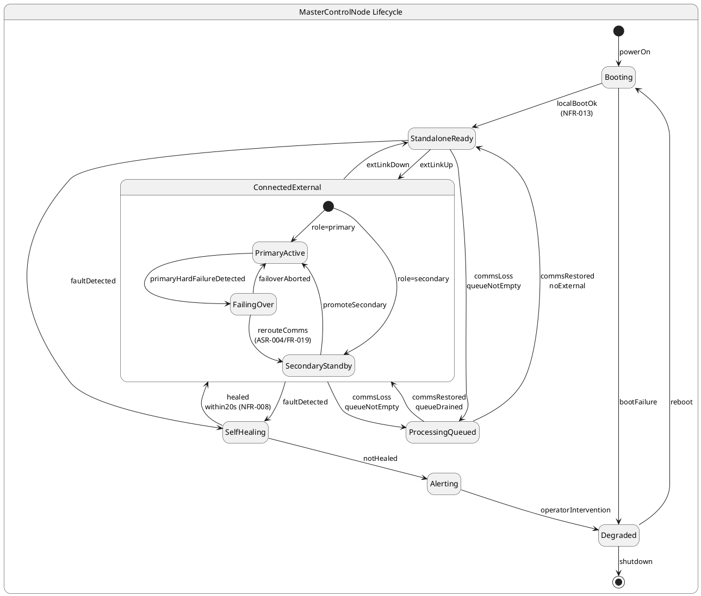

## ProcessView
5. Activity — Process View: Activity Diagram
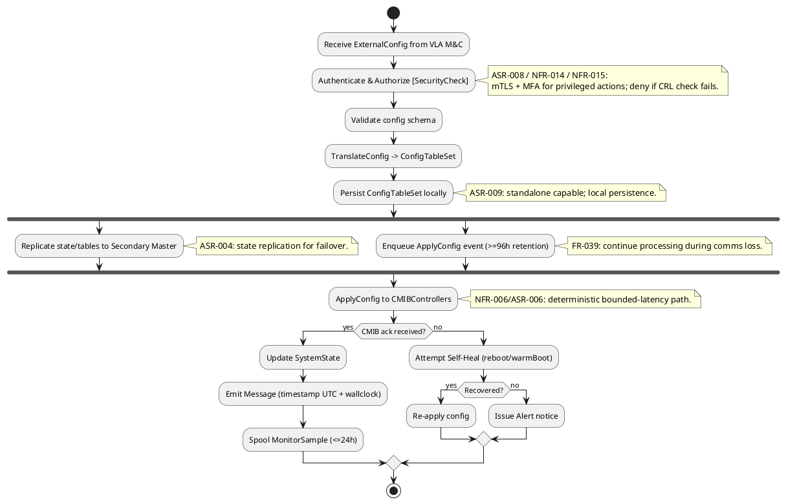

6. Sequence — Process View: Sequence Diagram
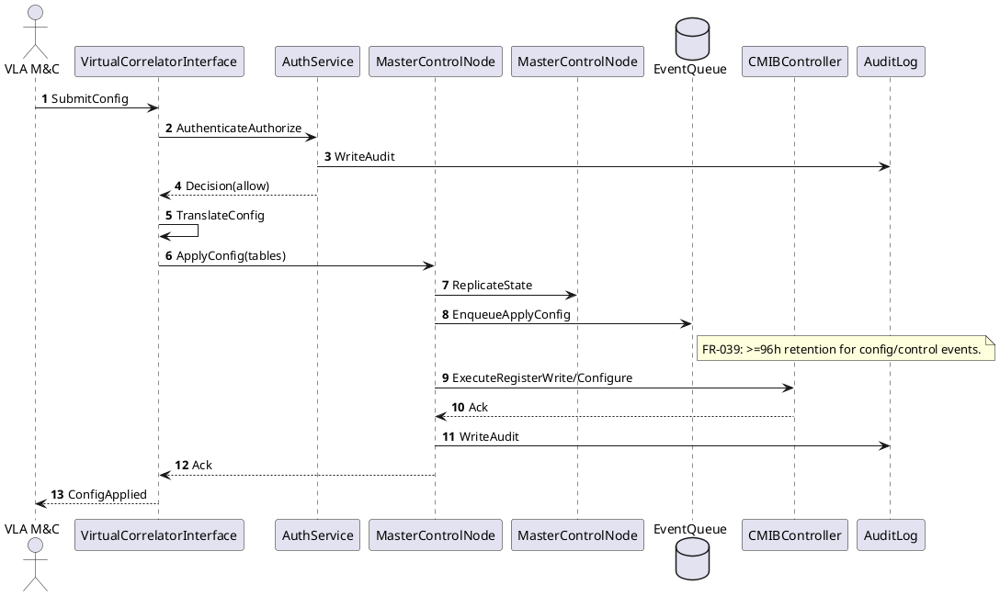

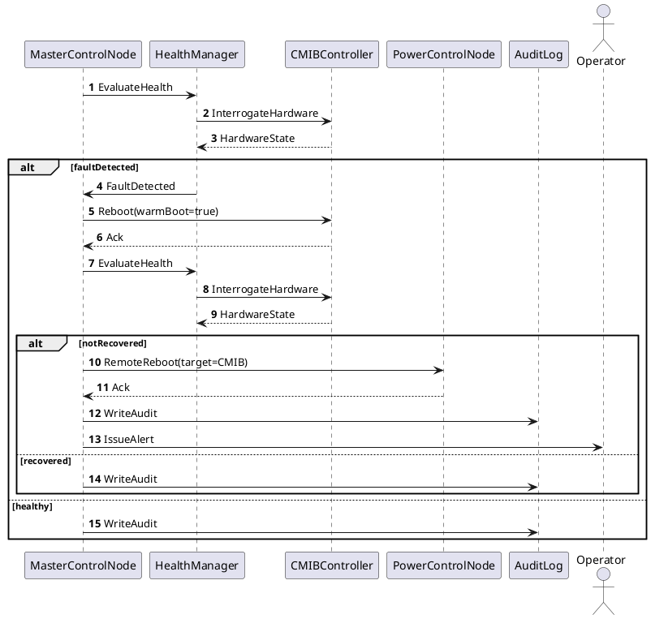

7. Collaboration — Process View: Collaboration Diagram
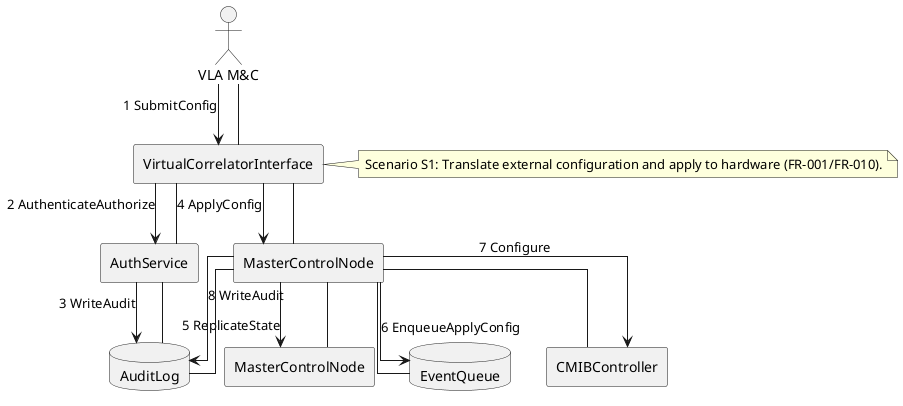

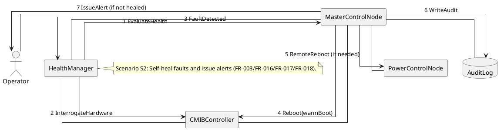

## DevelopmentView
8. Package — Development View: Package Diagram
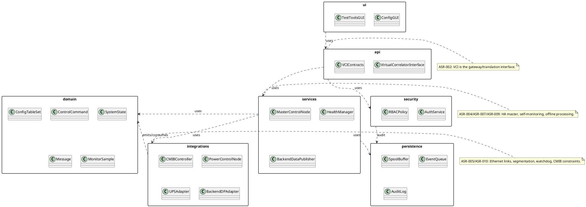

9. Component — Development View: Component Diagram
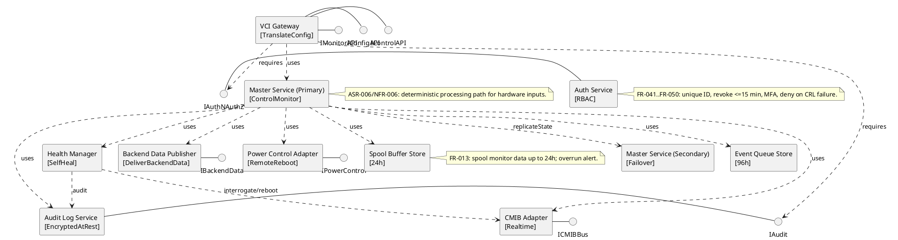

## PhysicalView
10. Deployment — Physical View: Deployment Diagram
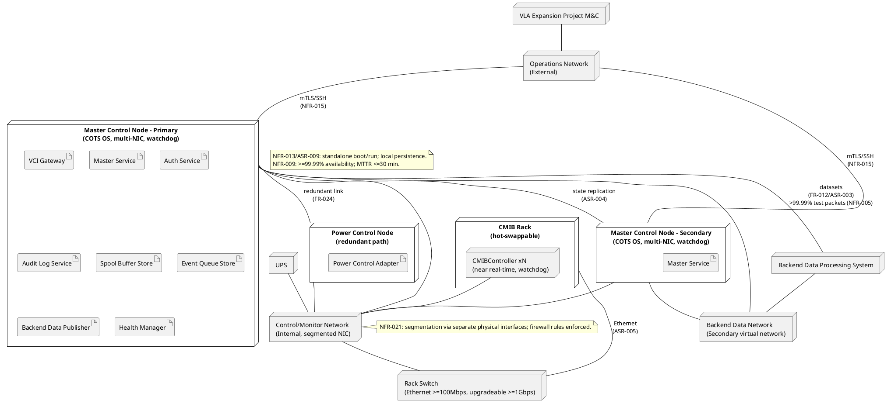

11. Container — Physical View: Container Diagram
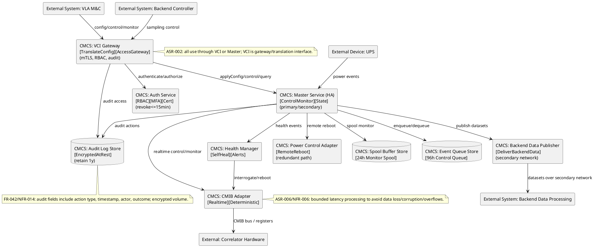