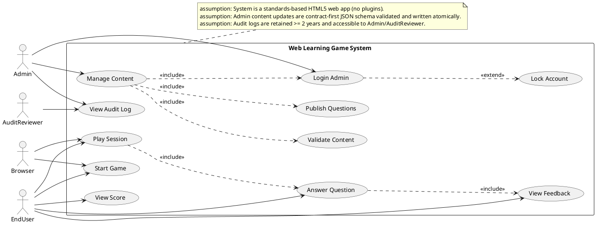
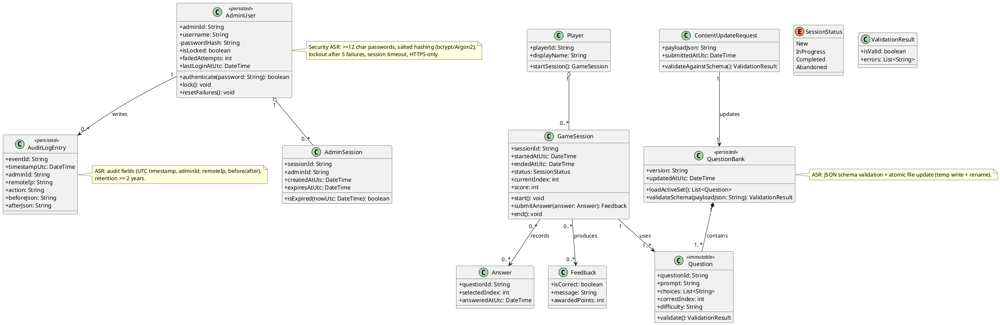
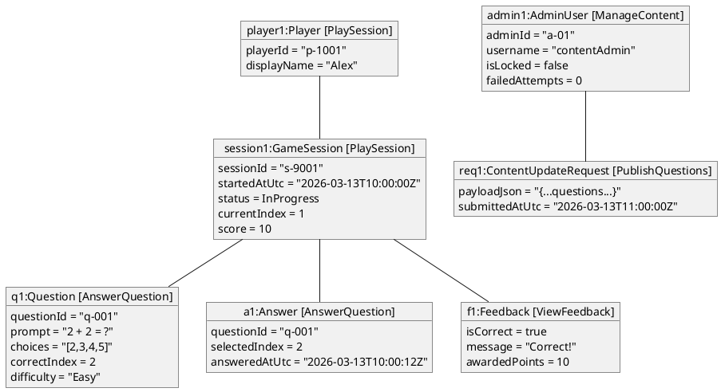
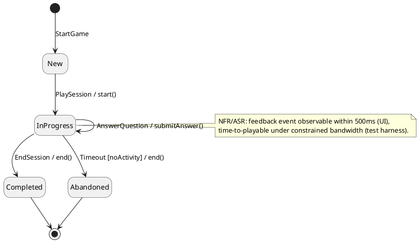
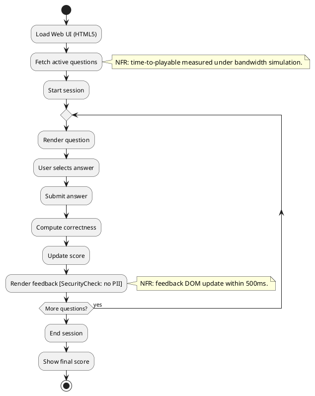
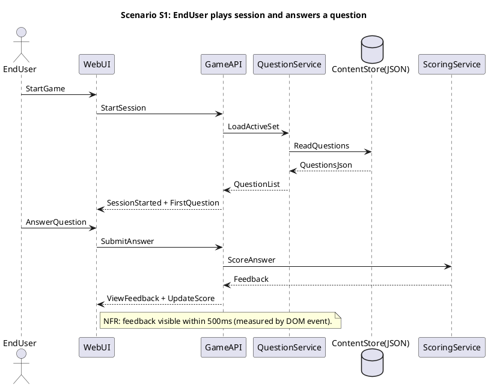
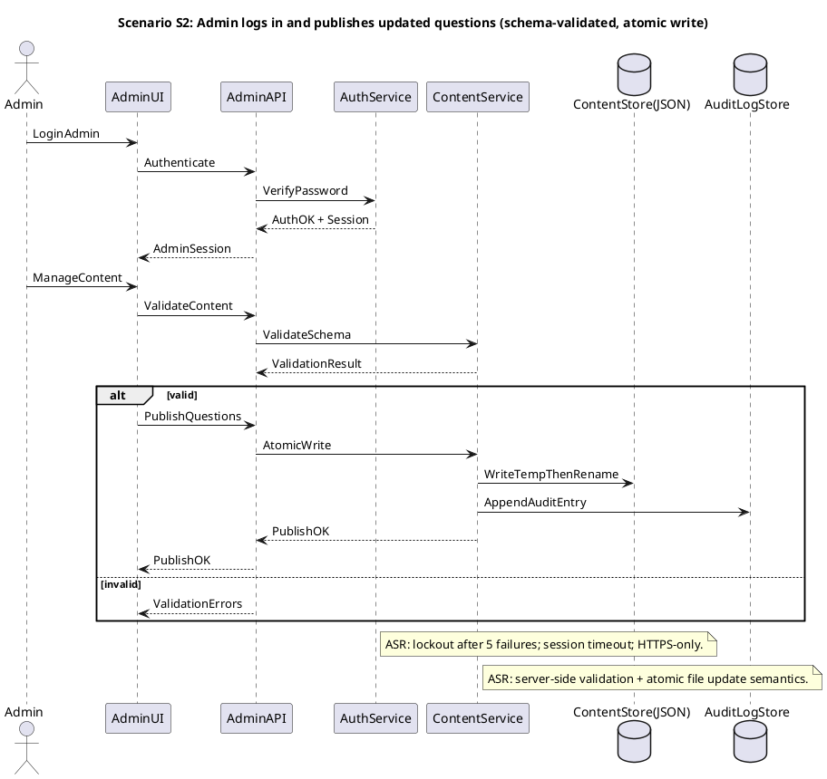
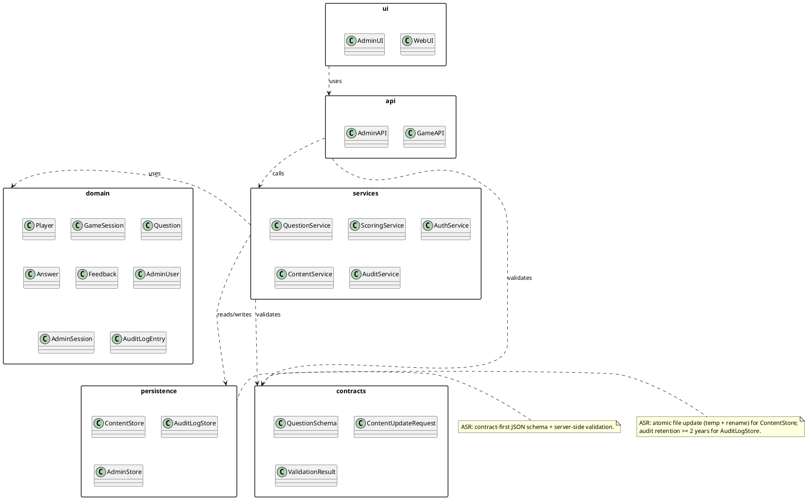
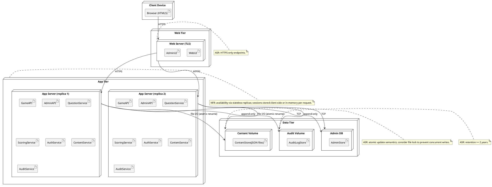

## ScenarioView
1. UseCase — Scenario View: Use Case Diagram


## LogicView
2. Class — Logic View: Class Diagram


3. Object — Logic View: Object Diagram


4. State — Logic View: State Diagram


## ProcessView
5. Activity — Process View: Activity Diagram


6. Sequence — Process View: Sequence Diagram




7. Collaboration — Process View: Collaboration Diagram
```plantuml
@startuml Collaboration_ProcessView_S1_PlaySession
title Collaboration S1: Play session + answer question

actor EndUser as EndUser
rectangle WebUI as WebUI
rectangle GameAPI as GameAPI
rectangle QuestionService as QuestionService
database ContentStore as ContentStore
rectangle ScoringService as ScoringService

EndUser -- WebUI
WebUI -- GameAPI
GameAPI -- QuestionService
QuestionService -- ContentStore
GameAPI -- ScoringService

WebUI : 1. StartGame
GameAPI : 2. StartSession
QuestionService : 3. LoadActiveSet
ContentStore : 4. ReadQuestions
WebUI : 5. AnswerQuestion
GameAPI : 6. SubmitAnswer
ScoringService : 7. ScoreAnswer
WebUI : 8. ViewFeedback

note right of WebUI
Origin: Scenario S1 sequence diagram.
end note
@enduml
```

```plantuml
@startuml Collaboration_ProcessView_S2_AdminPublish
title Collaboration S2: Admin publish questions (validate + atomic write + audit)

actor Admin as Admin
rectangle AdminUI as AdminUI
rectangle AdminAPI as AdminAPI
rectangle AuthService as AuthService
rectangle ContentService as ContentService
database ContentStore as ContentStore
database AuditLogStore as AuditLogStore

Admin -- AdminUI
AdminUI -- AdminAPI
AdminAPI -- AuthService
AdminAPI -- ContentService
ContentService -- ContentStore
ContentService -- AuditLogStore

AdminUI : 1. LoginAdmin
AdminAPI : 2. Authenticate
AuthService : 3. VerifyPassword
AdminUI : 4. ManageContent
AdminAPI : 5. ValidateContent
ContentService : 6. ValidateSchema
AdminAPI : 7. PublishQuestions
ContentService : 8. AtomicWrite
AuditLogStore : 9. AppendAuditEntry

note right of AdminAPI
Origin: Scenario S2 sequence diagram.
end note
@enduml
```

## DevelopmentView
8. Package — Development View: Package Diagram


9. Component — Development View: Component Diagram
```plantuml
@startuml Component_DevelopmentView
skinparam componentStyle rectangle

component "WebUI" as WebUI <<UI>> [PlaySession]
component "AdminUI" as AdminUI <<UI>> [ManageContent]

component "GameAPI" as GameAPI <<API>> [Session]
component "AdminAPI" as AdminAPI <<API>> [Admin]

component "QuestionService" as QuestionService <<Service>> [Questions]
component "ScoringService" as ScoringService <<Service>> [Scoring]
component "AuthService" as AuthService <<Service>> [Auth]
component "ContentService" as ContentService <<Service>> [Publish]
component "AuditService" as AuditService <<Service>> [Audit]

database "ContentStore(JSON)" as ContentStore <<Store>>
database "AdminStore" as AdminStore <<Store>>
database "AuditLogStore" as AuditLogStore <<Store>>

interface "IGame" as IGame
interface "IAdmin" as IAdmin
interface "IAuth" as IAuth
interface "IContent" as IContent
interface "IAudit" as IAudit

GameAPI - IGame
AdminAPI - IAdmin

AuthService - IAuth
ContentService - IContent
AuditService - IAudit

WebUI ..> IGame : uses
AdminUI ..> IAdmin : uses

GameAPI ..> QuestionService : uses
GameAPI ..> ScoringService : uses

AdminAPI ..> AuthService : uses
AdminAPI ..> ContentService : uses
AdminAPI ..> AuditService : uses

QuestionService ..> ContentStore : reads
ContentService ..> ContentStore : atomicWrite
AuthService ..> AdminStore : reads/writes
AuditService ..> AuditLogStore : append/read

note right of ContentService
ASR: validate JSON against schema; write temp then atomic rename.
end note

note right of AuthService
ASR: bcrypt/Argon2, lockout after 5 failures, session timeout, HTTPS-only.
end note
@enduml
```

## PhysicalView
10. Deployment — Physical View: Deployment Diagram


11. Container — Physical View: Container Diagram
```plantuml
@startuml Container_PhysicalView
skinparam rectangle {
  roundCorner 10
}
skinparam packageStyle rectangle

rectangle "EndUser Browser" as EndUserBrowser <<External>> {
  rectangle "WebUI (HTML5/JS)" as WebUI <<Container>> [PlaySession]
}

rectangle "Admin Browser" as AdminBrowser <<External>> {
  rectangle "AdminUI (HTML5/JS)" as AdminUI <<Container>> [ManageContent]
}

rectangle "Backend" as Backend {
  rectangle "GameAPI" as GameAPI <<Container>> [Session]
  rectangle "AdminAPI" as AdminAPI <<Container>> [Admin]
  rectangle "QuestionService" as QuestionService <<Container>> [Questions]
  rectangle "ScoringService" as ScoringService <<Container>> [Scoring]
  rectangle "AuthService" as AuthService <<Container>> [Auth]
  rectangle "ContentService" as ContentService <<Container>> [Publish]
  rectangle "AuditService" as AuditService <<Container>> [Audit]
}

database "ContentStore (JSON files)" as ContentStore <<Container>> [AtomicWrite]
database "AdminStore" as AdminStore <<Container>> [Credentials]
database "AuditLogStore" as AuditLogStore <<Container>> [Retention>=2y]

WebUI --> GameAPI : HTTPS (StartSession/SubmitAnswer)
AdminUI --> AdminAPI : HTTPS (Auth/Publish)

GameAPI --> QuestionService : internal call
GameAPI --> ScoringService : internal call
AdminAPI --> AuthService : internal call
AdminAPI --> ContentService : internal call
AdminAPI --> AuditService : internal call

QuestionService --> ContentStore : read
ContentService --> ContentStore : validate + atomicWrite
AuthService --> AdminStore : read/write
AuditService --> AuditLogStore : append/read

note right of ContentService
ASR: JSON schema validation; temp-file then rename; server-side validation.
end note

note right of AuthService
ASR: bcrypt/Argon2; lockout after 5 failures; session timeout; HTTPS-only.
end note
@enduml
```