## ScenarioView
1. UseCase — Scenario View: Use Case Diagram

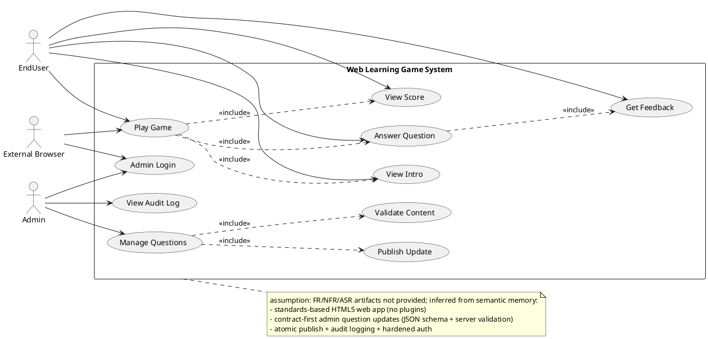

## LogicView
2. Class — Logic View: Class Diagram

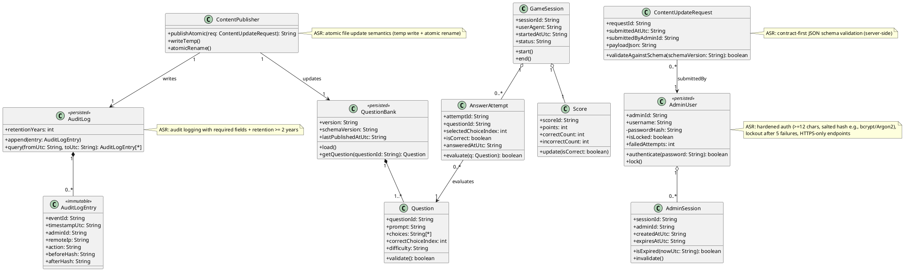

3. Object — Logic View: Object Diagram

```plantuml
@startuml Object_LogicView
object session1 as "session1:GameSession [PlayGame]" {
  sessionId = "S-9f2a"
  userAgent = "Chrome/122"
  startedAtUtc = "2026-03-13T10:00:00Z"
  status = "Active"
}

object bank1 as "bank1:QuestionBank [ManageQuestions]" {
  version = "2026.03.13-1"
  schemaVersion = "1.0.0"
  lastPublishedAtUtc = "2026-03-13T09:55:00Z"
}

object q1 as "q1:Question [AnswerQuestion]" {
  questionId = "Q-101"
  prompt = "What is 2+2?"
  choices = "{2,3,4,5}"
  correctChoiceIndex = 2
  difficulty = "Easy"
}

object attempt1 as "attempt1:AnswerAttempt [AnswerQuestion]" {
  attemptId = "A-0001"
  questionId = "Q-101"
  selectedChoiceIndex = 2
  isCorrect = true
  answeredAtUtc = "2026-03-13T10:00:10Z"
}

object score1 as "score1:Score [ViewScore]" {
  scoreId = "SC-1"
  points = 10
  correctCount = 1
  incorrectCount = 0
}

object admin1 as "admin1:AdminUser [AdminLogin]" {
  adminId = "ADM-7"
  username = "contentAdmin"
  isLocked = false
  failedAttempts = 0
}

object req1 as "req1:ContentUpdateRequest [PublishUpdate]" {
  requestId = "R-55"
  submittedAtUtc = "2026-03-13T09:54:30Z"
  submittedByAdminId = "ADM-7"
  payloadJson = "{...questions...}"
}

session1 -- attempt1
session1 -- score1
bank1 -- q1
attempt1 ..> q1 : evaluates
req1 ..> admin1 : submittedBy
@enduml
```

4. State — Logic View: State Diagram

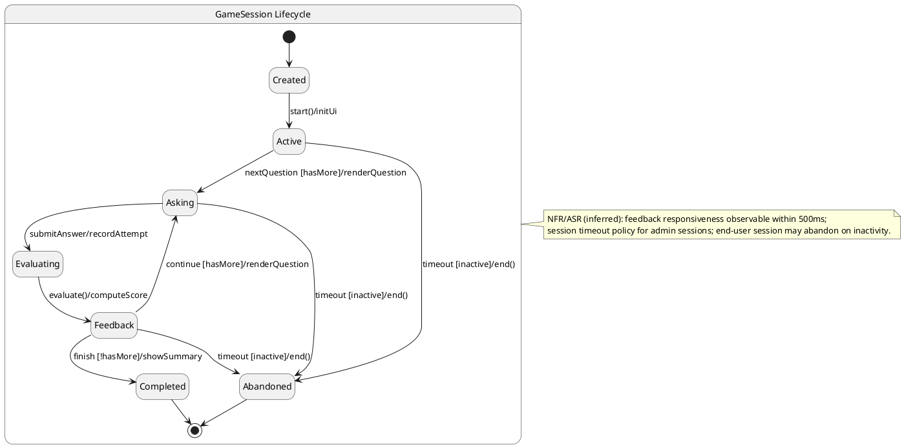

## ProcessView
5. Activity — Process View: Activity Diagram

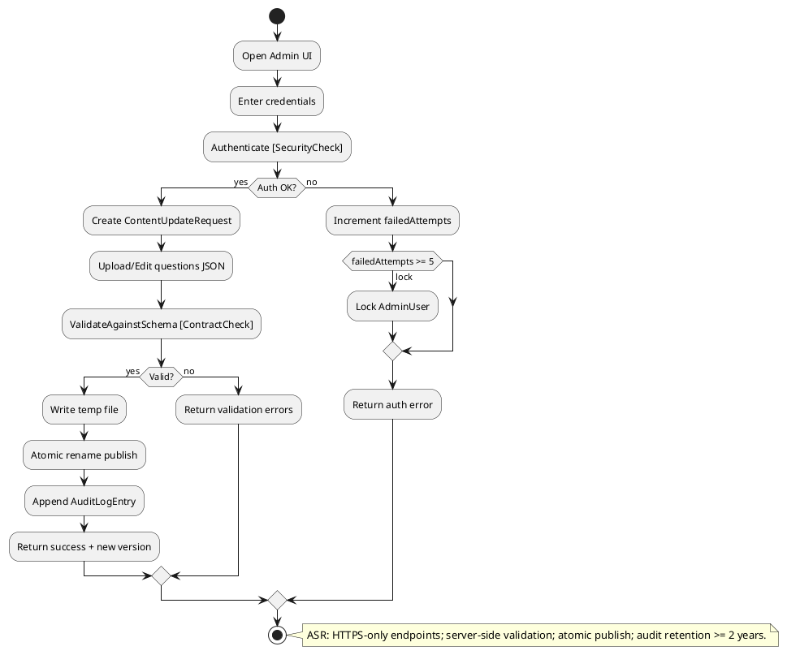

6. Sequence — Process View: Sequence Diagram

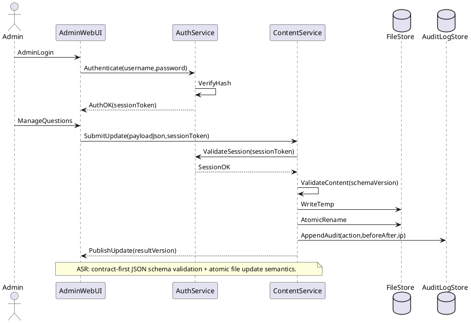

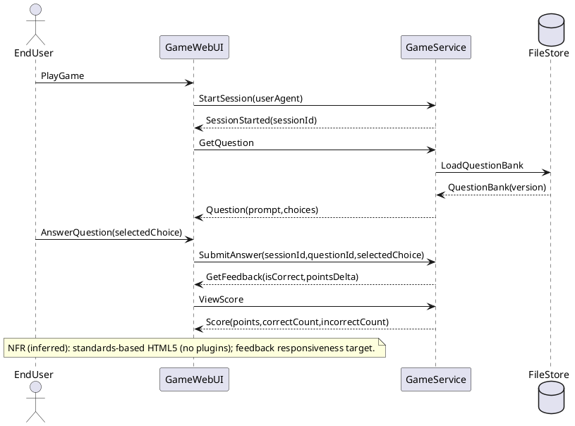

7. Collaboration — Process View: Collaboration Diagram

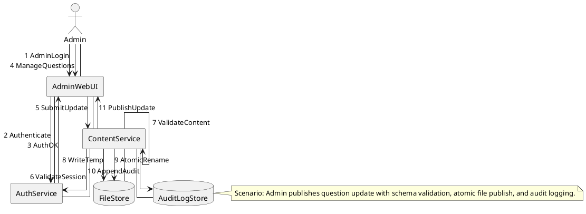

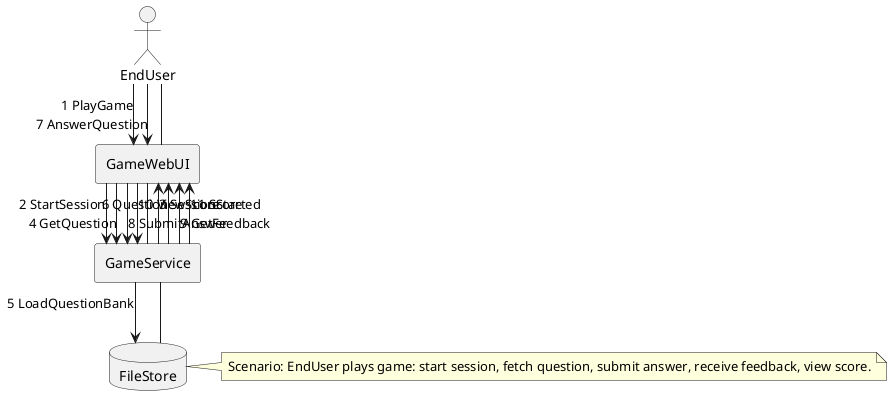

## DevelopmentView
8. Package — Development View: Package Diagram

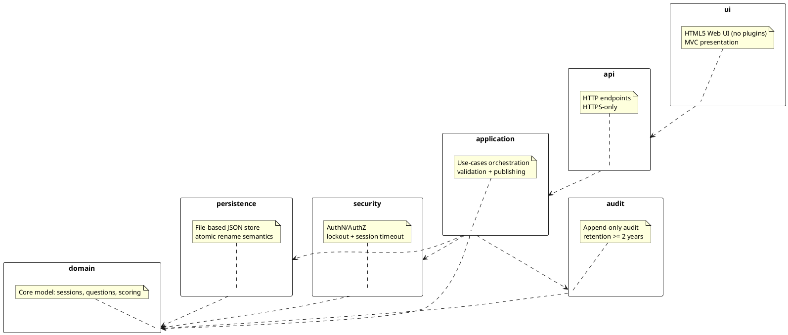

9. Component — Development View: Component Diagram

```plantuml
@startuml Component_DevelopmentView
skinparam componentStyle rectangle

component "GameWebUI" as GameWebUI <<UI>> [PlayGame]
component "AdminWebUI" as AdminWebUI <<UI>> [ManageQuestions]

component "ApiGateway" as ApiGateway <<API>> [HTTPSOnly]
component "GameService" as GameService <<Service>> [AnswerQuestion]
component "ContentService" as ContentService <<Service>> [PublishUpdate]
component "AuthService" as AuthService <<Security>> [Lockout]
component "AuditService" as AuditService <<Audit>> [Retention]

database "FileStore" as FileStore <<Storage>> [AtomicRename]
database "AuditLogStore" as AuditLogStore <<Storage>> [AppendOnly]

interface IGameApi
interface IAdminApi
interface IAuth
interface IAudit

GameWebUI --> ApiGateway : uses
AdminWebUI --> ApiGateway : uses

ApiGateway - IGameApi
ApiGateway - IAdminApi

GameService ..|> IGameApi
ContentService ..|> IAdminApi
AuthService ..|> IAuth
AuditService ..|> IAudit

GameService --> FileStore : reads
ContentService --> FileStore : writesTemp+rename
ContentService --> AuthService : validateSession
ContentService --> AuditService : appendAudit
AuditService --> AuditLogStore : persists
AuthService --> AuditLogStore : optionalAuthEvents

note right of FileStore
ASR: temp-file write + atomic rename to prevent corruption
end note

note right of AuthService
ASR: salted hash (bcrypt/Argon2), lockout after 5 failures, session timeout
end note
@enduml
```

## PhysicalView
10. Deployment — Physical View: Deployment Diagram

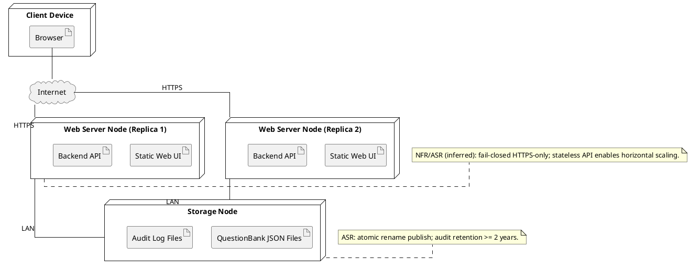

11. Container — Physical View: Container Diagram

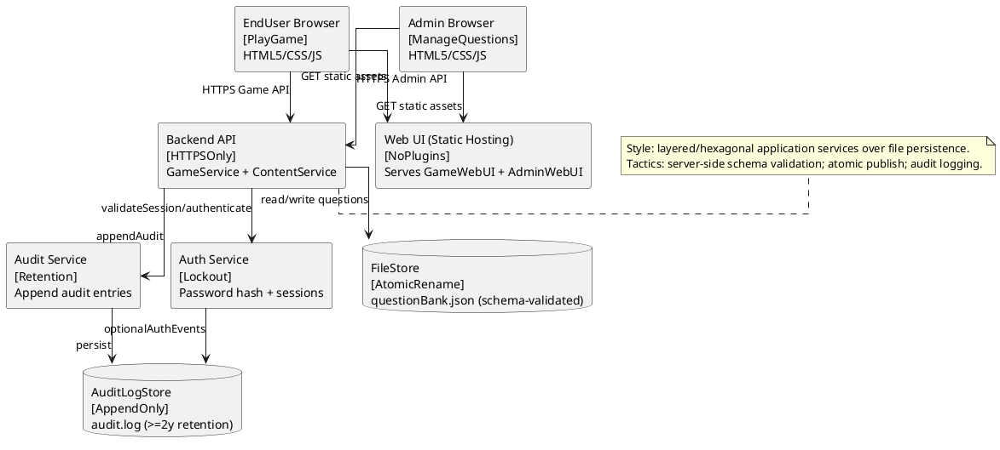