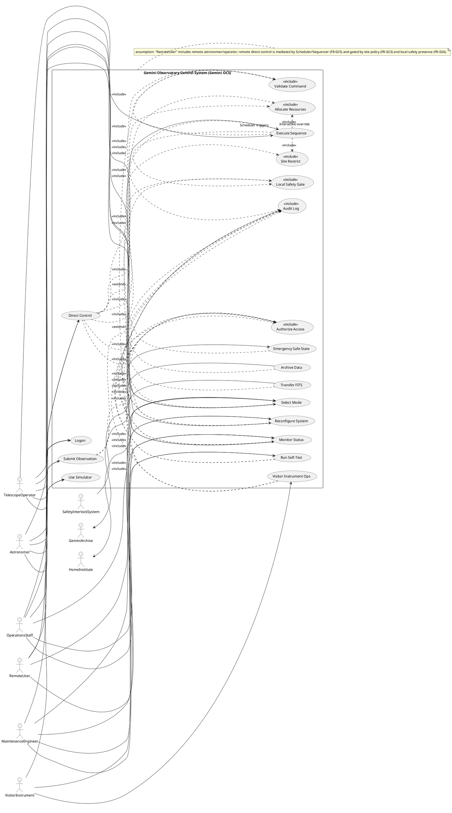
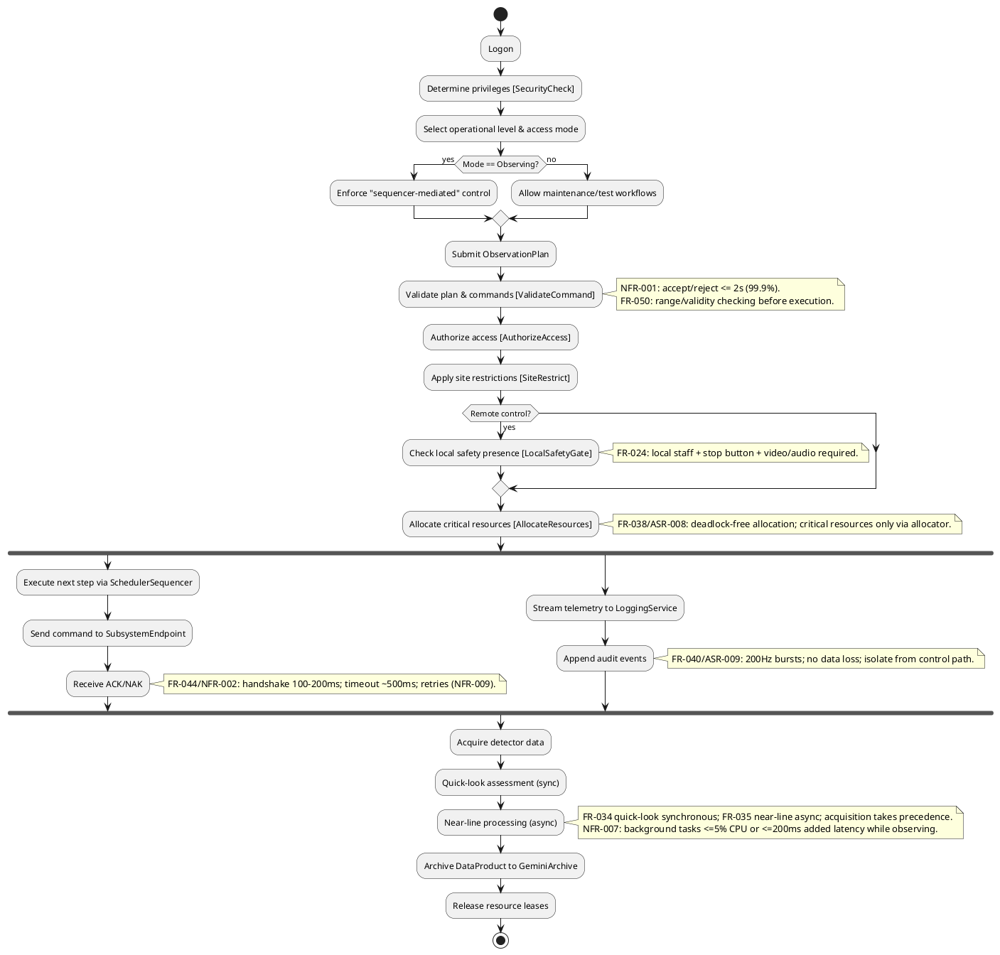
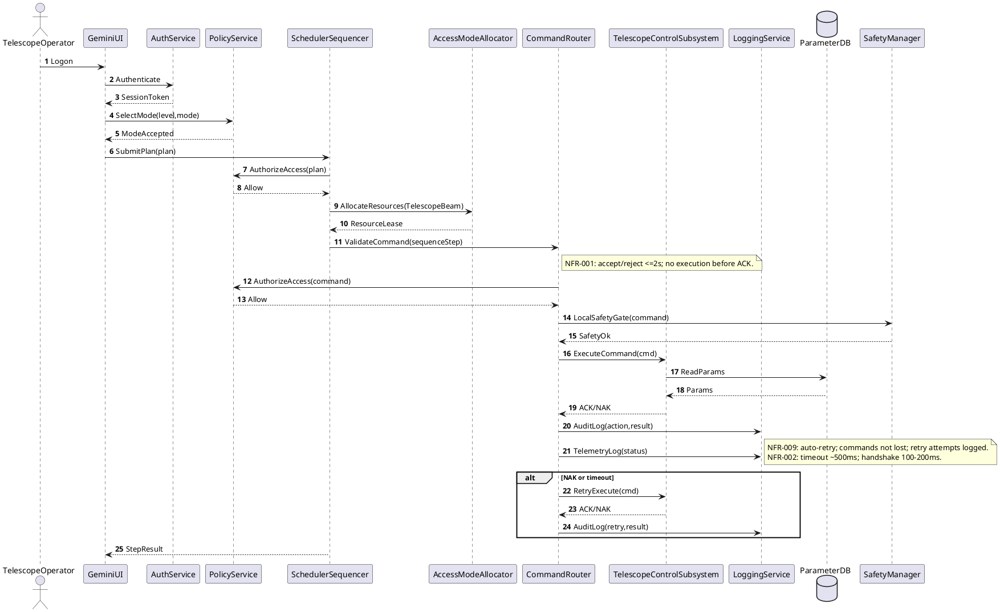
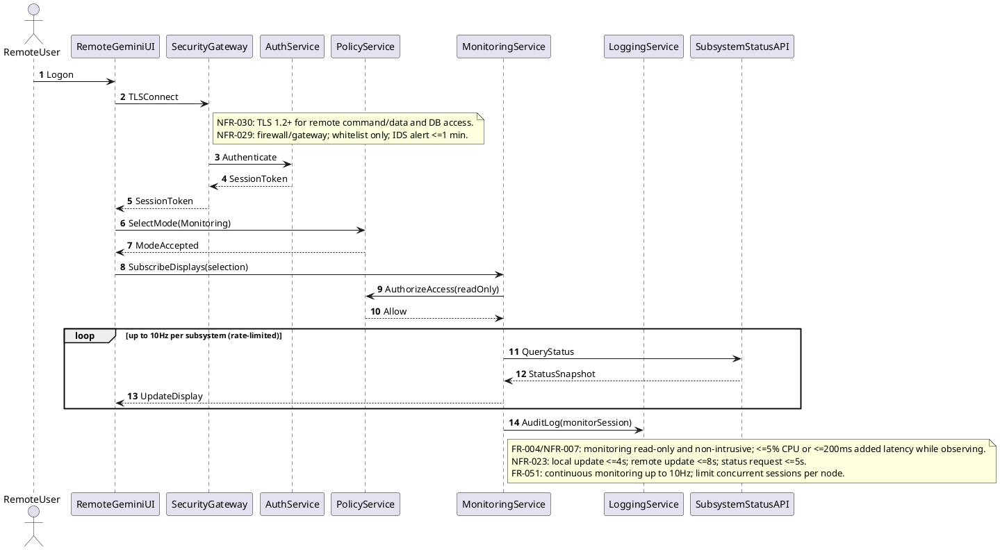
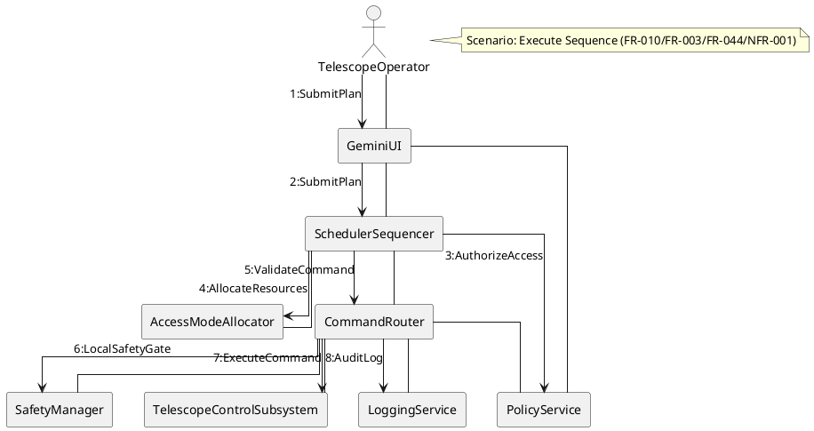
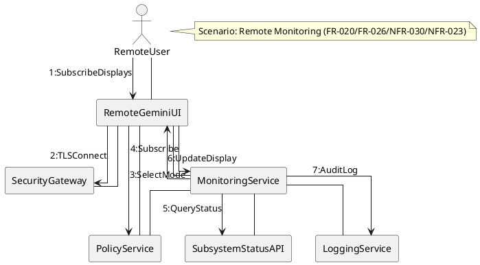
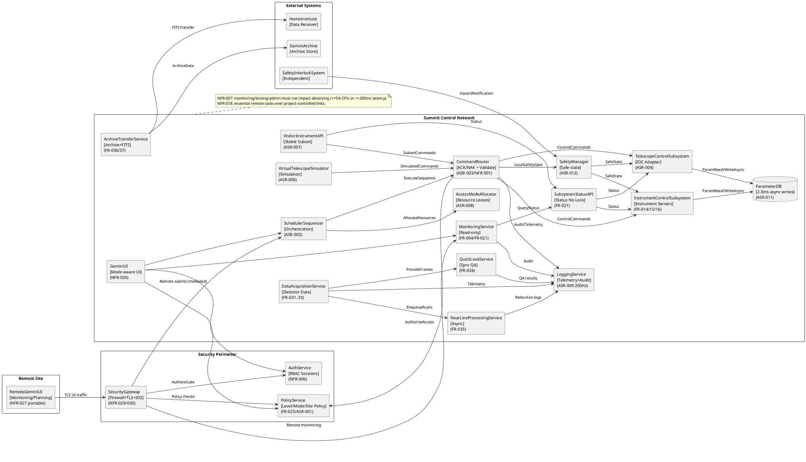

## ScenarioView
1. UseCase — Scenario View: Use Case Diagram


## LogicView
2. Class — Logic View: Class Diagram
```plantuml
@startuml Gemini_Class
skinparam classAttributeIconSize 0

class UserSession {
  +sessionId: String
  +userId: String
  +role: Role
  +siteId: String
  +loginTime: DateTime
  +lastActivityTime: DateTime
  +operationalLevel: OperationalLevel
  +accessMode: AccessMode
  +isRemote: Boolean
  +logout()
  +isExpired(): Boolean
}

enum Role {
  Astronomer
  TelescopeOperator
  OperationsStaff
  MaintenanceEngineer
  RemoteUser
  VisitorInstrument
}

enum OperationalLevel {
  Observing
  Maintenance
  Test
}

enum AccessMode {
  Observing
  Monitoring
  Operation
  Planning
  Testing
  Administrative
}

class PolicyRule {
  +ruleId: String
  +effect: Effect
  +allowedSites: String[*]
  +allowedRoles: Role[*]
  +allowedLevels: OperationalLevel[*]
  +allowedModes: AccessMode[*]
  +allowedOperations: String[*]
}

enum Effect { Allow Deny }

class AuthorizationDecision {
  +decisionId: String
  +effect: Effect
  +reason: String
  +policyVersion: String
}

class Command {
  +commandId: String
  +type: String
  +target: String
  +parameters: Map
  +requestedAt: DateTime
  +requestedBy: String
  +siteId: String
  +requiresResource: Boolean
  +validate(): ValidationResult
}

class ValidationResult {
  +isValid: Boolean
  +errorCode: String
  +message: String
}

class AckNak {
  +commandId: String
  +status: String  'ACK|NAK
  +sentAt: DateTime
  +timeoutMs: int
}

class ResourceLease {
  +leaseId: String
  +resourceId: String
  +holderSessionId: String
  +mode: AccessMode
  +expiresAt: DateTime
  +renew()
  +release()
}

class SubsystemEndpoint {
  +subsystemId: String
  +kind: String  'Telescope|Instrument|Env|Data|Safety
  +supportsSimulation: Boolean
  +status(): Map
  +execute(cmd: Command): AckNak
  +selfTest(level: String): Map
}

class ParameterDB <<persisted>> {
  +key: String
  +type: String
  +value: String
  +allowedMin: String
  +allowedMax: String
  +errorResponse: String
  +read(key: String): String
  +writeAsync(key: String, value: String)
}

class ObservationPlan <<persisted>> {
  +planId: String
  +programId: String
  +constraints: Map
  +sequence: String
  +simulate(): SimulationResult
}

class SimulationResult {
  +resultId: String
  +isFeasible: Boolean
  +warnings: String[*]
}

class TelemetryEvent <<immutable>> {
  +eventId: String
  +timestamp: DateTime
  +source: String
  +type: String
  +payload: Map
}

class AuditEvent <<immutable>> {
  +auditId: String
  +timestamp: DateTime
  +actorSessionId: String
  +action: String
  +target: String
  +result: String
}

class DataProduct <<persisted>> {
  +dataId: String
  +format: String  'FITS
  +compressed: Boolean
  +header: Map
  +storedAt: String
}

class SchedulerSequencer {
  +queueId: String
  +submitPlan(plan: ObservationPlan): String
  +resequence(reason: String)
  +prepareSequence(planId: String)
  +executeNext(): String
  +breakQueue()
}

class AccessModeAllocator {
  +allocate(resourceId: String, session: UserSession, mode: AccessMode): ResourceLease
  +avoidDeadlock(): Boolean
  +release(leaseId: String)
}

class SafetyManager {
  +hazardDetected(hazardCode: String)
  +initiateSafeState(): Boolean
  +confirmSafeState(): Boolean
}

class LoggingService {
  +appendTelemetry(e: TelemetryEvent)
  +appendAudit(e: AuditEvent)
  +queryStatus(topic: String): Map
}

UserSession "1" o-- "0..*" ResourceLease
SchedulerSequencer "1" --> "0..*" SubsystemEndpoint : orchestrates
SchedulerSequencer "1" --> "0..*" ObservationPlan : executes
AccessModeAllocator "1" --> "0..*" ResourceLease : issues
Command "1" --> "0..1" ResourceLease : requires
SubsystemEndpoint "1" --> "1" ParameterDB : reads/writes
LoggingService "1" --> "0..*" TelemetryEvent
LoggingService "1" --> "0..*" AuditEvent
DataProduct "0..*" --> "1" ObservationPlan : producedBy
SafetyManager "1" --> "0..*" SubsystemEndpoint : safeCommands
SafetyManager "1" --> "1" LoggingService : logs

PolicyRule "0..*" --> "1" AuthorizationDecision : evaluatesTo
UserSession "1" --> "0..*" AuthorizationDecision : obtains

note right of SchedulerSequencer
ASR-002: primary control plane; observing mode commands must be mediated.
end note

note right of AccessModeAllocator
ASR-008/FR-038: all critical resources via allocator; deadlock freedom required.
end note

note right of LoggingService
ASR-009/FR-040/NFR-024: sustain 200Hz bursts; isolate from control path.
end note

note right of SafetyManager
ASR-012/NFR-012: initiate safe-state <=2s; confirm <=10s; interlocks independent.
end note

note right of UserSession
NFR-006: privileges at login; 12+ char password; auto-logout 30 min inactivity; privilege changes audited.
end note

note right of Command
NFR-001: accept/reject within 2s (99.9%); no execution before ACK.
NFR-009: retries; commands not lost.
end note

note right of ParameterDB
ASR-011/NFR-005: 2-3ms access; async writes; EPICS in IOC.
end note
@enduml
```

3. Object — Logic View: Object Diagram
```plantuml
@startuml Gemini_Object
skinparam classAttributeIconSize 0

object session1 as "session1:UserSession [ExecuteSequence]" {
  userId = "op-17"
  role = "TelescopeOperator"
  siteId = "Summit"
  operationalLevel = "Observing"
  accessMode = "Operation"
  isRemote = false
}

object plan1 as "plan1:ObservationPlan [SubmitObservation]" {
  planId = "PLAN-2026-0313-001"
  programId = "GS-2026A-Q-12"
  sequence = "ACQ->EXPOSE(60s)x3->DITHER"
}

object cmd1 as "cmd1:Command [ExecuteSequence]" {
  commandId = "CMD-88421"
  type = "Slew"
  target = "Telescope"
  siteId = "Summit"
}

object lease1 as "lease1:ResourceLease [AllocateResources]" {
  leaseId = "LEASE-77"
  resourceId = "TelescopeBeam"
  holderSessionId = "session1"
  mode = "Operation"
}

object seq1 as "seq1:SchedulerSequencer [ExecuteSequence]" {
  queueId = "Q-NIGHT-2026-0313"
}

object alloc1 as "alloc1:AccessModeAllocator [AllocateResources]" {
}

object tel1 as "tel1:SubsystemEndpoint [ExecuteSequence]" {
  subsystemId = "TCS"
  kind = "Telescope"
  supportsSimulation = false
}

object log1 as "log1:LoggingService [AuditLog]" {
}

object audit1 as "audit1:AuditEvent [AuditLog]" {
  action = "ExecuteCommand"
  target = "TCS"
  result = "ACK"
}

session1 -- lease1
seq1 -- plan1
seq1 -- tel1
seq1 -- alloc1
cmd1 -- lease1
log1 -- audit1
@enduml
```

4. State — Logic View: State Diagram

```plantuml
@startuml Gemini_State_OperationalLevel
hide empty description

state "OperationalLevelStateMachine" as OLSM {
  [*] --> PoweredOff

  PoweredOff --> Booting : powerOn
  Booting --> ObservingLevel : bootOk / versionConsistencyCheck
  Booting --> MaintenanceLevel : bootOk [maintenanceRequested]
  Booting --> TestLevel : bootOk [testRequested]

  ObservingLevel --> MaintenanceLevel : enterMaintenance [authorized]
  ObservingLevel --> TestLevel : enterTest [authorized]
  MaintenanceLevel --> ObservingLevel : exitMaintenance [authorized]
  TestLevel --> ObservingLevel : exitTest [authorized]

  state ObservingLevel {
    [*] --> ObservingMode
    ObservingMode --> MonitoringMode : switchMode [authorized]
    MonitoringMode --> ObservingMode : switchMode [authorized]
    ObservingMode --> OperationMode : enableOperation [role==TelescopeOperator]
    OperationMode --> ObservingMode : disableOperation
    ObservingMode --> PlanningMode : switchMode
    PlanningMode --> ObservingMode : switchMode
    ObservingMode --> AdministrativeMode : switchMode [role==OperationsStaff]
    AdministrativeMode --> ObservingMode : switchMode
  }

  state MaintenanceLevel {
    [*] --> MaintenanceMode
    MaintenanceMode --> MonitoringMode : switchMode
    MonitoringMode --> MaintenanceMode : switchMode
    MaintenanceMode --> TestingMode : runSelfTest [authorized]
    TestingMode --> MaintenanceMode : endTest
  }

  state TestLevel {
    [*] --> TestingMode
    TestingMode --> MonitoringMode : switchMode
    MonitoringMode --> TestingMode : switchMode
  }

  ObservingLevel --> SafeState : hazardNotification / initiateSafeState
  MaintenanceLevel --> SafeState : hazardNotification / initiateSafeState
  TestLevel --> SafeState : hazardNotification / initiateSafeState
  SafeState --> MaintenanceLevel : recover [authorized] / reconfigure
  SafeState --> ObservingLevel : recover [authorized] / reconfigure

  ObservingLevel --> PoweredOff : shutdown
  MaintenanceLevel --> PoweredOff : shutdown
  TestLevel --> PoweredOff : shutdown
}

note right of SafeState
NFR-012: initiate safe-state <=2s; confirm <=10s.
end note

note right of ObservingLevel
FR-045: in Engineering/Maintenance, ignore directives from other systems but still provide status.
(Mode gating enforced by authorization + command router.)
end note
@enduml
```


## ProcessView
5. Activity — Process View: Activity Diagram


6. Sequence — Process View: Sequence Diagram




7. Collaboration — Process View: Collaboration Diagram




## DevelopmentView
8. Package — Development View: Package Diagram
```plantuml
@startuml Gemini_Package
skinparam packageStyle rectangle

package "ui" as ui {
  note bottom
  Gemini UI toolkit; uniform per access level (NFR-026) and portable (NFR-027).
  end note
}

package "security" as security {
  note bottom
  AuthN/AuthZ, site restrictions, auditing (NFR-006, FR-023, ASR-013).
  end note
}

package "orchestration" as orchestration {
  note bottom
  Scheduler/Sequencer control plane (ASR-002); queue resequencing (FR-011/FR-029).
  end note
}

package "resource" as resource {
  note bottom
  Access Mode Allocation; deadlock freedom (FR-038/ASR-008).
  end note
}

package "control" as control {
  note bottom
  Command routing, protocol, subsystem adapters (ASR-003, FR-044).
  end note
}

package "telemetry" as telemetry {
  note bottom
  Telemetry + audit logging pipeline (ASR-009/FR-040/NFR-024).
  end note
}

package "data" as data {
  note bottom
  Data acquisition, quick-look, near-line, archive/transfer (FR-031..FR-037).
  end note
}

package "simulation" as simulation {
  note bottom
  Virtual telescope + subsystem simulators (ASR-006/FR-052/FR-030).
  end note
}

package "safety" as safety {
  note bottom
  Safety manager; safe-state orchestration (ASR-012/FR-049).
  end note
}

ui ..> security
ui ..> orchestration
ui ..> telemetry

orchestration ..> security
orchestration ..> resource
orchestration ..> control
orchestration ..> data
orchestration ..> simulation
orchestration ..> safety

control ..> security
control ..> telemetry
control ..> safety

data ..> telemetry
data ..> control

simulation ..> control
simulation ..> data

resource ..> security
safety ..> telemetry
@enduml
```

9. Component — Development View: Component Diagram
```plantuml
@startuml Gemini_Component
skinparam componentStyle rectangle

component "GeminiUI" as GeminiUI <<UI>> [ModeAware]
component "RemoteGeminiUI" as RemoteGeminiUI <<UI>> [NetworkTransparent]

component "SecurityGateway" as SecurityGateway <<Gateway>> [Firewall+TLS]
component "AuthService" as AuthService <<Service>> [RBAC]
component "PolicyService" as PolicyService <<Service>> [Level+Mode+SitePolicy]

component "SchedulerSequencer" as SchedulerSequencer <<Service>> [Orchestration]
component "AccessModeAllocator" as AccessModeAllocator <<Service>> [DeadlockFree]
component "CommandRouter" as CommandRouter <<Service>> [ACK/NAK]

component "MonitoringService" as MonitoringService <<Service>> [ReadOnly]
component "LoggingService" as LoggingService <<Service>> [200HzBurst]
component "SafetyManager" as SafetyManager <<Service>> [SafeState]

component "ParameterDB" as ParameterDB <<Database>> [2-3ms]
component "DataAcquisitionService" as DataAcquisitionService <<Service>> [DetectorData]
component "QuickLookService" as QuickLookService <<Service>> [SyncQA]
component "NearLineProcessingService" as NearLineProcessingService <<Service>> [Async]
component "ArchiveTransferService" as ArchiveTransferService <<Service>> [Archive+FITS]

component "VirtualTelescopeSimulator" as VirtualTelescopeSimulator <<Service>> [Simulation]
component "VisitorInstrumentAPI" as VisitorInstrumentAPI <<API>> [StableSubset]

component "TelescopeControlSubsystem" as TelescopeControlSubsystem <<Subsystem>> [IOCAdapter]
component "InstrumentControlSubsystem" as InstrumentControlSubsystem <<Subsystem>> [MultiInstrument]
component "SubsystemStatusAPI" as SubsystemStatusAPI <<API>> [StatusNoLock]

interface "IAuth" as IAuth
interface "IPolicy" as IPolicy
interface "ISequencer" as ISequencer
interface "IAllocator" as IAllocator
interface "ICommand" as ICommand
interface "IMonitor" as IMonitor
interface "ILog" as ILog
interface "ISafety" as ISafety
interface "IParamDB" as IParamDB
interface "IStatus" as IStatus
interface "IVisitor" as IVisitor

AuthService - IAuth
PolicyService - IPolicy
SchedulerSequencer - ISequencer
AccessModeAllocator - IAllocator
CommandRouter - ICommand
MonitoringService - IMonitor
LoggingService - ILog
SafetyManager - ISafety
ParameterDB - IParamDB
SubsystemStatusAPI - IStatus
VisitorInstrumentAPI - IVisitor

GeminiUI ..> IAuth
GeminiUI ..> IPolicy
GeminiUI ..> ISequencer
GeminiUI ..> IMonitor

RemoteGeminiUI ..> SecurityGateway
SecurityGateway ..> IAuth
SecurityGateway ..> IPolicy
SecurityGateway ..> IMonitor
SecurityGateway ..> ICommand

SchedulerSequencer ..> IPolicy
SchedulerSequencer ..> IAllocator
SchedulerSequencer ..> ICommand
SchedulerSequencer ..> ISafety
SchedulerSequencer ..> ILog

CommandRouter ..> IPolicy
CommandRouter ..> ISafety
CommandRouter ..> ILog

MonitoringService ..> IPolicy
MonitoringService ..> IStatus
MonitoringService ..> ILog

TelescopeControlSubsystem ..> IParamDB
InstrumentControlSubsystem ..> IParamDB

DataAcquisitionService ..> ICommand
QuickLookService ..> ILog
NearLineProcessingService ..> ILog
ArchiveTransferService ..> ILog

VirtualTelescopeSimulator ..> ICommand
VisitorInstrumentAPI ..> ICommand
VisitorInstrumentAPI ..> IStatus

note right of VisitorInstrumentAPI
ASR-007: stable subset API; semantic versioning; 2-year backward compatibility after deprecation.
end note

note right of CommandRouter
ASR-003/FR-044: uniform ACK/NAK, timeouts, handshaking; retries (NFR-009).
end note

note right of MonitoringService
FR-021: status on request without delaying control or locking.
end note
@enduml
```

## PhysicalView
10. Deployment — Physical View: Deployment Diagram

```plantuml
@startuml Gemini_Deployment
skinparam linetype ortho

node "Summit LAN\n(20-40 Mbps)" as SummitLAN {
  node "ControlNode-1\n(Active)" as CN1 {
    artifact "GeminiUI"
    artifact "SchedulerSequencer"
    artifact "CommandRouter"
    artifact "MonitoringService"
  }
  node "ControlNode-2\n(Active)" as CN2 {
    artifact "GeminiUI"
    artifact "SchedulerSequencer (HA standby)"
    artifact "CommandRouter"
  }
  node "TelemetryNode" as TN {
    artifact "LoggingService"
  }
  database "ParameterDB (EPICS IOC)\n2-3ms access" as PDB
  node "IOC Network" as IOCNet {
    node "TCS IOC" as TCSIOC {
      artifact "TelescopeControlSubsystem"
    }
    node "Instrument IOC(s)" as INSTRIOC {
      artifact "InstrumentControlSubsystem"
    }
  }
  node "Safety Hardware\n(Independent Interlocks)" as SafetyHW
  node "Time/Event Buses\n(TimeBus/ReflectiveMemory/EventBus)" as TimeBus
  node "DataNode" as DN {
    artifact "DataAcquisitionService"
    artifact "QuickLookService"
    artifact "NearLineProcessingService"
    artifact "ArchiveTransferService"
  }
}

node "Base Facility LAN" as BaseLAN {
  node "RemoteOpsNode" as RON {
    artifact "RemoteGeminiUI"
  }
  node "SecurityGateway\n(Firewall+IDS+TLS)" as GW {
    artifact "SecurityGateway"
    artifact "AuthService"
    artifact "PolicyService"
  }
}

node "GeminiArchive Facility" as ArchiveSite {
  node "GeminiArchive" as GeminiArchive
}

node "Home Institute" as HomeInstitute {
  node "InstituteDataServer" as InstituteDataServer
}

CN1 -- SummitLAN
CN2 -- SummitLAN
TN -- SummitLAN
DN -- SummitLAN
PDB -- SummitLAN
IOCNet -- SummitLAN
SafetyHW -- SummitLAN
TimeBus -- SummitLAN

CN1 --> IOCNet : Control/Telemetry
CN1 --> PDB : ParamRead/WriteAsync
CN1 --> TN : Telemetry/Audit (burst 200Hz)
DN --> TN : ProcessingLogs
DN --> GeminiArchive : ArchiveData
ArchiveTransferService ..> InstituteDataServer : FITSTransfer

RON --> GW : WAN (leased line for essential)\nTLS 1.2+
GW --> SummitLAN : WAN link\nRemote RTT <=10s (NFR-021)

SafetyHW --> CN1 : HazardSignal
CN1 --> SafetyHW : SafeStateCommand

note right of SummitLAN
NFR-022: up to 6 active + 2 monitoring nodes; cope with 10 nodes.
NFR-007: background tasks <=5% CPU or <=200ms added latency while observing.
end note

note right of GW
NFR-029: whitelist-only; IDS alert <=1 min; quarterly pen tests.
NFR-030: encrypted remote channels.
end note
@enduml
```


11. Container — Physical View: Container Diagram
