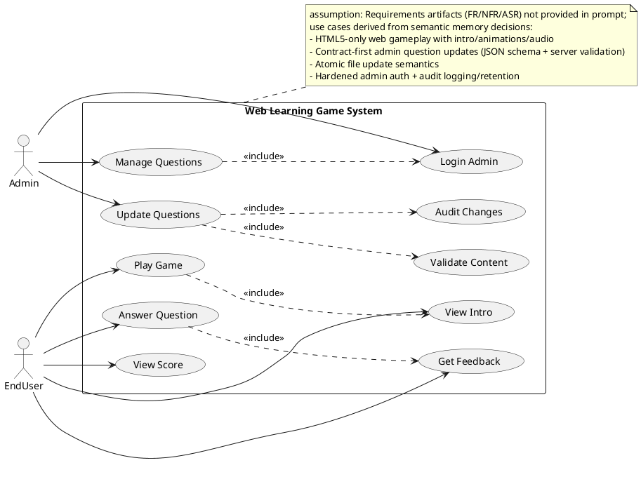
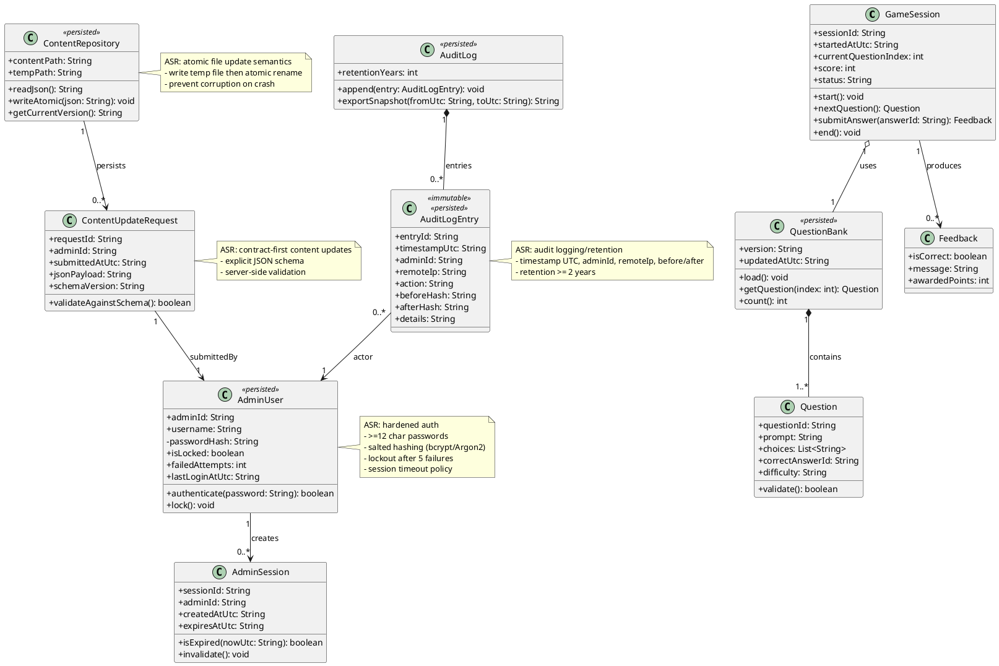
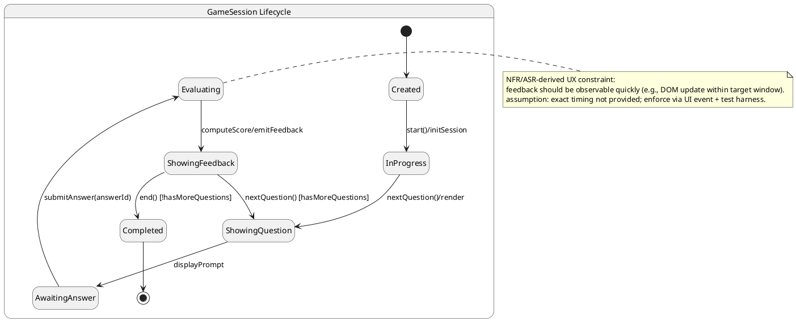
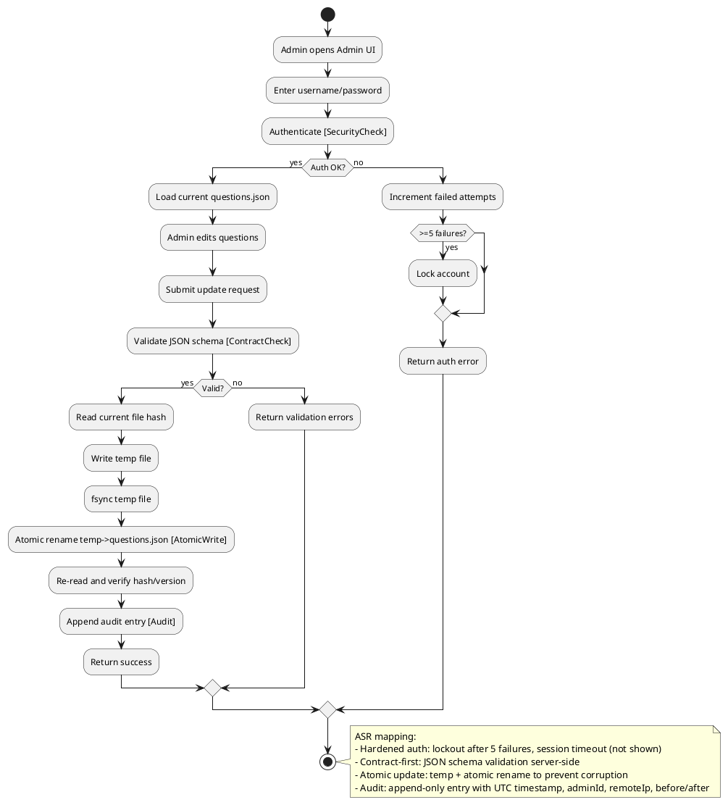
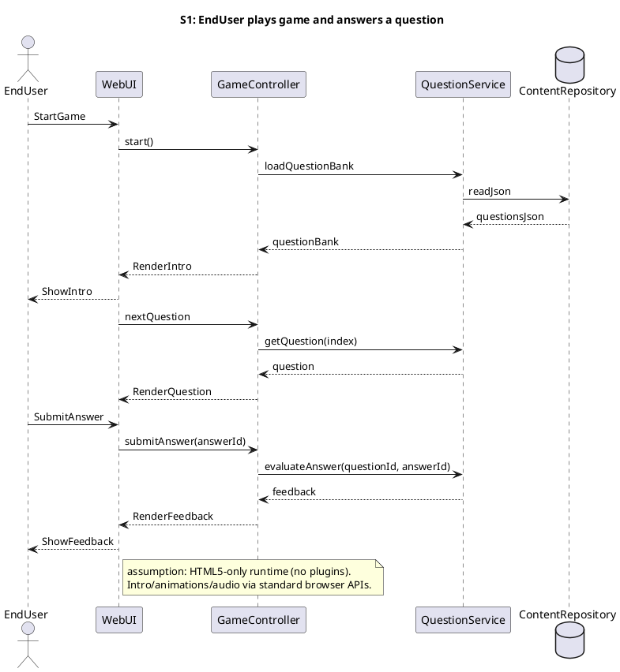
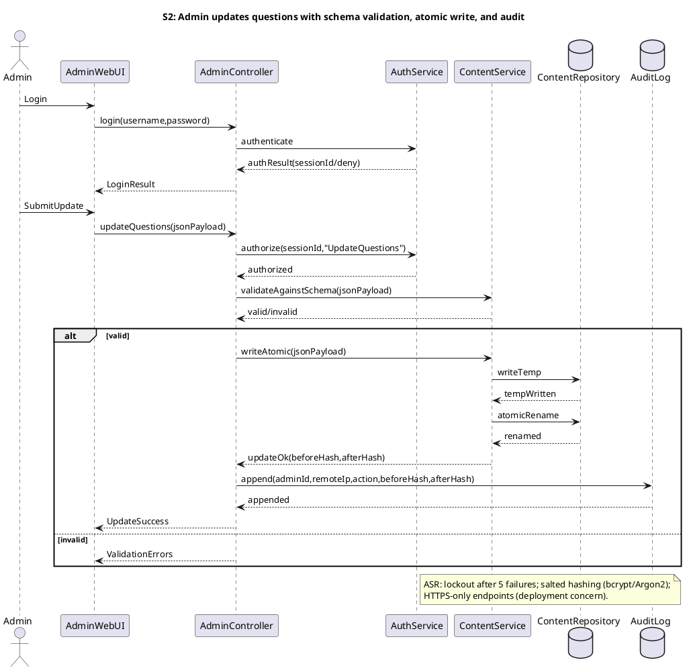
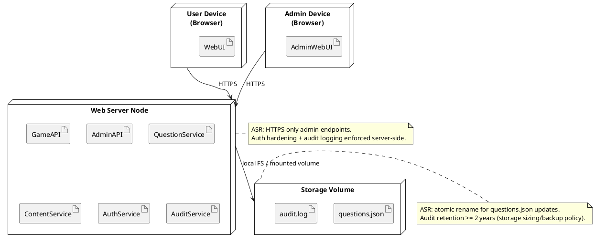
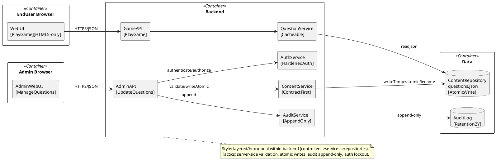

## ScenarioView
1. UseCase — Scenario View: Use Case Diagram


## LogicView
2. Class — Logic View: Class Diagram


3. Object — Logic View: Object Diagram
```plantuml
@startuml Object_LogicView

object qb1 as "qb1:QuestionBank [PlayGame]" {
  version = "2026.03.13"
  updatedAtUtc = "2026-03-13T10:00:00Z"
}

object q1 as "q1:Question [AnswerQuestion]" {
  questionId = "Q-001"
  prompt = "What is 2+2?"
  choices = "[A:3,B:4,C:5]"
  correctAnswerId = "B"
  difficulty = "Easy"
}

object gs1 as "gs1:GameSession [PlayGame]" {
  sessionId = "S-1001"
  startedAtUtc = "2026-03-13T10:05:00Z"
  currentQuestionIndex = 0
  score = 0
  status = "InProgress"
}

object fb1 as "fb1:Feedback [GetFeedback]" {
  isCorrect = true
  message = "Correct!"
  awardedPoints = 10
}

object admin1 as "admin1:AdminUser [ManageQuestions]" {
  adminId = "A-01"
  username = "contentAdmin"
  isLocked = false
  failedAttempts = 0
  lastLoginAtUtc = "2026-03-13T09:55:00Z"
}

object cur1 as "cur1:ContentUpdateRequest [UpdateQuestions]" {
  requestId = "R-9001"
  adminId = "A-01"
  submittedAtUtc = "2026-03-13T10:10:00Z"
  schemaVersion = "1.0"
  jsonPayload = "{...questions...}"
}

object repo1 as "repo1:ContentRepository [UpdateQuestions]" {
  contentPath = "/data/questions.json"
  tempPath = "/data/questions.json.tmp"
}

object al1 as "al1:AuditLog [AuditChanges]" {
  retentionYears = 2
}

object ae1 as "ae1:AuditLogEntry [AuditChanges]" {
  entryId = "E-777"
  timestampUtc = "2026-03-13T10:10:02Z"
  adminId = "A-01"
  remoteIp = "203.0.113.10"
  action = "UpdateQuestions"
  beforeHash = "sha256:aaa..."
  afterHash = "sha256:bbb..."
  details = "Updated Q-001 choices"
}

gs1 o-- qb1
qb1 *-- q1
gs1 --> fb1

cur1 --> admin1
repo1 --> cur1
al1 *-- ae1
ae1 --> admin1

@enduml
```

4. State — Logic View: State Diagram


## ProcessView
5. Activity — Process View: Activity Diagram


6. Sequence — Process View: Sequence Diagram




7. Collaboration — Process View: Collaboration Diagram
```plantuml
@startuml Collaboration_ProcessView_S1_PlayAndAnswer
title Collaboration S1: Play and Answer

actor EndUser
rectangle WebUI
rectangle GameController
rectangle QuestionService
database ContentRepository

EndUser -- WebUI
WebUI -- GameController
GameController -- QuestionService
QuestionService -- ContentRepository

WebUI : 1. StartGame
GameController : 2. start()
QuestionService : 3. loadQuestionBank
ContentRepository : 4. readJson
WebUI : 5. RenderIntro
WebUI : 6. nextQuestion
QuestionService : 7. getQuestion
WebUI : 8. RenderQuestion
WebUI : 9. SubmitAnswer
GameController : 10. submitAnswer
QuestionService : 11. evaluateAnswer
WebUI : 12. RenderFeedback

note right
Scenario mapping: EndUser plays game, loads questions, answers, receives feedback.
end note

@enduml
```

```plantuml
@startuml Collaboration_ProcessView_S2_AdminUpdateQuestions
title Collaboration S2: Admin Update Questions

actor Admin
rectangle AdminWebUI
rectangle AdminController
rectangle AuthService
rectangle ContentService
database ContentRepository
database AuditLog

Admin -- AdminWebUI
AdminWebUI -- AdminController
AdminController -- AuthService
AdminController -- ContentService
ContentService -- ContentRepository
AdminController -- AuditLog

AdminWebUI : 1. Login
AdminController : 2. login()
AuthService : 3. authenticate
AdminWebUI : 4. SubmitUpdate
AdminController : 5. authorize
ContentService : 6. validateAgainstSchema
ContentRepository : 7. writeTemp
ContentRepository : 8. atomicRename
AuditLog : 9. append

note right
Scenario mapping: Admin updates questions with server-side schema validation,
atomic file update, and audit logging/retention.
end note

@enduml
```

## DevelopmentView
8. Package — Development View: Package Diagram
```plantuml
@startuml Package_DevelopmentView
skinparam packageStyle rectangle

package "ui" as ui {
  note bottom: HTML5 Web UI (no plugins)\n[Usability][Maintainability]
}

package "api" as api {
  note bottom: HTTP controllers for game + admin\n[Security]
}

package "domain" as domain {
  note bottom: Core entities + rules\n[Modifiability]
}

package "services" as services {
  note bottom: Use-case services (game, content, auth)\n[Performance][Security]
}

package "persistence" as persistence {
  note bottom: File-based JSON repo + atomic writes\n[Reliability]
}

package "audit" as audit {
  note bottom: Append-only audit + export\n[Compliance]
}

ui ..> api : uses
api ..> services : calls
services ..> domain : uses
services ..> persistence : reads/writes
services ..> audit : appends
audit ..> persistence : stores

note right of persistence
ASR: atomic rename semantics; validate before write.
end note

note right of audit
ASR: retention >= 2 years; include UTC timestamp, adminId, remoteIp, before/after.
end note

@enduml
```

9. Component — Development View: Component Diagram
```plantuml
@startuml Component_DevelopmentView
skinparam componentStyle rectangle

component "WebUI" as WebUI <<UI>> [PlayGame]
component "AdminWebUI" as AdminWebUI <<UI>> [ManageQuestions]

component "GameAPI" as GameAPI <<API>> [PlayGame]
component "AdminAPI" as AdminAPI <<API>> [UpdateQuestions]

component "GameController" as GameController <<Controller>>
component "AdminController" as AdminController <<Controller>>

component "QuestionService" as QuestionService <<Service>> [Cacheable]
component "ContentService" as ContentService <<Service>> [ContractFirst]
component "AuthService" as AuthService <<Service>> [HardenedAuth]
component "AuditService" as AuditService <<Service>> [AppendOnly]

database "ContentRepository" as ContentRepository <<FileStore>> [AtomicWrite]
database "AuditLog" as AuditLog <<LogStore>> [Retention2Y]

interface "IGame" as IGame
interface "IAdmin" as IAdmin
interface "IAuth" as IAuth
interface "IContent" as IContent
interface "IAudit" as IAudit

WebUI --> GameAPI
AdminWebUI --> AdminAPI

GameAPI - IGame
AdminAPI - IAdmin

GameAPI --> GameController
AdminAPI --> AdminController

GameController --> QuestionService
AdminController --> AuthService
AdminController --> ContentService
AdminController --> AuditService

AuthService - IAuth
ContentService - IContent
AuditService - IAudit

QuestionService --> ContentRepository
ContentService --> ContentRepository
AuditService --> AuditLog

note right of ContentService
ASR: JSON schema validation server-side (contract-first).
end note

note right of ContentRepository
ASR: temp-file + atomic rename; prevent corruption.
end note

note right of AuthService
ASR: bcrypt/Argon2, lockout after 5 failures, session timeout.
end note

@enduml
```

## PhysicalView
10. Deployment — Physical View: Deployment Diagram


11. Container — Physical View: Container Diagram
