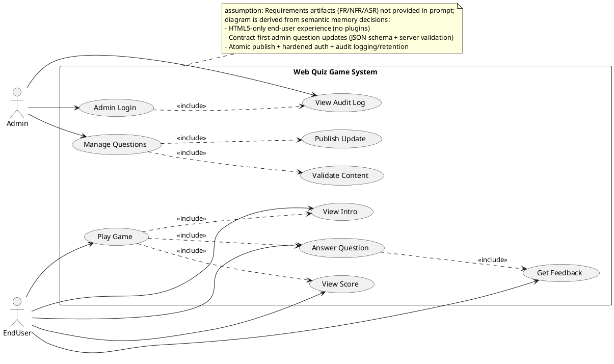
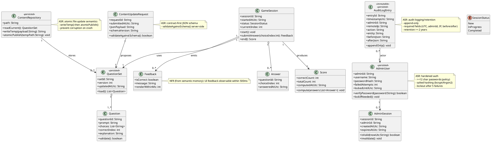
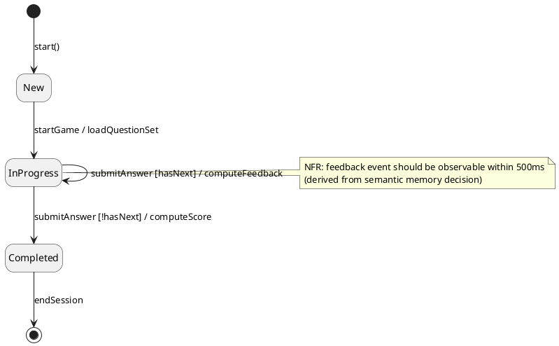
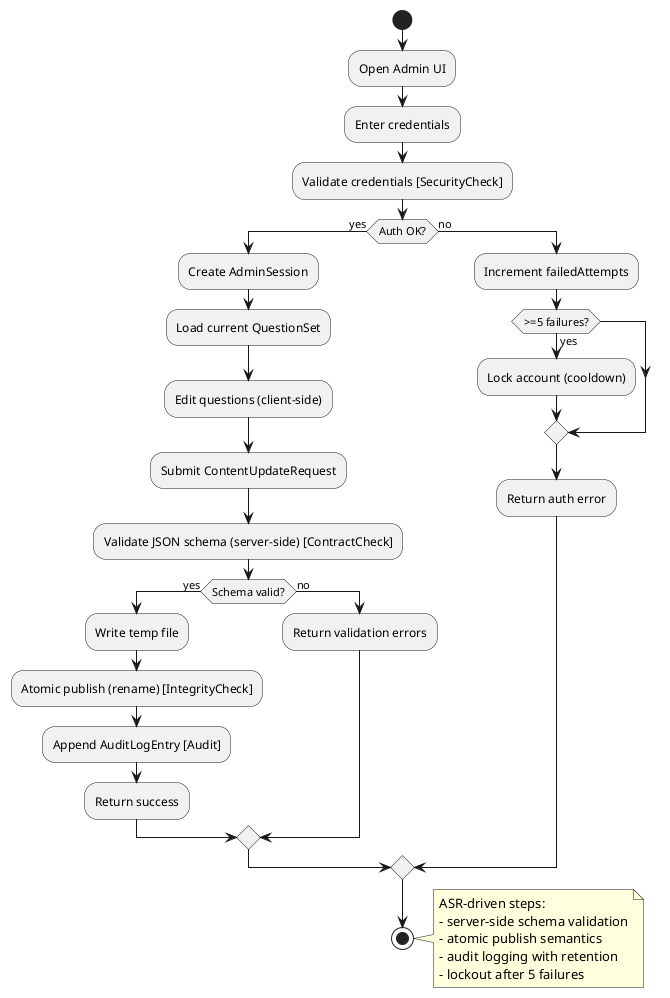
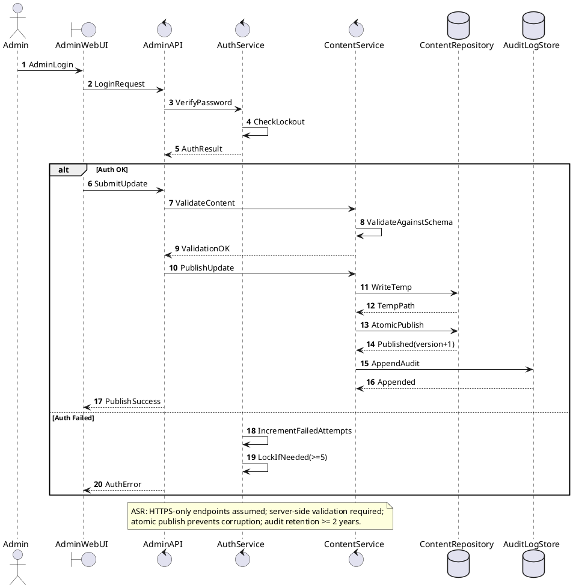
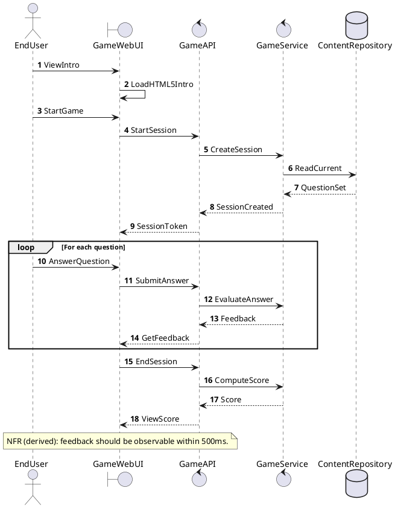
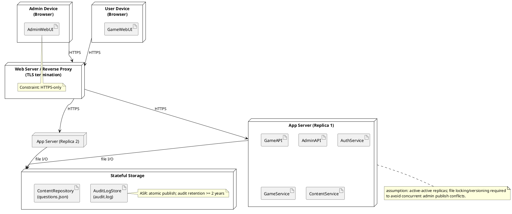
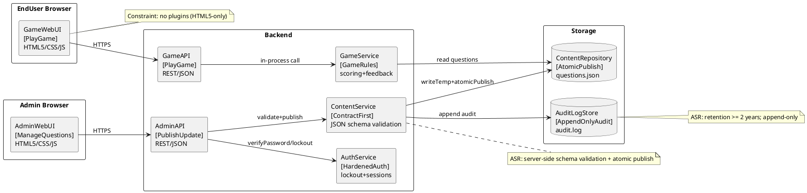

## ScenarioView
1. UseCase — Scenario View: Use Case Diagram


## LogicView
2. Class — Logic View: Class Diagram


3. Object — Logic View: Object Diagram
```plantuml
@startuml Object_LogicView

object questionSet1 as "questionSet1:QuestionSet [PlayGame]" {
  setId = "qs-2026-03"
  version = 12
  updatedAtUtc = "2026-03-01T10:00:00Z"
}

object q1 as "q1:Question [AnswerQuestion]" {
  questionId = "Q-001"
  prompt = "What is 2+2?"
  choices = "[2,3,4,5]"
  correctIndex = 2
  explanation = "2+2=4"
}

object session1 as "session1:GameSession [PlayGame]" {
  sessionId = "sess-9f2a"
  startedAtUtc = "2026-03-14T09:00:00Z"
  status = InProgress
  currentIndex = 0
}

object ans1 as "ans1:Answer [AnswerQuestion]" {
  questionId = "Q-001"
  choiceIndex = 2
  answeredAtUtc = "2026-03-14T09:00:10Z"
}

object fb1 as "fb1:Feedback [GetFeedback]" {
  isCorrect = true
  message = "Correct!"
  renderWithinMs = 180
}

object score1 as "score1:Score [ViewScore]" {
  correctCount = 1
  totalCount = 1
  computedAtUtc = "2026-03-14T09:00:12Z"
}

questionSet1 o-- q1
session1 --> questionSet1 : uses
session1 o-- ans1
session1 o-- fb1
session1 --> score1 : produces

@enduml
```

4. State — Logic View: State Diagram


## ProcessView
5. Activity — Process View: Activity Diagram


6. Sequence — Process View: Sequence Diagram




7. Collaboration — Process View: Collaboration Diagram

```plantuml
@startuml Collaboration_ProcessView_S1_AdminPublishUpdate
' Communication diagram for scenario S1: AdminPublishUpdate
object Admin
object AdminWebUI
object AdminAPI
object AuthService
object ContentService
object ContentRepository
object AuditLogStore

Admin -- AdminWebUI
AdminWebUI -- AdminAPI
AdminAPI -- AuthService
AdminAPI -- ContentService
ContentService -- ContentRepository
ContentService -- AuditLogStore

Admin -> AdminWebUI : 1 AdminLogin
AdminWebUI -> AdminAPI : 2 LoginRequest
AdminAPI -> AuthService : 3 VerifyPassword
AuthService -> AuthService : 4 CheckLockout
AuthService -> AdminAPI : 5 AuthResult
AdminWebUI -> AdminAPI : 6 SubmitUpdate
AdminAPI -> ContentService : 7 ValidateContent
ContentService -> ContentService : 8 ValidateAgainstSchema
AdminAPI -> ContentService : 9 PublishUpdate
ContentService -> ContentRepository : 10 WriteTemp
ContentService -> ContentRepository : 11 AtomicPublish
ContentService -> AuditLogStore : 12 AppendAudit
AdminAPI -> AdminWebUI : 13 PublishSuccess

note right
Originating scenario: "Admin publishes question updates with schema validation,
atomic file update, hardened auth, and audit logging."
end note

@enduml
```

```plantuml
@startuml Collaboration_ProcessView_S2_EndUserPlayGame
' Communication diagram for scenario S2: EndUserPlayGame
object EndUser
object GameWebUI
object GameAPI
object GameService
object ContentRepository

EndUser -- GameWebUI
GameWebUI -- GameAPI
GameAPI -- GameService
GameService -- ContentRepository

EndUser -> GameWebUI : 1 ViewIntro
GameWebUI -> GameWebUI : 2 LoadHTML5Intro
EndUser -> GameWebUI : 3 StartGame
GameWebUI -> GameAPI : 4 StartSession
GameAPI -> GameService : 5 CreateSession
GameService -> ContentRepository : 6 ReadCurrent
GameService -> GameAPI : 7 SessionCreated
GameAPI -> GameWebUI : 8 SessionToken
EndUser -> GameWebUI : 9 AnswerQuestion
GameWebUI -> GameAPI : 10 SubmitAnswer
GameAPI -> GameService : 11 EvaluateAnswer
GameService -> GameAPI : 12 Feedback
GameAPI -> GameWebUI : 13 GetFeedback
GameWebUI -> GameAPI : 14 EndSession
GameAPI -> GameService : 15 ComputeScore
GameService -> GameAPI : 16 Score
GameAPI -> GameWebUI : 17 ViewScore

note right
Originating scenario: "End user plays HTML5 game, answers questions,
receives fast feedback, and views score."
end note

@enduml
```




## DevelopmentView
8. Package — Development View: Package Diagram
```plantuml
@startuml Package_DevelopmentView
skinparam packageStyle rectangle

package "ui" as pkg_ui {
  note bottom
  Responsibilities: HTML5/CSS/JS game + admin UI
  Constraint: no plugins (HTML5-only)
  end note
}

package "api" as pkg_api {
  note bottom
  Responsibilities: REST endpoints, request/response DTOs
  Constraint: HTTPS-only assumed
  end note
}

package "domain" as pkg_domain {
  note bottom
  Responsibilities: core models + rules (GameSession, Question, Score)
  end note
}

package "application" as pkg_app {
  note bottom
  Responsibilities: use-cases (PlayGame, PublishUpdate)
  end note
}

package "persistence" as pkg_persist {
  note bottom
  Responsibilities: file-based content repo + audit store
  Constraint: atomic publish; append-only audit
  end note
}

package "security" as pkg_sec {
  note bottom
  Responsibilities: password hashing, lockout, session mgmt
  end note
}

pkg_ui ..> pkg_api : uses
pkg_api ..> pkg_app : calls
pkg_app ..> pkg_domain : uses
pkg_app ..> pkg_persist : reads/writes
pkg_api ..> pkg_sec : authn/authz
pkg_app ..> pkg_sec : session/lockout

@enduml
```

9. Component — Development View: Component Diagram
```plantuml
@startuml Component_DevelopmentView
skinparam componentStyle rectangle

component "GameWebUI" as GameWebUI <<UI>> [PlayGame]
component "AdminWebUI" as AdminWebUI <<UI>> [ManageQuestions]

component "GameAPI" as GameAPI <<REST>> [PlayGame]
component "AdminAPI" as AdminAPI <<REST>> [PublishUpdate]

component "AuthService" as AuthService <<Security>> [HardenedAuth]
component "GameService" as GameService <<Application>> [GameRules]
component "ContentService" as ContentService <<Application>> [ContractFirst]
component "ContentRepository" as ContentRepository <<Persistence>> [AtomicPublish]
component "AuditLogStore" as AuditLogStore <<Persistence>> [AppendOnlyAudit]

interface "IGameAPI" as IGameAPI
interface "IAdminAPI" as IAdminAPI
interface "IAuth" as IAuth
interface "IContent" as IContent
interface "IAudit" as IAudit

GameAPI - IGameAPI
AdminAPI - IAdminAPI
AuthService - IAuth
ContentService - IContent
AuditLogStore - IAudit

GameWebUI ..> IGameAPI : HTTPS
AdminWebUI ..> IAdminAPI : HTTPS

GameAPI ..> GameService : uses
GameAPI ..> AuthService : optional (admin-only endpoints separated)

AdminAPI ..> AuthService : uses
AdminAPI ..> ContentService : uses
ContentService ..> ContentRepository : uses
ContentService ..> IAudit : appends

note right of ContentService
ASR: JSON schema validation (server-side)
end note

note right of ContentRepository
ASR: temp write + atomic rename
end note

note right of AuthService
ASR: bcrypt/Argon2, >=12 chars policy, lockout after 5 failures
end note

@enduml
```

## PhysicalView
10. Deployment — Physical View: Deployment Diagram


11. Container — Physical View: Container Diagram
