## ScenarioView
1. UseCase — Scenario View: Use Case Diagram
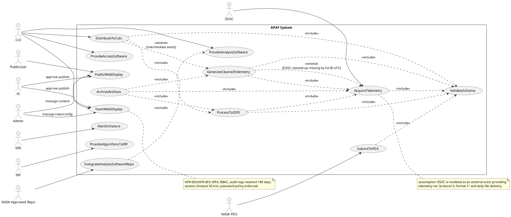

## LogicView
2. Class — Logic View: Class Diagram
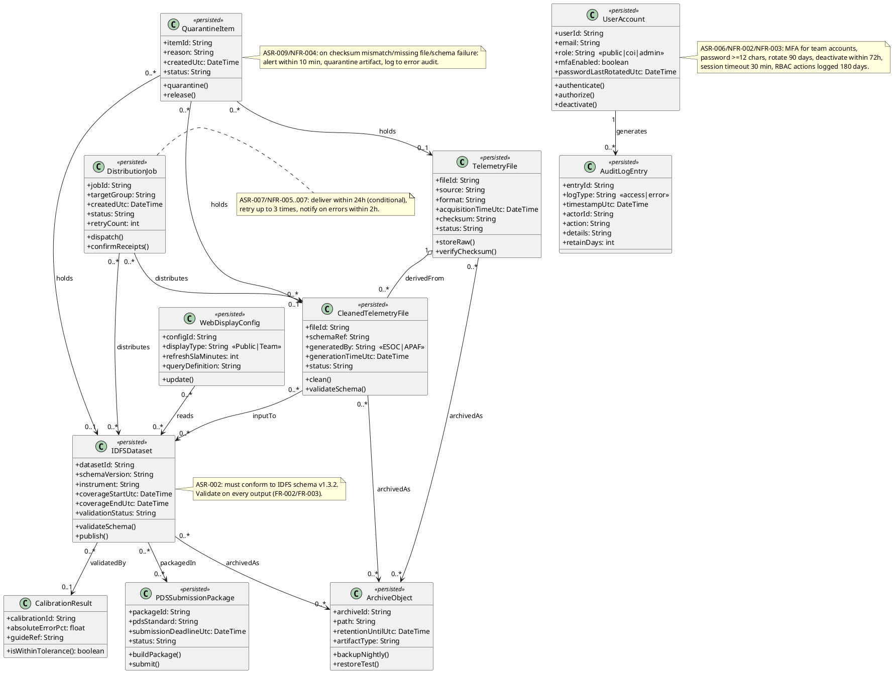

3. Object — Logic View: Object Diagram
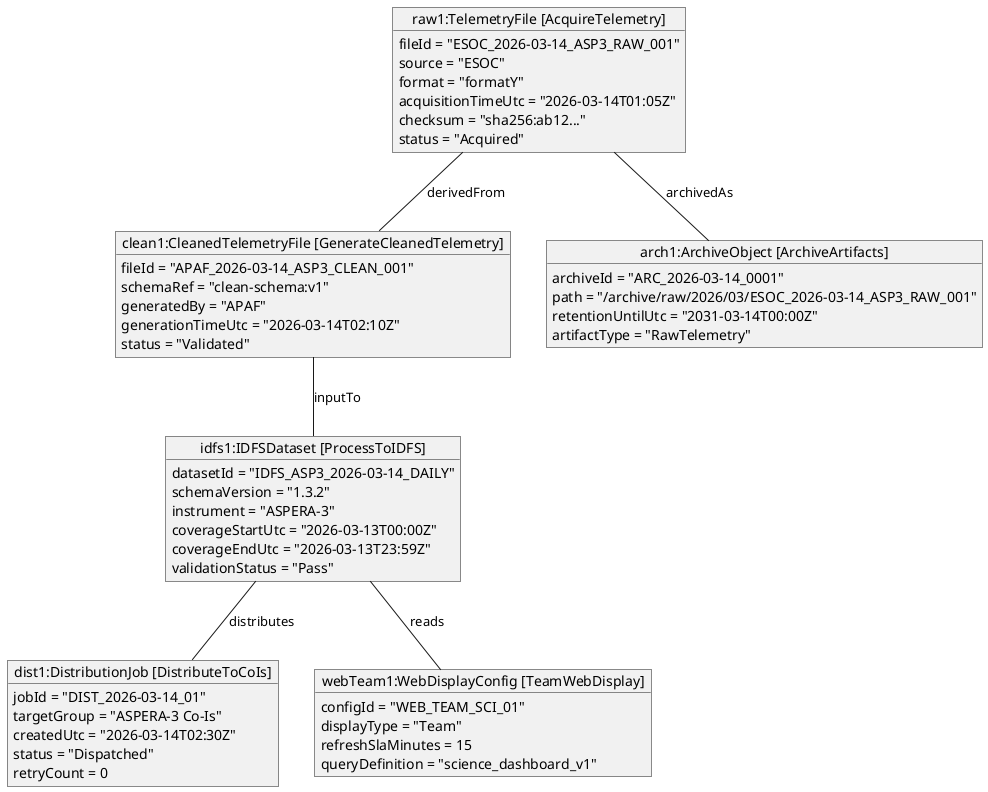

4. State — Logic View: State Diagram
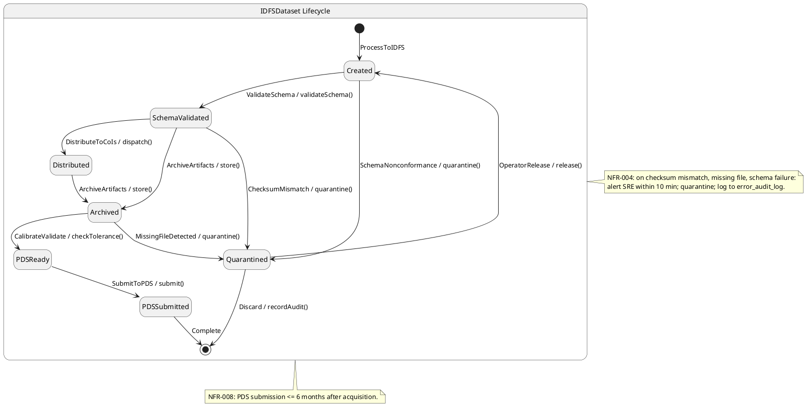

## ProcessView
5. Activity — Process View: Activity Diagram
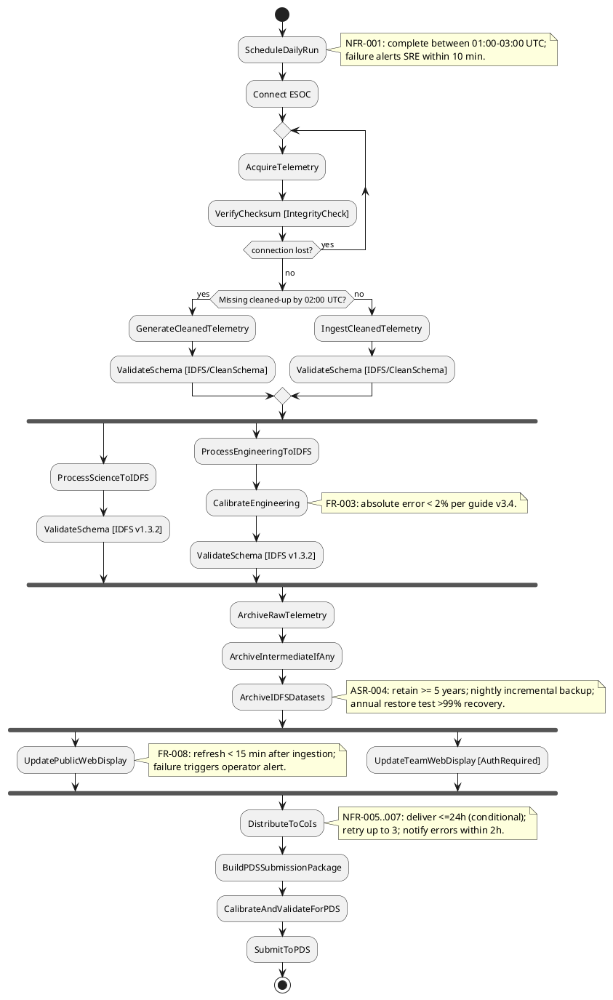

6. Sequence — Process View: Sequence Diagram
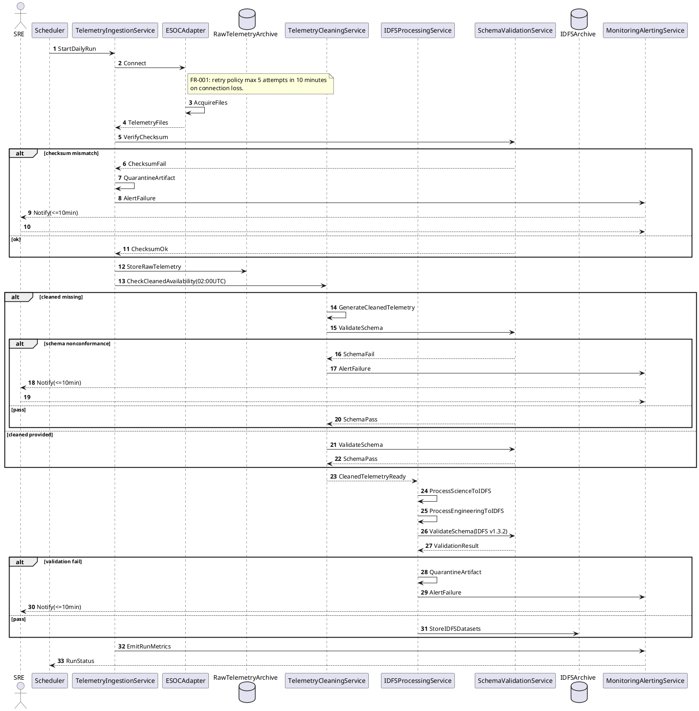

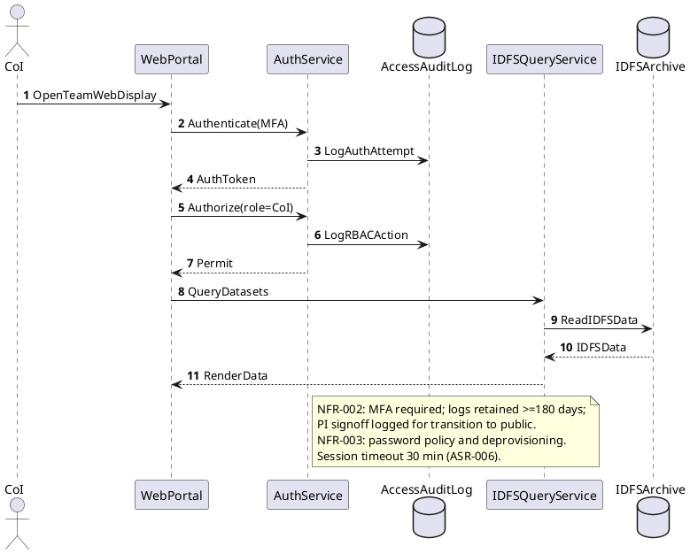

7. Collaboration — Process View: Collaboration Diagram
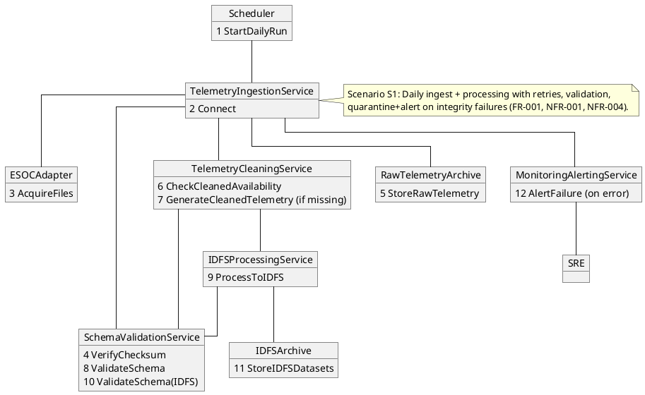

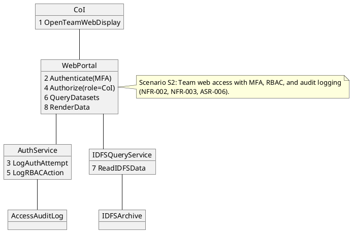

## DevelopmentView
8. Package — Development View: Package Diagram
```plantuml
@startuml Package_APAF
skinparam packageStyle rectangle

package "ui" as ui {
  note top
  WebPortal: public + team displays (FR-008/FR-009)
  end note
}

package "application" as app {
  note top
  Orchestration + use-case services; scheduled daily run (NFR-001)
  end note
}

package "domain" as dom {
  note top
  IDFS/telemetry domain model; invariants (ASR-002/ASR-005)
  end note
}

package "integrations" as integ {
  note top
  ESOC adapter; PDS submission; Co-I distribution; repo integration
  (FR-001, FR-013, FR-010, FR-022)
  end note
}

package "persistence" as pers {
  note top
  Local archives, metadata, quarantine, audit logs (ASR-004/ASR-009)
  end note
}

package "security" as sec {
  note top
  AuthN/AuthZ, MFA, RBAC, session mgmt, password policy (ASR-006)
  end note
}

package "observability" as obs {
  note top
  Monitoring, alerting, error audit log (NFR-001, NFR-004, NFR-012)
  end note
}

ui ..> sec : uses
ui ..> app : uses
app ..> dom : uses
app ..> integ : uses
app ..> pers : uses
app ..> obs : uses
integ ..> dom : uses
integ ..> pers : uses
sec ..> pers : uses (audit)
obs ..> pers : uses (logs)

note bottom
ASR-010: internal interface contracts live in SDDs and are versioned
with references to project-unique requirement IDs (NFR-010).
end note
@enduml
```

9. Component — Development View: Component Diagram
```plantuml
@startuml Component_APAF
skinparam componentStyle rectangle

component "WebPortal" as WebPortal <<UI>> [PublicWebDisplay/TeamWebDisplay]
component "AuthService" as AuthService <<Security>> [RBAC/MFA]
component "TelemetryIngestionService" as Ingest <<Service>> [AcquireTelemetry]
component "ESOCAdapter" as ESOCAdapter <<Adapter>> [protocolX/formatY]
component "TelemetryCleaningService" as CleanSvc <<Service>> [GenerateCleanedTelemetry]
component "IDFSProcessingService" as Proc <<Service>> [ProcessToIDFS]
component "SchemaValidationService" as Val <<Service>> [ValidateSchema]
component "ArchiveService" as ArchiveSvc <<Service>> [ArchiveArtifacts]
component "DistributionService" as DistSvc <<Service>> [DistributeToCoIs]
component "PDSSubmissionService" as PDSSvc <<Service>> [SubmitToPDS]
component "MonitoringAlertingService" as Mon <<Service>> [AlertOnFailure]
component "IDFSQueryService" as Query <<Service>> [QueryIDFS]

database "RawTelemetryArchive" as RawArc
database "IntermediateArchive" as IntArc
database "IDFSArchive" as IDFSArc
database "QuarantineStore" as Quarantine
database "AccessAuditLog" as AccessLog
database "ErrorAuditLog" as ErrorLog

interface "IAuth" as IAuth
interface "IESOC" as IESOC
interface "IValidate" as IValidate
interface "IArchive" as IArchive
interface "IDistribute" as IDistribute
interface "IPDSSubmit" as IPDSSubmit
interface "IQueryIDFS" as IQueryIDFS

WebPortal - IAuth
AuthService ..|> IAuth
AuthService --> AccessLog : writes

Ingest - IESOC
ESOCAdapter ..|> IESOC

Proc - IValidate
Val ..|> IValidate

ArchiveSvc - IArchive
ArchiveSvc ..|> IArchive

DistSvc - IDistribute
DistSvc ..|> IDistribute

PDSSvc - IPDSSubmit
PDSSvc ..|> IPDSSubmit

Query - IQueryIDFS
Query ..|> IQueryIDFS

Ingest --> ESOCAdapter : uses
Ingest --> Val : uses
Ingest --> RawArc : stores
Ingest --> Quarantine : quarantines
Ingest --> Mon : emits

CleanSvc --> Val : uses
CleanSvc --> IntArc : stores
CleanSvc --> Quarantine : quarantines
CleanSvc --> Mon : emits

Proc --> Val : uses
Proc --> IDFSArc : stores
Proc --> Quarantine : quarantines
Proc --> Mon : emits

ArchiveSvc --> RawArc : manages
ArchiveSvc --> IntArc : manages
ArchiveSvc --> IDFSArc : manages

DistSvc --> IDFSArc : reads
DistSvc --> IntArc : reads
DistSvc --> Mon : alerts

PDSSvc --> IDFSArc : reads
PDSSvc --> Val : validates
PDSSvc --> Mon : alerts

Mon --> ErrorLog : writes

note right of ESOCAdapter
FR-001: retry max 5 attempts/10 min on connection loss.
end note

note right of Val
NFR-004: detect checksum mismatch, missing file, schema nonconformance;
quarantine + alert within 10 min; log reviewable within 1 hour.
end note

note bottom of WebPortal
FR-008: public display refresh <15 min after ingestion; failure alerts operator.
ASR-006: mixed public/restricted access with RBAC + audit.
end note
@enduml
```

## PhysicalView
10. Deployment — Physical View: Deployment Diagram
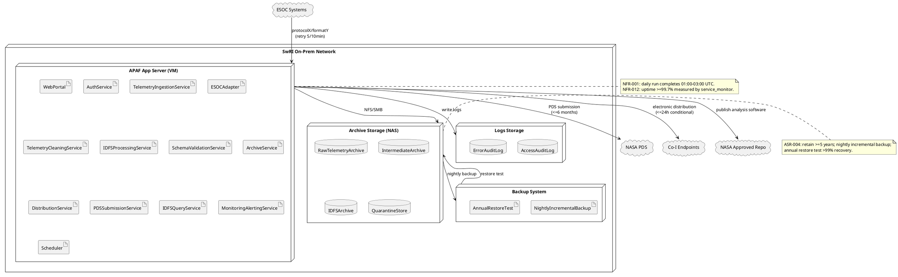

11. Container — Physical View: Container Diagram
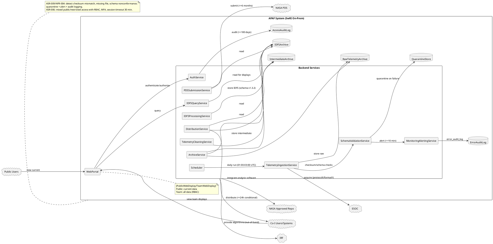