## ScenarioView
1. UseCase — Scenario View: Use Case Diagram
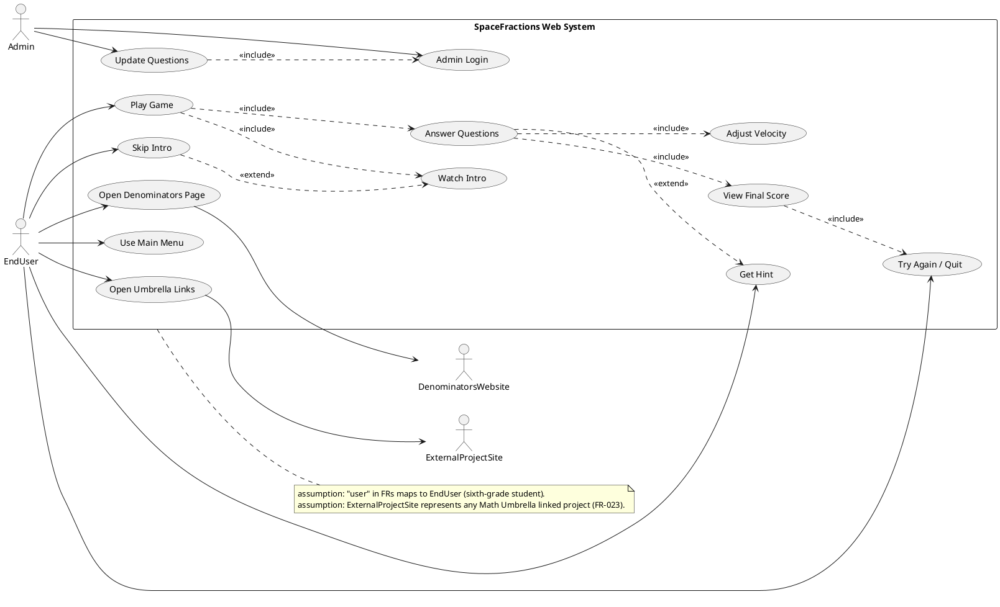

## LogicView
2. Class — Logic View: Class Diagram
```plantuml
@startuml Class_SpaceFractions
skinparam classAttributeIconSize 0

class GameApp {
  +start(): void
  +routeTo(screen: ScreenId): void
}

class ScreenRouter {
  -currentScreen: ScreenId
  +showIntro(): void
  +showMainMenu(): void
  +showGameplay(): void
  +showEnding(): void
}

class IntroMoviePlayer {
  -isPlaying: Boolean
  +play(): void
  +skip(): void
  +onEnded(): void
}

class MainMenu {
  +showHelp(): void
  +startGame(): void
  +openDenominators(): void
  +openUmbrella(): void
}

class GameSession {
  -sessionId: String
  -score: Score
  -progress: StoryProgress
  +start(): void
  +answer(choiceId: String): FeedbackEvent
  +applyVelocityFraction(numerator: Integer, denominator: Integer): void
  +end(): GameResult
}

class QuestionBank <<cacheable>> {
  -sourceUrl: String
  -questions: Question[]
  +load(): void
  +getQuestion(id: String): Question
  +getNext(progress: StoryProgress): Question
}

class Question {
  +id: String
  +prompt: String
  +choices: Choice[]
  +answer: String
  +hint: String
  +isCritical: Boolean
}

class Choice {
  +id: String
  +text: String
}

class StoryEngine {
  +nextQuestion(progress: StoryProgress, lastCorrect: Boolean): Question
  +branch(progress: StoryProgress): void
}

class StoryProgress {
  +currentQuestionId: String
  +correctOnCritical: Boolean
  +attemptedIds: String[]
}

class Score <<local>> {
  +points: Integer
  +penalizedQuestionIds: String[]
  +addPoint(questionId: String): void
  +markNoPoint(questionId: String): void
  +rank(): String
}

class FeedbackService {
  +emitFeedback(type: String, withinMs: Integer): FeedbackEvent
  +showMessage(text: String): void
}

class FeedbackEvent {
  +type: String
  +timestampUtc: String
}

class FractionValidator {
  +validateIntegers(numerator: Integer, denominator: Integer): Boolean
  +validateNonZeroDenominator(denominator: Integer): Boolean
}

class VelocityCalculator {
  +toDecimal(numerator: Integer, denominator: Integer): Float
  +adjust(currentVelocity: Float, delta: Float): Float
}

class PhysicsEngine {
  -velocity: Float
  +setVelocity(v: Float): void
  +tick(dtMs: Integer): void
}

class AdminAuthService {
  +login(adminId: String, password: String): Boolean
  +lockoutIfNeeded(adminId: String): void
}

class AuditLogger <<persisted>> {
  +append(entry: AuditLogEntry): void
}

class AuditLogEntry {
  +timestampUtc: String
  +adminId: String
  +remoteIp: String
  +fieldChanged: String
  +before: String
  +after: String
}

class QuestionUpdaterController {
  +loadEditor(): void
  +validateAndSave(updated: Question[]): Boolean
}

class QuestionFileRepository <<persisted>> {
  -filePath: String
  +readAll(): Question[]
  +writeAtomically(updated: Question[]): void
  +validateSchema(updated: Question[]): Boolean
}

GameApp --> ScreenRouter
ScreenRouter --> IntroMoviePlayer
ScreenRouter --> MainMenu
ScreenRouter --> GameSession

GameSession *-- Score
GameSession *-- StoryProgress
GameSession --> QuestionBank
GameSession --> StoryEngine
GameSession --> FeedbackService
GameSession --> FractionValidator
GameSession --> VelocityCalculator
GameSession --> PhysicsEngine

QuestionBank "1" o-- "0..*" Question
Question "1" o-- "2..*" Choice

QuestionUpdaterController --> AdminAuthService
QuestionUpdaterController --> QuestionFileRepository
QuestionUpdaterController --> AuditLogger

note right of FeedbackService : FR-019 must fire feedback event within 500ms
note right of QuestionFileRepository : ASR-003 UTF-8 JSON + atomic write
note right of AdminAuthService : >=12 char passwords + lockout + audit
note right of Score : stored in browser memory only

@enduml
```

3. Object — Logic View: Object Diagram
```plantuml
@startuml Object_SpaceFractions
skinparam classAttributeIconSize 0

object app1 as "app1:GameApp [PlayGame]" {
}

object router1 as "router1:ScreenRouter [PlayGame]" {
  currentScreen = "INTRO"
}

object intro1 as "intro1:IntroMoviePlayer [WatchIntro]" {
  isPlaying = true
}

object session1 as "session1:GameSession [AnswerQuestions]" {
  sessionId = "sess-7f3a"
}

object score1 as "score1:Score [ViewFinalScore]" {
  points = 30
  penalizedQuestionIds = "{Q3}"
}

object progress1 as "progress1:StoryProgress [AdaptiveStory]" {
  currentQuestionId = "Q5"
  correctOnCritical = true
  attemptedIds = "{Q1,Q2,Q3,Q4,Q5}"
}

object bank1 as "bank1:QuestionBank [LoadQuestions]" {
  sourceUrl = "/content/questions.json"
}

object q5 as "q5:Question [AnswerQuestions]" {
  id = "Q5"
  prompt = "Which fraction equals 0.5?"
  answer = "1/2"
  hint = "Divide numerator by denominator."
  isCritical = true
}

object physics1 as "physics1:PhysicsEngine [AdjustVelocity]" {
  velocity = 12.5
}

app1 -- router1
router1 -- intro1
router1 -- session1
session1 -- score1
session1 -- progress1
session1 -- bank1
bank1 -- q5
session1 -- physics1
@enduml
```

4. State — Logic View: State Diagram
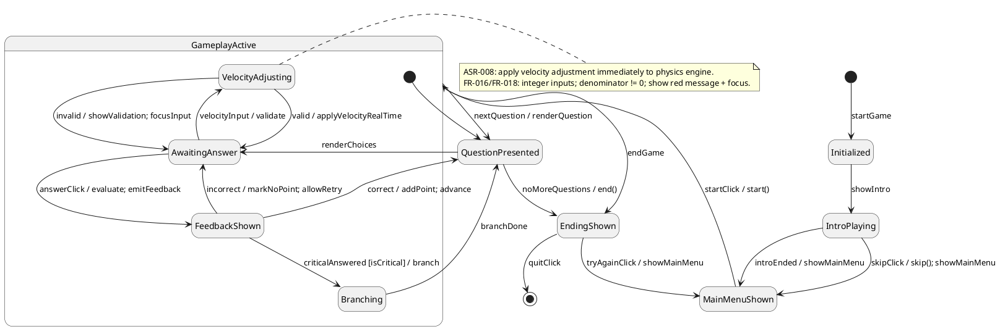

## ProcessView
5. Activity — Process View: Activity Diagram
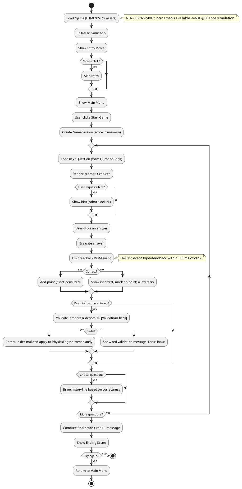

6. Sequence — Process View: Sequence Diagram
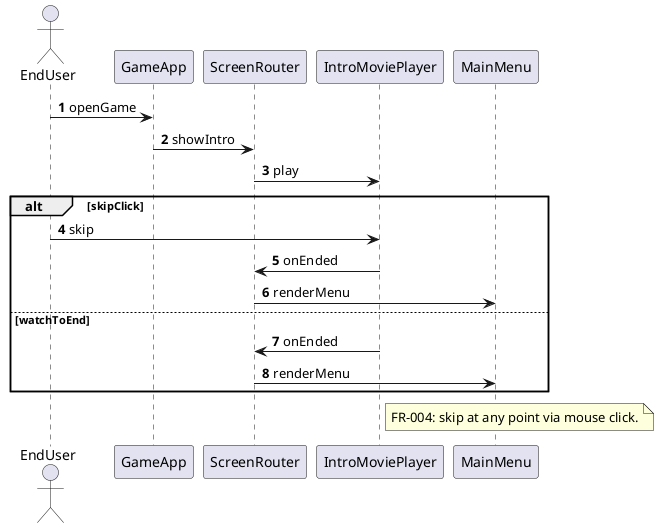

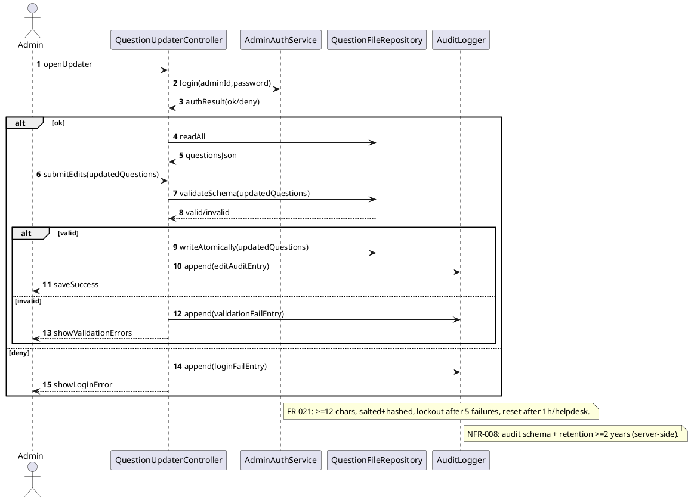

7. Collaboration — Process View: Collaboration Diagram
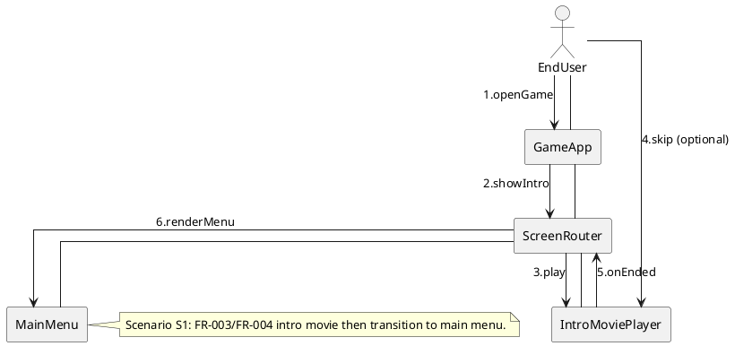

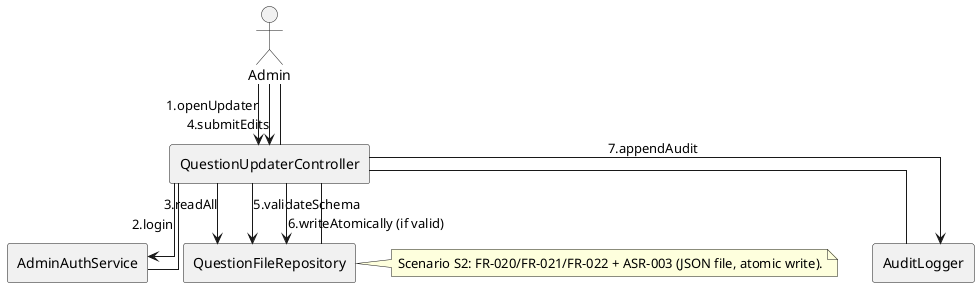

## DevelopmentView
8. Package — Development View: Package Diagram
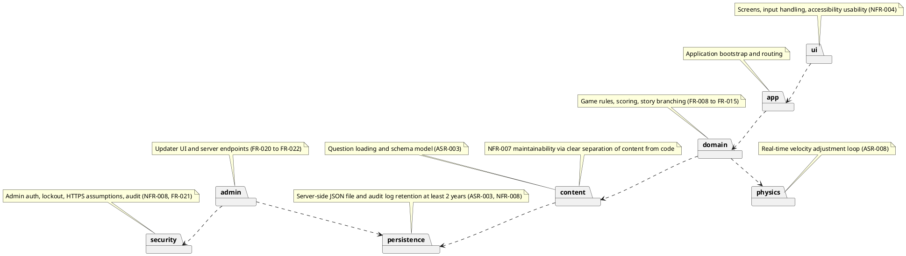

9. Component — Development View: Component Diagram
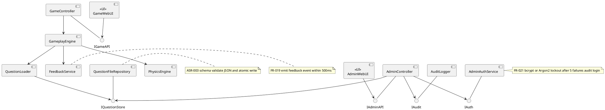

## PhysicalView
10. Deployment — Physical View: Deployment Diagram
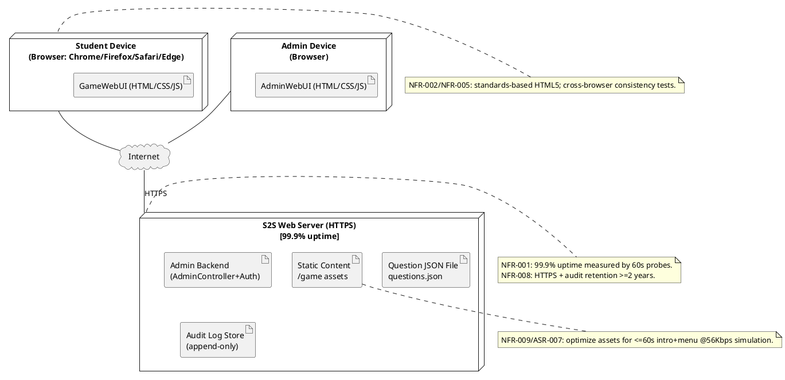

11. Container — Physical View: Container Diagram
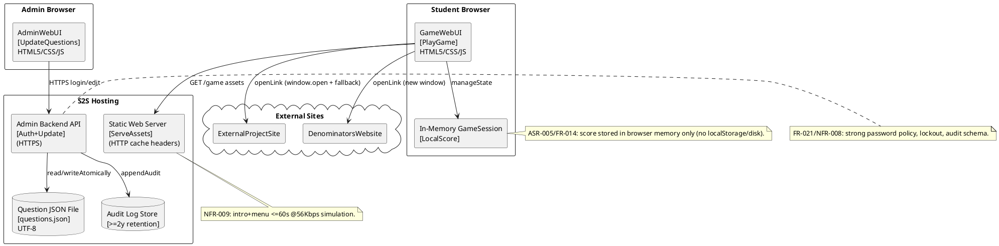