## ScenarioView
1. UseCase — Scenario View: Use Case Diagram
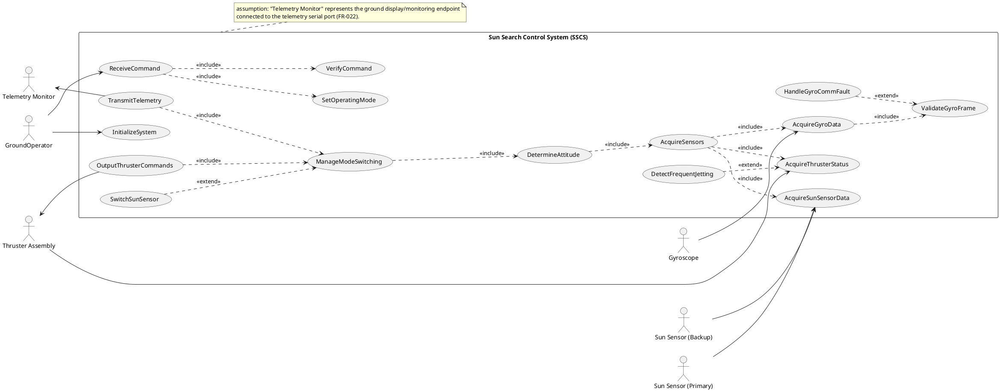

## LogicView
2. Class — Logic View: Class Diagram
```plantuml
@startuml Class_SunSearchControl
skinparam classAttributeIconSize 0

class ControlCycleScheduler <<control>> {
  -cycleId : uint32
  -tick32ms : uint8
  +onTimerTick32ms() : void
  +runCycle160ms() : void
  +measureCycleDurationMs() : uint16
}

class ModeRegister <<persisted>> {
  +modeWord : uint8
  +modeDurationTicks : uint16
  +targetAngleDeg : int16
  +targetRateDps : int16
  +pasmAttempts : uint8
  +rasmAttempts : uint8
  +activeSunSensor : uint8
  +resetAttemptsOnSunDetect() : void
}

class CommandFrame <<immutable>> {
  +header : uint8
  +len : uint8
  +data : uint8[*]
  +checksum : uint8
}

class CommandProcessor <<control>> {
  +receiveCommand() : CommandFrame
  +verifyCommand(cmd:CommandFrame) : bool
  +setOperatingMode(cmd:CommandFrame, modeReg:ModeRegister) : void
}

class SerialPortDriver <<boundary>> {
  +baseAddr : uint16
  +sendBytes(buf:uint8[*]) : void
  +readBytes(maxLen:uint8) : uint8[*]
  +measureInterByteUs() : uint16
}

class AdcDriver <<boundary>> {
  +readChannel(ch:uint8) : uint16
}

class GyroDriver <<boundary>> {
  +fetchCmd : uint16 = 0xEB91
  +powerOnCmd : uint16 = 0xEB92
  +sendFetch() : void
  +readFrame() : uint8[*]
  +powerOn() : void
  +powerOff() : void
  +control() : void
}

class SunSensorDriver <<boundary>> {
  +readPowerStatus() : bool
  +readSunVisible() : bool
  +readAngleCode12bit() : uint16
  +switchToBackupPulse() : void
}

class ThrusterIoDriver <<boundary>> {
  +readPowerStatus() : bool
  +outputSwitchData12(thrCmd:ThrusterCommand) : void
  +shutdownThruster() : void
}

class SensorFrameValidator <<service>> {
  +verifyLength(frame:uint8[*]) : bool
  +verifyHeader(frame:uint8[*]) : bool
  +verifyChecksum(frame:uint8[*]) : bool
}

class AttitudeEstimate {
  +rollDeg : int16
  +pitchDeg : int16
  +yawDeg : int16
  +wxDps : int16
  +wyDps : int16
  +wzDps : int16
  +sunVisible : bool
}

class AttitudeEstimator <<service>> {
  +determineAttitude(gyroFrame:uint8[*], sunAngleCode:uint16, sunVisible:bool) : AttitudeEstimate
}

class ModeManager <<service>> {
  +manage(modeReg:ModeRegister, est:AttitudeEstimate) : void
  +executeRDSM(modeReg:ModeRegister, est:AttitudeEstimate) : void
  +executePASM(modeReg:ModeRegister, est:AttitudeEstimate) : void
  +executeRASM(modeReg:ModeRegister, est:AttitudeEstimate) : void
  +executeCSM(modeReg:ModeRegister, est:AttitudeEstimate) : void
  +detectRepeatedSearchFailure(modeReg:ModeRegister, est:AttitudeEstimate) : bool
}

class ThrusterCommand {
  +switchBits12 : uint16
  +scheduledMs : uint16 = 128
}

class ThrusterController <<service>> {
  +computeThrusterCommand(modeReg:ModeRegister, est:AttitudeEstimate) : ThrusterCommand
  +outputAt128ms(thrCmd:ThrusterCommand) : void
}

class GyroFaultManager <<service>> {
  -consecutiveErrorCycles : uint8
  -waitCycles : uint8
  +onGyroFrameError() : void
  +onGyroFrameOk() : void
  +stepRecovery(gyro:GyroDriver) : void
}

class ThrusterIntervalMonitor <<service>> {
  +updateFireTimestamp(tsMs:uint32) : void
  +detectFrequentJetting() : bool
}

class TelemetryMsg <<immutable>> {
  +mode : uint8
  +angle : int16
  +velocity : int16
}

class TelemetryPacker <<service>> {
  +pack(modeReg:ModeRegister, est:AttitudeEstimate) : TelemetryMsg
  +encode(msg:TelemetryMsg) : uint8[*]
}

class TelemetryTransmitter <<boundary>> {
  +send(msgBytes:uint8[*]) : void
}

ControlCycleScheduler --> CommandProcessor
ControlCycleScheduler --> GyroDriver
ControlCycleScheduler --> SunSensorDriver
ControlCycleScheduler --> ThrusterIoDriver
ControlCycleScheduler --> AttitudeEstimator
ControlCycleScheduler --> ModeManager
ControlCycleScheduler --> ThrusterController
ControlCycleScheduler --> TelemetryPacker
ControlCycleScheduler --> TelemetryTransmitter
ControlCycleScheduler --> GyroFaultManager
ControlCycleScheduler --> ThrusterIntervalMonitor
ControlCycleScheduler --> ModeRegister

CommandProcessor --> SerialPortDriver : uses (0x88DA)
GyroDriver --> SerialPortDriver : uses (0x881A)
TelemetryTransmitter --> SerialPortDriver : uses (0x88DB)
SunSensorDriver --> AdcDriver : uses (angle/power)
ThrusterIoDriver --> AdcDriver : uses (power)

GyroDriver --> SensorFrameValidator
AttitudeEstimator --> SensorFrameValidator

ModeManager --> ModeRegister
ThrusterController --> ThrusterIoDriver
ThrusterController --> ThrusterCommand
TelemetryPacker --> TelemetryMsg

note right of ControlCycleScheduler
ASR-002/NFR-001/NFR-003:
Single 32ms timer ISR drives 160ms (5 ticks) cyclic executive.
Measure ControlCycleDuration = 160±2ms; alert on 3 consecutive violations.
end note

note right of SerialPortDriver
ASR-003/NFR-006:
Inter-byte spacing < 5us for gyro cmds and telemetry.
end note

note right of GyroDriver
FR-006/NFR-007:
Fetch-to-read delay >= 5ms after 0xEB91.
FR-020: power-on cmd 0xEB92 then control cmd <5us interval.
end note

note right of ThrusterController
NFR-004/FR-021:
Output 12 thruster switch lines at t=128ms; complete within 2ms.
end note

note right of SunSensorDriver
NFR-008/FR-017:
Switching instruction 190±1ms with 1ms pulse.
end note
@enduml
```

3. Object — Logic View: Object Diagram
```plantuml
@startuml Object_SunSearchControl
skinparam classAttributeIconSize 0

object scheduler1 as "scheduler1:ControlCycleScheduler [ControlCycle]" {
  cycleId = 1024
  tick32ms = 3
}

object modeReg1 as "modeReg1:ModeRegister [ModeControl]" {
  modeWord = 2
  modeDurationTicks = 15
  targetAngleDeg = 0
  targetRateDps = 5
  pasmAttempts = 1
  rasmAttempts = 0
  activeSunSensor = 0
}

object cmd1 as "cmd1:CommandFrame [ReceiveCommand]" {
  header = 0xA5
  len = 4
  checksum = 0x3C
}

object gyroDrv1 as "gyroDrv1:GyroDriver [AcquireGyroData]" {
  fetchCmd = 0xEB91
  powerOnCmd = 0xEB92
}

object sunDrv1 as "sunDrv1:SunSensorDriver [AcquireSunSensorData]" {
}

object est1 as "est1:AttitudeEstimate [DetermineAttitude]" {
  rollDeg = 12
  pitchDeg = -3
  yawDeg = 5
  wxDps = 2
  wyDps = 5
  wzDps = 1
  sunVisible = false
}

object thrCmd1 as "thrCmd1:ThrusterCommand [OutputThrusterCommands]" {
  switchBits12 = 0x05A
  scheduledMs = 128
}

scheduler1 -- modeReg1
scheduler1 -- cmd1
scheduler1 -- gyroDrv1
scheduler1 -- sunDrv1
scheduler1 -- est1
scheduler1 -- thrCmd1
@enduml
```

4. State — Logic View: State Diagram
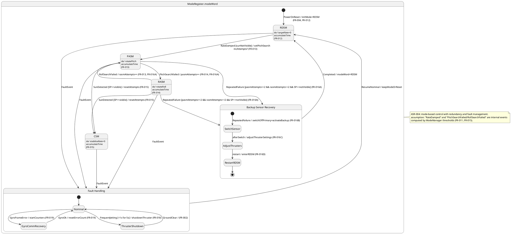

## ProcessView
5. Activity — Process View: Activity Diagram
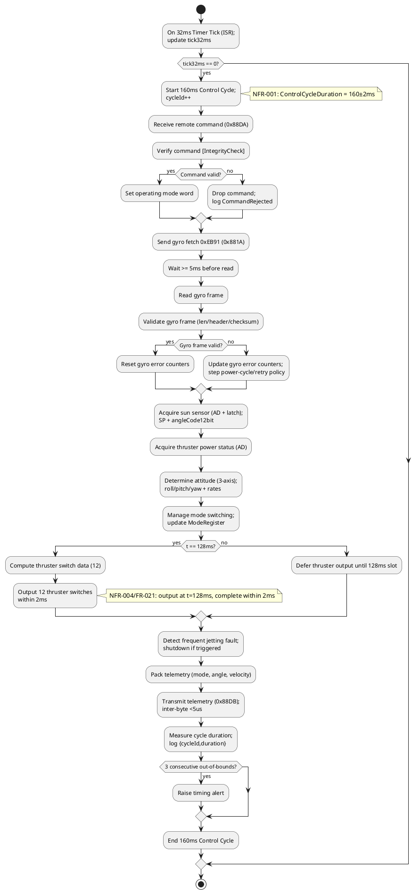

6. Sequence — Process View: Sequence Diagram
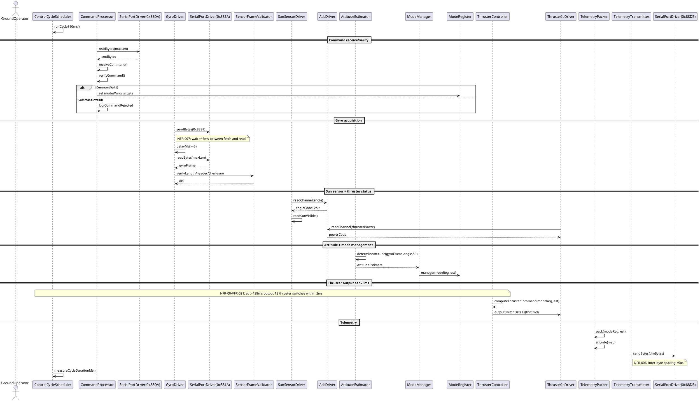

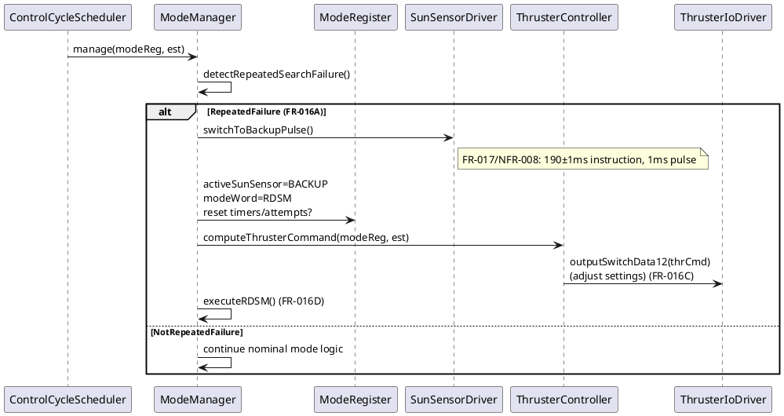

7. Collaboration — Process View: Collaboration Diagram
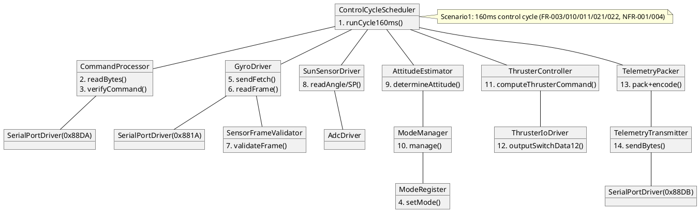

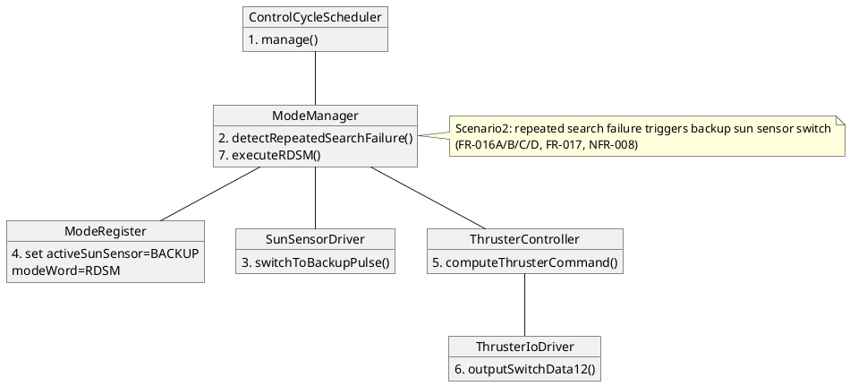

## DevelopmentView
8. Package — Development View: Package Diagram
```plantuml
@startuml Package_SunSearchControl
skinparam packageStyle rectangle
skinparam shadowing false

package "app" as app {
  note bottom
  Cyclic executive entrypoint; binds ISR tick to 160ms cycle (ASR-002)
  end note
}

package "domain" as domain {
  note bottom
  Mode/state + control logic (ASR-004)
  end note
}

package "services" as services {
  note bottom
  Estimation, validation, fault mgmt, telemetry packing
  end note
}

package "drivers" as drivers {
  note bottom
  Serial/ADC/IO drivers with fixed addresses (ASR-003)
  end note
}

package "interfaces" as interfaces {
  note bottom
  Versioned message schemas: CommandFrame, TelemetryMsg (NFR-002, FR-022)
  end note
}

package "platform" as platform {
  note bottom
  80C32E MCU specifics, timer ISR, register access (ASR-001/002)
  end note
}

app ..> domain
app ..> services
app ..> drivers
services ..> domain
services ..> interfaces
drivers ..> platform
domain ..> interfaces

note right of drivers
NFR-006: inter-byte <5us
NFR-007: fetch->read >=5ms
end note
@enduml
```

9. Component — Development View: Component Diagram
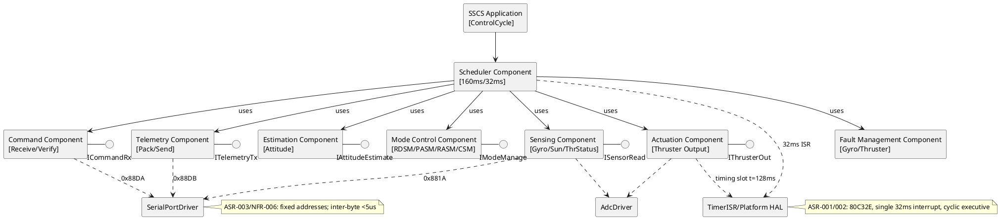

## PhysicalView
10. Deployment — Physical View: Deployment Diagram
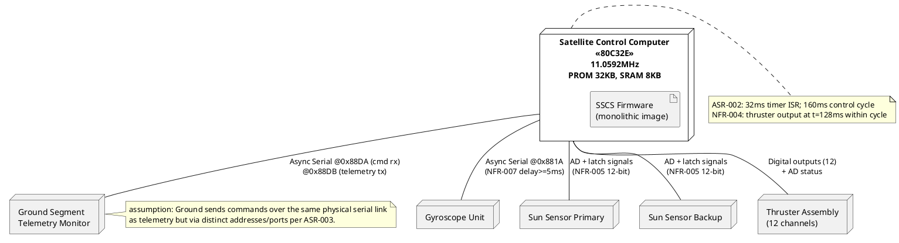

11. Container — Physical View: Container Diagram
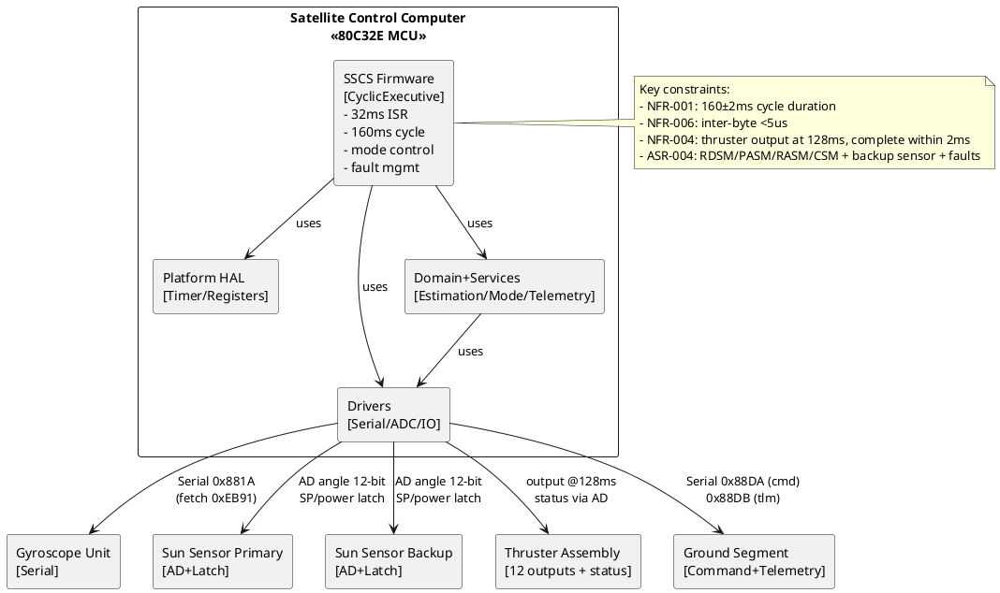