## ScenarioView
1. UseCase — Scenario View: Use Case Diagram
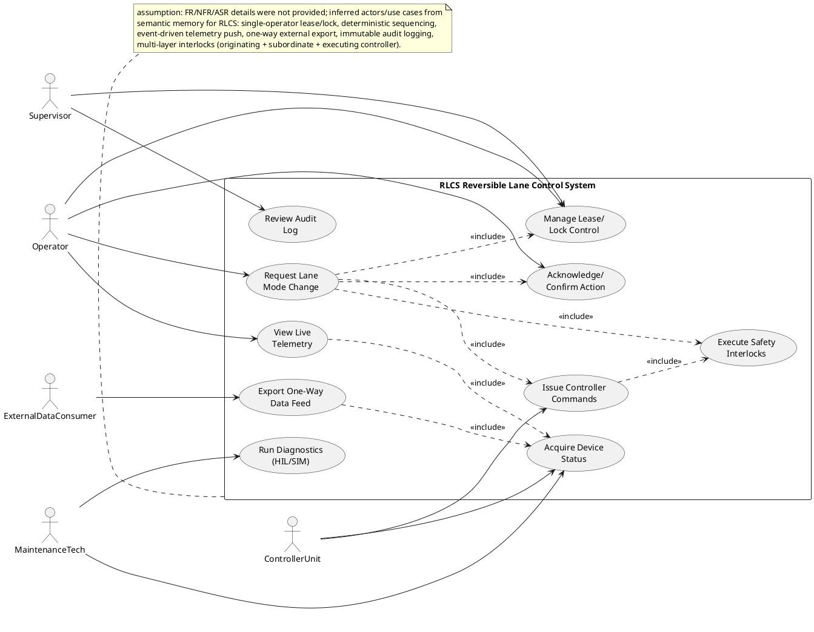

## LogicView
2. Class — Logic View: Class Diagram
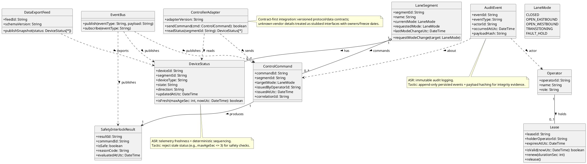

3. Object — Logic View: Object Diagram
```plantuml
@startuml Object_LogicView
object operator1 as "operator1:Operator [RequestModeChange]" {
  operatorId = "op-42"
  name = "A. Rivera"
  role = "Operator"
}

object lease1 as "lease1:Lease [ManageLease]" {
  leaseId = "lease-9c1"
  holderOperatorId = "op-42"
  expiresAtUtc = "2026-04-22T10:20:00Z"
}

object segment1 as "segment1:LaneSegment [RequestModeChange]" {
  segmentId = "seg-7"
  name = "Bridge Approach"
  currentMode = "CLOSED"
  requestedMode = "OPEN_EASTBOUND"
  lastModeChangeUtc = "2026-04-22T10:12:10Z"
}

object cmd1 as "cmd1:ControlCommand [IssueCommand]" {
  commandId = "cmd-10017"
  segmentId = "seg-7"
  targetMode = "OPEN_EASTBOUND"
  issuedByOperatorId = "op-42"
  issuedAtUtc = "2026-04-22T10:15:01Z"
  correlationId = "corr-55aa"
}

object ds1 as "ds1:DeviceStatus [AcquireStatus]" {
  deviceId = "gate-3"
  segmentId = "seg-7"
  deviceType = "BarrierGate"
  state = "CLOSED"
  direction = "N/A"
  updatedAtUtc = "2026-04-22T10:15:00Z"
}

object ds2 as "ds2:DeviceStatus [AcquireStatus]" {
  deviceId = "sign-8"
  segmentId = "seg-7"
  deviceType = "LaneArrowSign"
  state = "RED_X"
  direction = "EASTBOUND"
  updatedAtUtc = "2026-04-22T10:15:00Z"
}

object interlock1 as "interlock1:SafetyInterlockResult [SafetyInterlocks]" {
  resultId = "si-771"
  commandId = "cmd-10017"
  isSafe = "true"
  reasonCode = "OK_ALL_CLEAR"
  evaluatedAtUtc = "2026-04-22T10:15:01Z"
}

operator1 -- lease1
segment1 -- ds1
segment1 -- ds2
segment1 -- cmd1
cmd1 -- interlock1

note bottom
assumption: object values reflect safety-critical reversible-lane control:
barrier gates + lane arrow signs, with operator lease and safety interlock result.
end note
@enduml
```

4. State — Logic View: State Diagram
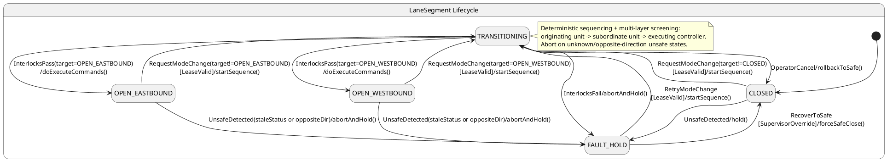

## ProcessView
5. Activity — Process View: Activity Diagram
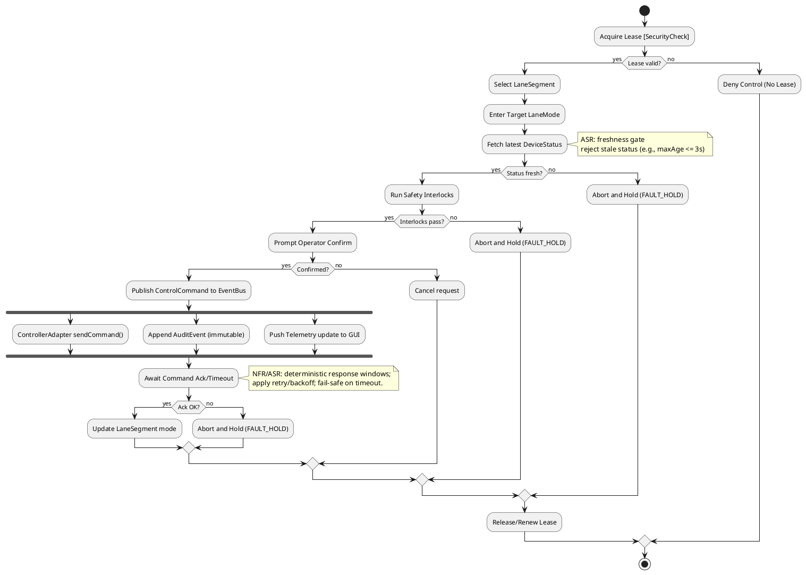

6. Sequence — Process View: Sequence Diagram
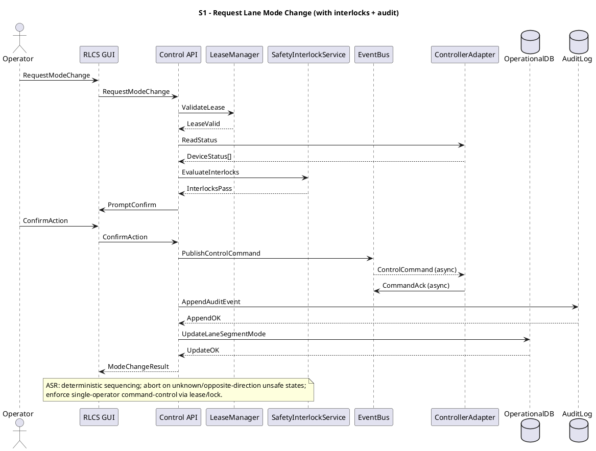

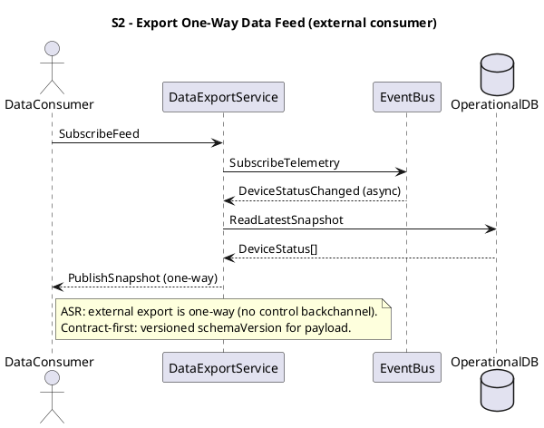

7. Collaboration — Process View: Collaboration Diagram
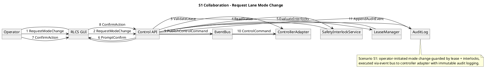

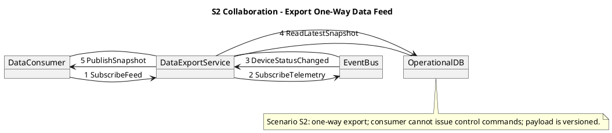

## DevelopmentView
8. Package — Development View: Package Diagram
```plantuml
@startuml Package_DevelopmentView
skinparam packageStyle rectangle

package "ui" as UI {
  note bottom
  Responsibility: operator GUI; live telemetry; confirmation prompts.
  end note
}

package "api" as API {
  note bottom
  Responsibility: control endpoints; orchestrate workflows; validation.
  end note
}

package "domain" as DOMAIN {
  note bottom
  Responsibility: LaneSegment, commands, interlocks, invariants (safety).
  end note
}

package "application" as APP {
  note bottom
  Responsibility: use-cases; deterministic sequencing; timeouts/retries.
  end note
}

package "integrations" as INTEG {
  note bottom
  Responsibility: ControllerAdapter + versioned protocol contracts; external export.
  end note
}

package "messaging" as MSG {
  note bottom
  Responsibility: EventBus abstraction; publish/subscribe.
  end note
}

package "persistence" as PERSIST {
  note bottom
  Responsibility: OperationalDB + AuditLog append-only storage.
  end note
}

UI ..> API
API ..> APP
APP ..> DOMAIN
APP ..> MSG
APP ..> INTEG
APP ..> PERSIST
INTEG ..> MSG
INTEG ..> DOMAIN
PERSIST ..> DOMAIN

note right of INTEG
ASR: contract-first stubs for unknown vendor I/O; versioned schemas + freeze dates.
end note

note right of PERSIST
ASR: immutable audit logging (append-only) for safety accountability.
end note
@enduml
```

9. Component — Development View: Component Diagram
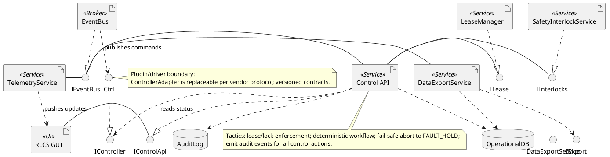

## PhysicalView
10. Deployment — Physical View: Deployment Diagram
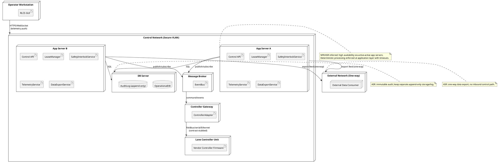

11. Container — Physical View: Container Diagram
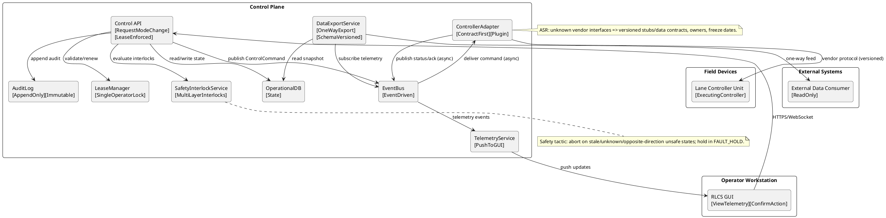