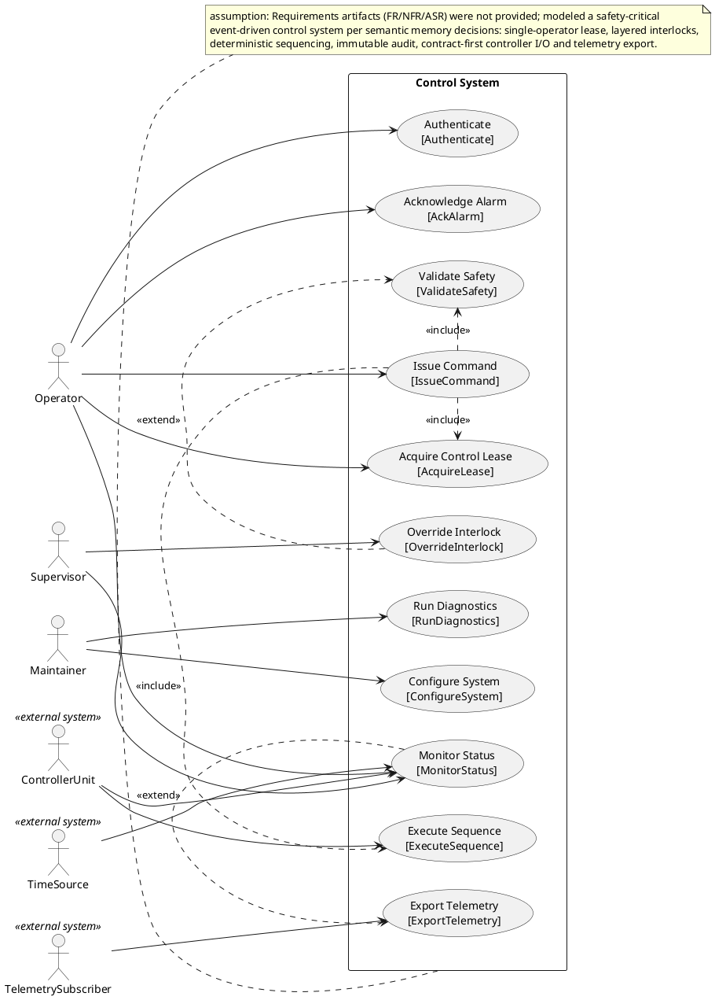
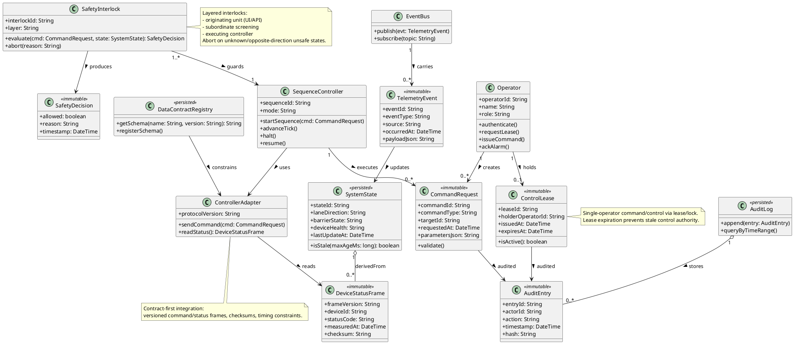
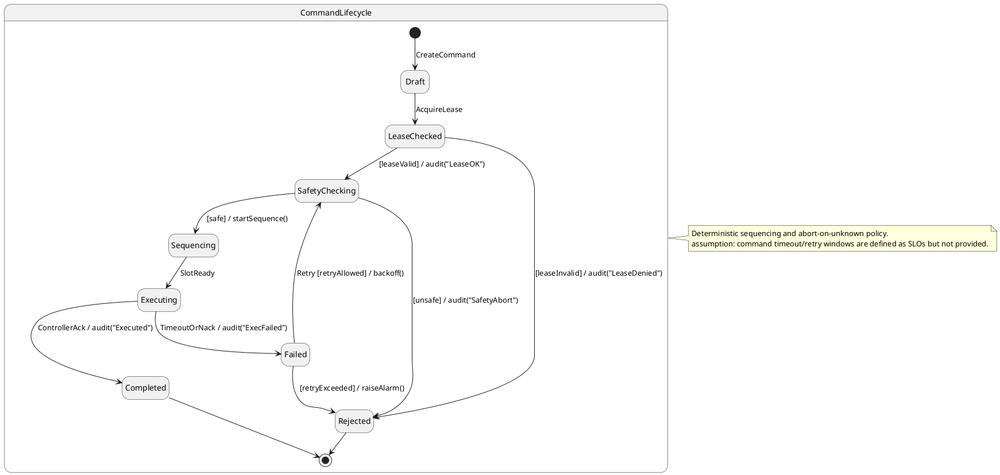
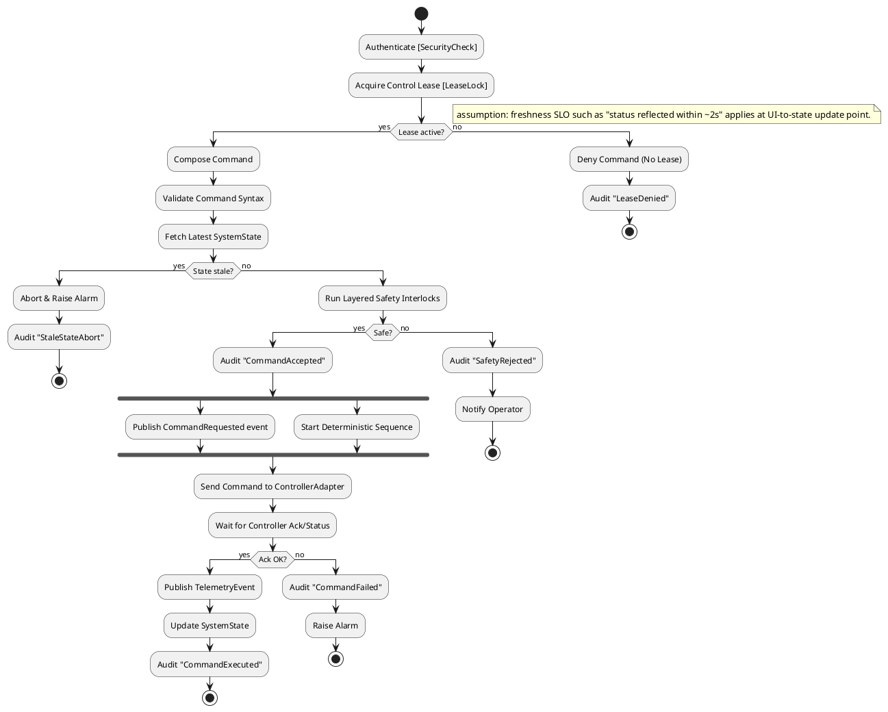
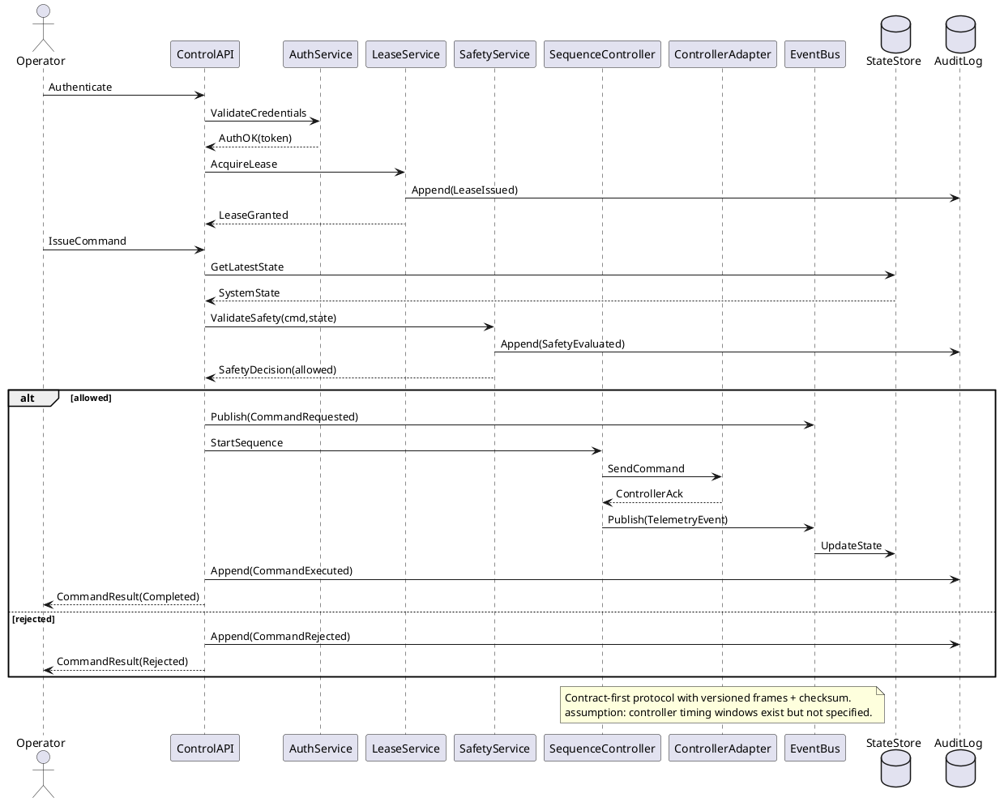
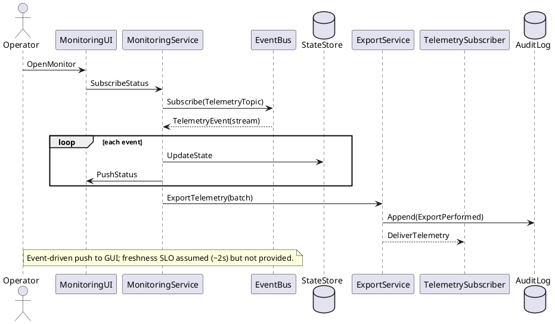
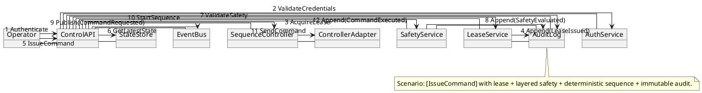
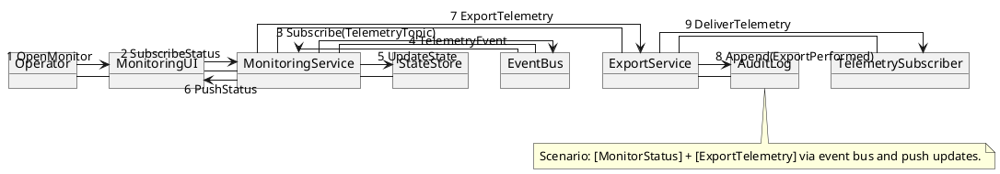
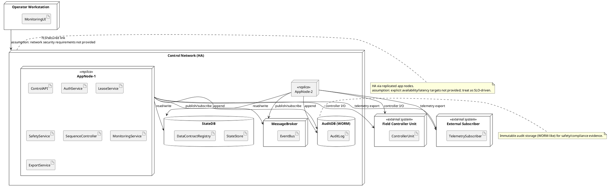

## ScenarioView
1. UseCase — Scenario View: Use Case Diagram


## LogicView
2. Class — Logic View: Class Diagram


3. Object — Logic View: Object Diagram
```plantuml
@startuml Object_SafetyCriticalControl
skinparam classAttributeIconSize 0

object op1 as "op1:Operator [IssueCommand]" {
  operatorId = "OP-17"
  name = "A. Rivera"
  role = "Operator"
}

object lease1 as "lease1:ControlLease [AcquireLease]" {
  leaseId = "L-2026-04-22-0007"
  holderOperatorId = "OP-17"
  issuedAt = "2026-04-22T10:00:00Z"
  expiresAt = "2026-04-22T10:05:00Z"
}

object cmd1 as "cmd1:CommandRequest [IssueCommand]" {
  commandId = "C-8891"
  commandType = "SetLaneDirection"
  targetId = "LaneSegment-3"
  requestedAt = "2026-04-22T10:00:10Z"
  parametersJson = "{direction:'NORTHBOUND'}"
}

object state1 as "state1:SystemState [MonitorStatus]" {
  stateId = "S-rt"
  laneDirection = "HOLD"
  barrierState = "CLOSED"
  deviceHealth = "OK"
  lastUpdateAt = "2026-04-22T10:00:09Z"
}

object si1 as "si1:SafetyInterlock [ValidateSafety]" {
  interlockId = "SI-ORIGIN"
  layer = "Originating"
}

object sc1 as "sc1:SequenceController [ExecuteSequence]" {
  sequenceId = "SEQ-42"
  mode = "Deterministic"
}

object ad1 as "ad1:ControllerAdapter [ExecuteSequence]" {
  protocolVersion = "v1.0"
}

op1 --> lease1 : holds
op1 --> cmd1 : creates
cmd1 --> si1 : evaluatedBy
si1 --> sc1 : guards
sc1 --> ad1 : uses
state1 <-- ad1 : readsStatus

@enduml
```

4. State — Logic View: State Diagram


## ProcessView
5. Activity — Process View: Activity Diagram


6. Sequence — Process View: Sequence Diagram




7. Collaboration — Process View: Collaboration Diagram




## DevelopmentView
8. Package — Development View: Package Diagram
```plantuml
@startuml Package_SafetyCriticalControl
skinparam packageStyle rectangle

package "ui" as ui {
  note bottom: Operator screens; status push; command entry
}

package "api" as api {
  note bottom: ControlAPI endpoints; request validation; orchestration
}

package "domain" as domain {
  note bottom: Command, Lease, Interlocks, Sequence, State model (pure)
}

package "services" as services {
  note bottom: Auth/Lease/Safety/Monitoring/Export services
}

package "persistence" as persistence {
  note bottom: StateStore, AuditLog, DataContractRegistry
}

package "messaging" as messaging {
  note bottom: EventBus abstraction; topics; replay hooks
}

package "integrations" as integrations {
  note bottom: ControllerAdapter; protocol frames; HIL simulator hooks
}

ui ..> api : uses
api ..> services : uses
services ..> domain : uses
services ..> messaging : uses
services ..> persistence : uses
services ..> integrations : uses
integrations ..> domain : uses
persistence ..> domain : maps

note right of domain
Key constraints:
- deterministic sequencing
- layered interlocks
- abort on unknown/unsafe
- immutable audit entries
end note

note right of integrations
Contract-first, versioned schemas; freeze dates/owners assumed per semantic memory.
end note
@enduml
```

9. Component — Development View: Component Diagram

```plantuml
@startuml Component_SafetyCriticalControl
skinparam componentStyle rectangle

component "MonitoringUI" as MonitoringUI
component "ControlAPI" as ControlAPI
component "AuthService" as AuthService
component "LeaseService" as LeaseService
component "SafetyService" as SafetyService
component "SequenceController" as SequenceController
component "MonitoringService" as MonitoringService
component "ExportService" as ExportService
component "EventBus" as EventBus
component "ControllerAdapter" as ControllerAdapter
database "StateStore" as StateStore
database "AuditLog" as AuditLog
database "DataContractRegistry" as DataContractRegistry
component "TelemetrySubscriber" as TelemetrySubscriber <<external system>>
component "ControllerUnit" as ControllerUnit <<external system>>

interface IAuth
interface ILease
interface ISafety
interface ICommandAPI
interface IMonitor
interface IExport
interface IControllerIO
interface IEventBus

ControlAPI -down-> ICommandAPI
MonitoringService -down-> IMonitor
AuthService -down-> IAuth
LeaseService -down-> ILease
SafetyService -down-> ISafety
ExportService -down-> IExport
ControllerAdapter -down-> IControllerIO
EventBus -down-> IEventBus

MonitoringUI ..> ICommandAPI : uses
MonitoringUI ..> IMonitor : uses

ControlAPI ..> IAuth : requires
ControlAPI ..> ILease : requires
ControlAPI ..> ISafety : requires
ControlAPI ..> SequenceController : uses
ControlAPI ..> IEventBus : publishes
ControlAPI ..> StateStore : reads/writes
ControlAPI ..> AuditLog : appends

MonitoringService ..> IEventBus : subscribes
MonitoringService ..> StateStore : updates
MonitoringService ..> MonitoringUI : pushes

SequenceController ..> IControllerIO : requires
SequenceController ..> IEventBus : publishes
SequenceController ..> AuditLog : appends

ControllerAdapter ..> DataContractRegistry : uses
ControllerAdapter ..> ControllerUnit : communicates

ExportService ..> StateStore : reads
ExportService ..> TelemetrySubscriber : delivers
ExportService ..> AuditLog : appends

note right of AuditLog
Immutable append-only audit trail.
end note

note right of EventBus
Event-driven monitoring/control; decouple producers/consumers.
end note
@enduml
```


## PhysicalView
10. Deployment — Physical View: Deployment Diagram


11. Container — Physical View: Container Diagram
```plantuml
@startuml Container_SafetyCriticalControl
left to right direction
skinparam packageStyle rectangle

rectangle "Safety-Critical Control System" as SCS {
  rectangle "MonitoringUI Container" as C_UI <<container>> {
    note bottom: Operator GUI; status push; command forms
  }

  rectangle "ControlAPI Container" as C_API <<container>> {
    note bottom: Command orchestration; validation; exposes ICommandAPI
  }

  rectangle "Core Services Container" as C_SVC <<container>> {
    note bottom: AuthService, LeaseService, SafetyService, SequenceController, MonitoringService, ExportService
  }

  rectangle "Message Broker Container" as C_MB <<container>> {
    note bottom: EventBus topics; decouple; replay hooks
  }

  rectangle "State Store Container" as C_STATE <<container>> {
    note bottom: SystemState persistence; contracts registry
  }

  rectangle "Audit Log Container" as C_AUDIT <<container>> {
    note bottom: Immutable append-only audit entries
  }

  rectangle "Controller Integration Container" as C_ADAPTER <<container>> {
    note bottom: ControllerAdapter; versioned frames; checksums; HIL hooks
  }
}

rectangle "ControllerUnit" as X_CTRL <<external system>>
rectangle "TelemetrySubscriber" as X_SUB <<external system>>

C_UI --> C_API : HTTPS/WebSocket\n[MonitorStatus][IssueCommand]
C_API --> C_SVC : internal RPC\n[Authenticate][AcquireLease][ValidateSafety]
C_SVC --> C_MB : pub/sub\n[TelemetryEvent]
C_SVC --> C_STATE : read/write\n[SystemState]
C_SVC --> C_AUDIT : append\n[ImmutableAudit]
C_SVC --> C_ADAPTER : call\n[ExecuteSequence]
C_ADAPTER --> X_CTRL : serial/Ethernet\n[ContractFirst]
C_SVC --> X_SUB : export\n[ExportTelemetry]

note bottom of SCS
assumption: explicit SLOs (freshness/latency/availability) are to be derived and baselined as testable metrics.
end note
@enduml
```