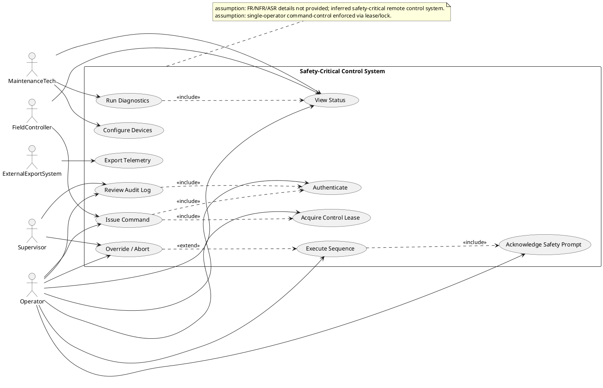
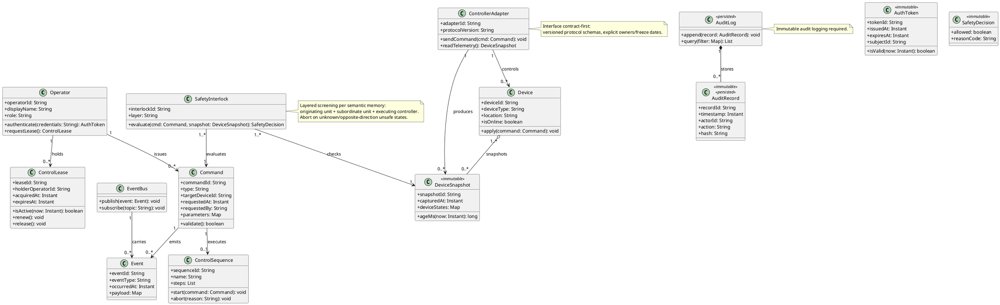
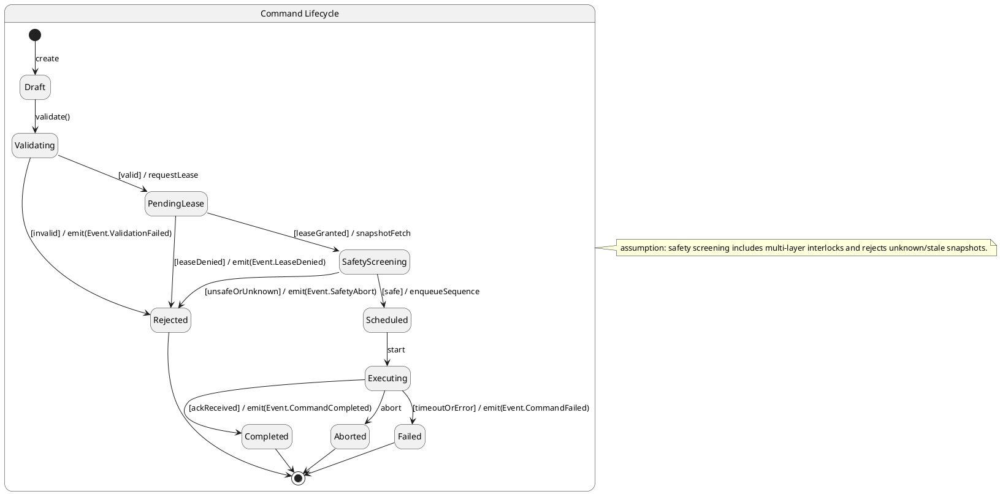
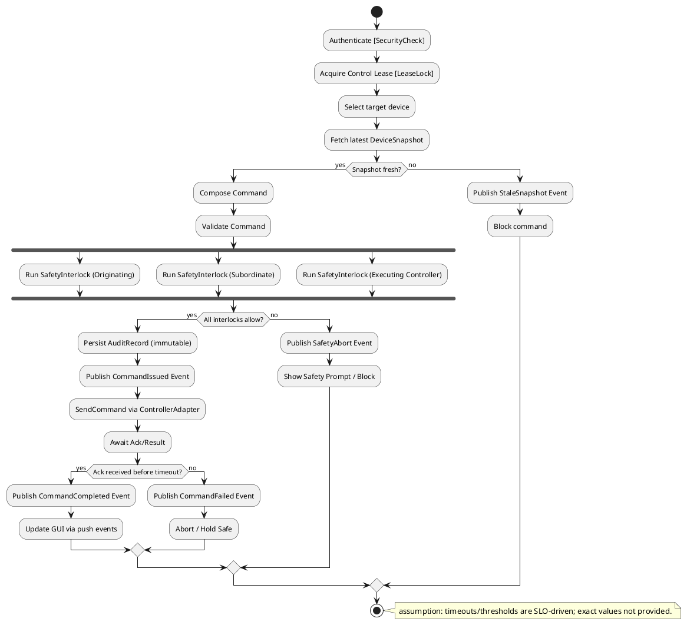
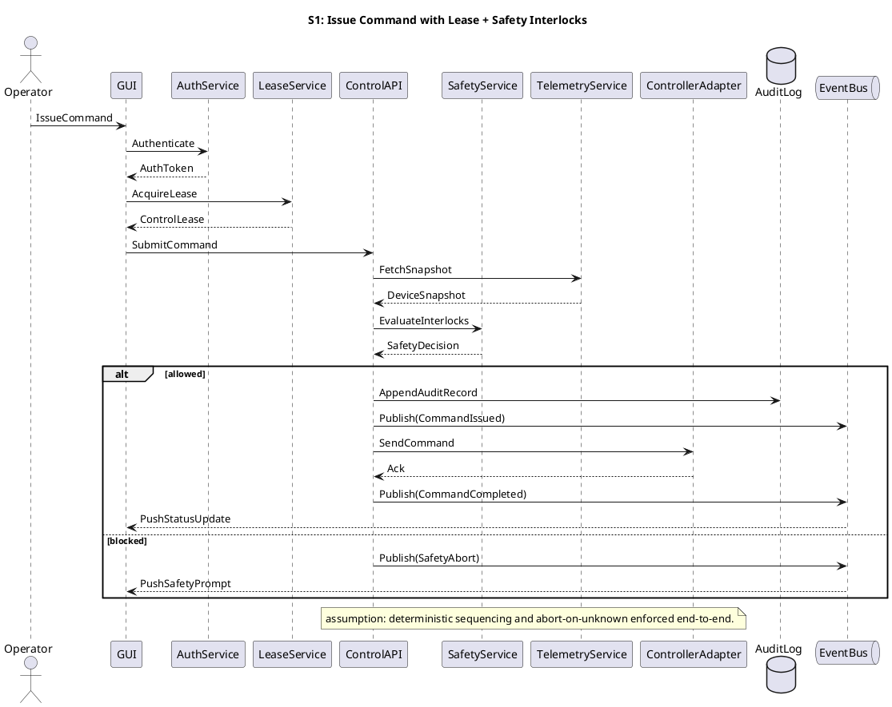
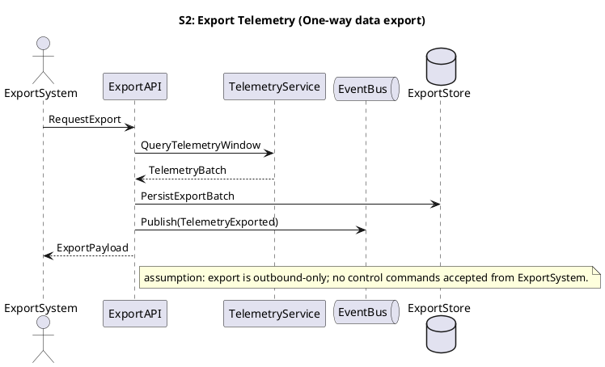
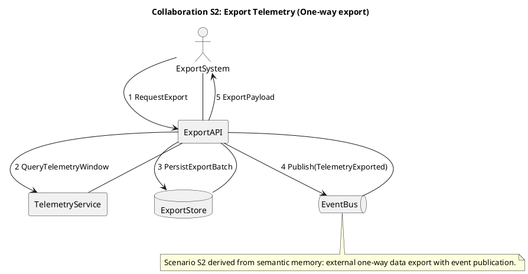
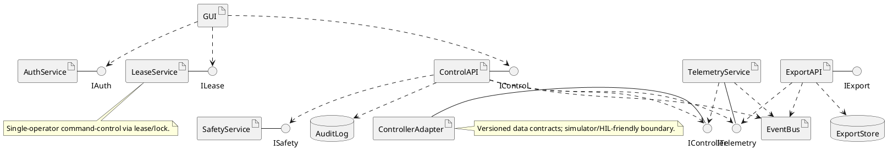
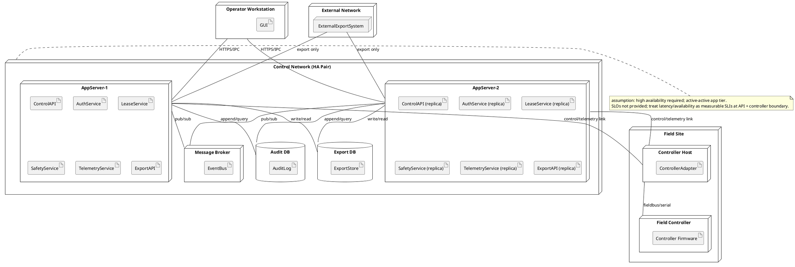
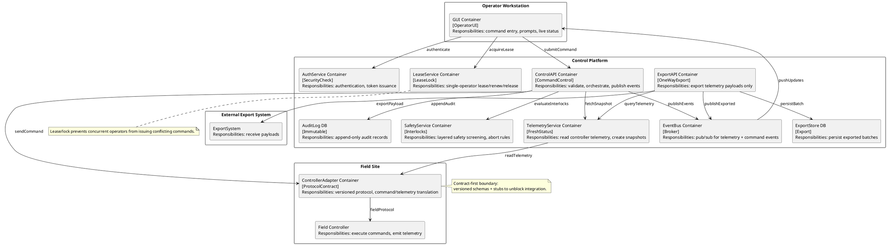

## ScenarioView
1. UseCase — Scenario View: Use Case Diagram


## LogicView
2. Class — Logic View: Class Diagram


3. Object — Logic View: Object Diagram
```plantuml
@startuml Object_SafetyCriticalControl
object operator1 as "operator1:Operator [IssueCommand]" {
  operatorId = "op-101"
  displayName = "Control Room A"
  role = "Operator"
}

object token1 as "token1:AuthToken [Authenticate]" {
  tokenId = "tkn-9f3"
  subjectId = "op-101"
  issuedAt = "2026-04-22T10:00:00Z"
  expiresAt = "2026-04-22T18:00:00Z"
}

object lease1 as "lease1:ControlLease [AcquireLease]" {
  leaseId = "lease-77"
  holderOperatorId = "op-101"
  acquiredAt = "2026-04-22T10:00:05Z"
  expiresAt = "2026-04-22T10:05:05Z"
}

object cmd1 as "cmd1:Command [IssueCommand]" {
  commandId = "cmd-5001"
  type = "SetLaneDirection"
  targetDeviceId = "lane-12"
  requestedAt = "2026-04-22T10:00:10Z"
  requestedBy = "op-101"
}

object snap1 as "snap1:DeviceSnapshot [ViewStatus]" {
  snapshotId = "snap-abc"
  capturedAt = "2026-04-22T10:00:09Z"
}

object interlock1 as "interlock1:SafetyInterlock [ExecuteSequence]" {
  interlockId = "si-origin"
  layer = "OriginatingUnit"
}

object audit1 as "audit1:AuditRecord [ReviewAuditLog]" {
  recordId = "ar-1"
  timestamp = "2026-04-22T10:00:10Z"
  actorId = "op-101"
  action = "IssueCommand cmd-5001"
  hash = "sha256:..."
}

operator1 -- token1
operator1 -- lease1
operator1 -- cmd1
cmd1 -- snap1
interlock1 -- cmd1
audit1 .. cmd1 : references
@enduml
```

4. State — Logic View: State Diagram


## ProcessView
5. Activity — Process View: Activity Diagram


6. Sequence — Process View: Sequence Diagram




7. Collaboration — Process View: Collaboration Diagram
```plantuml
@startuml Collaboration_S1_IssueCommand
title Collaboration S1: Issue Command with Lease + Safety Interlocks

actor Operator
rectangle GUI
rectangle AuthService
rectangle LeaseService
rectangle ControlAPI
rectangle SafetyService
rectangle TelemetryService
rectangle ControllerAdapter
database AuditLog
queue EventBus

Operator -- GUI
GUI -- AuthService
GUI -- LeaseService
GUI -- ControlAPI
ControlAPI -- TelemetryService
ControlAPI -- SafetyService
ControlAPI -- AuditLog
ControlAPI -- ControllerAdapter
ControlAPI -- EventBus
EventBus -- GUI

GUI : 1 IssueCommand
GUI -> AuthService : 2 Authenticate
GUI -> LeaseService : 3 AcquireLease
GUI -> ControlAPI : 4 SubmitCommand
ControlAPI -> TelemetryService : 5 FetchSnapshot
ControlAPI -> SafetyService : 6 EvaluateInterlocks
ControlAPI -> AuditLog : 7 AppendAuditRecord
ControlAPI -> ControllerAdapter : 8 SendCommand
ControlAPI -> EventBus : 9 Publish(CommandCompleted)
EventBus -> GUI : 10 PushStatusUpdate

note bottom
Scenario S1 derived from semantic memory: single-operator lease + layered interlocks + immutable audit + event-driven GUI updates.
end note
@enduml
```



## DevelopmentView
8. Package — Development View: Package Diagram
```plantuml
@startuml Package_SafetyCriticalControl
skinparam packageStyle rectangle

package "ui" as pkg_ui {
  note bottom: Operator GUI (push updates)
}

package "api" as pkg_api {
  note bottom: ControlAPI + ExportAPI (REST/IPC)
}

package "domain" as pkg_domain {
  note bottom: Commands, sequences, safety rules
}

package "application" as pkg_app {
  note bottom: Orchestration services, SLO timers
}

package "infrastructure" as pkg_infra {
  note bottom: EventBus, persistence, adapters
}

package "integrations" as pkg_int {
  note bottom: ControllerAdapter (versioned contracts)
}

pkg_ui ..> pkg_api : uses
pkg_api ..> pkg_app : calls
pkg_app ..> pkg_domain : uses
pkg_app ..> pkg_infra : uses
pkg_infra ..> pkg_int : uses
pkg_int ..> pkg_domain : maps

note right of pkg_int
Contract-first stubs:
versioned schemas + owners + freeze dates.
end note

note right of pkg_infra
Immutable audit logging + event-driven monitoring.
end note
@enduml
```

9. Component — Development View: Component Diagram


## PhysicalView
10. Deployment — Physical View: Deployment Diagram


11. Container — Physical View: Container Diagram
