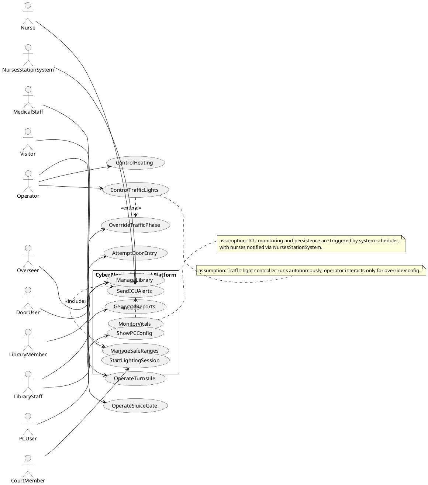

## ScenarioView
1. UseCase — Scenario View: Use Case Diagram


## LogicView
2. Class — Logic View: Class Diagram
```plantuml
@startuml Class_LogicView
skinparam classAttributeIconSize 0

class PluginManager {
  +loadPlugin(pluginId: String)
  +startAll()
  +stopAll()
}

class EventBus {
  +publish(eventType: String, payload: String)
  +subscribe(eventType: String, handlerId: String)
}

interface HardwareIO {
  +readPort(portId: String): int
  +writePort(portId: String, value: int)
  +readRegister(addr: int): int
  +writeRegister(addr: int, value: int)
  +emitPulse(lineId: String, durationMs: int)
  +readStatus(lineId: String): boolean
}

class Scheduler {
  +registerPeriodic(jobId: String, periodMs: int)
  +cancel(jobId: String)
  +validatePeriod(periodMs: int): boolean
}

class AuditLogger {
  +logAccess(userId: String, action: String, resourceId: String)
  +logSecurity(eventId: String, outcome: String)
  +logError(message: String)
}

class MetricsCollector {
  +observe(name: String, value: double)
  +inc(name: String)
}

class PatientMonitor «persisted» {
  -patientId: String
  -samplingPeriodMs: int
  +readVitals(io: HardwareIO): VitalMeasurement
  +detectDeviceFailure(io: HardwareIO): boolean
}

class SafeRange «persisted» {
  -patientId: String
  -factor: String
  -minValue: double
  -maxValue: double
  +isOutOfRange(value: double): boolean
}

class VitalMeasurement «persisted» {
  -measurementId: String
  -patientId: String
  -timestampUtc: String
  -pulse: int
  -temperatureC: double
  -systolicMmHg: int
  -diastolicMmHg: int
  -skinResistanceOhm: double
  +checksum(): String
}

class Alert {
  -alertId: String
  -timestampUtc: String
  -severity: String
  -category: String
  -message: String
  +formatForStation(): String
}

class DoorAccessAttempt {
  -attemptId: String
  -timestampUtc: String
  -cameraId: String
  +extractFrame(): String
}

class FaceTemplate «persisted» {
  -subjectId: String
  -templateCiphertext: String
  -expiresOn: String
  +isExpired(now: String): boolean
}

class AccessDecision {
  -attemptId: String
  -result: String
  -latencyMs: int
  +isAllowed(): boolean
}

class TurnstileSession {
  -sessionId: String
  -coinsInserted: int
  -state: String
  +insertCoin()
  +allowEntry(io: HardwareIO)
  +denyEntry(io: HardwareIO