## ScenarioView
1. UseCase — Scenario View: Use Case Diagram

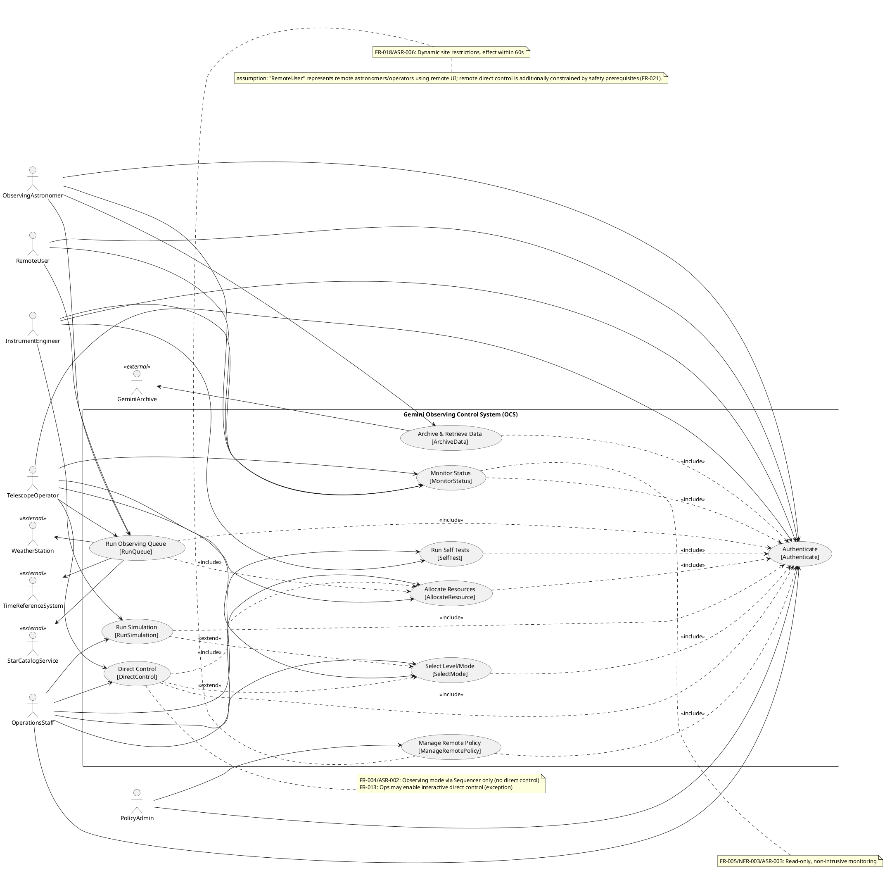

## LogicView
2. Class — Logic View: Class Diagram

```plantuml
@startuml ClassDiagram
skinparam classAttributeIconSize 0

enum OperationalLevel {
  OBSERVING
  MAINTENANCE
  TEST
}

enum AccessMode {
  OBSERVING
  MONITORING
  OPERATION
  PLANNING
  TESTING
  ADMINISTRATIVE
}

enum CommandResultCode {
  ACK
  NAK
  TIMEOUT
}

class User {
  +userId: String
  +username: String
  +roles: List<String>
}

class Session {
  +sessionToken: String
  +remoteSiteId: String
  +activeModes: Set<AccessMode>
  +createdAtUtc: String
  +addMode(mode: AccessMode)
  +removeMode(mode: AccessMode)
}

class RBACPolicy {
  +policyVersion: String
  +isAllowed(role: String, level: OperationalLevel, mode: AccessMode, operation: String): boolean
}

class OperationalState {
  +currentLevel: OperationalLevel
  +setLevel(level: OperationalLevel)
  +getLevel(): OperationalLevel
}

class RemoteSitePolicy {
  +policyVersion: String
  +allowedSites: Set<String>
  +isSiteAllowed(siteId: String, operation: String): boolean
  +updateAllowedSites(sites: Set<String>)
}

class Resource {
  +resourceId: String
  +resourceType: String
}

class ResourceLease {
  +leaseId: String
  +ownerSessionToken: String
  +resourceId: String
  +expiresAtUtc: String
}

class AccessModeAllocator {
  +requestLease(session: Session, resources: List<Resource>, mode: AccessMode): ResourceLease
  +releaseLease(leaseId: String)
  +detectAndResolveDeadlock()
}

class Command {
  +commandId: String
  +cmd: String
  +argsJson: String
  +isIdempotent: boolean
  +requiresSafetyInterlock: boolean
}

class CommandEnvelope {
  +correlationId: String
  +timestampUtc: String
  +sessionToken: String
  +accessMode: AccessMode
  +operationalLevel: OperationalLevel
  +command: Command
}

class CommandResponse {
  +correlationId: String
  +resultCode: CommandResultCode
  +reason: String
  +acceptedAtUtc: String
}

class CommandRouter {
  +validateAndRoute(env: CommandEnvelope): CommandResponse
}

class Sequencer {
  +runQueue(queueId: String)
  +submitStep(env: CommandEnvelope): CommandResponse
  +breakAndResequence(queueId: String)
}

class Scheduler {
  +buildQueue(): String
  +resortQueue(queueId: String)
  +applyRules()
}

class ControlGateway {
  +sendToIoc(env: CommandEnvelope): CommandResponse
  +queryStatus(variable: String): ControlVariable
}

class ControlVariable {
  +timestampUtc: String
  +variable: String
  +value: String
  +unit: String
  +statusCode: int
  +errorMessage: String
}
note right of ControlVariable
FR-051: Must not block/lock control even when faulty.
NFR-004: status requests <= 5s; local updates <= 4s.
end note

class Subsystem {
  +subsystemId: String
  +name: String
  +mode: String
  +getVersion(): String
  +selfTest(level: String): String
}

class SimulatorAdapter {
  +simulate(env: CommandEnvelope): CommandResponse
}

class DataProduct {
  +datasetId: String
  +fitsPath: String
  +compression: String <<immutable>>
  +headersJson: String
}

class ArchiveClient {
  +archive(dataset: DataProduct)
  +query(criteria: String): List<DataProduct>
}

class AuditLogEntry <<persisted>> {
  +timestampUtc: String
  +userId: String
  +subsystem: String
  +action: String
  +resultCode: String
}

class EventLogEntry <<persisted>> {
  +eventTimeUtc: String
  +origin: String
  +severity: String
  +errorCode: String
  +correlationId: String
  +userAction: String
}

User "1" -- "0..*" Session
Session "1" o-- "1" OperationalState
Session "1" ..> RBACPolicy : uses
Session "1" ..> RemoteSitePolicy : uses

Sequencer "1" -- "1" Scheduler
Sequencer "1" ..> CommandRouter : uses
CommandRouter "1" ..> RBACPolicy : authorize
CommandRouter "1" ..> RemoteSitePolicy : siteGate
CommandRouter "1" ..> AccessModeAllocator : allocate
CommandRouter "1" ..> ControlGateway : route
ControlGateway "1" ..> Subsystem : controls
ControlGateway "1" ..> SimulatorAdapter : simulate

AccessModeAllocator "1" o-- "0..*" ResourceLease
ResourceLease "*" --> "1" Resource

CommandEnvelope "1" o-- "1" Command
CommandRouter ..> AuditLogEntry : writes
CommandRouter ..> EventLogEntry : writes

ArchiveClient ..> DataProduct : transfers
Sequencer ..> ArchiveClient : triggers archive

note top of CommandRouter
ASR-002: Sequencer/scheduler primary control path.
NFR-001: accept/reject <=2s; timeouts ~500ms; handshake 100-200ms.
NFR-008: TLS + audit on every access/admin action.
end note

note top of AccessModeAllocator
ASR-005/FR-027: critical resources solely through allocation; no deadlock.
ASR-012: active instrument isolation + beam exclusivity.
end note

note bottom of DataProduct
FR-034/35/37/38 + NFR-006: lossless compression; FITS with full headers.
ASR-009 + NFR-007: storage tiers + retention (7d, last 3d interactive).
end note
@enduml
```

3. Object — Logic View: Object Diagram

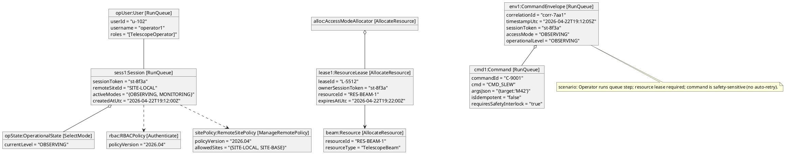

4. State — Logic View: State Diagram

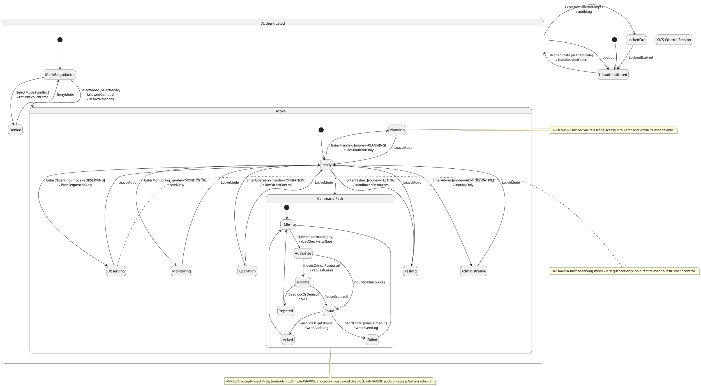

## ProcessView
5. Activity — Process View: Activity Diagram

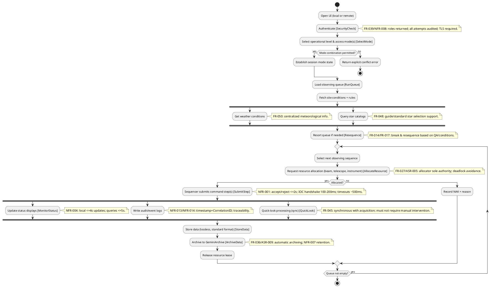

6. Sequence — Process View: Sequence Diagram

```plantuml
@startuml SequenceScenario1_RunQueueAndControl
autonumber
actor TelescopeOperator as TelescopeOperator
participant "RemoteUI" as RemoteUI
participant "AuthService" as AuthService
participant "PolicyService" as PolicyService
participant "Sequencer" as Sequencer
participant "Scheduler" as Scheduler
participant "CommandRouter" as CommandRouter
participant "AccessModeAllocator" as AccessModeAllocator
participant "ControlGateway" as ControlGateway
database "ParameterDB" as ParameterDB
participant "TelescopeIOC" as TelescopeIOC
participant "InstrumentIOC" as InstrumentIOC
participant "AuditLogService" as AuditLogService
participant "EventLogService" as EventLogService

TelescopeOperator -> RemoteUI : Authenticate
RemoteUI -> AuthService : authenticate(username,password,mfa_token)
AuthService --> RemoteUI : sessionToken,roles

RemoteUI -> PolicyService : selectMode(sessionToken, level=OBSERVING, modes={OBSERVING,MONITORING})
PolicyService --> RemoteUI : modeAccepted

RemoteUI -> Sequencer : runQueue(queueId)
Sequencer -> Scheduler : buildOrLoadQueue
Scheduler -> ParameterDB : readSiteRules
ParameterDB --> Scheduler : rules
Scheduler --> Sequencer : queueReady

loop for each step
  Sequencer -> CommandRouter : submitStep(CommandEnvelope)
  note right of CommandRouter
  NFR-001: accept/reject <= 2s before action.
  end note

  CommandRouter -> PolicyService : authorize(sessionToken, level, mode, cmd)
  PolicyService --> CommandRouter : allow/deny

  alt needs critical resources
    CommandRouter -> AccessModeAllocator : requestLease(resources={beam,telescope,instrument})
    AccessModeAllocator --> CommandRouter : leaseGranted/NAK
  end alt

  CommandRouter -> ControlGateway : sendToIoc(envelope)
  ControlGateway -> TelescopeIOC : cmd(ACK/NAK)
  TelescopeIOC --> ControlGateway : ACK/NAK (100-200ms handshake)
  ControlGateway -> InstrumentIOC : cmd(ACK/NAK)
  InstrumentIOC --> ControlGateway : ACK/NAK

  alt ACK
    ControlGateway --> CommandRouter : ACK
    CommandRouter -> AuditLogService : writeAudit(action, result=ACK, correlationId)
    AuditLogService --> CommandRouter : ok
    CommandRouter --> Sequencer : CommandResponse(ACK)
  else NAK/Timeout
    ControlGateway --> CommandRouter : NAK/TIMEOUT
    CommandRouter -> EventLogService : writeEvent(severity, errorCode, correlationId)
    EventLogService --> CommandRouter : ok
    CommandRouter --> Sequencer : CommandResponse(NAK/TIMEOUT)
  end alt
end

note bottom
FR-004/ASR-002: Operator uses Sequencer path in Observing mode.\nFR-064: retries only for retryable idempotent commands (not shown for CMD_SLEW).
end note
@enduml
```

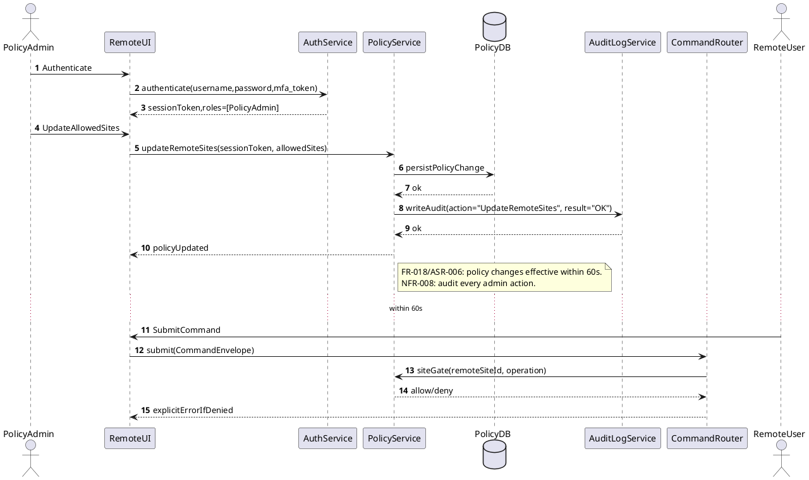

7. Collaboration — Process View: Collaboration Diagram

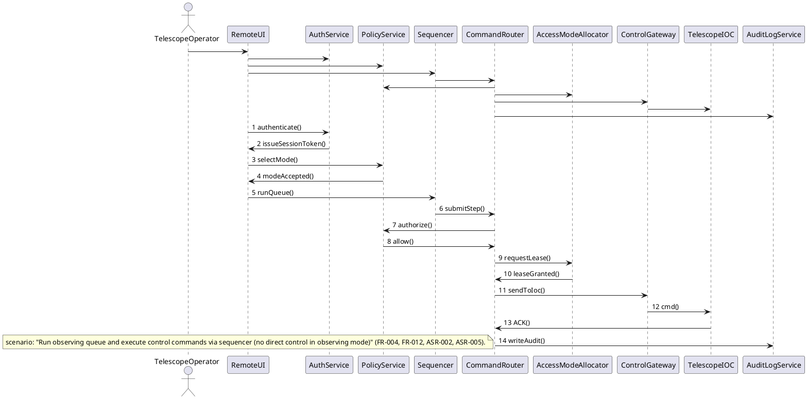

```plantuml
@startuml CollaborationScenario2_RemotePolicyUpdate
skinparam linetype ortho
actor PolicyAdmin as PolicyAdmin
actor RemoteUser as RemoteUser
rectangle RemoteUI as RemoteUI
rectangle AuthService as AuthService
rectangle PolicyService as PolicyService
database PolicyDB as PolicyDB
rectangle AuditLogService as AuditLogService
rectangle CommandRouter as CommandRouter

PolicyAdmin -- RemoteUI
RemoteUI -- AuthService
RemoteUI -- PolicyService
PolicyService -- PolicyDB
PolicyService -- AuditLogService
RemoteUser -- RemoteUI
RemoteUI -- CommandRouter
CommandRouter -- PolicyService

RemoteUI : 1 authenticate()
AuthService : 2 issueSessionToken()
RemoteUI : 3 updateRemoteSites()
PolicyService : 4 persistPolicyChange()
PolicyDB : 5 ok
PolicyService : 6 writeAudit()
AuditLogService : 7 ok
RemoteUI : 8 policyUpdated()

RemoteUI : 9 submitCommand()
CommandRouter : 10 siteGate()
PolicyService : 11 allow/deny()
CommandRouter : 12 explicitErrorIfDenied()

note bottom
scenario: "Policy admin updates allowed remote sites; policy enforced within 60s" (FR-018, ASR-006, NFR-008).
end note
@enduml
```

## DevelopmentView
8. Package — Development View: Package Diagram

```plantuml
@startuml PackageDiagram
skinparam packageStyle rectangle

package "ui" as ui {
  artifact RemoteUI
  note bottom of ui
  Responsibility: local/remote UI; mode-aware UX.
  NFR-010: uniform UI + role-dependent look-and-feel.
  end note
}

package "api" as api {
  artifact AuthAPI
  artifact CommandAPI
  artifact PolicyAPI
  artifact StatusAPI
  artifact ArchiveAPI
}

package "domain" as domain {
  artifact Session
  artifact OperationalState
  artifact CommandEnvelope
  artifact ResourceLease
  artifact DataProduct
}

package "security" as security {
  artifact AuthService
  artifact PolicyService
  artifact RBACPolicy
  artifact RemoteSitePolicy
  note bottom of security
  ASR-001/NFR-008: centralized authz; TLS; audit on every access/admin action.
  end note
}

package "orchestration" as orchestration {
  artifact Sequencer
  artifact Scheduler
  note bottom of orchestration
  ASR-002: sequencer/scheduler primary control path.
  end note
}

package "control" as control {
  artifact CommandRouter
  artifact ControlGateway
  artifact AccessModeAllocator
  artifact SimulatorAdapter
  note bottom of control
  ASR-004: common command+ACK/NAK; NFR-001 timings.
  ASR-005: allocation sole authority; deadlock avoidance.
  ASR-008: simulation adapters.
  end note
}

package "data" as data {
  artifact ParameterDB
  artifact ArchiveClient
  artifact QuickLookProcessor
  artifact NearLineProcessor
  note bottom of data
  ASR-009: storage tiers + archive + FITS; NFR-007 retention.
  FR-046: near-line async, acquisition precedence.
  end note
}

package "observability" as observability {
  artifact AuditLogService
  artifact EventLogService
  artifact MetricsService
  note bottom of observability
  ASR-011: traceability + 200Hz engineering logs (burst).
  NFR-003: non-interference; use async pipelines.
  end note
}

ui ..> api
api ..> domain
api ..> security
api ..> orchestration
api ..> control
api ..> data
orchestration ..> control
control ..> domain
data ..> domain
security ..> domain
control ..> observability
security ..> observability
data ..> observability

@enduml
```

9. Component — Development View: Component Diagram

```plantuml
@startuml ComponentDiagram
skinparam componentStyle rectangle

interface IAuthAPI
interface IPolicyAPI
interface ICommandAPI
interface IStatusAPI
interface IArchiveAPI

component "RemoteUI" as RemoteUI

component "AuthService" as AuthService <<service>> 
component "PolicyService" as PolicyService <<service>> 
component "Sequencer" as Sequencer <<service>> 
component "Scheduler" as Scheduler <<service>> 
component "CommandRouter" as CommandRouter <<service>> 
component "AccessModeAllocator" as AccessModeAllocator <<service>> 
component "ControlGateway" as ControlGateway <<service>> 
component "SimulatorAdapter" as SimulatorAdapter <<plugin>> 
component "ParameterDB" as ParameterDB <<database>> 
component "TelemetryBus" as TelemetryBus <<broker>> 
component "QuickLookProcessor" as QuickLookProcessor <<service>> 
component "NearLineProcessor" as NearLineProcessor <<service>> 
component "ArchiveClient" as ArchiveClient <<service>> 
component "AuditLogService" as AuditLogService <<service>> 
component "EventLogService" as EventLogService <<service>> 
component "MetricsService" as MetricsService <<service>> 

RemoteUI - IAuthAPI
RemoteUI - IPolicyAPI
RemoteUI - ICommandAPI
RemoteUI - IStatusAPI
RemoteUI - IArchiveAPI

AuthService - IAuthAPI
PolicyService - IPolicyAPI
CommandRouter - ICommandAPI
ControlGateway - IStatusAPI
ArchiveClient - IArchiveAPI

Sequencer --> CommandRouter : submitStep()
Sequencer --> Scheduler : queueOps()
CommandRouter --> PolicyService : authorize+siteGate()
CommandRouter --> AccessModeAllocator : requestLease()
CommandRouter --> ControlGateway : sendToIoc()
ControlGateway --> SimulatorAdapter : simulateIfEnabled()
ControlGateway --> ParameterDB : readCachedParams()
Sequencer --> QuickLookProcessor : syncProcess()
QuickLookProcessor --> TelemetryBus : publishProducts()
NearLineProcessor --> TelemetryBus : subscribeProducts()
NearLineProcessor --> ParameterDB : asyncWrites()
ArchiveClient --> TelemetryBus : subscribeProducts()
ArchiveClient --> AuditLogService : auditArchive()
CommandRouter --> AuditLogService : auditAccess()
CommandRouter --> EventLogService : faultEvent()
AuditLogService --> MetricsService : emitMetrics()
EventLogService --> MetricsService : emitMetrics()

note right of CommandRouter
ASR-004/NFR-001: common command schema + ACK/NAK + timeouts.
NFR-008: audit all access; TLS on APIs.
end note

note right of NearLineProcessor
FR-046/ASR-003: acquisition precedence; drop/defer near-line under contention.
end note

note right of TelemetryBus
ASR-003/ASR-011: isolate monitoring/logging via async pub/sub to avoid interfering with observing.
end note
@enduml
```

## PhysicalView
10. Deployment — Physical View: Deployment Diagram

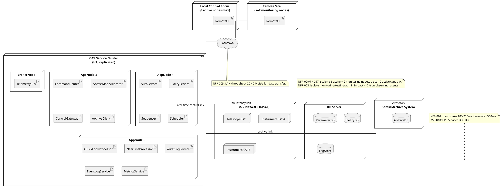

11. Container — Physical View: Container Diagram

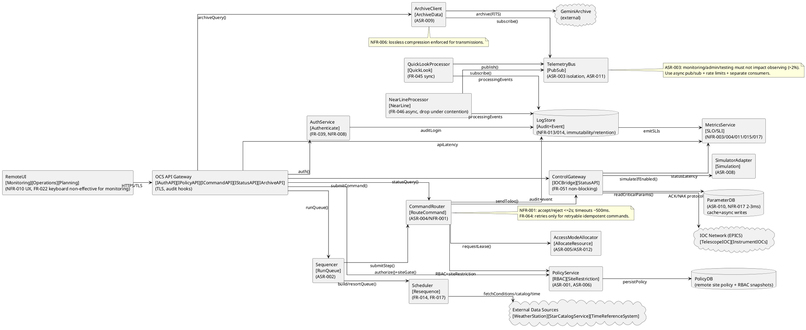