## ScenarioView
1. UseCase — Scenario View: Use Case Diagram
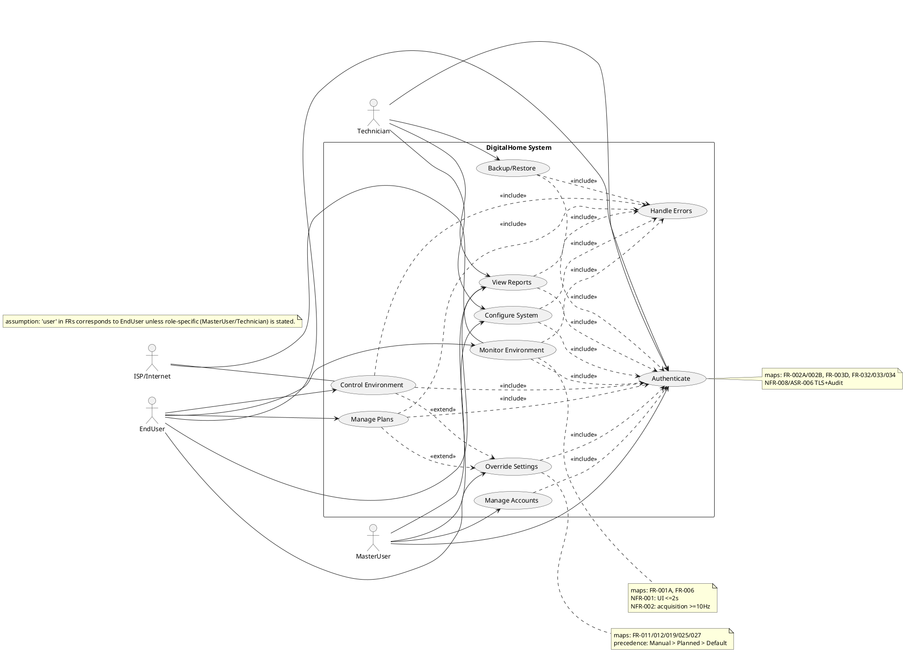

## LogicView
2. Class — Logic View: Class Diagram
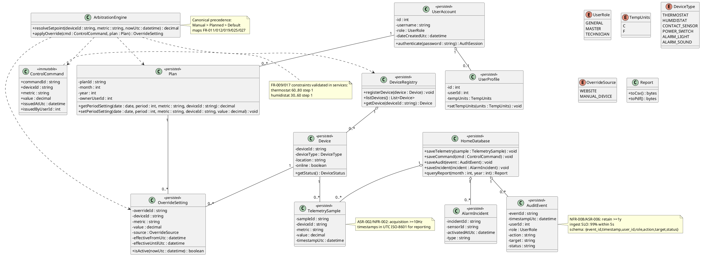

3. Object — Logic View: Object Diagram
```plantuml
@startuml DigitalHome_Object
skinparam classAttributeIconSize 0

object user1 as "user1:UserAccount [MonitorEnvironment]" {
  id = 42
  username = "alex"
  role = GENERAL
}

object profile1 as "profile1:UserProfile [MonitorEnvironment]" {
  id = 42
  userId = 42
  tempUnits = F
}

object gwThermo1 as "thermo1:Device [ControlEnvironment]" {
  deviceId = "tstat-01"
  deviceType = THERMOSTAT
  location = "LivingRoom"
  online = true
}

object sample1 as "sample1:TelemetrySample [MonitorEnvironment]" {
  sampleId = "s-1001"
  deviceId = "tstat-01"
  metric = "temperatureF"
  value = 72.0
  timestampUtc = "2026-04-22T12:00:01Z"
}

object planApr as "planApr:Plan [ManagePlans]" {
  planId = "plan-2026-04"
  month = 4
  year = 2026
  ownerUserId = 42
}

object override1 as "override1:OverrideSetting [OverrideSettings]" {
  overrideId = "ov-9001"
  deviceId = "tstat-01"
  metric = "setpointF"
  value = 74.0
  source = WEBSITE
  effectiveFromUtc = "2026-04-22T12:00:10Z"
  effectiveUntilUtc = "2026-04-22T13:00:00Z"
}

object cmd1 as "cmd1:ControlCommand [ControlEnvironment]" {
  commandId = "cmd-7001"
  deviceId = "tstat-01"
  metric = "setpointF"
  value = 74.0
  issuedAtUtc = "2026-04-22T12:00:10Z"
  issuedByUserId = 42
}

user1 -- profile1
user1 -- planApr
gwThermo1 -- sample1
gwThermo1 -- override1
override1 .. cmd1
@enduml
```

4. State — Logic View: State Diagram
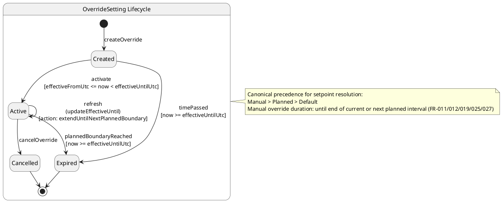

## ProcessView
5. Activity — Process View: Activity Diagram
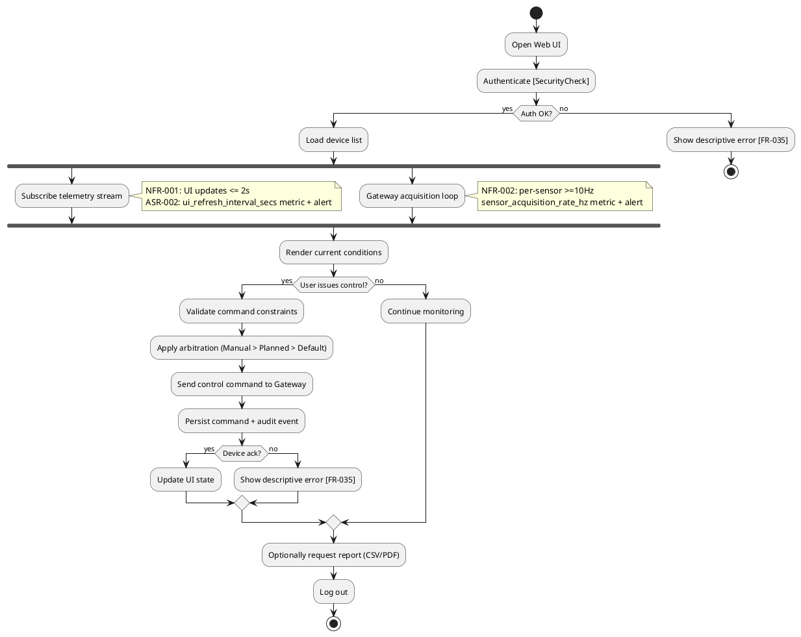

6. Sequence — Process View: Sequence Diagram
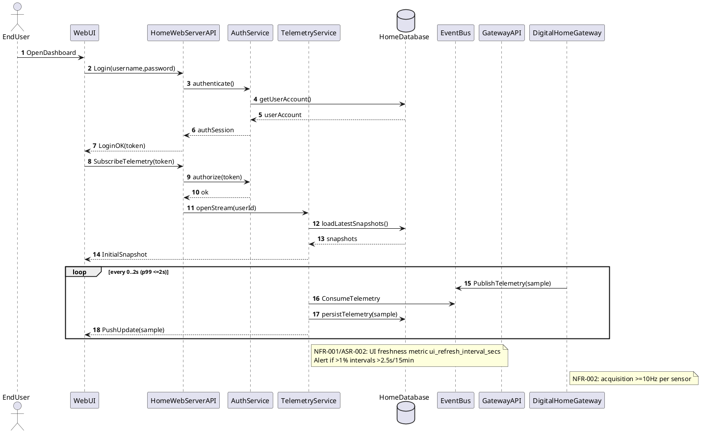

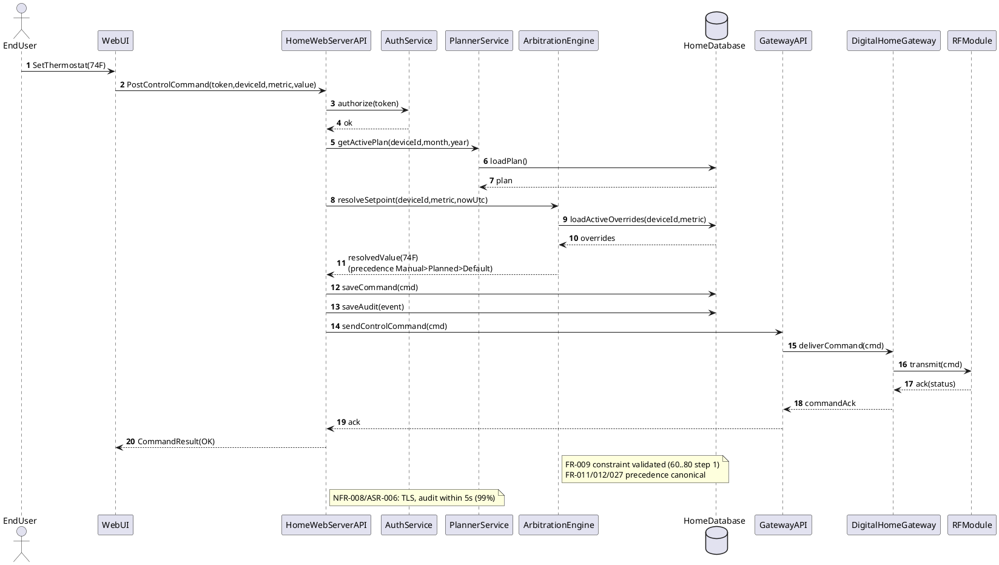

7. Collaboration — Process View: Collaboration Diagram
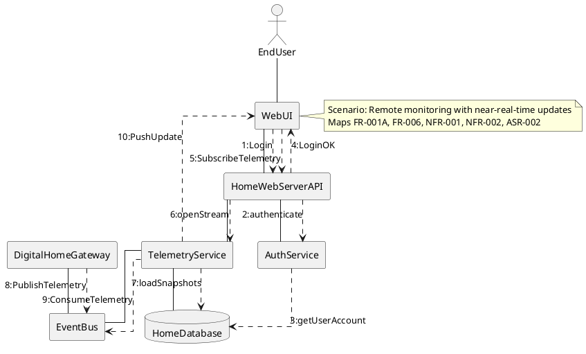

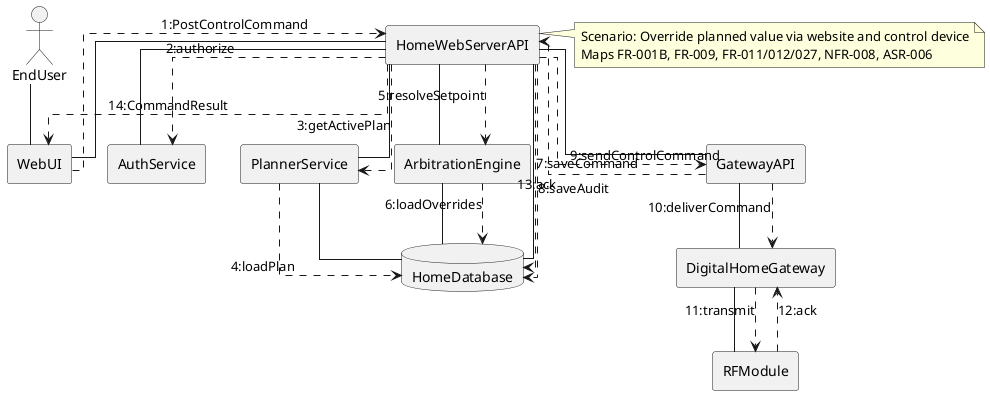

## DevelopmentView
8. Package — Development View: Package Diagram
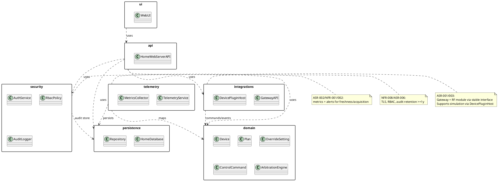

9. Component — Development View: Component Diagram
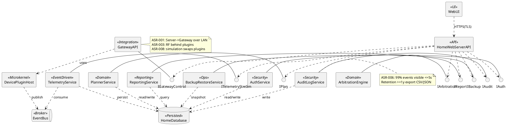

## PhysicalView
10. Deployment — Physical View: Deployment Diagram
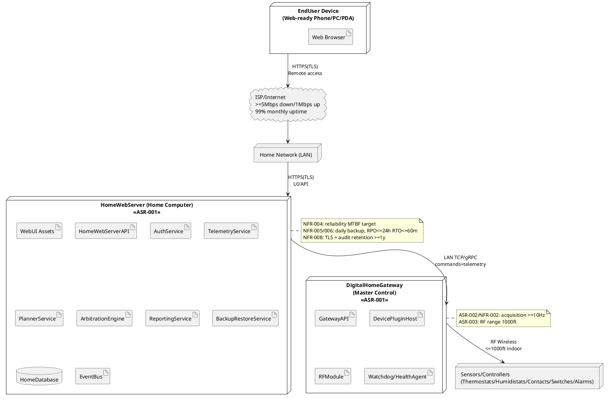

11. Container — Physical View: Container Diagram
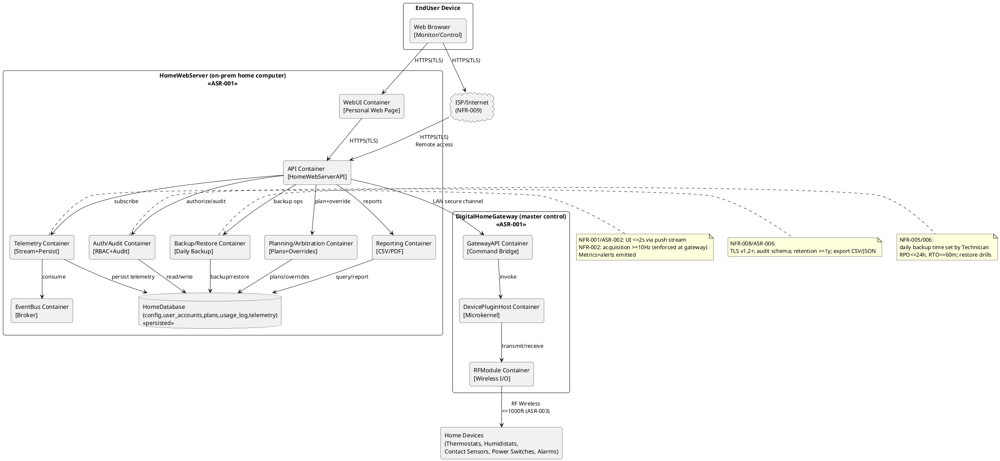