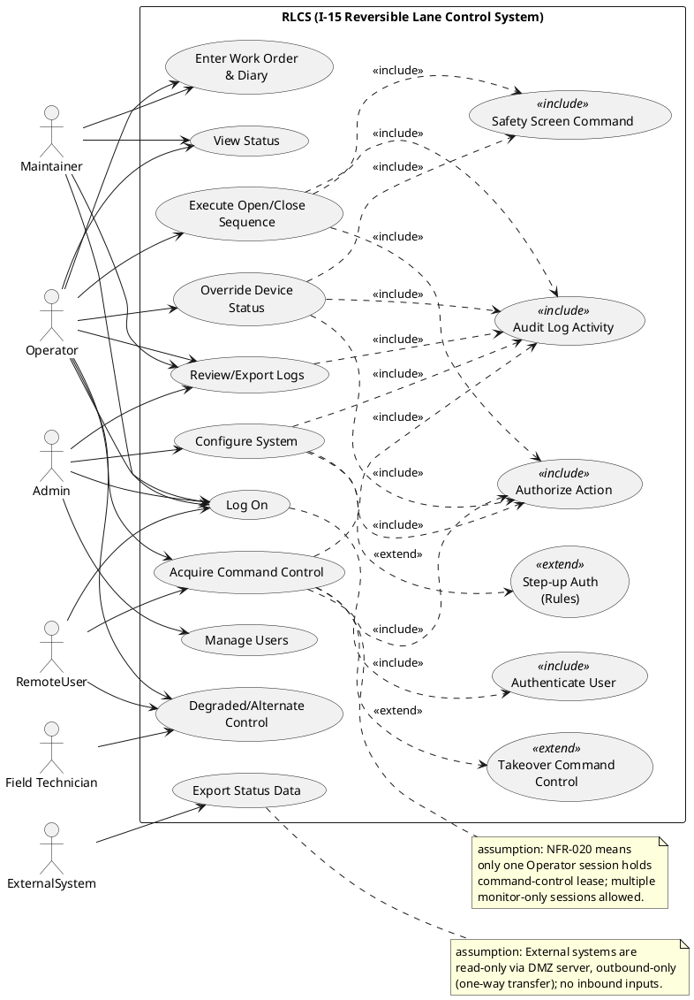
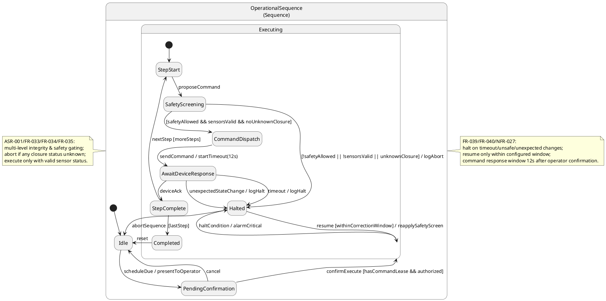
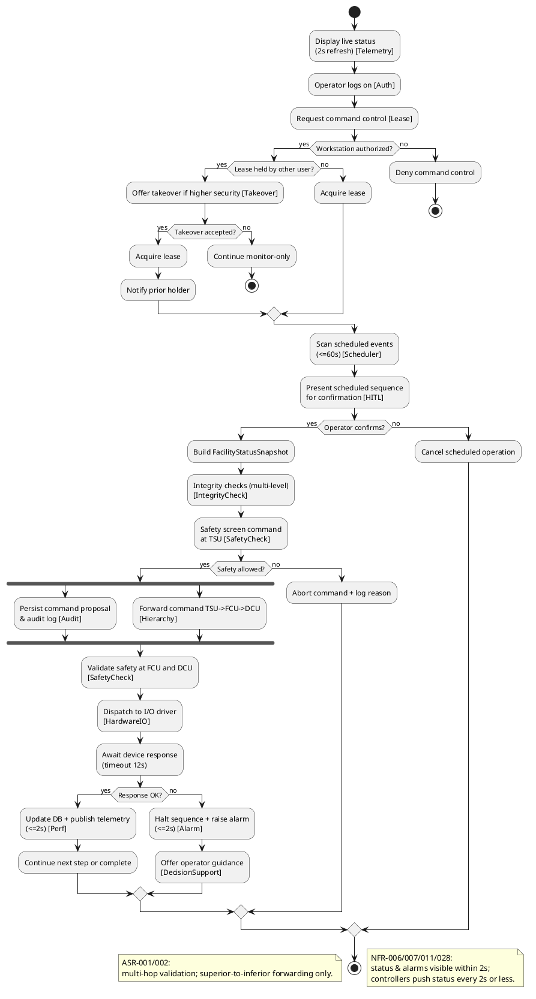
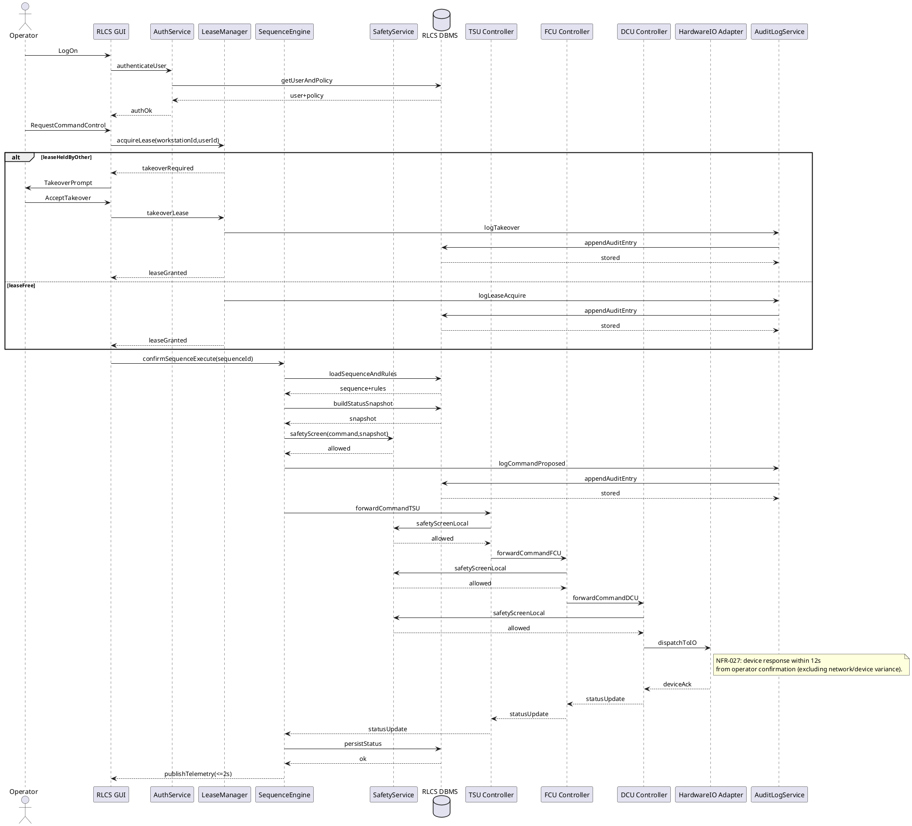
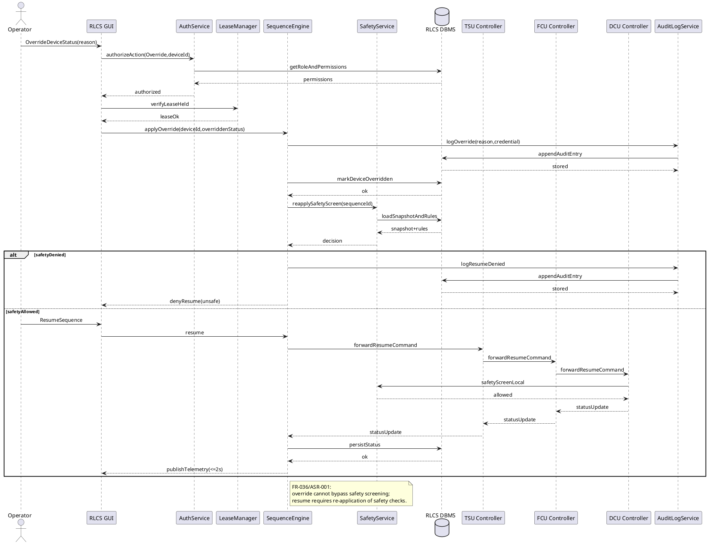
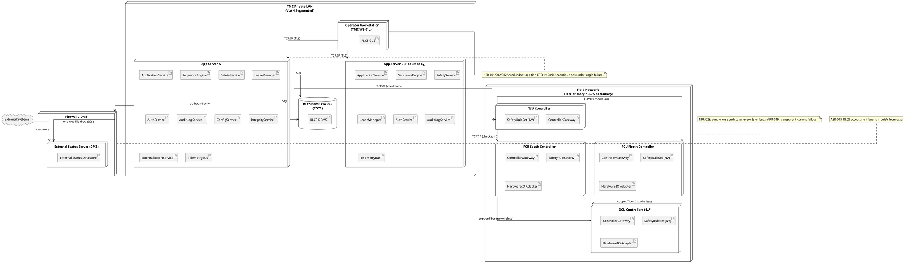
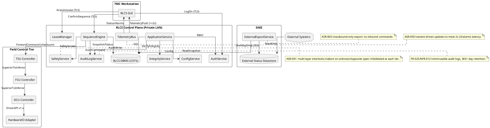

## ScenarioView
1. UseCase — Scenario View: Use Case Diagram


## LogicView
2. Class — Logic View: Class Diagram

```plantuml
@startuml ClassView
hide circle
skinparam classAttributeIconSize 0

class User {
  +userId: String
  +username: String
  -passwordHash: String
  +role: Role
  +securityLevel: int
  +isRemoteAllowed: boolean
  +isActive: boolean
  +authenticate(password: String): boolean
}

enum Role {
  Operator
  SystemAdministrator
  MaintenanceUser
  MonitorOnly
}

class Workstation {
  +workstationId: String
  +locationName: String
  +isAuthorizedForCommand: boolean
  +isRemoteDialIn: boolean
}

class Session {
  +sessionId: String
  +loginTime: DateTime
  +lastSeen: DateTime
  +mode: SessionMode
  +requestCommandControl(): void
  +releaseCommandControl(): void
}

enum SessionMode {
  MonitorOnly
  CommandControl
}

class CommandLease {
  +leaseId: String
  +holderUserId: String
  +holderWorkstationId: String
  +acquiredAt: DateTime
  +expiresAt: DateTime
  +takeoverBy(user: User): boolean
  +isHeld(): boolean
}

class Device {
  +deviceId: String
  +deviceType: String
  +location: String
  +direction: String
  +status: DeviceStatus
  +lastUpdate: DateTime
  +setDesiredState(desired: DeviceStatus): void
}

enum DeviceStatus {
  Open
  Closed
  Unknown
  Failed
  Overridden
}

class SensorStatus {
  +sensorId: String
  +deviceId: String
  +value: String
  +quality: String
  +timestamp: DateTime
}

class ControlCommand {
  +commandId: String
  +commandType: String
  +targetDeviceId: String
  +requestedBy: String
  +requestedAt: DateTime
  +confirmedAt: DateTime
  +status: CommandStatus
  +validate(): boolean
}

enum CommandStatus {
  Proposed
  Confirmed
  Aborted
  Sent
  Completed
  Halted
  Failed
}

class SafetyRuleSet <<persisted>> {
  +ruleSetId: String
  +version: String
  +effectiveAt: DateTime
  +evaluate(cmd: ControlCommand, snapshot: FacilityStatusSnapshot): SafetyDecision
}

class SafetyDecision {
  +isAllowed: boolean
  +reason: String
}

class Sequence {
  +sequenceId: String
  +name: String
  +mode: String
  +scheduleCron: String
  +state: SequenceState
  +start(): void
  +halt(reason: String): void
  +resume(): void
}

enum SequenceState {
  Idle
  PendingConfirmation
  Executing
  Halted
  Completed
}

class FacilityStatusSnapshot {
  +snapshotId: String
  +capturedAt: DateTime
  +isStale(maxAgeSeconds: int): boolean
}

class AuditLogEntry <<immutable>> {
  +entryId: String
  +timestamp: DateTime
  +userId: String
  +workstationId: String
  +action: String
  +details: String
  +hashChain: String
}

class ConfigChange {
  +changeId: String
  +changedBy: String
  +changedAt: DateTime
  +impactedUnits: String[*]
  +validateConflicts(): String[*]
}

class IntegrityReport <<immutable>> {
  +unitId: String
  +verifiedAt: DateTime
  +algorithm: String
  +result: String
  +digest: String
}

class ExternalExportFile <<immutable>> {
  +exportId: String
  +createdAt: DateTime
  +schemaVersion: String
  +buildPayload(snapshot: FacilityStatusSnapshot): String
}

Session "1" o-- "1" User
Session "1" o-- "1" Workstation
CommandLease "0..1" --> "1" Session : heldBy
ControlCommand "0..*" --> "1" Session : issuedBy
ControlCommand "0..*" --> "1" Device : target
Device "1" *-- "0..*" SensorStatus
SafetyRuleSet "1" --> "0..*" ControlCommand : validates >
SafetyRuleSet "1" --> "0..*" FacilityStatusSnapshot : uses >
Sequence "1" o-- "0..*" ControlCommand : steps
FacilityStatusSnapshot "1" o-- "0..*" Device : statuses
AuditLogEntry "0..*" --> "0..1" Session : actorContext
AuditLogEntry "0..*" --> "0..1" ControlCommand : commandRef
AuditLogEntry "0..*" --> "0..1" ConfigChange : configRef
IntegrityReport "0..*" --> "1" Workstation : unit
ExternalExportFile "0..*" --> "1" FacilityStatusSnapshot : source

note right of SafetyRuleSet
ASR-001/FR-041:
validated at each unit;
stored in non-volatile memory;
must abort on unsafe/unknown.
end note

note right of AuditLogEntry
FR-025/NFR-012:
tamper-proof storage, 365+ days retention;
no user edits; include failed/aborted commands.
end note

note right of CommandLease
ASR-008:
single active command-control;
workstation allow-list; takeover workflow logged.
end note

note right of ExternalExportFile
ASR-005:
outbound-only export every 30s to DMZ;
no inbound inputs from external systems.
end note
@enduml
```


3. Object — Logic View: Object Diagram
```plantuml
@startuml ObjectView
skinparam classAttributeIconSize 0

object op1 as "op1:User [CommandControl]" {
  userId = "U-1001"
  username = "j.smith"
  role = "Operator"
  securityLevel = 5
  isRemoteAllowed = false
}

object ws1 as "ws1:Workstation [CommandControl]" {
  workstationId = "TMC-WS-01"
  locationName = "TMC Main"
  isAuthorizedForCommand = true
  isRemoteDialIn = false
}

object sess1 as "sess1:Session [LogOn]" {
  sessionId = "S-7788"
  loginTime = "2026-04-22T06:01:10"
  mode = "CommandControl"
}

object lease1 as "lease1:CommandLease [AcquireLease]" {
  leaseId = "L-55"
  holderUserId = "U-1001"
  holderWorkstationId = "TMC-WS-01"
  expiresAt = "2026-04-22T06:11:10"
}

object seq1 as "seq1:Sequence [OpenLanes]" {
  sequenceId = "SEQ-OPEN-AM"
  name = "Morning Open"
  mode = "PeakAM"
  state = "Executing"
}

object gateN1 as "gateN1:Device [Gate]" {
  deviceId = "GATE-N-01"
  deviceType = "BarrierGate"
  direction = "NB"
  status = "Closed"
  lastUpdate = "2026-04-22T06:01:09"
}

object cmd1 as "cmd1:ControlCommand [ConfirmExecute]" {
  commandId = "CMD-9001"
  commandType = "OpenGate"
  targetDeviceId = "GATE-N-01"
  status = "Confirmed"
  confirmedAt = "2026-04-22T06:01:12"
}

object audit1 as "audit1:AuditLogEntry [Audit]" {
  entryId = "A-1"
  timestamp = "2026-04-22T06:01:12"
  userId = "U-1001"
  workstationId = "TMC-WS-01"
  action = "ConfirmSequenceStep"
  details = "SEQ-OPEN-AM CMD-9001"
}

sess1 -- op1
sess1 -- ws1
lease1 --> sess1
seq1 o-- cmd1
cmd1 --> gateN1
audit1 ..> cmd1

@enduml
```

4. State — Logic View: State Diagram


## ProcessView
5. Activity — Process View: Activity Diagram


6. Sequence — Process View: Sequence Diagram




7. Collaboration — Process View: Collaboration Diagram
```plantuml
@startuml Collaboration_CommandControlAndOperate
skinparam linetype ortho

actor Operator
rectangle "RLCS GUI" as GUI
rectangle "AuthService" as Auth
rectangle "LeaseManager" as Lease
rectangle "SequenceEngine" as SeqEng
rectangle "SafetyService" as Safety
database "RLCS DBMS" as DB
rectangle "AuditLogService" as Audit
rectangle "TSU Controller" as TSU
rectangle "FCU Controller" as FCU

Operator -- GUI
GUI -- Auth
GUI -- Lease
GUI -- SeqEng
SeqEng -- Safety
Auth -- DB
SeqEng -- DB
Audit -- DB
SeqEng -- Audit
SeqEng -- TSU
TSU -- FCU

GUI : 1. LogOn
GUI -> Auth : 2. authenticateUser
Auth -> DB : 3. getUserAndPolicy
GUI -> Lease : 4. acquireLease
Lease -> Audit : 5. logLeaseAcquire
Audit -> DB : 6. appendAuditEntry
GUI -> SeqEng : 7. confirmSequenceExecute
SeqEng -> DB : 8. loadSequenceAndRules
SeqEng -> Safety : 9. safetyScreen
SeqEng -> TSU : 10. forwardCommandTSU
TSU -> FCU : 11. forwardCommandFCU
SeqEng -> DB : 12. persistStatus
SeqEng -> GUI : 13. publishTelemetry

note right of GUI
Scenario: Operator acquires command control and confirms
a scheduled open/close sequence (FR-006, FR-038, FR-037),
with multi-layer safety screening (FR-041/ASR-001).
end note
@enduml
```

```plantuml
@startuml Collaboration_OverrideAndResume
skinparam linetype ortho

actor Operator
rectangle "RLCS GUI" as GUI
rectangle "AuthService" as Auth
rectangle "LeaseManager" as Lease
rectangle "SequenceEngine" as SeqEng
rectangle "SafetyService" as Safety
database "RLCS DBMS" as DB
rectangle "AuditLogService" as Audit
rectangle "TSU Controller" as TSU
rectangle "DCU Controller" as DCU

Operator -- GUI
GUI -- Auth
GUI -- Lease
GUI -- SeqEng
SeqEng -- Safety
SeqEng -- Audit
Audit -- DB
Auth -- DB
SeqEng -- DB
SeqEng -- TSU
TSU -- DCU

GUI : 1. OverrideDeviceStatus
GUI -> Auth : 2. authorizeAction
GUI -> Lease : 3. verifyLeaseHeld
GUI -> SeqEng : 4. applyOverride
SeqEng -> Audit : 5. logOverride
Audit -> DB : 6. appendAuditEntry
SeqEng -> Safety : 7. reapplySafetyScreen
GUI : 8. ResumeSequence
GUI -> SeqEng : 9. resume
SeqEng -> TSU : 10. forwardResumeCommand
TSU -> DCU : 11. forwardResumeCommand
DCU -> Safety : 12. safetyScreenLocal

note right of SeqEng
Scenario: Override a failed/unknown device status with reason
then attempt resume; safety screening must still pass
(FR-036, FR-040, ASR-001).
end note
@enduml
```

## DevelopmentView
8. Package — Development View: Package Diagram
```plantuml
@startuml PackageView
skinparam packageStyle rectangle

package "ui" as UI {
  note bottom: GUI screens: status/map/alarms\ncommands/config/log export (FR-002)
}

package "application" as APP {
  note bottom: use-case orchestration\nsequence confirmation, workflows
}

package "domain" as DOMAIN {
  note bottom: core model: Sequence, Command,\nSafetyRuleSet, Device, Lease
}

package "infrastructure" as INFRA {
  note bottom: DB access, audit storage,\nmessage bus, scheduling
}

package "integrations" as INTEG {
  note bottom: controllers & I/O drivers,\nexternal export to DMZ (ASR-005/006)
}

package "security" as SEC {
  note bottom: authn/authz, password policy,\nTLS, workstation allow-list (ASR-008)
}

package "observability" as OBS {
  note bottom: alarms, metrics, integrity checks\n(ASR-007, NFR-011)
}

UI ..> APP
APP ..> DOMAIN
APP ..> SEC
APP ..> INFRA
APP ..> INTEG
INFRA ..> DOMAIN
INTEG ..> DOMAIN
SEC ..> DOMAIN
OBS ..> INFRA
OBS ..> DOMAIN
APP ..> OBS

note right of APP
ASR-003: bounded-latency pipelines;\nprefer event-driven push to UI.
end note

note right of INTEG
ASR-002: TSU>FCU>DCU forwarding only;\nHardwareIO Adapter boundary.
end note

note left of INFRA
FR-050/ASR-009:\nCOTS DBMS; isolate reporting workload.
end note
@enduml
```

9. Component — Development View: Component Diagram

```plantuml
@startuml ComponentView
skinparam componentStyle rectangle

component "RLCS GUI" as C_GUI <<UI>> 
component "ApplicationService" as C_APP 
component "SequenceEngine" as C_SEQ 
component "SafetyService" as C_SAFE 
component "LeaseManager" as C_LEASE 
component "AuthService" as C_AUTH 
component "TelemetryBus" as C_BUS <<broker>> 
component "AuditLogService" as C_AUDIT 
component "ConfigService" as C_CONFIG 
component "IntegrityService" as C_INTEG 
component "ExternalExportService" as C_EXPORT 
component "ControllerGateway" as C_GATE 
component "HardwareIO Adapter" as C_HW 
database "RLCS DBMS" as C_DB <<COTS>>

interface "IAuth" as IAuth
interface "ILease" as ILease
interface "ISequence" as ISeq
interface "ISafety" as ISafety
interface "IAudit" as IAudit
interface "IConfig" as IConfig
interface "IIntegrity" as IIntegrity
interface "IExport" as IExport
interface "IControllerLink" as ICtrl
interface "IHardwareIO" as IHW

C_AUTH - IAuth
C_LEASE - ILease
C_SEQ - ISeq
C_SAFE - ISafety
C_AUDIT - IAudit
C_CONFIG - IConfig
C_INTEG - IIntegrity
C_EXPORT - IExport
C_GATE - ICtrl
C_HW - IHW

C_GUI ..> IAuth
C_GUI ..> ILease
C_GUI ..> ISeq
C_GUI ..> IConfig
C_GUI ..> IAudit

C_APP ..> IAuth
C_APP ..> ILease
C_APP ..> ISeq
C_APP ..> IConfig
C_APP ..> IIntegrity
C_APP ..> IExport
C_APP ..> IAudit

C_SEQ ..> ISafety
C_SEQ ..> IAudit
C_SEQ ..> ICtrl
C_SEQ ..> C_BUS

C_GATE ..> IHW

C_AUTH ..> C_DB
C_LEASE ..> C_DB
C_SEQ ..> C_DB
C_CONFIG ..> C_DB
C_AUDIT ..> C_DB
C_EXPORT ..> C_DB
C_INTEG ..> C_DB

note right of C_BUS
ASR-003: publish device/alarm updates\nso GUI reflects changes <=2s.
end note

note right of C_EXPORT
ASR-005/FR-030: outbound-only to DMZ\n(every 30s) + one-way serial link.
end note

note left of C_SAFE
ASR-001/FR-041: safety screening\nat each hop and executing controller.
end note

note bottom of C_HW
ASR-006/FR-055: implement RLCS Device Control API v1.x\n(pluggable drivers/controllers).
end note
@enduml
```


## PhysicalView
10. Deployment — Physical View: Deployment Diagram


11. Container — Physical View: Container Diagram
