## ScenarioView
1. UseCase — Scenario View: Use Case Diagram
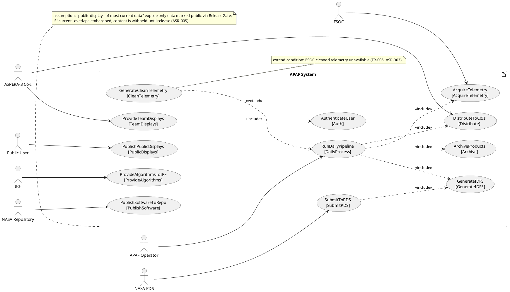

## LogicView
2. Class — Logic View: Class Diagram
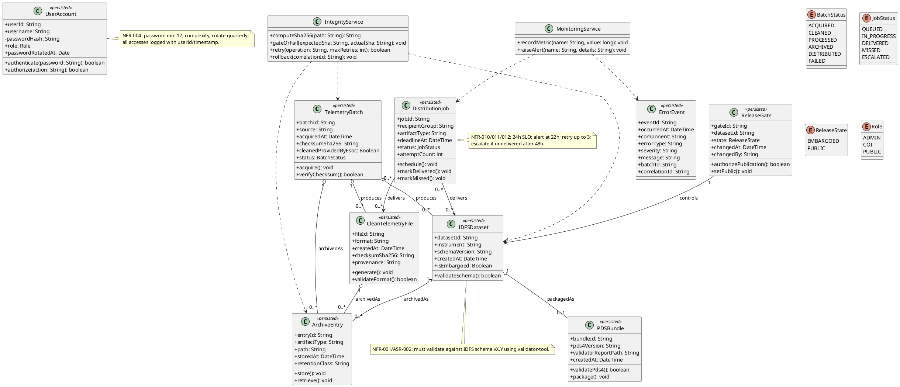

3. Object — Logic View: Object Diagram
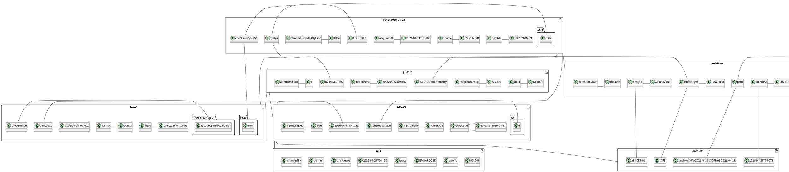

4. State — Logic View: State Diagram
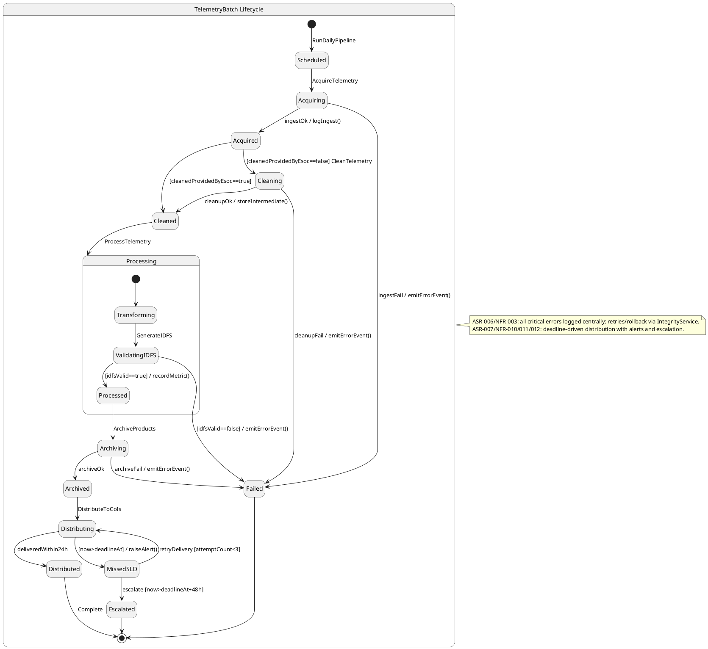

## ProcessView
5. Activity — Process View: Activity Diagram
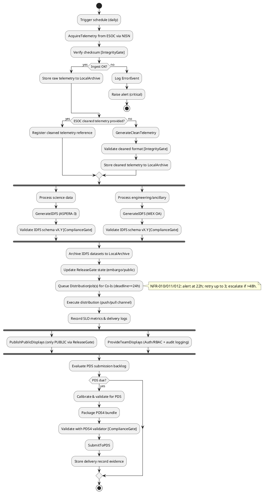

6. Sequence — Process View: Sequence Diagram
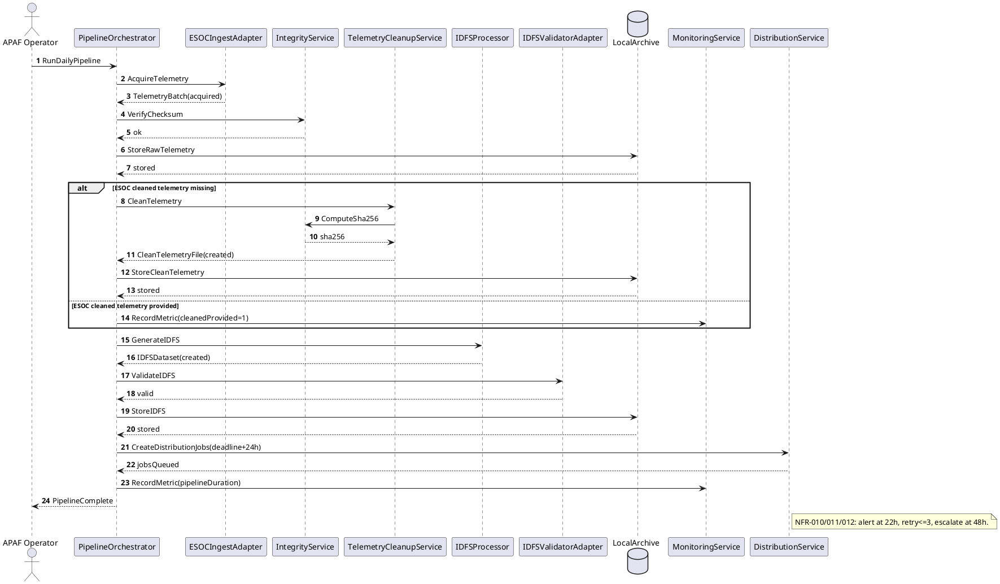

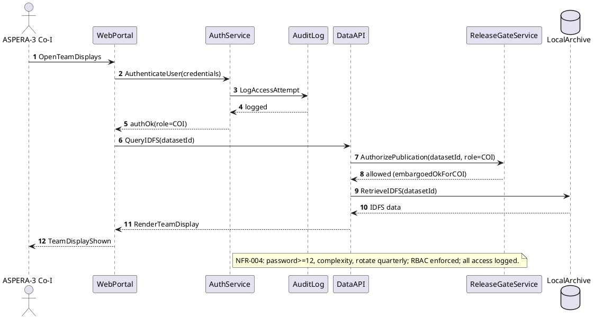

7. Collaboration — Process View: Collaboration Diagram
```plantuml
@startuml CollaborationView_S1_DailyPipeline
actor "APAF Operator" as Operator
rectangle "PipelineOrchestrator" as Orchestrator
rectangle "ESOCIngestAdapter" as ESOCAdapter
rectangle "IntegrityService" as Integrity
rectangle "TelemetryCleanupService" as Cleanup
rectangle "IDFSProcessor" as IDFSProc
rectangle "IDFSValidatorAdapter" as IDFSVal
database "LocalArchive" as Archive
rectangle "DistributionService" as Dist
rectangle "MonitoringService" as Monitor

Operator -- Orchestrator
Orchestrator -- ESOCAdapter
Orchestrator -- Integrity
Orchestrator -- Cleanup
Orchestrator -- IDFSProc
Orchestrator -- IDFSVal
Orchestrator -- Archive
Orchestrator -- Dist
Orchestrator -- Monitor

Orchestrator : 1. RunDailyPipeline
Orchestrator -> ESOCAdapter : 2. AcquireTelemetry
Orchestrator -> Integrity : 3. VerifyChecksum
Orchestrator -> Archive : 4. StoreRawTelemetry
Orchestrator -> Cleanup : 5. CleanTelemetry (if needed)
Orchestrator -> IDFSProc : 6. GenerateIDFS
Orchestrator -> IDFSVal : 7. ValidateIDFS
Orchestrator -> Archive : 8. StoreIDFS
Orchestrator -> Dist : 9. CreateDistributionJobs
Orchestrator -> Monitor : 10. RecordMetrics

note bottom
scenario: Daily automated telemetry ingest -> optional cleanup -> IDFS generation/validation -> archive -> distribute (FR-001/002/003/005/006/007/013; ASR-001/003/004/007).
end note
@enduml
```

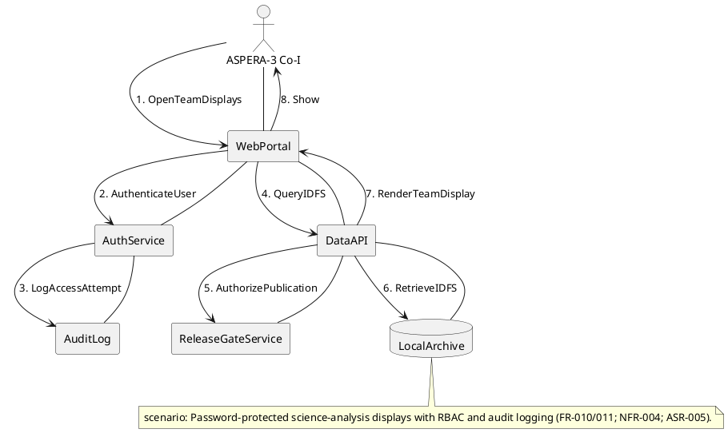

## DevelopmentView
8. Package — Development View: Package Diagram
```plantuml
@startuml PackageView_APAF
skinparam packageStyle rectangle

package "ui" as P_UI {
  note bottom: WebPortal (public + team views)
}

package "api" as P_API {
  note bottom: DataAPI for queries/download
}

package "domain" as P_DOMAIN {
  note bottom: TelemetryBatch, IDFSDataset, ReleaseGate, DistributionJob
}

package "application" as P_APP {
  note bottom: PipelineOrchestrator, use-case services
}

package "integrations" as P_INT {
  note bottom: ESOCIngestAdapter, IDFSValidatorAdapter, PDSValidatorAdapter
}

package "infrastructure" as P_INFRA {
  note bottom: LocalArchive, queues, scheduling, config
}

package "crosscutting" as P_XCUT {
  note bottom: AuthService, IntegrityService, MonitoringService, AuditLog
}

P_UI ..> P_API
P_API ..> P_APP
P_APP ..> P_DOMAIN
P_APP ..> P_INT
P_APP ..> P_INFRA
P_APP ..> P_XCUT
P_INT ..> P_XCUT
P_API ..> P_XCUT

note right of P_XCUT
ASR-006: centralized error handling/logging/alerts.
NFR-004: authentication/RBAC/audit.
end note

note right of P_DOMAIN
ASR-002: IDFS canonical products.
ASR-007: deadline-driven DistributionJob model.
end note
@enduml
```

9. Component — Development View: Component Diagram
```plantuml
@startuml ComponentView_APAF
skinparam componentStyle rectangle

component "WebPortal\n[PublicDisplays|TeamDisplays]" as Web
component "DataAPI\n[Query|Download]" as API
component "AuthService\n[RBAC]" as Auth
component "AuditLog\n[AccessLog]" as Audit
component "PipelineOrchestrator\n[DailyProcess]" as Orchestrator
component "ESOCIngestAdapter\n[AcquireTelemetry]" as ESOCAdapter
component "TelemetryCleanupService\n[CleanTelemetry]" as Cleanup
component "IDFSProcessor\n[GenerateIDFS]" as IDFSProc
component "IDFSValidatorAdapter\n[ValidateIDFS]" as IDFSVal
component "ReleaseGateService\n[Embargo]" as Release
component "DistributionService\n[Distribute]" as Dist
component "PDSExportService\n[SubmitPDS]" as PDSExport
component "PDSValidatorAdapter\n[ValidatePDS4]" as PDSVal
component "IntegrityService\n[IntegrityGate]" as Integrity
component "MonitoringService\n[SLO|Alerts]" as Monitor
database "LocalArchive" as Archive
queue "JobQueue\n[DistributionJobs]" as Queue

interface IAuth
interface IDataQuery
interface IIngest
interface IArchive
interface IIntegrity
interface IMonitor

Auth - IAuth
API - IDataQuery
ESOCAdapter - IIngest
Archive - IArchive
Integrity - IIntegrity
Monitor - IMonitor

Web ..> IAuth
Web ..> IDataQuery

API ..> IAuth
API ..> Release
API ..> Archive
API ..> Audit

Orchestrator ..> ESOCAdapter
Orchestrator ..> Cleanup
Orchestrator ..> IDFSProc
Orchestrator ..> IDFSVal
Orchestrator ..> Archive
Orchestrator ..> Dist
Orchestrator ..> Integrity
Orchestrator ..> Monitor
Orchestrator ..> Release

Dist ..> Queue
Dist ..> Archive
Dist ..> Monitor

PDSExport ..> Archive
PDSExport ..> PDSVal
PDSExport ..> Monitor
PDSExport ..> Integrity

note right of IDFSVal
NFR-001: validate against IDFS schema vX.Y using validator-tool.
end note

note right of PDSVal
NFR-001/FR-017: PDS4 validator pass; store evidence in delivery record.
end note

note bottom of Dist
ASR-007: 24h SLO enforcement, retries, escalation.
end note
@enduml
```

## PhysicalView
10. Deployment — Physical View: Deployment Diagram
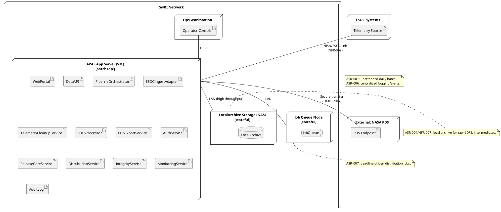

11. Container — Physical View: Container Diagram
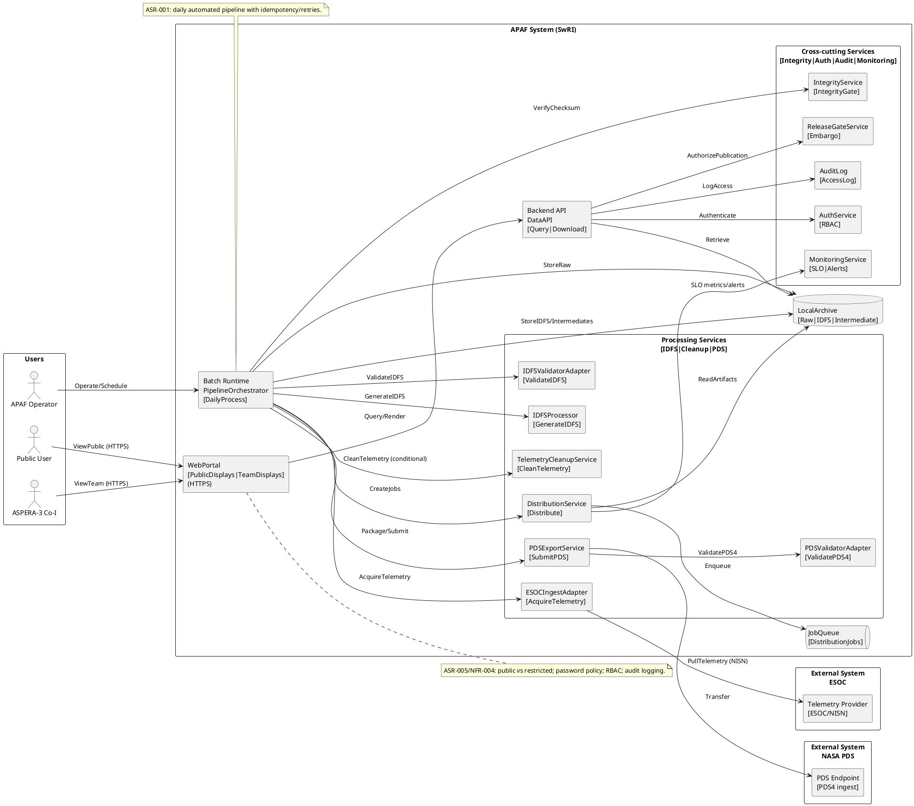