## ScenarioView
1. UseCase — Scenario View: Use Case Diagram
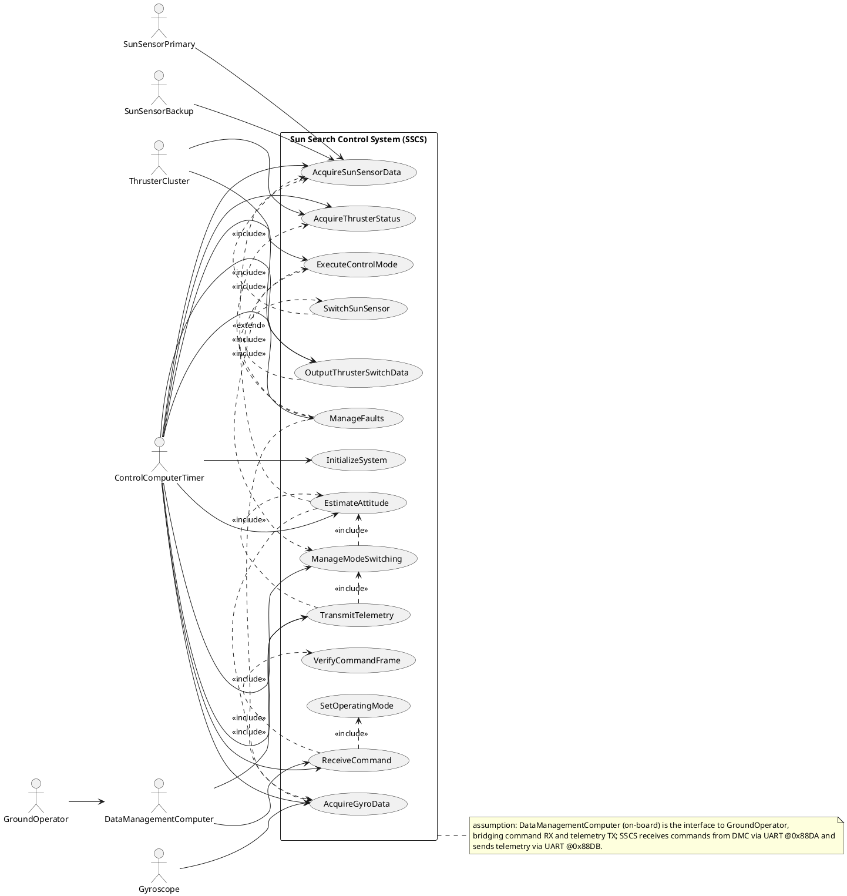

## LogicView
2. Class — Logic View: Class Diagram
```plantuml
@startuml Class_SunSearchControl
skinparam classAttributeIconSize 0

class CyclicExecutive <<control>> {
  -tickCount5 : uint8
  -superframeStartMs : uint16
  +onTimerTick32ms() : void
  +runSlot(slotId:uint8) : void
  +detectOverrun() : void
}

class ScheduleMonitor <<service>> {
  -isrOverrunCount : uint16
  -cycleMissCount : uint16
  -lastIsrDurationMs : uint16
  +beginIsr() : void
  +endIsr() : void
  +markCycleComplete() : void
}

class HardwareIO <<boundary>> {
  +uartRx(port:uint16, maxLen:uint8) : byte[]
  +uartTx(port:uint16, data:byte[]) : void
  +adcRead(channel:uint8) : uint16
  +writeReg(addr:uint16, value:uint8) : void
  +delayMs(ms:uint16) : void
}

class CommandFrame <<immutable>> {
  +length : uint8
  +header : uint16
  +payload : byte[]
  +checksum : uint16
  +isValid(spec:FrameSpec) : bool
}

class TelemetryPacket <<immutable>> {
  +modeWord : uint16
  +attitude : int16[3]
  +angularRate : int16[3]
  +faultFlags : uint16
  +scheduleStatus : uint16
  +encode(spec:FrameSpec) : byte[]
}

class FrameSpec <<value>> {
  +minLen : uint8
  +header : uint16
  +checksumType : uint8
  +verify(bytes:byte[]) : bool
}

class ModeRegister <<persisted>> {
  +modeWord : uint16
  +modeDurationTicks : uint16
  +targetAngleU12 : uint16
  +targetRate : int16[3]
  +sunSensorSel : uint8
  +reset() : void
  +updateTargets(rate:int16[3], angleU12:uint16) : void
}

class SensorSnapshot <<value>> {
  +gyroPulseCount : uint32
  +gyroValid : bool
  +sunPowerOn : bool
  +sunVisible : bool
  +sunSign : bool
  +sunAngleU12 : uint16
  +thrusterPowerOn : bool
}

class GyroDriver <<driver>> {
  -portAddr : uint16 = 0x881A
  -fetchCmd : uint16 = 0xEB91
  -homeCmd : uint16 = 0xEB92
  -spec : FrameSpec
  +init() : void
  +fetch() : void
  +readAndValidate() : SensorSnapshot
}

class SunSensorDriver <<driver>> {
  -angleAdFormat : uint8
  +readAdAngleU12() : uint16
  +readLatchSignals() : void
  +switchPulse190ms() : void
}

class ThrusterDriver <<driver>> {
  +readPowerStatus() : bool
  +outputSwitchDataAt128ms(cmd:ThrusterCommand) : void
  +disableThrusters() : void
}

class AttitudeEstimator <<service>> {
  +estimate(snapshot:SensorSnapshot) : AttitudeState
}

class AttitudeState <<value>> {
  +eulerDegX10 : int16[3]
  +omegaMdps : int16[3]
}

class ModeManager <<service>> {
  +evaluate(state:AttitudeState, reg:ModeRegister, sunVisible:bool) : void
  +logTransition(from:uint16, to:uint16, cause:uint8) : void
}

class ControlLaw <<service>> {
  +computeTargets(reg:ModeRegister, state:AttitudeState) : ThrusterCommand
}

class ThrusterCommand <<value>> {
  +switchBits12 : uint16
  +sequenceId : uint8
}

class FaultManager <<service>> {
  -gyroErrCount : uint8
  -gyroRecoveryState : uint8
  -thrusterRapidFireCount : uint8
  +checkGyroComms(gyroValid:bool) : void
  +checkThrusterFiring(intervalMs:uint16) : void
  +requestSunSensorSwitch() : bool
}

class TelemetryService <<service>> {
  -portAddr : uint16 = 0x88DB
  -spec : FrameSpec
  +build(state:AttitudeState, reg:ModeRegister, faults:uint16, sched:uint16) : TelemetryPacket
  +transmit(pkt:TelemetryPacket) : void
}

class CommandService <<service>> {
  -portAddr : uint16 = 0x88DA
  -spec : FrameSpec
  -lastAcceptedTick : uint16
  +receive() : CommandFrame
  +verify(cmd:CommandFrame) : bool
  +apply(cmd:CommandFrame, reg:ModeRegister) : void
  +enforceRateLimit(nowTick:uint16) : bool
}

CyclicExecutive "1" *-- "1" ScheduleMonitor
CyclicExecutive "1" *-- "1" CommandService
CyclicExecutive "1" *-- "1" GyroDriver
CyclicExecutive "1" *-- "1" SunSensorDriver
CyclicExecutive "1" *-- "1" ThrusterDriver
CyclicExecutive "1" *-- "1" AttitudeEstimator
CyclicExecutive "1" *-- "1" ModeManager
CyclicExecutive "1" *-- "1" ControlLaw
CyclicExecutive "1" *-- "1" FaultManager
CyclicExecutive "1" *-- "1" TelemetryService
CyclicExecutive "1" *-- "1" ModeRegister

GyroDriver ..> HardwareIO : uses
SunSensorDriver ..> HardwareIO : uses
ThrusterDriver ..> HardwareIO : uses
CommandService ..> HardwareIO : uses
TelemetryService ..> HardwareIO : uses

CommandService ..> FrameSpec
TelemetryService ..> FrameSpec
CommandFrame ..> FrameSpec
TelemetryPacket ..> FrameSpec

AttitudeEstimator ..> SensorSnapshot
AttitudeEstimator ..> AttitudeState

ModeManager ..> ModeRegister
ModeManager ..> AttitudeState

ControlLaw ..> ModeRegister
ControlLaw ..> AttitudeState
ControlLaw ..> ThrusterCommand

FaultManager ..> ModeRegister
FaultManager ..> GyroDriver
FaultManager ..> ThrusterDriver
FaultManager ..> SunSensorDriver

note right of CyclicExecutive
ASR-001/NFR-004: 32ms tick, 160ms superframe (5 ticks),
reserved output slot at t=128ms (tick 4).
end note

note right of HardwareIO
ASR-003/NFR-011: UART ports fixed:
0x88DA cmd RX, 0x88DB telemetry TX, 0x881A gyro only.
NFR-006: inter-byte gap < 5us for certain TX.
end note

note right of GyroDriver
NFR-008: fetch-to-read delay > 5ms (instrumented).
end note

note right of SunSensorDriver
NFR-009: switch pulse 190ms ±1ms via control register enable.
end note
@enduml
```

3. Object — Logic View: Object Diagram
```plantuml
@startuml Object_SunSearchControl
skinparam objectAttributeIconSize 0

object exec1 as "exec1 : CyclicExecutive [ControlCycle]"
object reg1 as "reg1 : ModeRegister [ModeState]" {
  modeWord = 0x0001
  modeDurationTicks = 37
  targetAngleU12 = 0x7A0
  targetRate = "{0,0,0}"
  sunSensorSel = 0
}
object snap1 as "snap1 : SensorSnapshot [AcquireSensors]" {
  gyroPulseCount = 1280345
  gyroValid = true
  sunPowerOn = true
  sunVisible = false
  sunSign = false
  sunAngleU12 = 0x3F2
  thrusterPowerOn = true
}
object att1 as "att1 : AttitudeState [EstimateAttitude]" {
  eulerDegX10 = "{-12, 35, 4}"
  omegaMdps = "{120, -80, 25}"
}
object cmd1 as "cmd1 : CommandFrame [ReceiveCommand]" {
  length = 12
  header = 0x55AA
  checksum = 0x1F2C
}
object thrCmd1 as "thrCmd1 : ThrusterCommand [OutputThrusters]" {
  switchBits12 = 0x05A3
  sequenceId = 4
}
object tlm1 as "tlm1 : TelemetryPacket [TransmitTelemetry]" {
  modeWord = 0x0001
  faultFlags = 0x0000
  scheduleStatus = 0x0000
}

exec1 -- reg1
exec1 -- snap1
snap1 -- att1
cmd1 -- reg1
att1 -- thrCmd1
reg1 -- thrCmd1
att1 -- tlm1
reg1 -- tlm1

note right of cmd1
assumption: command frame spec uses header 0x55AA and a 16-bit checksum placeholder
until Table 3.2-1 is provided.
end note
@enduml
```

4. State — Logic View: State Diagram
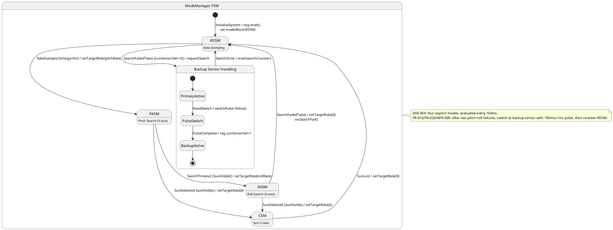

## ProcessView
5. Activity — Process View: Activity Diagram
```plantuml
@startuml Activity_160msControlCycle
start
:ISR tick 32ms;
:ScheduleMonitor.beginIsr();

if (tick == 0?) then (yes)
  :CommandService.receive() [UART 0x88DA];
  :VerifyCommandFrame [SpecCheck];
  if (RateLimit ok?) then (yes)
    :SetOperatingMode;
  else (no)
    :LogCmdReject;
  endif
  :GyroDriver.fetch() [UART 0x881A];
  note right
  NFR-008: enforce fetch->read delay > 5ms
  end note
endif

if (tick == 1?) then (yes)
  :delayMs(>5ms);
  :GyroDriver.readAndValidate();
endif

if (tick == 2?) then (yes)
  :SunSensorDriver.readLatchSignals();
  :SunSensorDriver.readAdAngleU12() [12-bit];
  :ThrusterDriver.readPowerStatus();
endif

if (tick == 3?) then (yes)
  :AttitudeEstimator.estimate();
  :FaultManager.checkGyroComms();
  :FaultManager.checkThrusterFiring();
  :ModeManager.evaluate();
endif

if (tick == 4?) then (yes)
  :ControlLaw.computeTargets();
  :OutputThrusterSwitchData @128ms;
  :TelemetryService.build();
  :TelemetryService.transmit() [UART 0x88DB];
endif

:ScheduleMonitor.endIsr();
if (Overrun?) then (yes)
  :LogScheduleOverrun;
endif
stop

note bottom
ASR-001/NFR-004/NFR-010: 5 ticks per 160ms superframe, reserved thruster output at t=128ms (tick 4).
NFR-006: telemetry TX inter-byte gap <5us (driver-level).
end note
@enduml
```

6. Sequence — Process View: Sequence Diagram
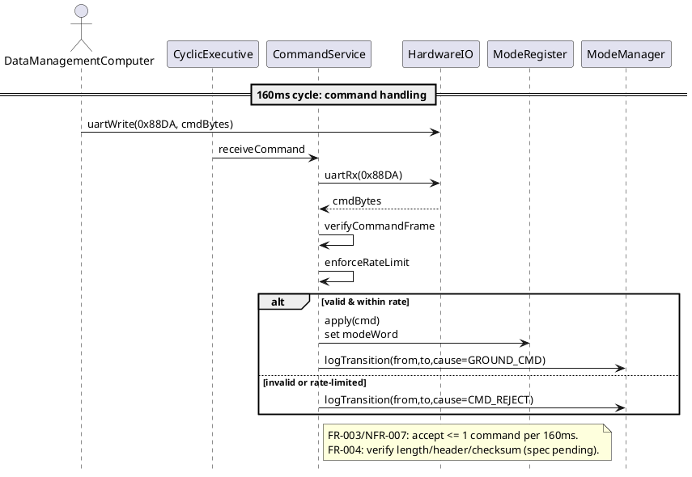

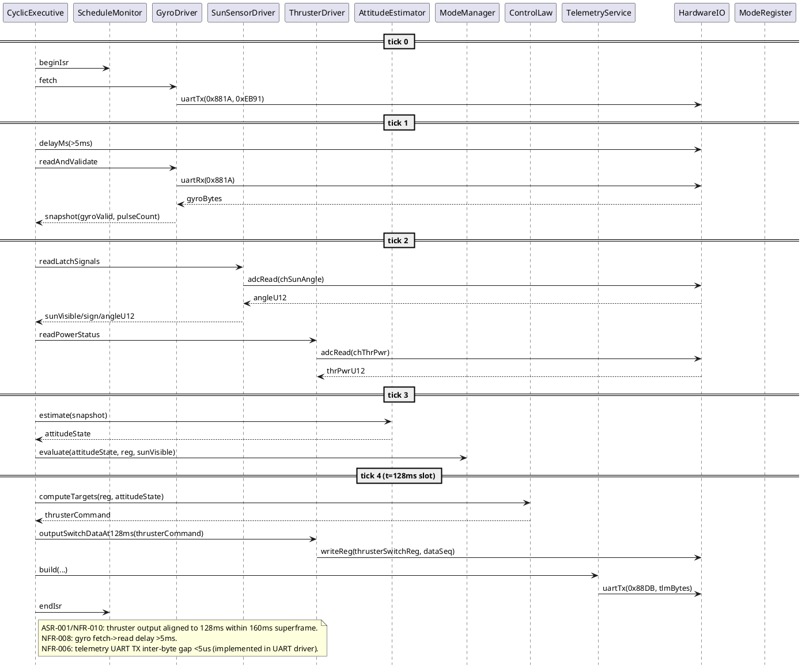

7. Collaboration — Process View: Collaboration Diagram
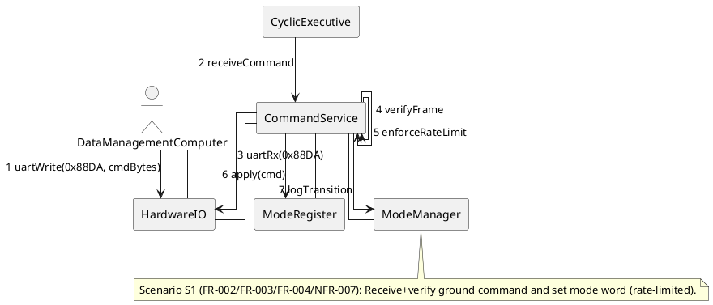

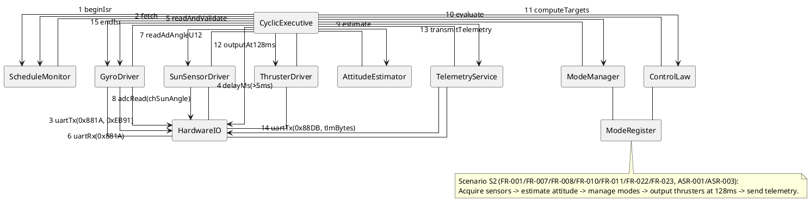

## DevelopmentView
8. Package — Development View: Package Diagram
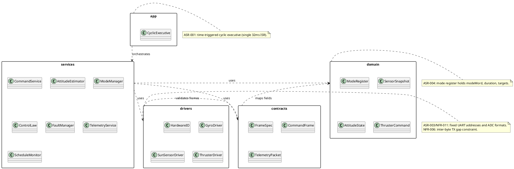

9. Component — Development View: Component Diagram
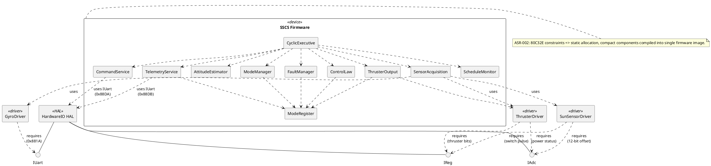

## PhysicalView
10. Deployment — Physical View: Deployment Diagram
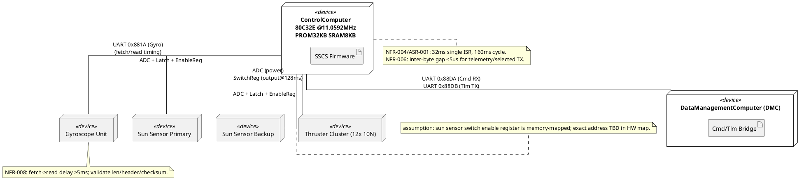

11. Container — Physical View: Container Diagram
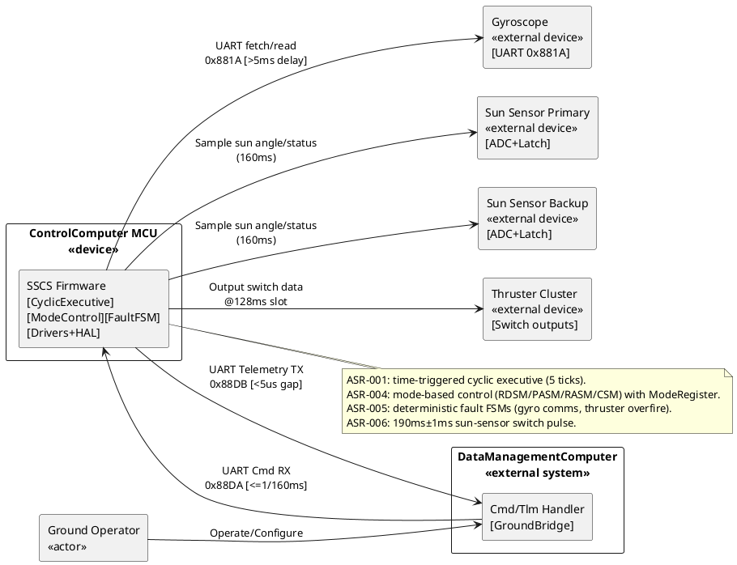