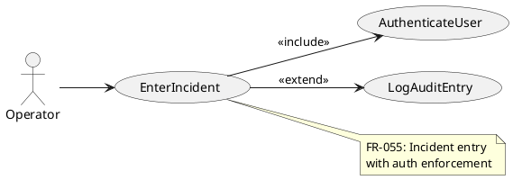
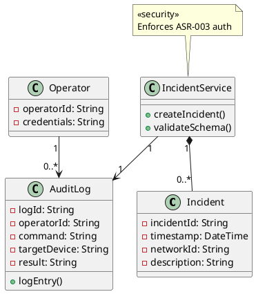
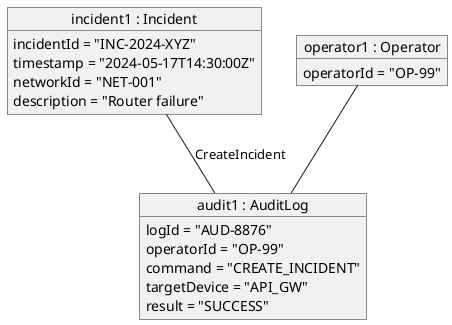
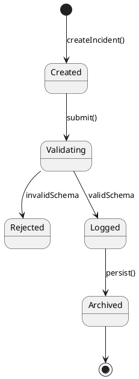
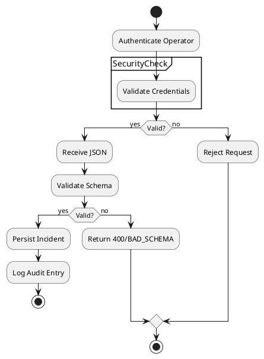
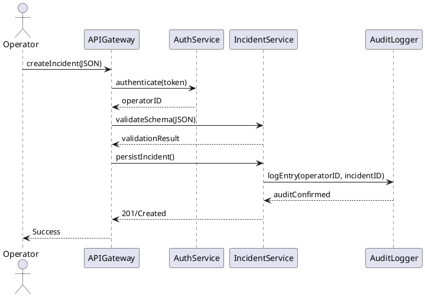
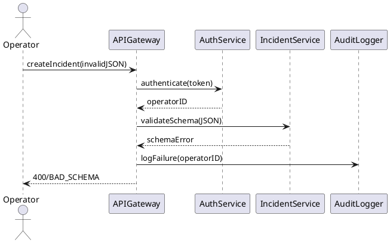
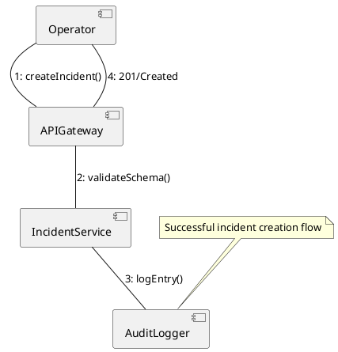
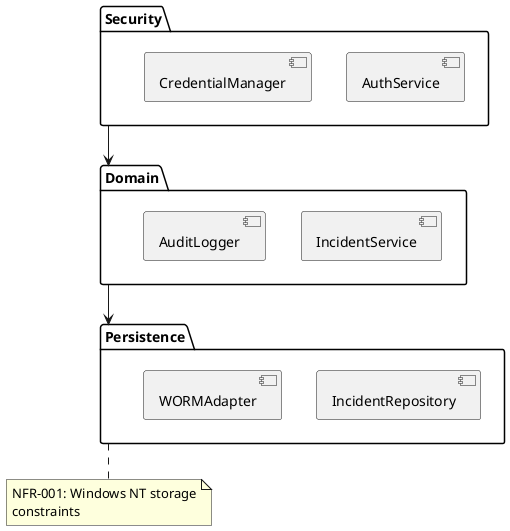
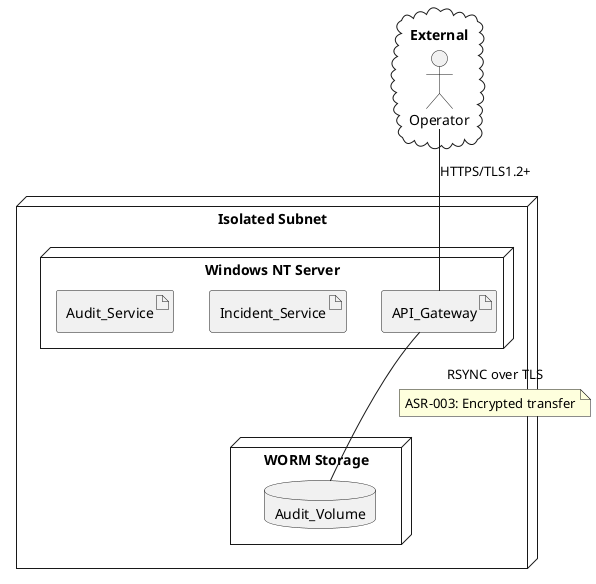

## Architecture Summary & Quality-Attribute Analysis  
**Proposed Architecture**: A layered security-focused architecture using API Gateway pattern for TLS/mTLS enforcement, RBAC authorization, and WORM-protected audit logging. Core components include Authentication Service, Incident Service, and Audit Logger deployed on Windows NT with OPSEC hardening.  

**Key Quality Attributes**:  
1. **Security** (ASR-003/NFR-001):  
   - *Tactics*: Mutual TLS, OAuth2.1 PKCE, credential rotation  
   - *Risks*: Legacy OS vulnerabilities vs. modern crypto requirements  
   - *Trade-off*: TLS termination at gateway simplifies NT deployment but reduces end-to-end encryption  

2. **Reliability** (FR-055):  
   - *Tactics*: WORM storage, atomic audit writes  
   - *Tension*: Write durability vs. NT filesystem limitations  

3. **Compatibility** (NFR-001):  
   - *Constraints*: Windows NT SP6a dependencies  
   - *Risk*: Modern security libraries incompatible with NT  

4. **Auditability** (ASR-003/FR-055):  
   - *Tactics*: Immutable logs with operatorID-incidentId binding  
   - *Trade-off*: WORM storage complexity vs. regulatory compliance  

**Architectural Style**:  
- **API Gateway + Layered Architecture**: Centralizes security enforcement (ASR-003) while isolating NT-specific components (NFR-001)  
- **Hexagonal Pattern**: Decouples core logic from legacy OS dependencies via adapters  

---

## Architectural Patterns & Tactics  
**Patterns**:  
1. **API Gateway** (ASR-003):  
   - Handles TLS/mTLS termination and OAuth flows  
   - *Justification*: Centralizes security-critical functions  

2. **Adapter-Broker** (NFR-001):  
   - WORM storage adapter abstracts NT filesystem  
   - *Justification*: Isolates legacy OS dependencies  

3. **RBAC Enforcement** (ASR-003):  
   - Policy decision point in gateway  
   - *Justification*: Mandates operator authorization  

**Tactics**:  
- **Credential Rotation** (ASR-003):  
  Scheduled secret generator with 90-day lifecycle  
- **Schema Validation** (FR-055):  
  JSON schema enforcement at gateway  
- **OPSEC Hardening** (NFR-001):  
  Disabled services + restricted account policy  

---

## PlantUML Diagrams  

### ScenarioView  
1. UseCase  


### LogicView  
2. Class  


3. Object  


4. State  


### ProcessView  
5. Activity  


6. Sequence  




7. Collaboration  


### DevelopmentView  
8. Package  


9. Component  
```plantuml
@startuml ComponentDiagram
component [API Gateway] as GW {
  interface "REST/HTTPS" as if1
}

component [Incident Service] as IS {
  interface "IncidentMgmt" as if2
}

component [Audit Service] as AUD {
  interface "WORMWriter" as if3
}

component [Auth Service] as AUTH {
  interface "OAuth2.1" as if4
}

GW -- IS : uses
GW -- AUD : uses
GW -- AUTH : uses
note right of AUD
  «ASR-003»
  WORM-protected storage
end note
@enduml
```

### PhysicalView  
10. Deployment  


11. Container  
```plantuml
@startuml ContainerDiagram
container "Web Layer" as WEB {
  component "API Gateway" 
  technology "IIS 6.0"
}

container "App Layer" as APP {
  component "Incident Service"
  component "Audit Logger"
  technology "C++ Win32"
}

container "Storage" as STORE {
  component "WORM Filesystem"
  technology "NTFS WORM Extension"
}

Operator --> WEB : 443/HTTPS
WEB --> APP : RPC
APP --> STORE : Encrypted I/O
note right of STORE
  NFR-001: Disabled ports\nOPSEC hardened
end note
@enduml
```