## Architecture Summary & Quality-Attribute Analysis
**Proposed Architecture:** Master/Slave architecture with redundant stateful Masters (ASR-001, ASR-003) and a Virtual Correlator Interface (VCI) gateway (ASR-002). Deterministic real-time processing occurs at Slave nodes (CMIB controllers), while the Master handles aggregation and network resilience. Features include network segmentation (ASR-004), encrypted audit logging (ASR-008), durable spooling (ASR-009), and OpenAPI-defined contracts (FR-002, FR-013).

**Key Quality Attributes:**
1. **Performance** (NFR-001):  
   - *Tactic:* Isolate real-time processing in Slaves  
   - *Risk:* VCI translation latency  
   - *Trade-off:* Accept quasi-real-time in Master for network resilience

2. **Reliability** (FR-008, ASR-005):  
   - *Tactic:* Redundant Masters + 24h spooling  
   - *Risk:* State replication complexity  
   - *Trade-off:* Increased storage vs zero data loss  

3. **Security** (ASR-008, FR-015):  
   - *Tactic:* VCI as security choke-point  
   - *Risk:* Overhead from cryptographic controls  
   - *Trade-off:* Strict access vs debug flexibility  

4. **Maintainability** (NFR-002, ASR-007):  
   - *Tactic:* Hot-swappable modules  
   - *Risk:* Auto-recovery race conditions  
   - *Trade-off:* Modularity vs hardware abstraction  

5. **Availability** (ASR-003, ASR-009):  
   - *Tactic:* Primary/secondary failover  
   - *Risk:* Split-brain scenarios  
   - *Trade-off:* State continuity complexity  

**Architectural Style:** Layered + Event-Driven Hybrid  
- *Justification:*  
  - **Layered:** Isolates translation (VCI), coordination (Master), and real-time processing (Slaves) per ASR-001/ASR-002  
  - **Event-Driven:** Handles asynchronous fault recovery (FR-003) and spooling (FR-006) via durable queues  

---

## ScenarioView
1. UseCase — Scenario View: Use Case Diagram  
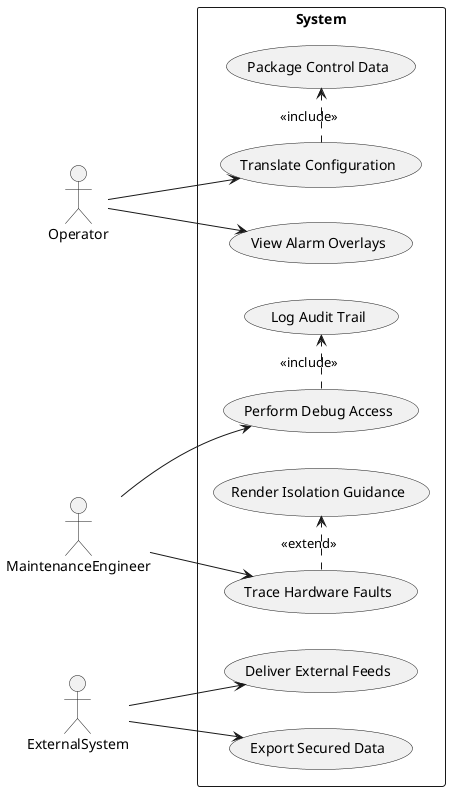

## LogicView
2. Class — Logic View: Class Diagram  
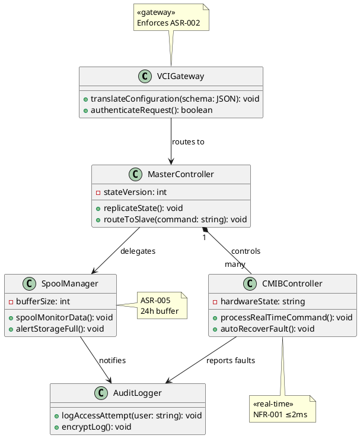

3. Object — Logic View: Object Diagram  
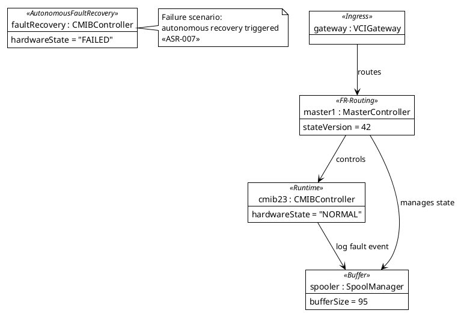

4. State — Logic View: State Diagram  
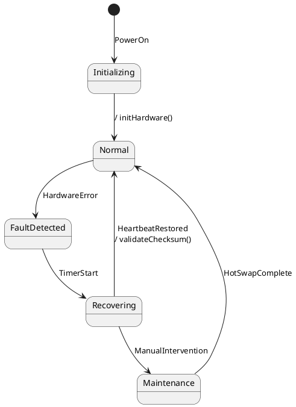

## ProcessView
5. Activity — Process View: Activity Diagram  
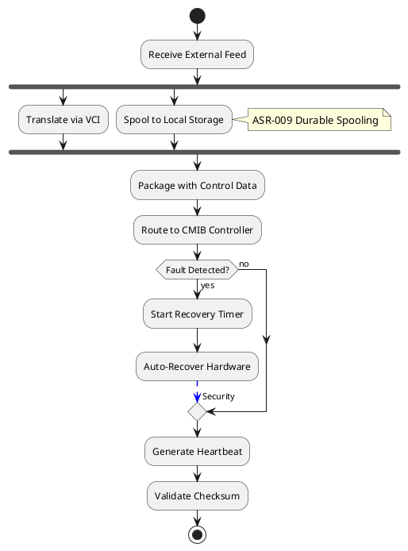

6. Sequence — Process View: Sequence Diagram  
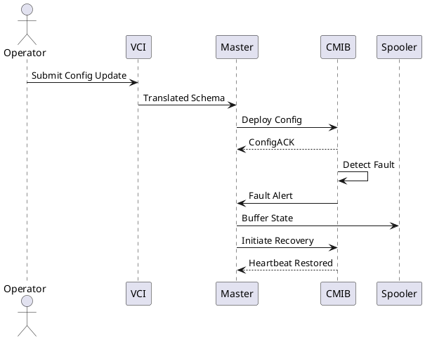

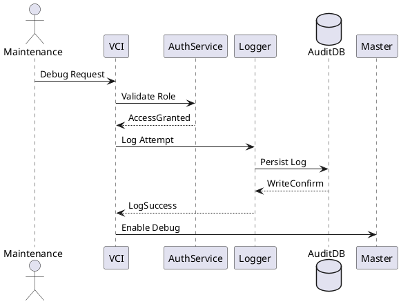

7. Collaboration — Process View: Collaboration Diagram  
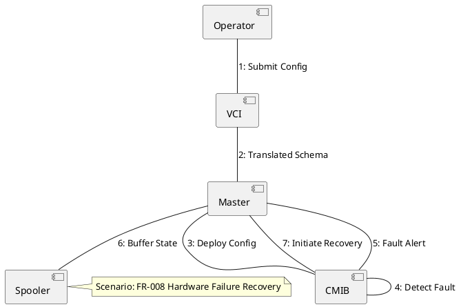

## DevelopmentView
8. Package — Development View: Package Diagram  
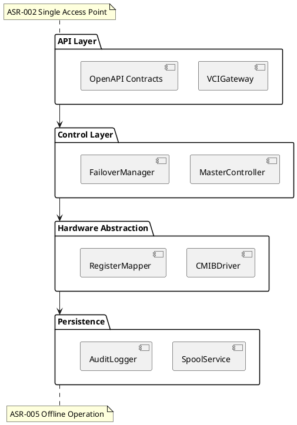

9. Component — Development View: Component Diagram  
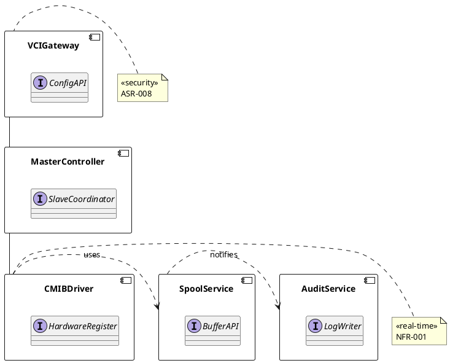

## PhysicalView
10. Deployment — Physical View: Deployment Diagram  
```plantuml
@startuml DeploymentDiagram
node "Master Network" {
  artifact PrimaryMaster : MasterController
  artifact SecondaryMaster : MasterController
  database StateDB
}
node "CMIB Cluster" {
  artifact CMIB1 : CMIBController
  artifact CMIB2 : CMIBController
}
node "Security Zone" {
  artifact VCI : VCIGateway
  artifact AuditVault : EncryptedStorage
}

PrimaryMaster -[hidden]-> SecondaryMaster : heartbeat
PrimaryMaster --> CMIB1 : 100Mbps Fiber
PrimaryMaster --> CMIB2 : 100Mbps Fiber
VCI --> PrimaryMaster : HTTPS
CMIB1 --> AuditVault : Syslog
note on link: ASR-004 Segregated Interfaces
@enduml
```

11. Container — Physical View: Container Diagram  
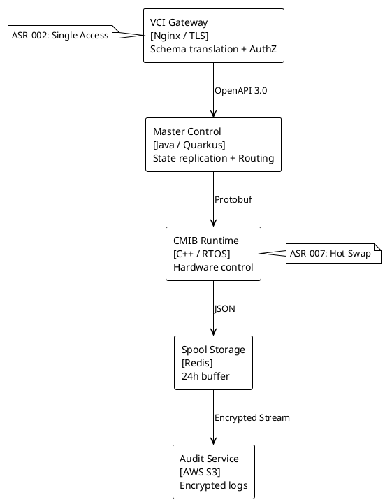