## ScenarioView
1. UseCase — Scenario View: Use Case Diagram
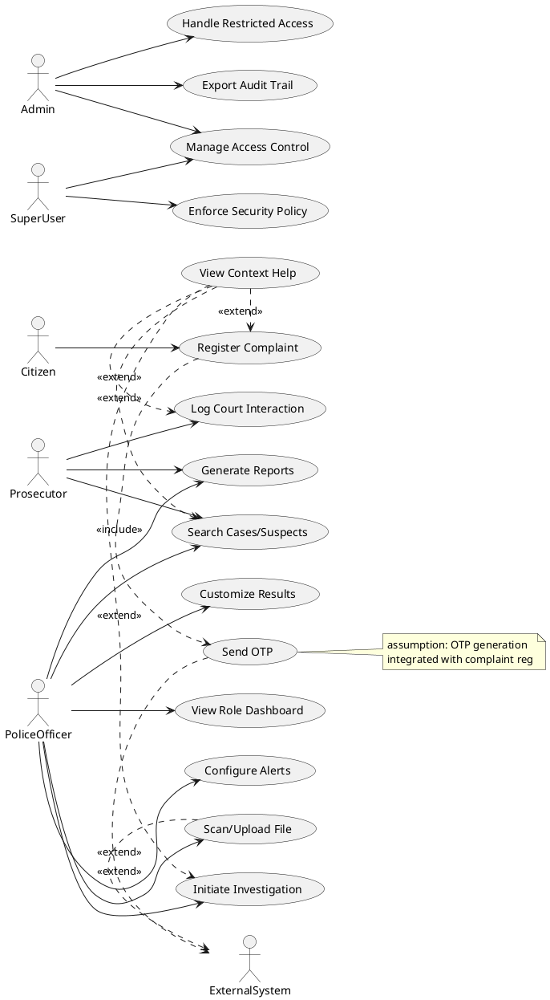

## LogicView
2. Class — Logic View: Class Diagram
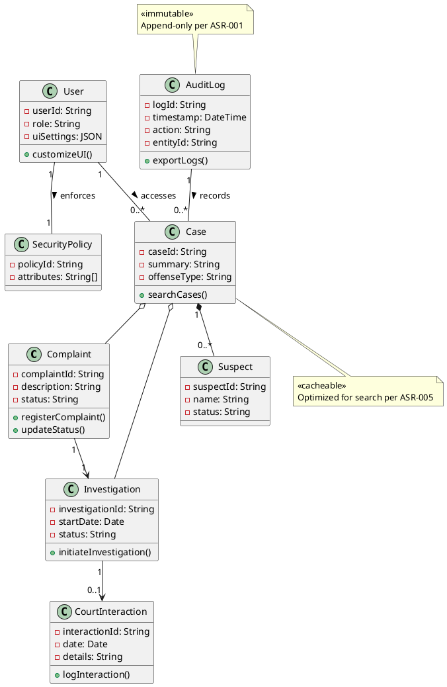

3. Object — Logic View: Object Diagram
```plantuml
@startuml ObjectDiagram
object citizen1 as "citizen1: Citizen" {
  name = "John Doe"
}
object complaint1 as "complaint1: Complaint [RegisterComplaint]" {
  complaintId = "CMP-1001"
  description = "Noise complaint"
  status = "Registered"
}
object case1 as "case1: Case" {
  caseId = "CASE-2023-001"
  summary = "Residential disturbance"
}
object audit1 as "audit1: AuditLog" {
  logId = "AUD-778"
  action = "CREATE"
}

citizen1 --> complaint1
complaint1 --> case1
case1 --> audit1

object officer1 as "officer1: PoliceOfficer [SearchCases]" {
  userId = "PO-887"
}
object searchResults as "results: Case[]" {
  case1 : CASE-2023-001
  case2 : CASE-2023-005
}
object suspect1 as "suspect1: Suspect" {
  name = "Mark Smith"
}

officer1 --> searchResults
searchResults --> case1
case1 --> suspect1
@enduml
```

4. State — Logic View: State Diagram
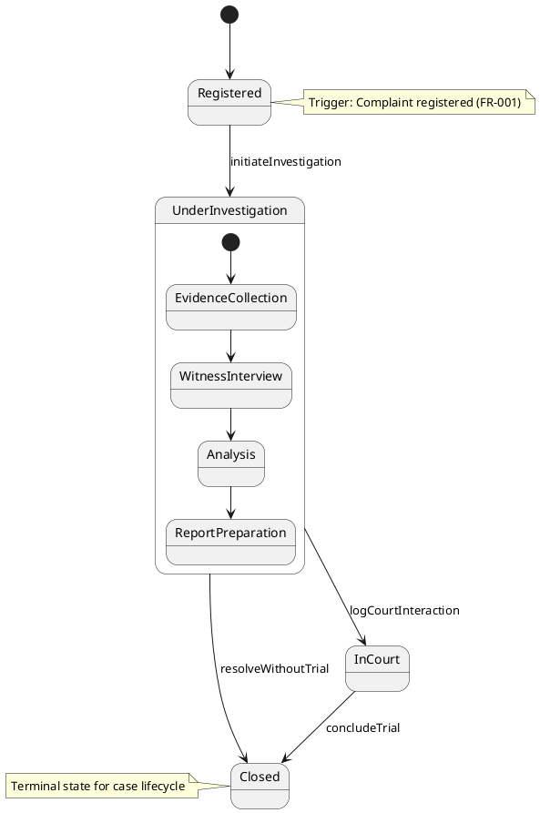

## ProcessView
5. Activity — Process View: Activity Diagram
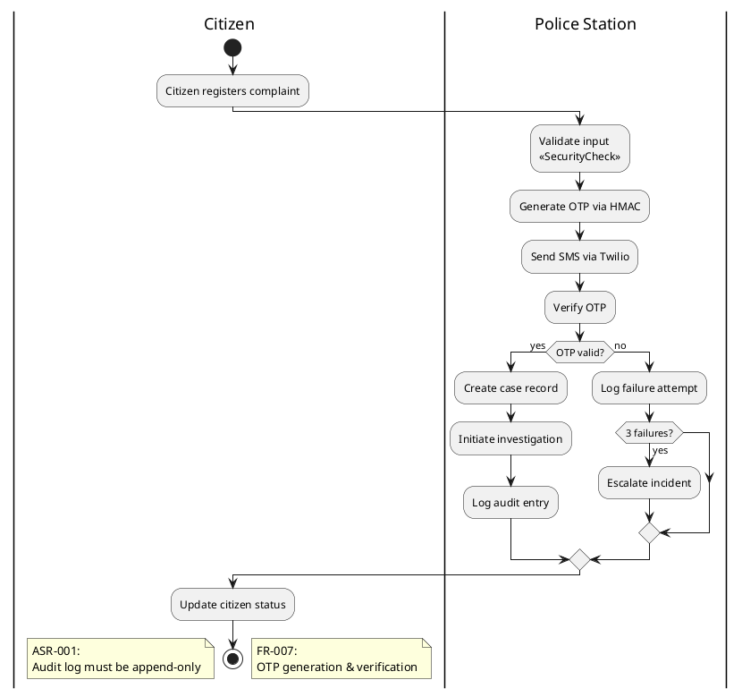

6. Sequence — Process View: Sequence Diagram 
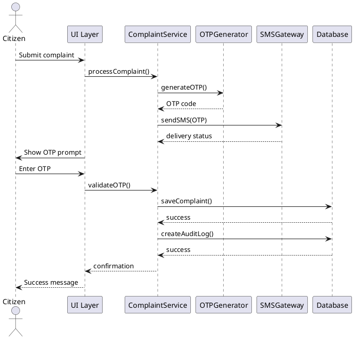

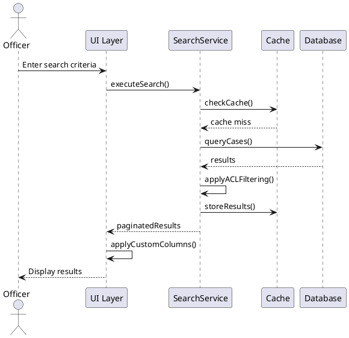

7. Collaboration — Process View: Collaboration Diagram
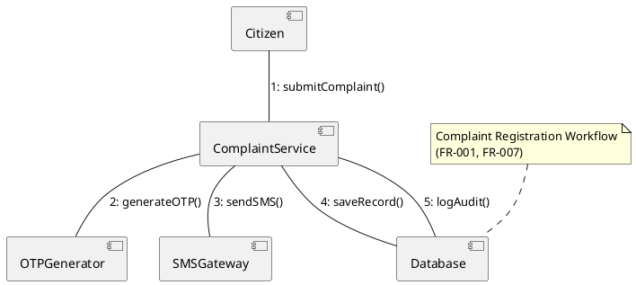

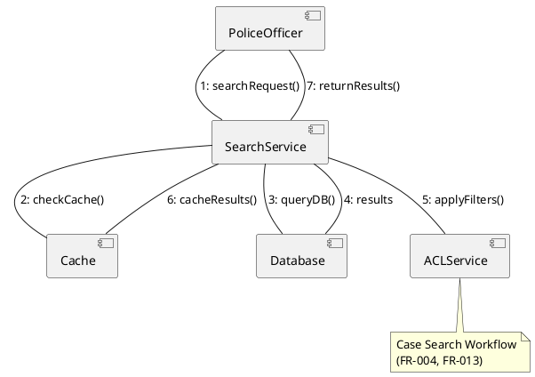

## DevelopmentView
8. Package — Development View: Package Diagram
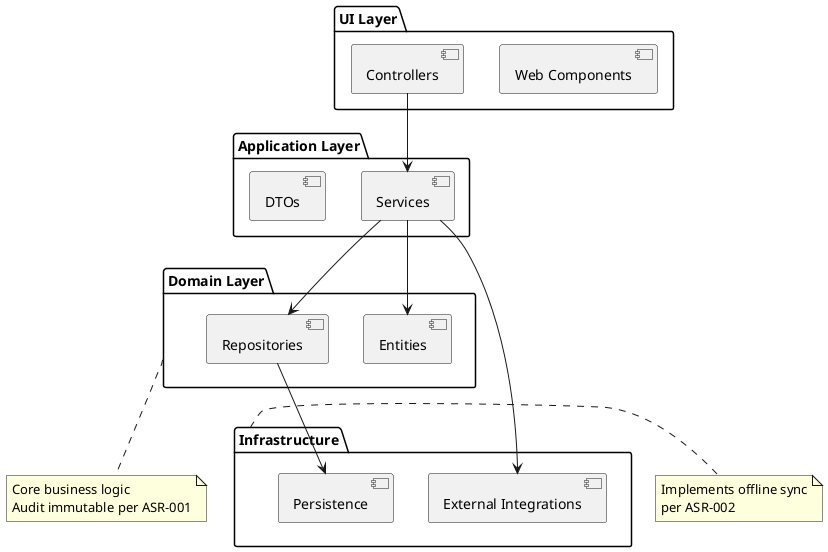

9. Component — Development View: Component Diagram
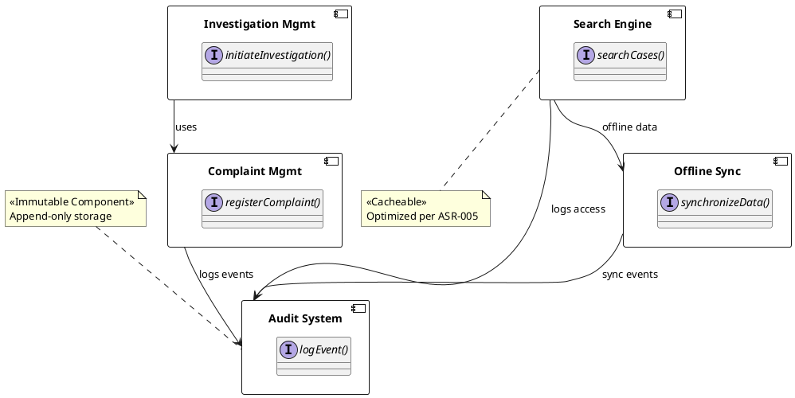

## PhysicalView
10. Deployment — Physical View: Deployment Diagram
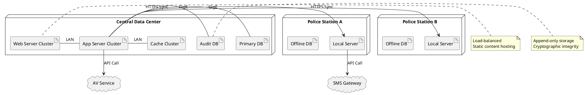

11. Container — Physical View: Container Diagram
```plantuml
@startuml ContainerDiagram
container "Web Browser" as WB {
  component "React UI"
}

container "API Gateway" as GW {
  component "NGINX"
}

container "Application Server" as APP {
  component "ComplaintService"
  component "SearchService"
  component "SyncService"
}

container "Database" as DB {
  component "PostgreSQL"
}

container "Audit Store" as AUDIT {
  component "ImmutableDB"
}

container "Cache" as CACHE {
  component "Redis"
}

container "Message Broker" as MSG {
  component "Kafka"
}

WB --> GW : HTTPS
GW --> APP : REST/JSON
APP --> DB : JDBC
APP --> AUDIT : gRPC
APP --> CACHE : Redis protocol
APP --> MSG : Events
MSG --> APP : Commands
SyncService --> APP : Sync API

note left of APP
  Stateless services
  Supports ASR-004
end note

note right of AUDIT
  WORM storage
  Hash-chained entries
end note
@enduml
```