## ScenarioView
1. UseCase — Scenario View: Use Case Diagram
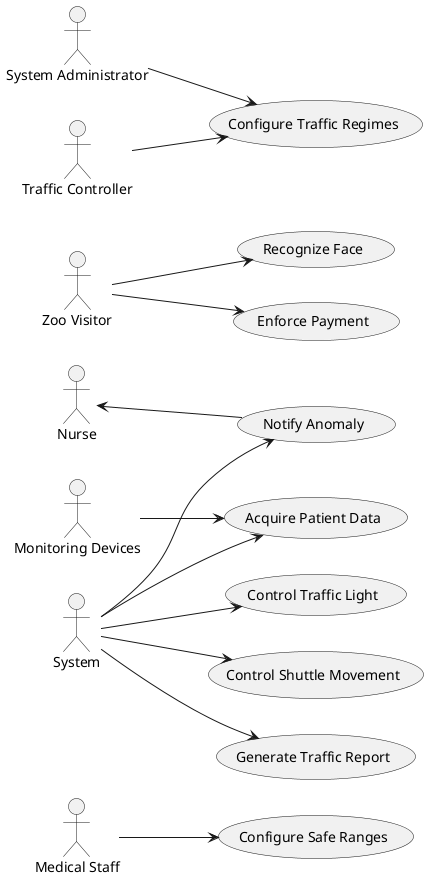

## LogicView
2. Class — Logic View: Class Diagram
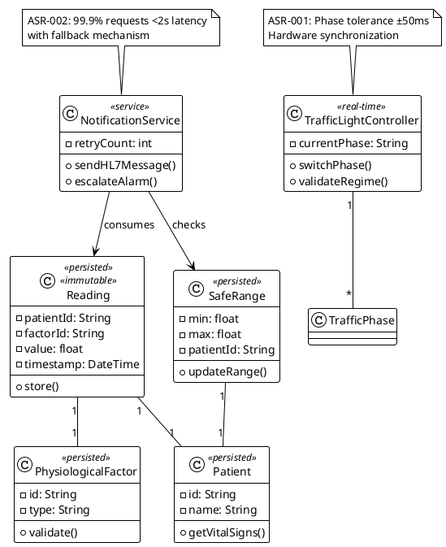

3. Object — Logic View: Object Diagram
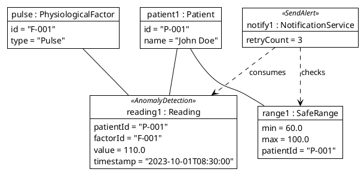

4. State — Logic View: State Diagram
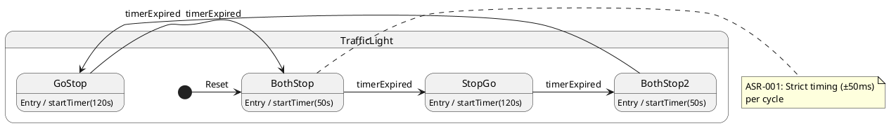

## ProcessView
5. Activity — Process View: Activity Diagram
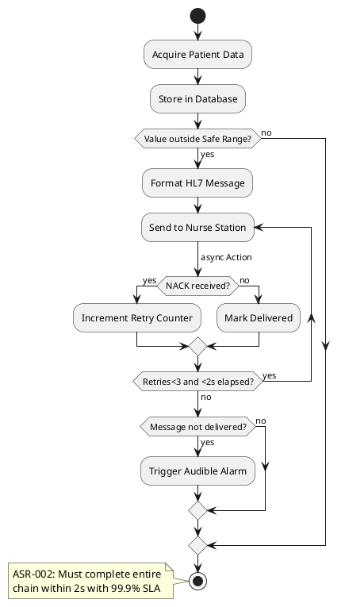

6. Sequence — Process View: Sequence Diagram 
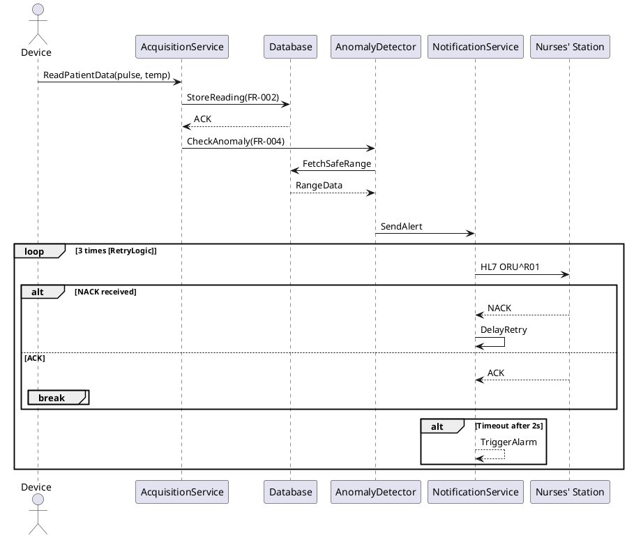

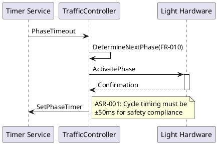

7. Collaboration — Process View: Collaboration Diagram
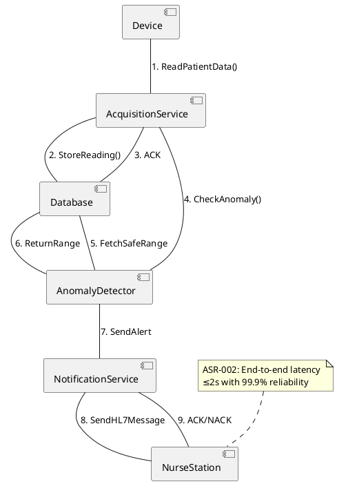

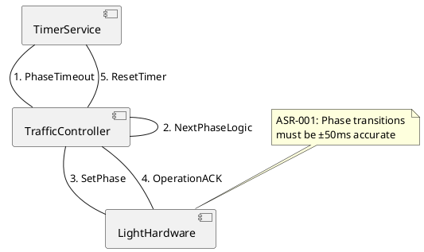

## DevelopmentView
8. Package — Development View: Package Diagram
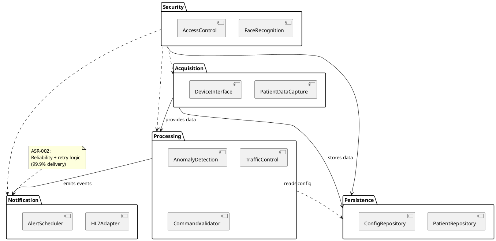

9. Component — Development View: Component Diagram
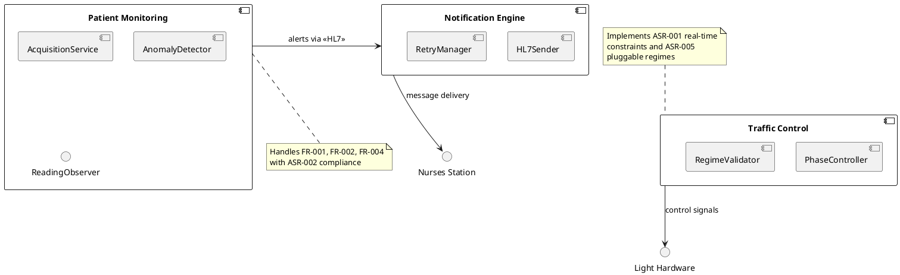

## PhysicalView
10. Deployment — Physical View: Deployment Diagram
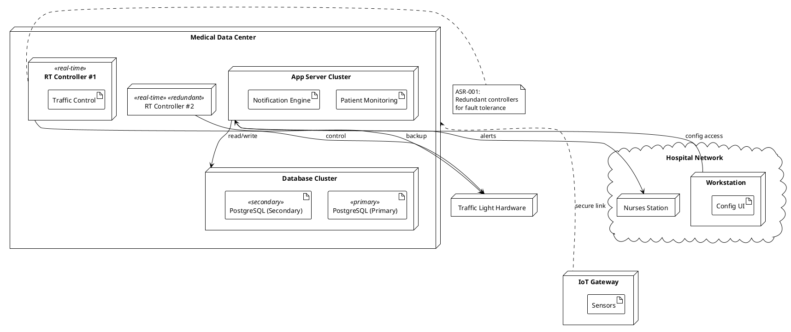

11. Container — Physical View: Container Diagram
```plantuml
@startuml ContainerDiagram

container "Web App Server" {
  component [Patient Monitoring] <<Spring Boot>>
  component [Notification Service] <<Quarkus>>
}

container "Database" {
  component [PostgreSQL] <<Database>>
}

container "RT Controller" {
  component [Traffic Control] <<C++>>
}

container "IoT Gateway" {
  component [Data Collector] <<Python>>
}

queue "MQTT Bus" as MQTT {
  [PatientReadings]
}

[Patient Monitoring] --> [PostgreSQL] : JDBC
[IoT Gateway] --> MQTT : publish
[Patient Monitoring] --> MQTT : subscribe
[Notification Service] -- [Nurses Station] : HL7 over TCP
[Traffic Control] -- [Light Hardware] : GPIO/CAN

note top of Notification Service
  NFR-002: Uses AES-256 encryption
  for sensitive data
  with 90d audit retention
end note

@enduml
```