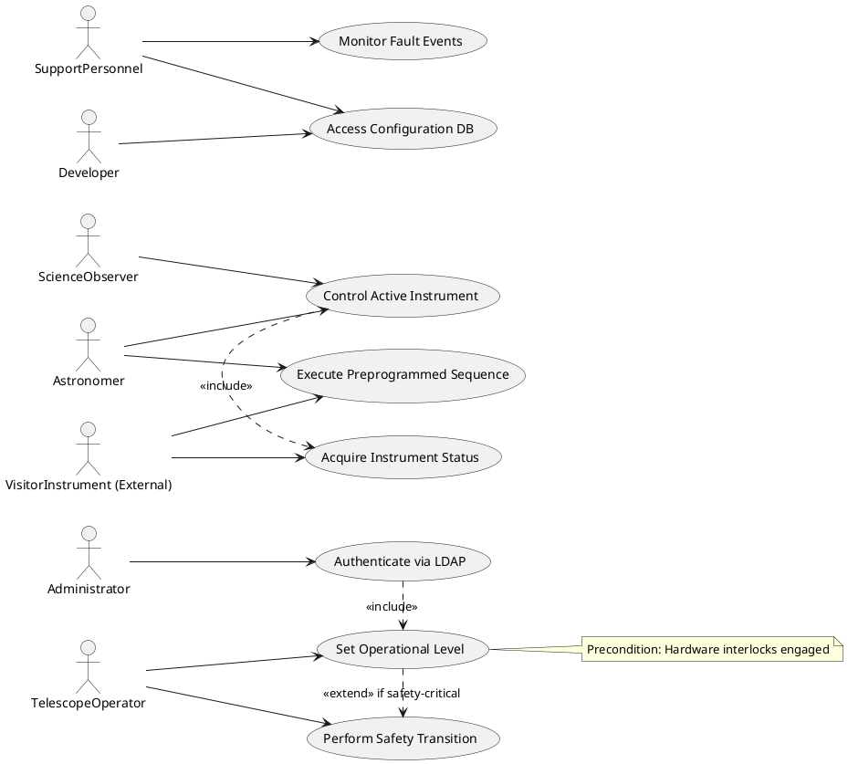
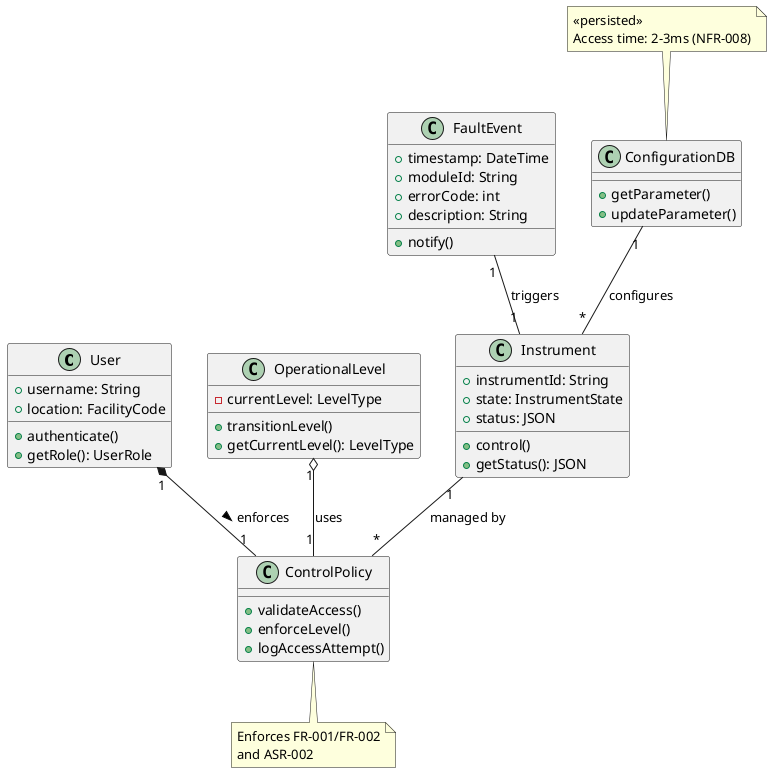
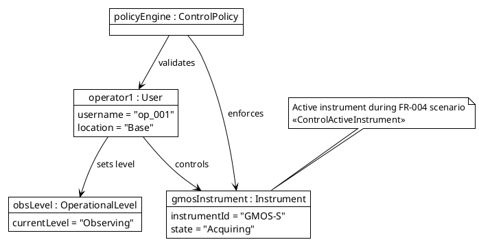
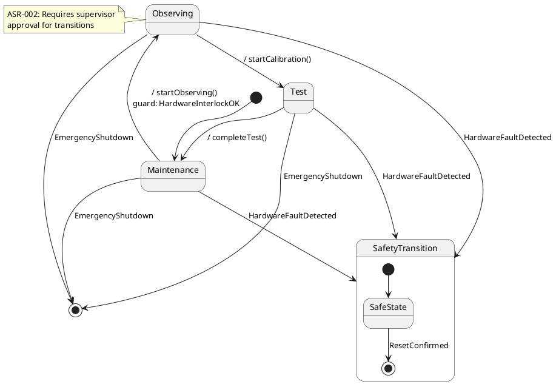
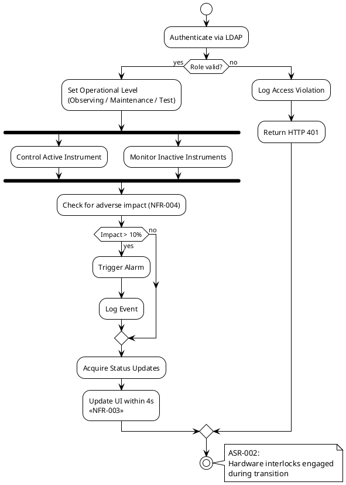
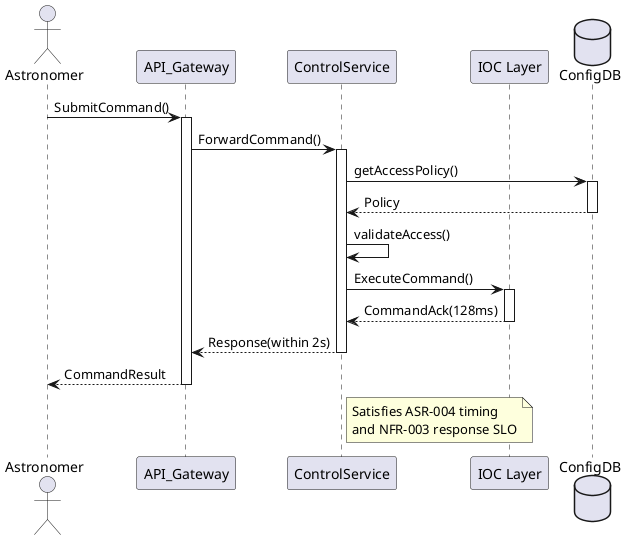
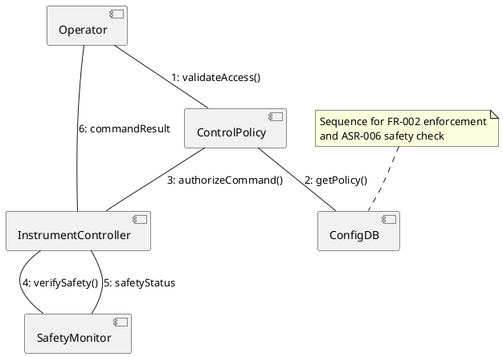
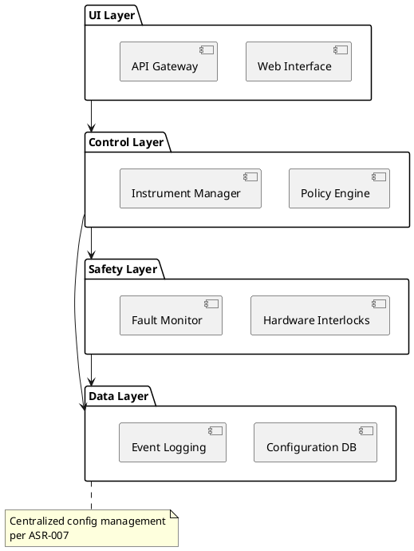
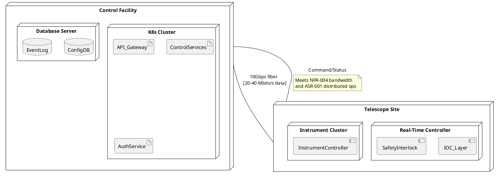

## Architecture Summary & Quality-Attribute Analysis

**Proposed Architecture**: A distributed layered architecture with microkernel pattern for operational control, combining:
- Real-time subsystem (IOC layer) for hardware control
- Centralized configuration management via EPICS-compatible database
- Microservices for user management/instrument control
- Event-driven fault handling
- API gateway for visitor instruments

**Quality Attribute Analysis**:
1. **Reliability** (ASR-005/006, NFR-006/007)
   - Tactic: Hardware interlocks + state persistence
   - Risk: Recovery time objective conflicts with safety transition timing
   - Trade-off: Redundancy vs hardware independence mandate

2. **Safety** (ASR-002/006)
   - Tactic: Hardware-enforced state machines
   - Risk: Software/hardware coordination latency
   - Tension: Atomic transitions vs logging overhead

3. **Performance** (ASR-004, NFR-001/003/008)
   - Tactic: Cyclic executives + caching
   - Risk: 128ms thruster cycle conflicts with 100 TPS control throughput
   - Trade-off: Data freshness vs caching depth

4. **Security** (FR-001, NFR-009)
   - Tactic: Mutual TLS + LDAP attribute mapping
   - Risk: Role mapping latency impacting command response SLO

5. **Scalability** (ASR-001, NFR-005)
   - Tactic: Location-based routing
   - Tension: Hierarchical communication vs parallel instrument ops

## Architectural Style & Rationale
**Hybrid Style**: Layered + Microkernel + Event-Driven  
- **Layered architecture** (ASR-007): Configuration DB layer supports maintainability  
- **Microkernel** (ASR-002/004): Central policy engine for operational levels/instrument control  
- **Event-driven** (NFR-006): Fault notification broker satisfies 10s SLO  
*Justification*:  
- Hardware control isolation (ASR-004/006) requires microkernel  
- Distributed operations (ASR-001) needs layered decoupling  
- Fault handling (NFR-006) mandates event bus  

## Architecture Patterns & Tactics
**Patterns**:  
1. **State Machine** (FR-002/ASR-002): Enforces operational levels  
2. **Broker** (NFR-006): Routes fault events  
3. **CQRS** (NFR-003): Separates command/status paths  

**Tactics**:  
- **Hardware Interlocks** (ASR-006): Dedicated safety subsystem  
- **Cyclic Executive** (ASR-004): Time-triggered scheduler  
- **LDAP Attribute Caching** (FR-001): Pre-fetched role mapping  
- **Deadlock Monitor** (ASR-003): Nightly conflict scanner  

---

## ScenarioView
1. UseCase — Scenario View: Use Case Diagram


## LogicView
2. Class — Logic View: Class Diagram


3. Object — Logic View: Object Diagram


4. State — Logic View: State Diagram


## ProcessView
5. Activity — Process View: Activity Diagram


6. Sequence — Process View: Sequence Diagram 


7. Collaboration — Process View: Collaboration Diagram


## DevelopmentView
8. Package — Development View: Package Diagram


9. Component — Development View: Component Diagram
```plantuml
@startuml ComponentDiagram
component "AuthService" as AS [
  LDAP integration
  Role mapping
]

component "PolicyEngine" as PE [
  Operational level enforcement
  Access validation
]

component "InstrumentController" as IC [
  Multi-instrument coordination
  Status aggregation
]

component "FaultHandler" as FH [
  Event notification
  Log formatting
]

AS -- PE : provides auth
PE -- IC : controls access
IC -- FH : reports faults

PE -[dashed]-> "ConfigurationDB" : reads policies
FH -[dashed]-> "EventLog" : writes entries

note top of FH
  Implements NFR-006
  fault notification SLO
end note
@enduml
```

## PhysicalView
10. Deployment — Physical View: Deployment Diagram


11. Container — Physical View: Container Diagram
```plantuml
@startuml ContainerDiagram
node "Control Node" {
  container "Web UI" as UI {
    Component ReactApp
  }
  container "API Gateway" as GW {
    Component NGINX
  }
  container "Control Service" as CS {
    Component PolicyEngine
    Component InstrumentManager
  }
  container "Database" as DB {
    Component PostgreSQL
  }
}

node "Monitoring Node" {
  container "Fault Processor" as FP {
    Component LogAggregator
    Component AlertManager
  }
}

UI --> GW : HTTPS
GW --> CS : gRPC
CS --> DB : SQL
CS --> FP : Kafka
FP --> DB : Writes

note left of DB
  ConfigurationDB with
  2-3ms access (NFR-008)
end note
@enduml
```