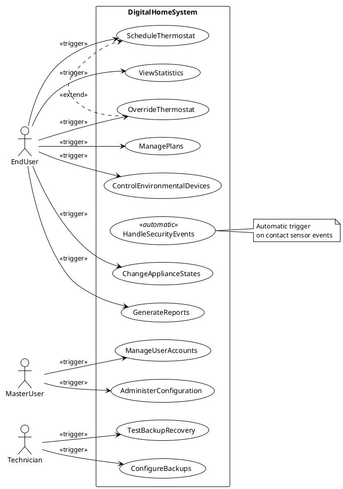
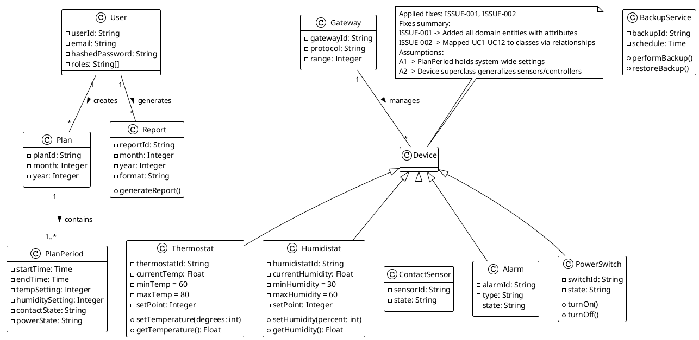
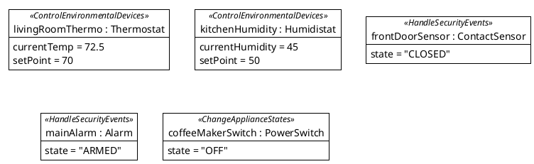
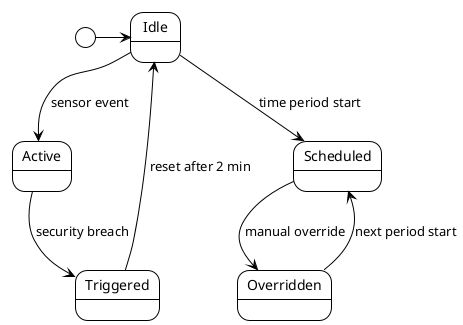
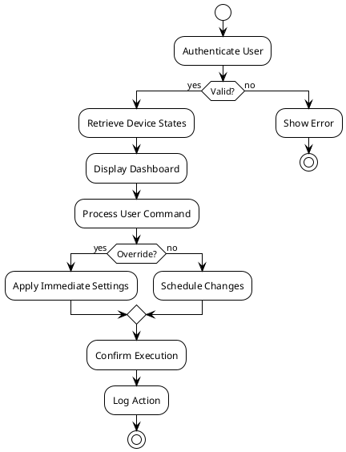
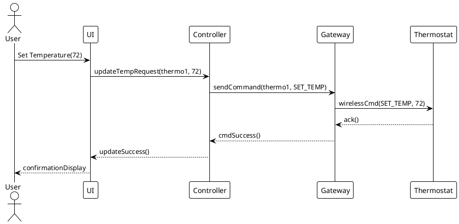
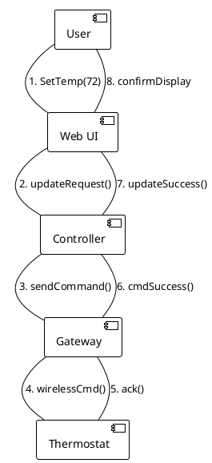
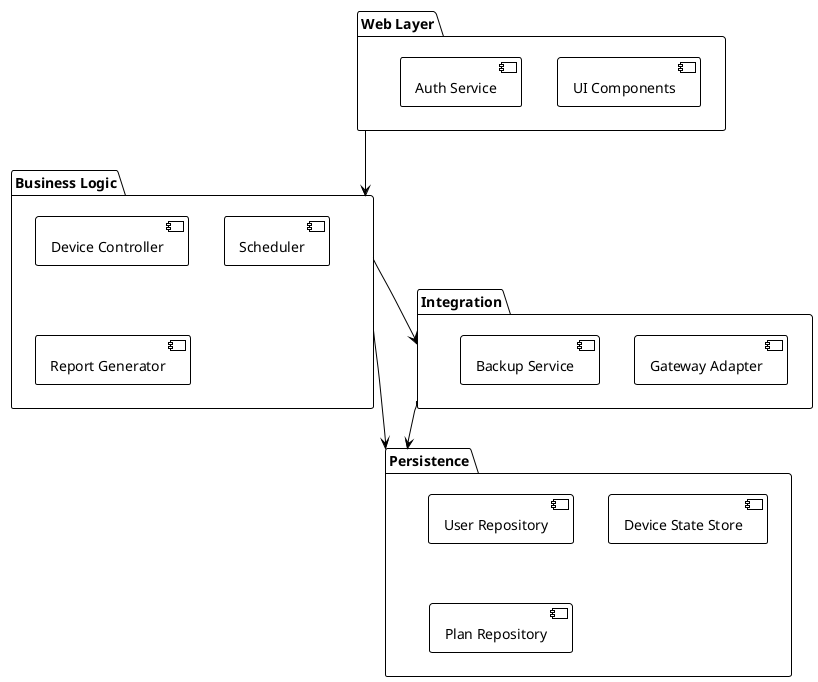
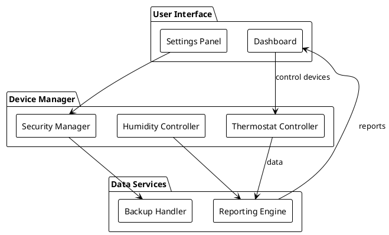
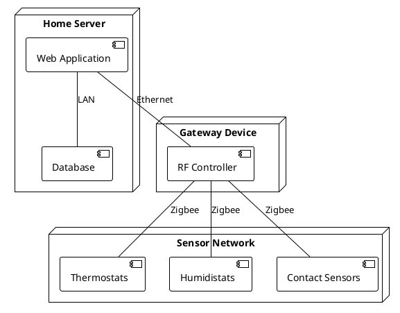

Based on the evaluator feedback, I'll address the critical issues in the Class Diagram while maintaining strict copy compliance for other diagrams. Here are the corrections:

## ScenarioView
1. UseCase — Scenario View: Use Case Diagram


## LogicView
2. Class — Logic View: Class Diagram


3. Object — Logic View: Object Diagram


4. State — Logic View: State Diagram


## ProcessView
5. Activity — Process View: Activity Diagram


6. Sequence — Process View: Sequence Diagram 


7. Collaboration — Process View: Collaboration Diagram


## DevelopmentView
8. Package — Development View: Package Diagram


9. Component — Development View: Component Diagram


## PhysicalView
10. Deployment — Physical View: Deployment Diagram


11. Container — Physical View: Container Diagram
```plantuml
@startuml Container
!theme plain
skinparam defaultFontName Arial

container "Web Browser" as WB {
  component "React UI"
}

container "Home Server" as HS {
  component "Spring Boot App"
  component "PostgreSQL"
}

container "Gateway" as GW {
  component "Zigbee Controller"
}

WB --> HS : HTTP/HTTPS
HS --> GW : TCP
GW --> HS : MQTT
@enduml
```