### Architecture Summary & Quality-Attribute Analysis  
**Proposed Architecture**: A **layered event-driven architecture** with **CQRS patterns** for real-time control systems, leveraging **microservices** for critical components (authentication, safety validation, command routing). The system uses hierarchical command routing (TSU > FCU > DCU), atomic rollback for safety interlocks, and dual-admin workflows for security-critical operations.  

**Quality Attributes & Trade-offs**:  
1. **Reliability/Availability** (ASR-001, NFR-001):  
   - *Tactic*: Active-active redundancy with automated failover.  
   - *Risk*: Failover latency (<10min) conflicts with lock TTL constraints (ASR-003).  
2. **Security** (NFR-002, NFR-005, ASR-002):  
   - *Tactic*: SHA-256 enforcement + dual-auth overrides.  
   - *Trade-off*: Cryptographic overhead increases latency (vs. NFR-004).  
3. **Performance** (NFR-003, NFR-004):  
   - *Tactic*: Degraded-mode throttling + event-sourcing.  
   - *Tension*: Real-time latency (≤2s) vs. overload degradation.  
4. **Safety** (ASR-003, ASR-004):  
   - *Tactic*: Atomic rollback + time-synchronized locks.  
   - *Risk*: Clock drift (>150ms) triggers false alerts.  
5. **Maintainability** (FR-008, FR-009):  
   - *Tactic*: Versioned configuration schemas + audit logs.  

**Architectural Styles**:  
- **Event-Driven + CQRS**: Separates command execution (FR-006) from real-time status queries (FR-003).  
- **Layered Microservices**: Isolates security-critical components (Auth, Safety) for ASR-002 compliance.  
- **Hybrid Rationale**: CQRS handles write/read segregation for device overrides (FR-004) and status displays; microservices enable dual-admin workflows (FR-008) without monolithic bottlenecks.  

### Patterns & Tactics  
1. **Patterns**:  
   - **Broker** (Event bus for device monitoring FR-010)  
   - **Circuit Breaker** (Degraded mode per NFR-003)  
   - **Repository** (ConfigChangeLog for FR-008)  
   - **Strategy** (SafetyRule validation FR-005)  
2. **Tactics**:  
   - Replication (NFR-001): Service replicas for FCU/DCU controllers.  
   - Caching (NFR-004): Device status snapshots.  
   - Authentication (NFR-005): SHA-256 migration with lockout.  
   - Atomic Rollback (ASR-004): Compensating transactions.  

---

## ScenarioView  
1. UseCase — Scenario View: Use Case Diagram  
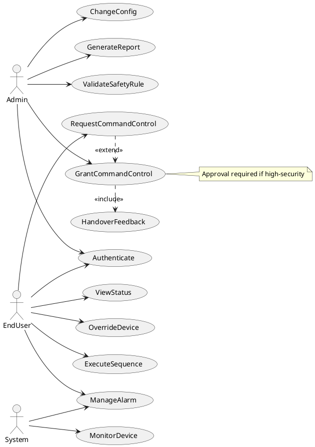

## LogicView  
2. Class — Logic View: Class Diagram  
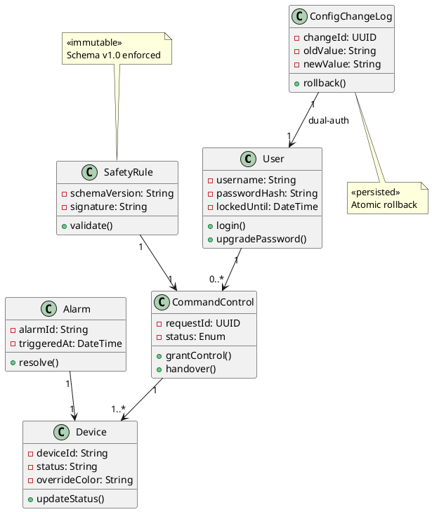

3. Object — Logic View: Object Diagram  
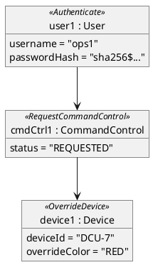

4. State — Logic View: State Diagram  
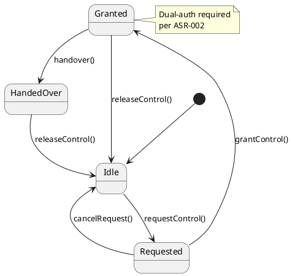

## ProcessView  
5. Activity — Process View: Activity Diagram  
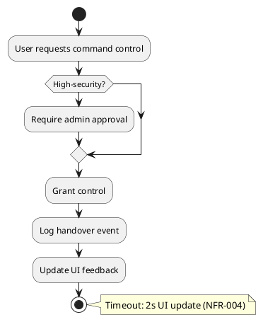

6. Sequence — Process View: Sequence Diagram  
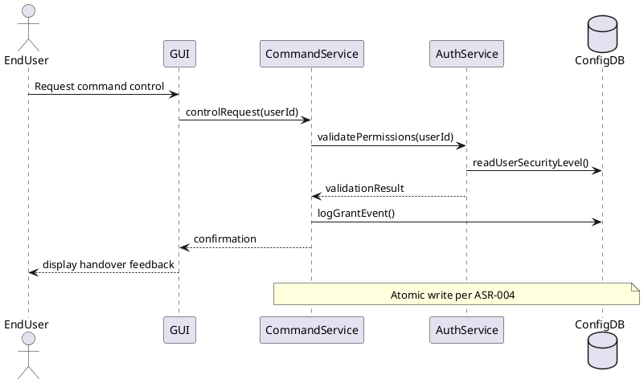

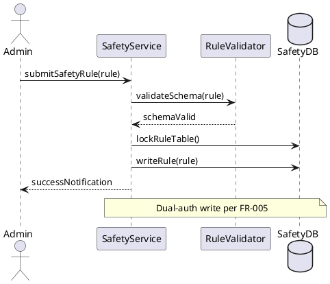

7. Collaboration — Process View: Collaboration Diagram  
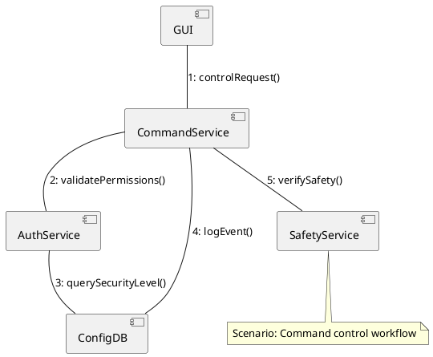

## DevelopmentView  
8. Package — Development View: Package Diagram  
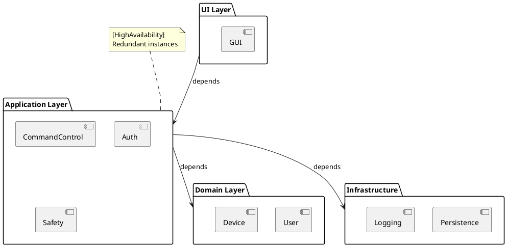

9. Component — Development View: Component Diagram  
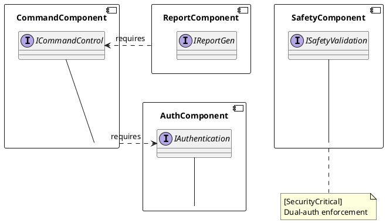

## PhysicalView  
10. Deployment — Physical View: Deployment Diagram  
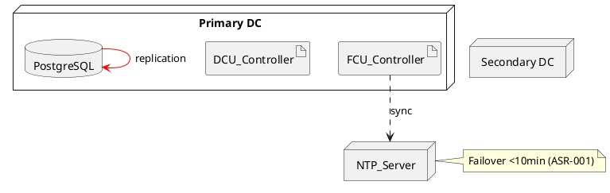

11. Container — Physical View: Container Diagram  
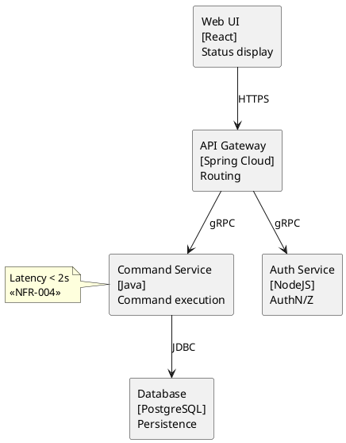