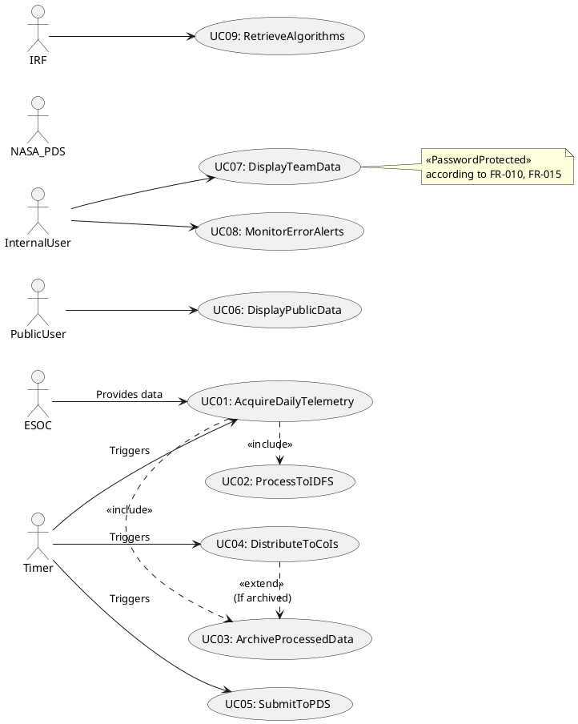
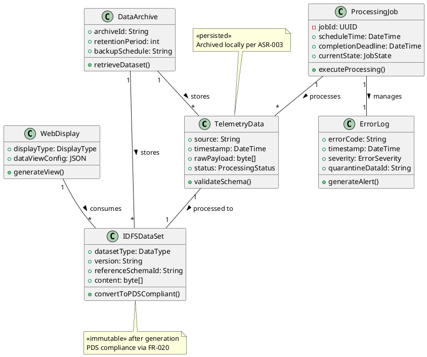
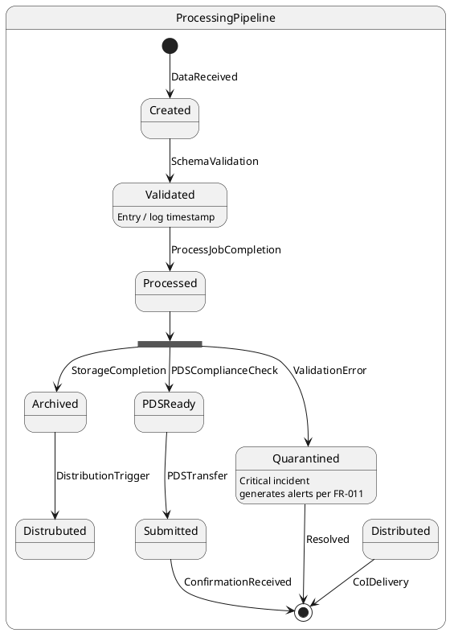
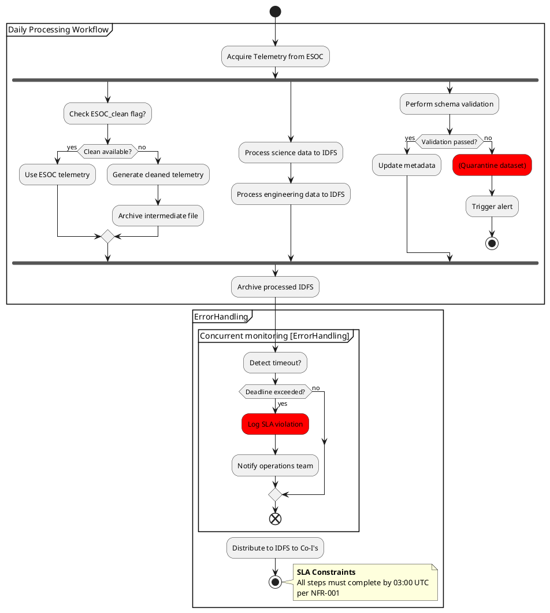
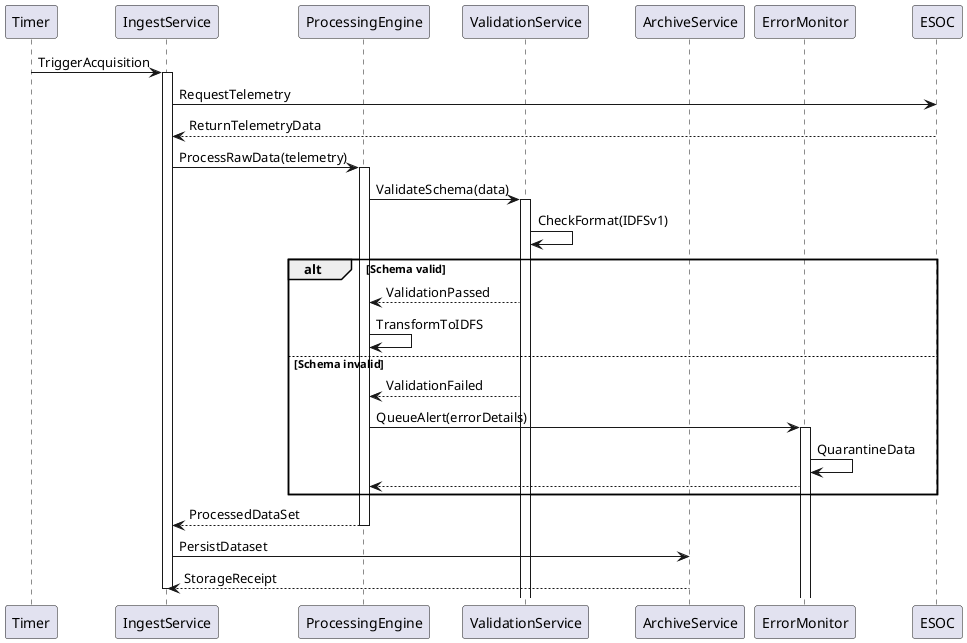
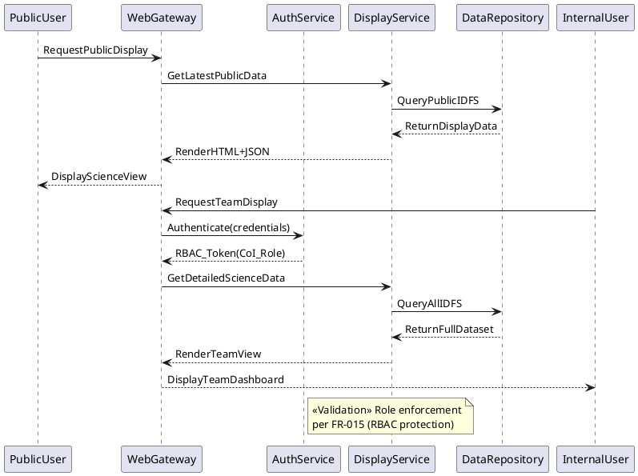
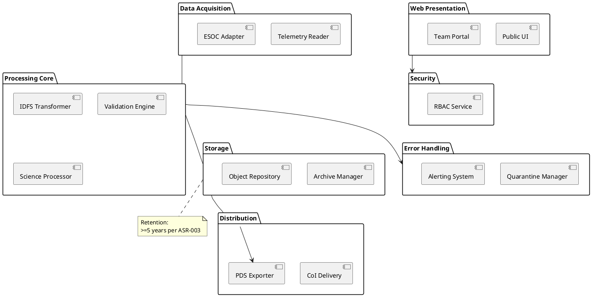

## ScenarioView
1. UseCase — Scenario View: Use Case Diagram


## LogicView
2. Class — Logic View: Class Diagram


3. Object — Logic View: Object Diagram
```plantuml
@startuml ObjectDiagram
object telemetry_20231005 as "telemetry_20231005 : TelemetryData" 
telemetry_20231005 : source = "ESOC"
telemetry_20231005 : status = RAW

object science_dataset_001 as "science_dataset_001 : IDFSDataSet"
science_dataset_001 : datasetType = SCIENCE
science_dataset_001 : version = "1.2.0"

object job_4421 as "job_4421 : ProcessingJob"
job_4421 : currentState = RUNNING

object cleaning_job as "cleaning_job : ProcessingJob" 
cleaning_job : scheduleTime = 2023-10-05T01:00Z

telemetry_20231005 --> science_dataset_001 : becomes
job_4421 --> telemetry_20231005 : processes
cleaning_job --> job_4421 : precedes
@enduml
```

4. State — Logic View: State Diagram


## ProcessView
5. Activity — Process View: Activity Diagram


6. Sequence — Process View: Sequence Diagram 




7. Collaboration — Process View: Collaboration Diagram
```plantuml
@startuml CollaborationDiagram
component Timer
component ProcessingService
component ValidationService
component ESOC
component ArchiveSystem
component CoIAccessPoint

Timer::1.Calls ---> ProcessingService:: : T+00:00
ProcessingService::2.RequestData ---> ESOC:: : T+00:05
ESOC::3.Provides --> ProcessingService:: : T+00:10
ProcessingService::4.Validates --> ValidationService:: : T+00:15
ValidationService::5.Confirms --> ProcessingService:: : T+00:20
ProcessingService::6.Archives --> ArchiveSystem:: : T+00:45
ArchiveSystem::7.Confirms --> ProcessingService:: : T+01:00
ProcessingService::8.Notifies ---> CoIAccessPoint:: : T+01:05

note top
  Critical path timeline follows
  NFR-001 deadline constraints
end note
@enduml
```

## DevelopmentView
8. Package — Development View: Package Diagram


9. Component — Development View: Component Diagram
```plantuml
@startuml

skinparam componentStyle rectangle

' ===== Components =====
component DataIngestion <<Async>>

component IDFSProcessor <<Transactional>>

component ArchiveManagement <<Persistent>>

component DistributionHub <<Scheduled>>

component WebPresentation <<REST>>

component SecurityPackage <<SharedUtility>>

component "ErrorFramework <<Crosscutting>>

' ===== Interfaces =====
interface ischema
interface ipds

' ===== Relationships =====
DataIngestion --> IDFSProcessor : RawTelemetry
IDFSProcessor --> ischema : validates
IDFSProcessor --> ArchiveManagement : VerifiedIDFS
ArchiveManagement --> DistributionHub : ArchivedData
DistributionHub --> ipds : PDSSubmission
WebPresentation -- ArchiveManagement : QueryMetadata
SecurityPackage -- WebPresentation : enforceRBAC

' ===== Error Handling =====
ErrorFramework ..> DataIngestion : Listens for failures
ErrorFramework ..> IDFSProcessor : Schema fails
ErrorFramework ..> ArchiveManagement : Storage alerts

@enduml
```

## PhysicalView
10. Deployment — Physical View: Deployment Diagram
```plantuml
@startuml DeploymentDiagram
node "Primary Data Center" {
  node "Linux Cluster" {
    artifact BatchProcessingServer_1 as batch1 
    artifact BatchProcessingServer_2 as batch2
    database ArchiveStorage_1 as db1
    database ArchiveStorage_2 as db2
  }
  
  artifact RESTGateway_1 as web1 
  artifact RESTGateway_2 as web2
}

node "ESOC Data Source" {
  artifact ExternalFeedProxy 
}

node "Co-I Access Zone" {
  fleet CoI_DeliveryNode [5]
}

cloud "NASA PDS Registry" {
  component PDSApiGateway
}

BatchProcessingServer_1 -[#blue] DB_LAN--> db1 : 10GbE
batch2 -[#blue] DB_LAN--> db2 : 10GbE
web1 -[#red] SAN--> db1 : iSCSI
web2 -[#red] SAN--> db2 : iSCSI
ExternalFeedProxy -[#green] Internet--> BatchProcessingServer_1 : SFTP
ExternalFeedProxy -[#green] Internet--> batch2
CoI_DeliveryNode -[#blue] Intranet- BatchProcessingServer_1
BatchProcessingServer_1 -[#orange] TLS--> PDSApiGateway

note right of BatchProcessingServer_1
  **Redundancy:** Active/Active config
  **Performance:** SLA 03:00 UTC daily
end note
@enduml
```

11. Container — Physical View: Container Diagram
```plantuml
@startuml ContainerDiagram
node "Virtualized Environment" {
  container RestGateway [
    RESTful Gateway
    - Nginx reverse proxy
    - API routing rules
  ] <<K8s Pod>>

  container BatchProcessing [
    Data Pipeline Controller
    - Apache Airflow
    - Job scheduling
  ] <<Job Scheduler>>

  container ProcessingWorker [
    Transform Worker
    - Python + C extensions
    - Memory: 16GB
  ] <<K8s Deployment>> {
    component ScienceProcessor
    component DataValidator
  }

  database ObjectStorage [
    MinIO Cluster
    - Binary object store
    - S3-compatible
  ] <<Replicated Storage>>

  container Messaging [
    Kafka Cluster
    - Error alerts stream
    "partitions=6"
  ] <<Message Broker>>

  container PDSExporter [
    PDS Submission Agent
    - Crontab schedule
    - On-prem service
  ]

  container AuditDashboard [
    Security Monitor
    - Kibana dashboard
    - Audit log analysis
  ]

  ProcessingWorker - ObjectStorage: Writes datasets
  BatchProcessing --> ProcessingWorker: Controls jobs
  ProcessingWorker -> Messaging: Reports failures
  RestGateway - ObjectStorage: Retrieves data
  PDSExporter - ObjectStorage: Exports datasets
  AuditDashboard - Messaging: Consumes error logs

  note right of ObjectStorage
    **Scalability:** MinIO cluster expands to PB
    **Guarantees:** Data versioning + encryption
    per ASR-003
  end note
}
@enduml
```