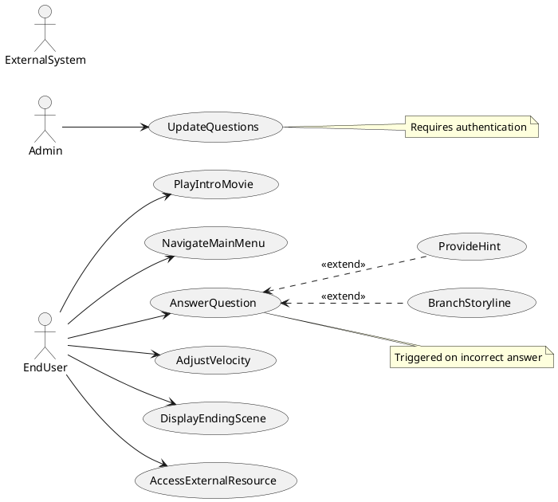
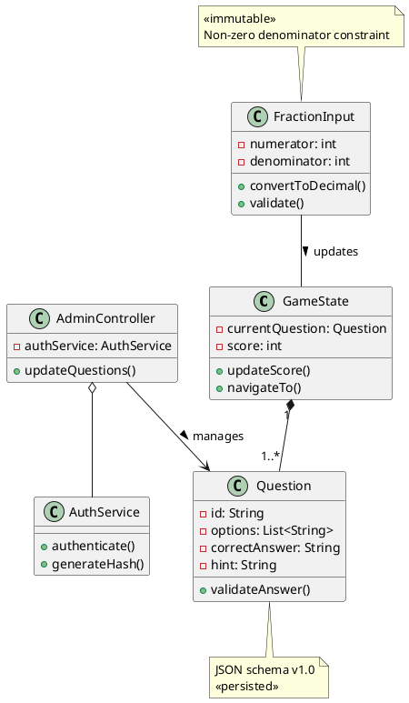
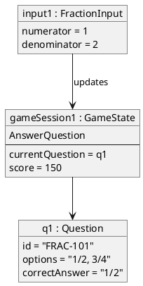
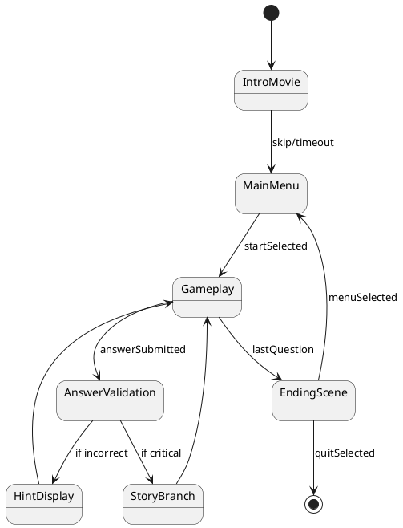
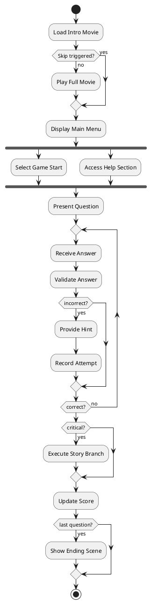
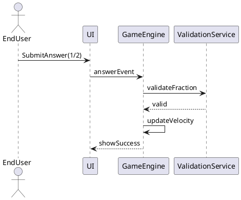
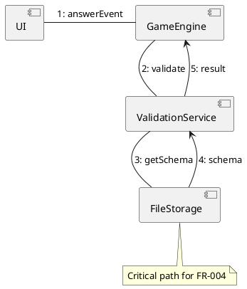
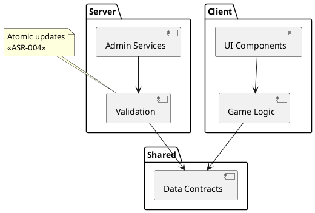
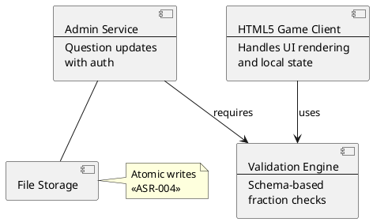
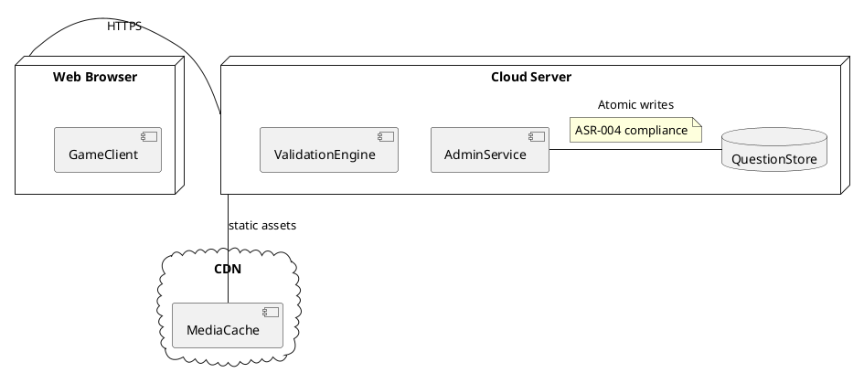

## Architecture Summary & Quality-Attribute Analysis
**Proposed Architecture:**  
A layered web application with HTML5 client (SPA), stateless backend services, and atomic file-based persistence. Client-side handles game flow/UI while server manages admin functions. Adheres to HTML5 standards (ASR-001) with strict accessibility (ASR-005) and security controls (ASR-007).

**Key Quality Attributes:**  
1. **Usability** (NFR-001/ASR-005):  
   - Risk: Overly complex UI hinders sixth-grade usability  
   - Tactic: Simplified navigation flows + WCAG 2.1 AA compliance  
2. **Security** (NFR-003/ASR-007):  
   - Trade-off: Strong auth (bcrypt-12/TLS 1.2+) increases latency  
   - Tactic: Isolated admin subsystem with audit logging  
3. **Performance** (NFR-002):  
   - Risk: Heavy media assets impact load times  
   - Tactic: CDN caching + connection-aware streaming  
4. **Availability** (NFR-004/NFR-005):  
   - Tension: Global availability vs cost constraints  
   - Tactic: Multi-region deployment + synthetic monitoring  
5. **Maintainability** (NFR-006):  
   - Risk: JSON schema evolution breaks validation  
   - Tactic: Contract-first question updates (ASR-004)  

**Architectural Style:**  
**Layered Architecture with Hexagonal Ports/Adapters**  
- Client Layer (HTML5 SPA): Implements presentation logic  
- Application Layer: Game flow controllers + validation services  
- Infrastructure Layer: File I/O adapters + security components  
*Justification:* Aligns with web deployment (ASR-002), enables testability (NFR-006), and isolates atomic file operations (ASR-004) via adapters. Supports stateless concurrency (NFR-007).

---

## Architectural Patterns & Tactics
**Patterns:**  
1. **Front Controller (Client):** Centralizes input handling for keyboard/mouse (FR-001/FR-002)  
2. **Strategy (Validation):** Interchangeable validators for fractions (FR-004) vs questions (FR-006)  
3. **Observer (UI):** Decouples storyline branching (FR-003c) from question logic  
4. **Repository (Server):** Abstracts atomic file operations (ASR-004)  

**Tactics:**  
- **Security:** TLS termination proxies (NFR-003) + bcrypt hashing adapters (ASR-007)  
- **Reliability:** Atomic file writes via temp/rename (ASR-004)  
- **Performance:** Browser-side caching of questions (NFR-002)  
- **Accessibility:** ARIA label generators (ASR-005)  

---

## PlantUML Diagrams

### ScenarioView
1. UseCase — Scenario View: Use Case Diagram


### LogicView
2. Class — Logic View: Class Diagram


3. Object — Logic View: Object Diagram


4. State — Logic View: State Diagram


### ProcessView
5. Activity — Process View: Activity Diagram


6. Sequence — Process View: Sequence Diagram 


7. Collaboration — Process View: Collaboration Diagram


### DevelopmentView
8. Package — Development View: Package Diagram


9. Component — Development View: Component Diagram


### PhysicalView
10. Deployment — Physical View: Deployment Diagram


11. Container — Physical View: Container Diagram
```plantuml
@startuml Container
container "Browser SPA" as SPA {
  component GameEngine
  component LocalStorage
}

container "Web Server" as WS {
  component AdminAPI
  component AuthService
}

container "File System" as FS {
  component QuestionRepository
}

database "AuditLog" as AL

SPA --> WS : REST/HTTPS
WS --> FS : File I/O
WS --> AL : Write logs
note on link : TLS 1.2+\n«NFR-003»
@enduml
```