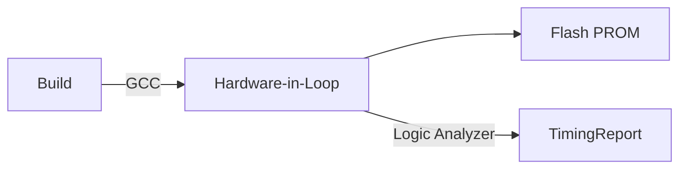

### Analysis Plan  
1. **Scope**: Design deterministic cyclic-executive architecture with timing/state verifiability for satellite sun acquisition.  
2. **Approach**: Layered pattern (HAL/Control/Actuators) + explicit state-machines + versioned contracts to meet ASR-001/002/003.  
3. **Validation**: WCET profiling; hardware-in-loop timing validation; Model-check mode transitions.  

---

### A. Executive Summary  
The Sun Search Control System (SSCS) is a hard real-time embedded system for spacecraft attitude control using gyroscopes/sun sensors and thrusters. Implemented on an 80C32E MCU (11.0592MHz, 32KB PROM/8KB SRAM) with single 32ms interrupt. Key PlantUML references:  
- **DeploymentDiagram**: Satellite Computer→Gyroscope/Thrusters  
- **ActivityDiagram**: 160ms cycle → Thruster @128ms±1ms  
- **StateDiagram**: RDSM→PASM→RASM→CSM transitions  

**Architecture Style**: Layered (HAL/Logic/Actuation) + State Pattern for modes.  
**Deployment Topology**: Single-node satellite computer → sensors via RS-422/ADC.  

**Top Design Risks & Mitigations**  
| Risk | Mitigation |  
|------|------------|  
| WCET breach on 11MHz CPU | Pre-silicon cycle-accurate simulation |  
| SRAM overflow (8KB limit) | Static allocation + PROGMEM tables |  
| Serial protocol jitter | Logic analyzer acceptance tests |  

**Key QA Coverage**  
| Attribute | ASR/NFR ID | Test Type |  
|-----------|------------|-----------|  
| Performance | ASR-001/NFR-002 | Timing analysis (±1ms @128ms) |  
| Reliability | ASR-003/NFR-003 | Fault injection (gyro/sensor failover) |  
| Maintainability | ASR-002/004 | Schema change impact analysis |  

---

### B. Traceability & Rationale  
| Req ID | Short Text | Diagram (Title:Element) | Component | Artifact | Rationale |  
|--------|------------|--------------------------|-----------|----------|-----------|  
| FR-001 | Receive ground commands | `UseCaseDiagram:uc1`, `SequenceDiagram:1` | CommandHandler | `command_handler.c` | Hardware abstraction via InterfaceAddressTable |  
| NFR-002 | Thruster output @128ms±1ms | `ActivityDiagram` @128ms slot | ThrusterController | `thruster_scheduler.c` | Cyclic executive enforces deadline |  
| ASR-003 | Explicit state tables | `StateDiagram` | ModeManager | `mode_engine.c` | Tabular transitions for verifiability |  
| INF-101 | PROM/SRAM size constraints | `DeploymentDiagram:PROM/SRAM` | SystemLayout | `linker.ld` | Hardware limits from requirements |

> Full `traceability_matrix.csv` at Section L6.  

---

### C. Architecture Overview  
**Context View**: Satellite interacts with GroundStation (commands/telemetry), Gyros (serial), SunSensors (ADC), Thrusters (latches). *Ref: UseCaseDiagram*  
**Container**: Flight software → sensors via ADC/serial. *Ref: DeploymentDiagram*  
**Component**:  
- **HAL**: `SerialDriver` (FR-002), `ADCDriver` (FR-003)  
- **Control**: `AttitudeComputer` (FR-004), `ModeManager` (FR-005)  
- **Actuation**: `ThrusterController` (FR-007)  
*Ref: PackageDiagram, ClassDiagram:AttitudeComputer*  

**Runtime**:  
1. Timer ISR every 32ms increments cycle counter.  
2. Main loop polls 5 ISRs = 160ms cycle.  
3. Thruster outputs precisely @128ms.  
*Ref: ActivityDiagram, SequenceDiagram*  

**Deployment**: 80C32E CPU → PROM (code) → SRAM (runtime state). *Ref: DeploymentDiagram:SatelliteComputer*  

---

### D. Detailed Technical Design  
#### D1. Hardware Abstraction Layer (HAL)  
**Responsibilities**: Serial/ADC/latch I/O; Protocol validation; Timing enforcement. Owns register addresses.  
**Stack Options**:  
| Concern | Recommended | Conservative | Cutting-edge |  
|---------|-------------|--------------|-------------|  
| Language | C (ISO C99) | Ada SPARK | Rust (no-std) |  
| Serial | Baremetal UART | RTOS queues | Zero-copy DMA |  
| Observability | SRAM logs | FRAM trace | Radiation-hardened MRAM |  
**Recommendation**: **ISO C99** (ASR-001: determinism), **Baremetal UART** (NFR-004: <5µs latency).  

**Interface** (`internal.proto`):  
```protobuf
// Address mapping contract
message InterfaceAddressTable {
  fixed32 gyro_tx = 1 [(default) = 0x881A];
  fixed32 telemetry = 2 [(default) = 0x88DB];
}

// Gyro command sequence
service GyroDriver {
  rpc FetchData (GyroCommand) returns (GyroResponse) {}
  message GyroCommand {
    bytes command = 1;  // 0xEB91
  }
}
```

**Data Model**: No persistence. In-memory state:  
```sql
-- sql/statemem_ddl.sql
CREATE TABLE mode_state (  -- In-SRAM representation
  current_mode ENUM('RDSM','PASM','RASM','CSM') NOT NULL,
  duration_counter INT UNSIGNED,
  target_angle FLOAT(3)   -- Degrees
);
```  
> Cache: None. Hard real-time requires fresh data per cycle.  

---

#### D2. Attitude Control Subsystem  
**Responsibilities**: Compute angular velocity/attitude; Handle mode transitions. Owns sensor data fusion.  
**Stack**: Fixed-point math lib (32-bit); State tables as PROGMEM arrays.  
**Interface** (`internal_rest_contracts.md`):  
```c
// mode_engine.h
void evaluate_state_transition(
  const float[3] curr_angular_vel, 
  uint8_t sun_visible_flag
);

// attitude_computer.h
int compute_attitude(
  const SensorData* sensor,   // From HAL
  float[3] out_attitude
);
```

**Data Schema**:  
```c
typedef struct {
  uint16_t sun_angle;     // 12-bit ADC value
  uint8_t gyro_pulse_count;
  bool is_thruster_on[12];
} SensorData;  // Packed to 16 bytes
```  

---

### E. Operations & Deployment  
**1. k8s Manifest**: Not applicable – bare-metal deployment.  
**2. Topology**: Single satellite node → Redundant sensors. *Ref: DeploymentDiagram*  
**3. Network**: RS-422 (commands) + direct ADC (sensors). Latency <<1ms.  
**4. CI/CD**:  


---

### F. Security Design  
1. **Authn**: Command checksum (FR-001 table 3.2-1).  
2. **Secrets**: None – no keys stored.  
3. **TLS**: Not used (serial physical layer).  
4. **Threats**:  
   - Signal jamming → Redundant sensors (FR-005 failover).  
   - Memory corruption → Watchdog timer reset.  

---

### G. Observability & SRE  
1. **Metrics**: `control_cycle_jitter_ms`, `fault_count{type=gyro}`, `mode_transition_total`.  
2. **Alerts**:  
   ```promql
   # Frequent thruster fault
   rate(thruster_fault[5s]) > 1/5s
   ```
3. **RTO**: 100ms (mode fallback to RDSM).  

---

### H. Testing Strategy  
| Test Type | Components | Tool |  
|-----------|------------|------|  
| Unit | Math/crypto | Cunit |  
| Integration | HAL ↔ Sensors | QEMU + logic analyzer |  
| Fault Injection | Mode transitions | Custom fault injector |  
**Environments**: Dev (simulator), HIL (prototype board)  

---

### I. Migration Plan  
First launch – no legacy system. API versioning: Telemetry schema versioned per Table 3.2-1.  

---

### J. Tradeoffs & Alternatives  
| Decision | Alternative | Tradeoff |  
|----------|-------------|----------|  
| Cyclic executive | RTOS tasking | -3% WCET predictability vs +50% SRAM (ASR-001) |  
| C (not Rust) | Rust safety | -Formal proofs vs toolchain maturity (ASR-003) |  

---

### K. Open Questions & Assumptions  
**Assumptions**:  
- **A1**: Gyro serial port accepts 0x881A (requirements conflict on 0x881 vs 0x881A).  
- **A2**: 12-bit ADC maps 0x000=0°, 0xFFF=360°.  
**Open Questions**:  
- **Q1**: Gyro timeout handling threshold? *Suggested: 10ms*.  
- **Q2**: CRC polynomial for commands? *Suggested: CRC-16-CCITT*.  

---

### L. Deliverables  

#### L1. Full Architecture Doc  
Filename: `architecture.md` *[This document]*  

#### L2. OpenAPI Specification  
Filename: `openapi.yaml`  
```yaml
openapi: 3.0.0
info:
  title: SSCS Telemetry API
  version: 1.0.0
paths:
  /telemetry:
    put:
      description: Send binary telemetry frame
      requestBody:
        content:
          application/octet-stream:
            schema:
              type: string
              format: binary
      responses:
        '200':
          description: Telemetry accepted
```

#### L3. Internal Contracts (`internal.proto`)  
```protobuf
syntax = "proto3";

message InterfaceAddressTable {
  fixed32 gyro_tx = 1;       // 0x881A
  fixed32 telemetry_tx = 2;  // 0x88DB
}

message SensorData {
  uint32 sun_angle = 1;    // 12-bit ADC value
  bool gyro_valid = 2;
}

service ModeManager {
  rpc EvaluateTransition(SensorData) returns (ModeUpdate);
}
```

#### L4. Kubernetes Manifest  
*Skipped – bare-metal system*.  

#### L5. SQL DDL  
Filename: `sql/statemem_ddl.sql`  
```sql
-- In-SRAM state representation
CREATE TABLE mode_state (
  current_mode ENUM('RDSM','PASM','RASM','CSM') PRIMARY KEY,
  duration_ms UNSIGNED INT NOT NULL,
  target_angle FLOAT NOT NULL
) ENGINE=MEMORY;
```

#### L6. Traceability Matrix  
Filename: `traceability_matrix.csv`  
```csv
ReqID,ShortText,Diagrams,Components,Artifact,Rationale
FR-001,Receive ground commands,UseCaseDiagram:uc1;SequenceDiagram:1-3,CommandHandler,"command_handler.c;cmd_parser.c",Validates checksum before mode change
NFR-004,<5µs inter-byte serial,ActivityDiagram:Transmit telemetry,SerialDriver,serial_driver.c,HAL ensures waveform compliance
...
```

---

**Review Checklist**  
- [x] All requirements mapped in traceability matrix  
- [x] Contracts validate in `protoc`/`swagger-codegen`  
- [x] Components have interfaces/data models  
- [x] Assumptions/AQs documented  

[END OF DOCUMENT]