## Architecture Summary & Quality-Attribute Analysis  
**Proposed Architecture**: Deterministic cyclic executive using time-triggered scheduling (32ms ISR driving 160ms cycles) with strict within-cycle timing. Features include:  
- Hardware abstraction via `InterfaceAddressTable`  
- Explicit state machines for mode/fault transitions  
- Schema-validated data contracts  
- Centralized fault logging  

**Quality Attribute Analysis**:  
1. **Performance** (ASR-001, NFR-001/002/004):  
   - *Trade-off*: Fixed scheduling ensures 128ms±1ms thruster control but limits dynamic adaptation  
   - *Risk*: WCET breaches in 11MHz CPU may violate 5µs inter-byte latency  
2. **Reliability** (NFR-003, ASR-003):  
   - *Tension*: Explicit state tables enable verifiability but increase memory usage in 8KB SRAM  
3. **Maintainability** (ASR-002/004):  
   - *Trade-off*: Versioned schemas prevent integration errors but require governance overhead  

**Architectural Style**: **Layered Architecture** + **State Pattern**  
- *Justification*:  
  - Layering isolates hardware interaction (HAL) from control logic (ASR-002)  
  - State pattern implements mode transitions (ASR-003)  
  - Cyclic executive satisfies hard real-time constraints (ASR-001)  

---

## ScenarioView
1. UseCase — Scenario View: Use Case Diagram
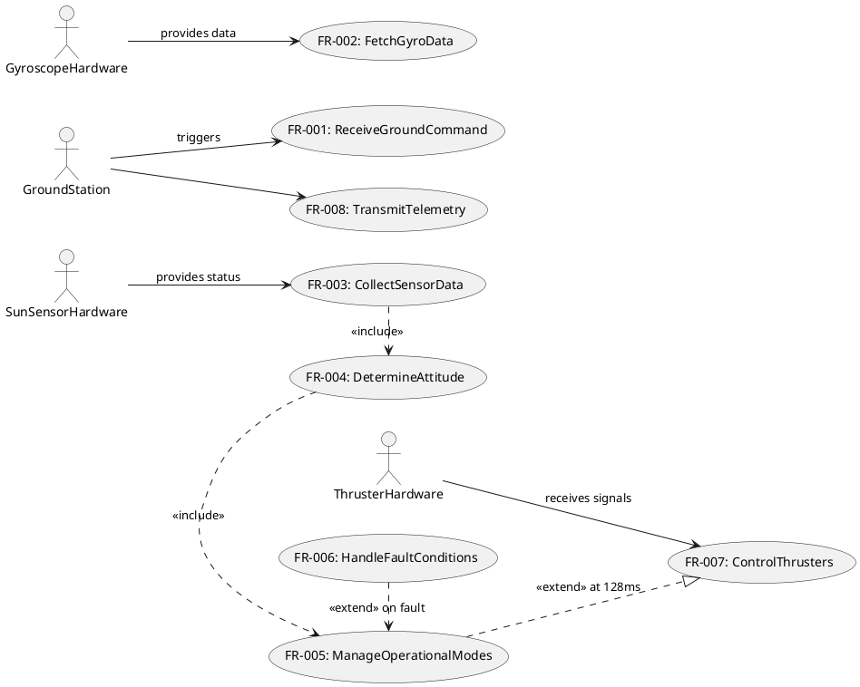

## LogicView
2. Class — Logic View: Class Diagram
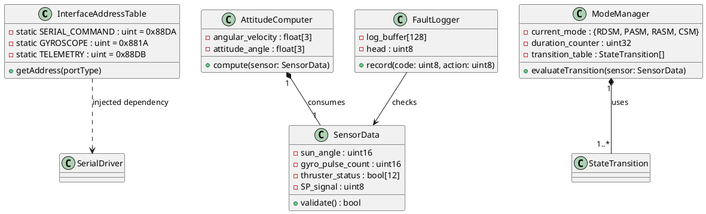

3. Object — Logic View: Object Diagram  
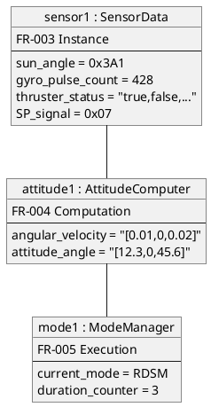

4. State — Logic View: State Diagram  
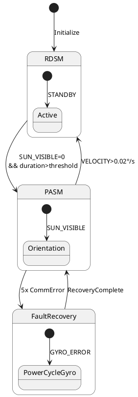

## ProcessView  
5. Activity — Process View: Activity Diagram  
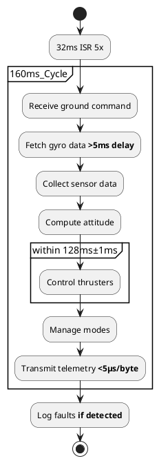

6. Sequence — Process View: Sequence Diagram  
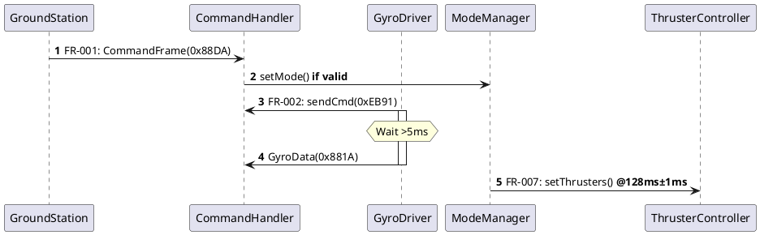

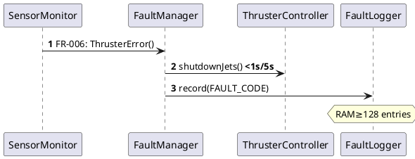

7. Collaboration — Process View: Collaboration Diagram  
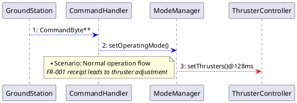

## DevelopmentView  
8. Package — Development View: Package Diagram  
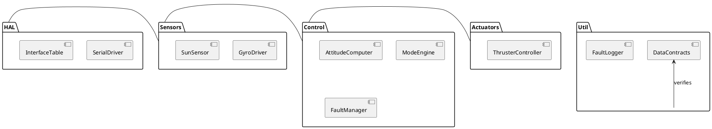

9. Component — Development View: Component Diagram  
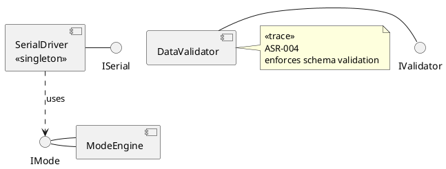

## PhysicalView  
10. Deployment — Physical View: Deployment Diagram  
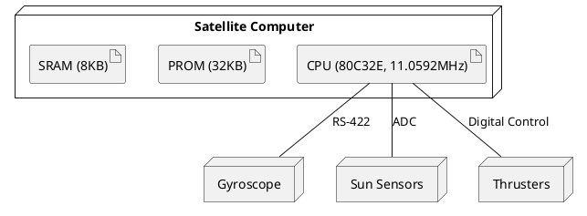

11. Container — Physical View: Container Diagram  
```plantuml
@startuml ContainerDiagram
container "Flight Software" {
  component CommandParser
  component AttitudeEstimator
  component PulseWidthController
  database "FaultLog" as FL
}

container "Ground Station" as Gs {
  component CommandInitiator
}

Gs -> CommandParser : UDP/Serial @160ms
PulseWidthController -> Gyroscope : Serial(0x881A) >5ms delay
AttitudeEstimator .> FL : writes logs
@enduml
```