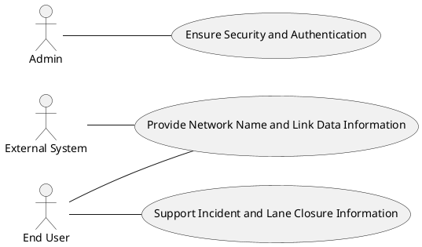
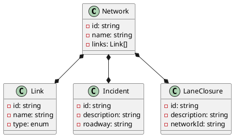
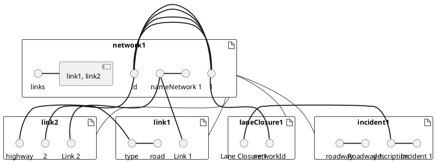
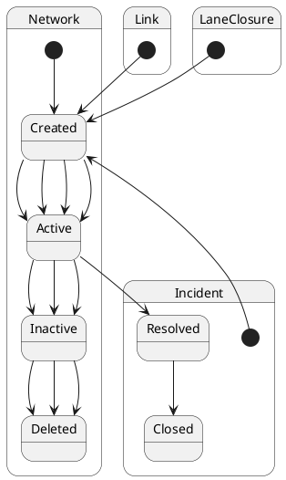
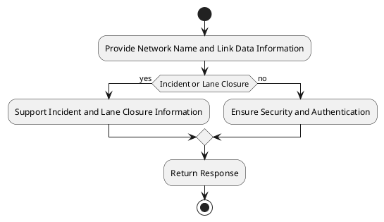
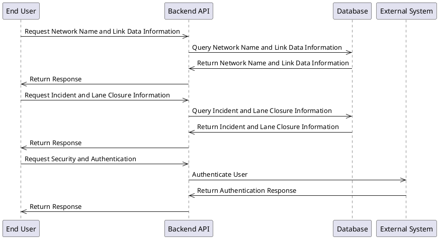
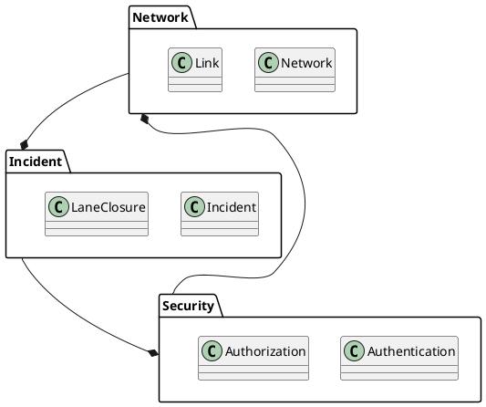
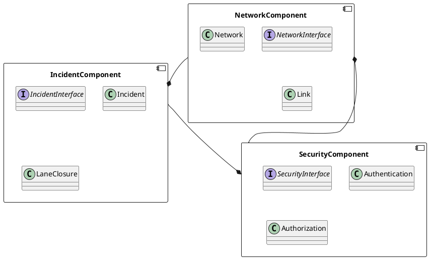
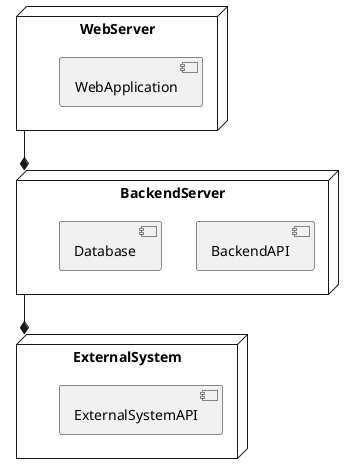
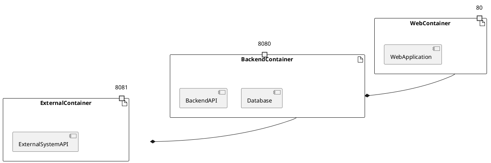

## Architecture Summary & Quality-Attribute Analysis
The proposed architecture is a modular, layered system that incorporates a microservices architecture style to ensure scalability, reliability, and maintainability. The system consists of multiple components, including a web interface, a backend API, a database, and external systems. The architecture is designed to meet the requirements of the Center-to-Center project, including providing network name and link data information, supporting incident and lane closure information, and ensuring security and authentication.

The key quality attributes of the system include:

* Scalability: The system is designed to handle a large number of users and requests, with a focus on horizontal scaling and load balancing.
* Reliability: The system is designed to ensure high availability and reliability, with a focus on redundancy and failover mechanisms.
* Security: The system is designed to ensure the security and integrity of data, with a focus on authentication, authorization, and encryption.
* Performance: The system is designed to ensure fast response times and low latency, with a focus on caching, indexing, and optimization.
* Maintainability: The system is designed to be easy to maintain and update, with a focus on modular design, automated testing, and continuous integration.

The architectural risks and trade-offs include:

* Complexity: The system's modular design and microservices architecture may introduce additional complexity, which can make it harder to debug and maintain.
* Communication overhead: The system's distributed architecture may introduce additional communication overhead, which can impact performance.
* Security: The system's security mechanisms may introduce additional overhead and complexity, which can impact performance and usability.

## Architectural Style & Rationale
The recommended architectural style is a microservices architecture, which is well-suited to meet the requirements of the Center-to-Center project. The microservices architecture style allows for:

* Scalability: Each microservice can be scaled independently, allowing for more efficient use of resources and improved scalability.
* Reliability: Each microservice can be designed to be highly available and reliable, with a focus on redundancy and failover mechanisms.
* Security: Each microservice can be designed to ensure the security and integrity of data, with a focus on authentication, authorization, and encryption.
* Performance: Each microservice can be designed to ensure fast response times and low latency, with a focus on caching, indexing, and optimization.
* Maintainability: Each microservice can be designed to be easy to maintain and update, with a focus on modular design, automated testing, and continuous integration.

The microservices architecture style is well-suited to meet the requirements of the Center-to-Center project, as it allows for a high degree of flexibility, scalability, and reliability.

## Architecture Patterns & Tactics
The recommended architecture patterns and tactics include:

* Service-oriented architecture (SOA): The system will use a service-oriented architecture to ensure loose coupling and high cohesion between components.
* Model-view-controller (MVC): The system will use a model-view-controller pattern to ensure separation of concerns and improve maintainability.
* Repository pattern: The system will use a repository pattern to ensure data encapsulation and improve data integrity.
* Caching: The system will use caching to improve performance and reduce latency.
* Load balancing: The system will use load balancing to ensure high availability and reliability.

## ScenarioView
1. UseCase — Scenario View: Use Case Diagram

## LogicView
2. Class — Logic View: Class Diagram

3. Object — Logic View: Object Diagram

4. State — Logic View: State Diagram

## ProcessView
5. Activity — Process View: Activity Diagram

6. Sequence — Process View: Sequence Diagram 

7. Collaboration — Process View: Collaboration Diagram

## DevelopmentView
8. Package — Development View: Package Diagram

9. Component — Development View: Component Diagram

## PhysicalView
10. Deployment — Physical View: Deployment Diagram

11. Container — Physical View: Container Diagram
