## ScenarioView
1. UseCase — Scenario View: Use Case Diagram
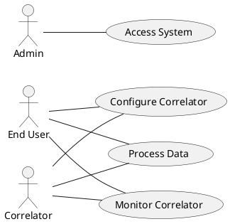

## LogicView
2. Class — Logic View: Class Diagram
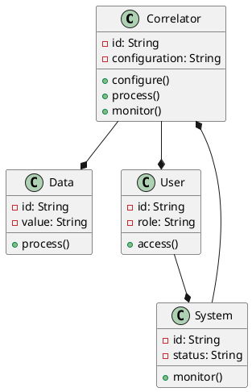
3. Object — Logic View: Object Diagram
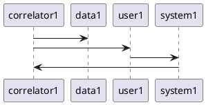
4. State — Logic View: State Diagram
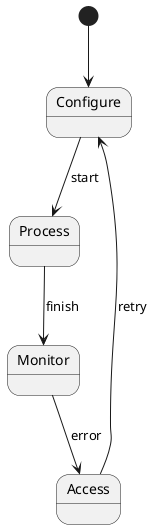

## ProcessView
5. Activity — Process View: Activity Diagram
```plantuml
@startuml Activity
start
:Configure Correlator;
fork
  :Process Data;
  :Monitor Correlator;
join
:Access System;
if (error?) then
  :Retry;
else
  :Finish;
endif
stop
@enduml
```
6. Sequence — Process View: Sequence Diagram 
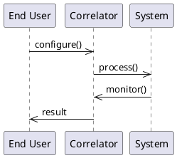
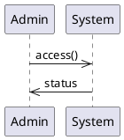
7. Collaboration — Process View: Collaboration Diagram 
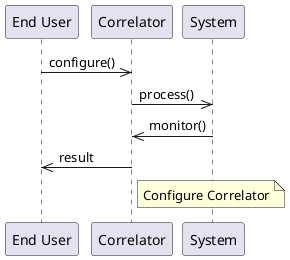
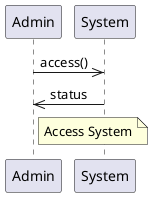

## DevelopmentView
8. Package — Development View: Package Diagram
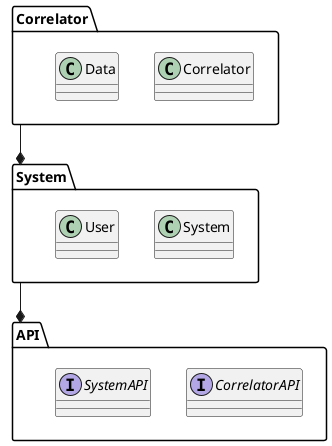
9. Component — Development View: Component Diagram
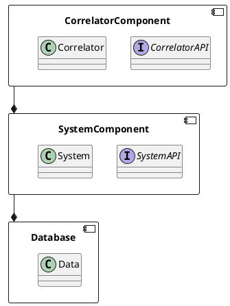

## PhysicalView
10. Deployment — Physical View: Deployment Diagram
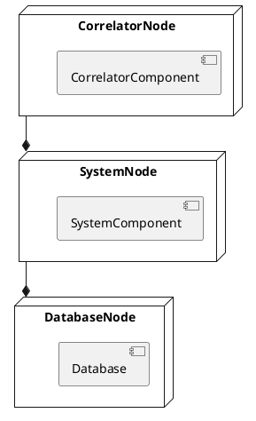
11. Container — Physical View: Container Diagram
```plantuml
@startuml Container
container CorrelatorContainer {
  component CorrelatorComponent
  technology "Docker"
}
container SystemContainer {
  component SystemComponent
  technology "Kubernetes"
}
container DatabaseContainer {
  component Database
  technology "MySQL"
}
CorrelatorContainer --* SystemContainer
SystemContainer --* DatabaseContainer
@enduml
```