## ScenarioView
1. UseCase — Scenario View: Use Case Diagram
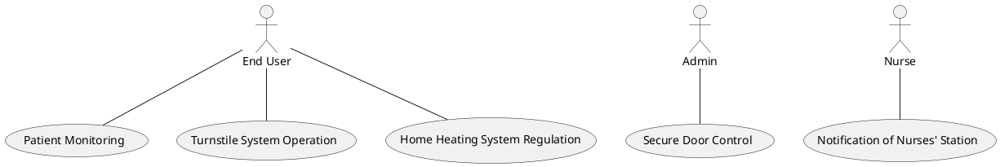

## LogicView
2. Class — Logic View: Class Diagram
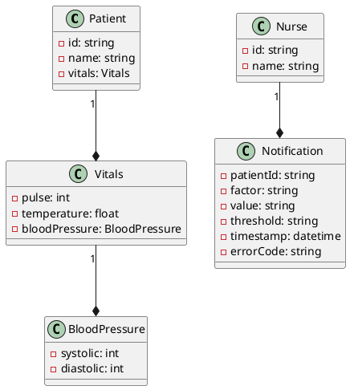

3. Object — Logic View: Object Diagram
```plantuml
@startuml Object
object patient1 : Patient
object vitals1 : Vitals
object bloodPressure1 : BloodPressure
object nurse1 : Nurse
object notification1 : Notification

patient1 -- vitals1
vitals1 -- bloodPressure1
nurse1 -- notification1

patient1 : id = "1"
patient1 : name = "John Doe"
vitals1 : pulse = 120
vitals1 : temperature = 37.5
bloodPressure1 : systolic = 120
bloodPressure1 : diastolic = 80
nurse1 : id = "1"
nurse1 : name = "Jane Doe"
notification1 : patientId = "1"
notification1 : factor = "pulse"
notification1 : value = "120"
notification1 : threshold = "100"
notification1 : timestamp = "2023-03-01 12:00:00"
notification1 : errorCode = "OUT_OF_RANGE"

@enduml
```

4. State — Logic View: State Diagram
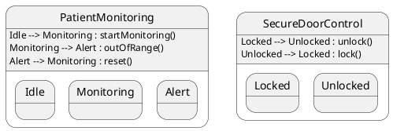

## ProcessView
5. Activity — Process View: Activity Diagram
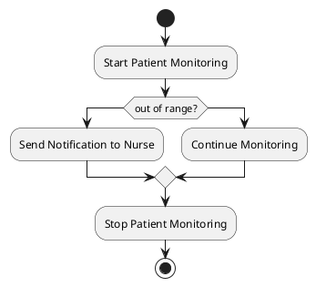

6. Sequence — Process View: Sequence Diagram 
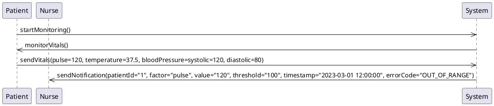

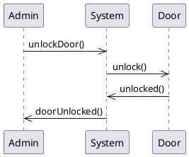

7. Collaboration — Process View: Collaboration Diagram
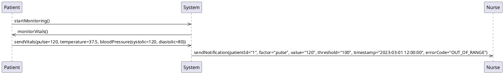


## DevelopmentView
8. Package — Development View: Package Diagram
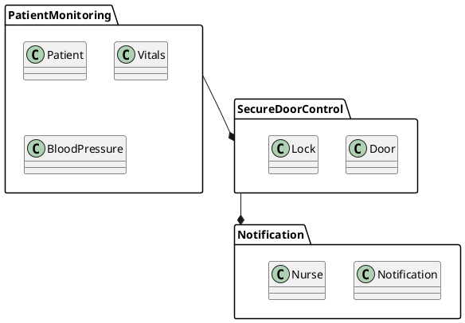

9. Component — Development View: Component Diagram
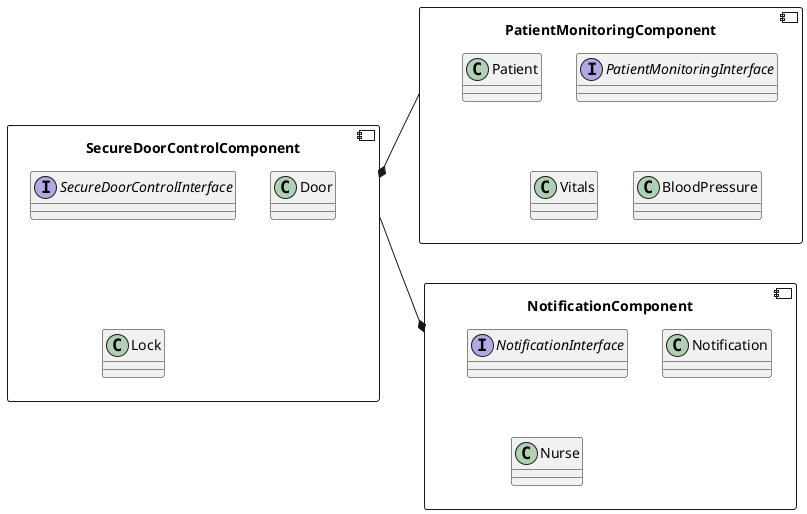

## PhysicalView
10. Deployment — Physical View: Deployment Diagram
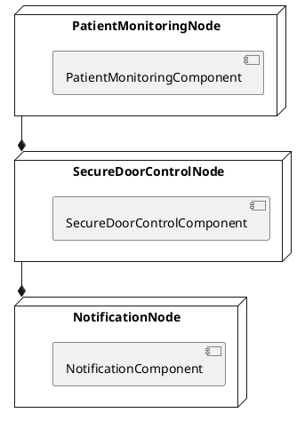

11. Container — Physical View: Container Diagram
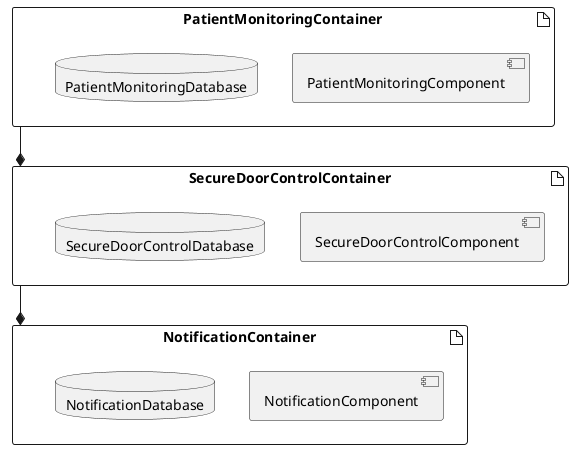