## ScenarioView
1. UseCase — Scenario View: Use Case Diagram
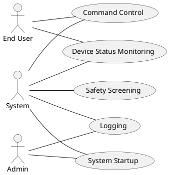

## LogicView
2. Class — Logic View: Class Diagram
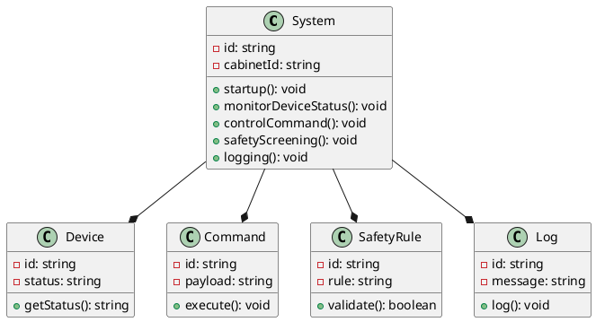

3. Object — Logic View: Object Diagram
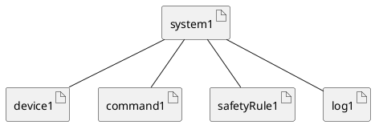

4. State — Logic View: State Diagram
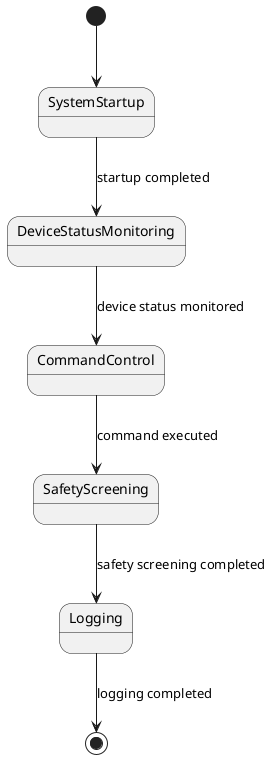

## ProcessView
5. Activity — Process View: Activity Diagram
```plantuml
@startuml ActivityDiagram
start
:Startup System;
fork
  :Monitor Device Status;
  :Control Command;
  :Safety Screening;
join
:Logging;
if (Safety Screening Failed?) then
  :Alert Admin;
else
  :Continue Operation;
endif
stop

@enduml
```

6. Sequence — Process View: Sequence Diagram 
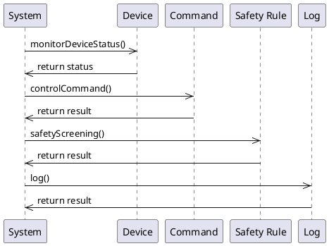

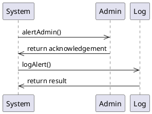

7. Collaboration — Process View: Collaboration Diagram 
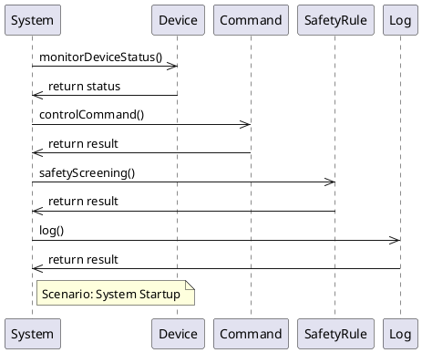

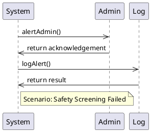

## DevelopmentView
8. Package — Development View: Package Diagram
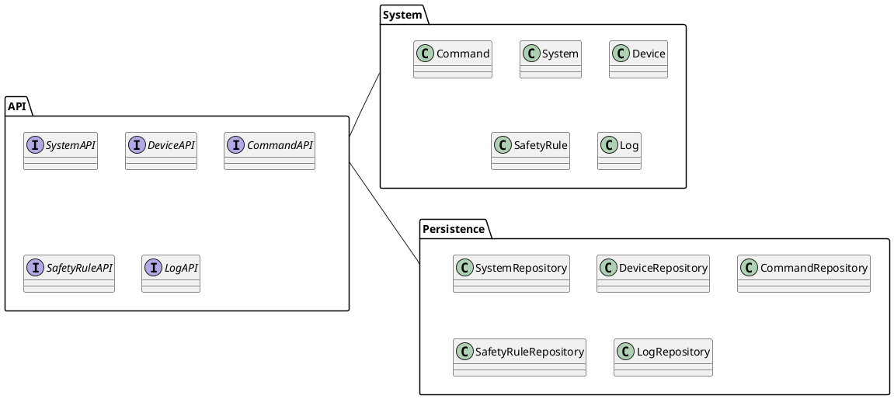

9. Component — Development View: Component Diagram
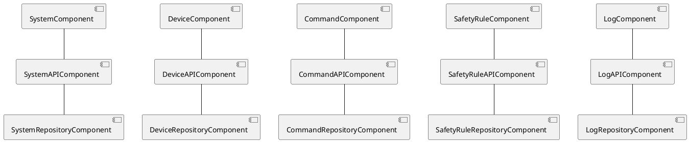

## PhysicalView
10. Deployment — Physical View: Deployment Diagram
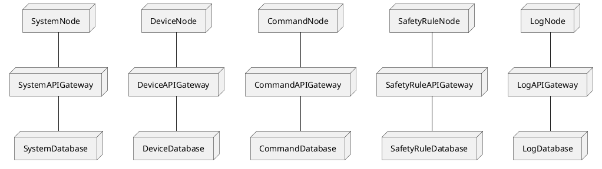

11. Container — Physical View: Container Diagram
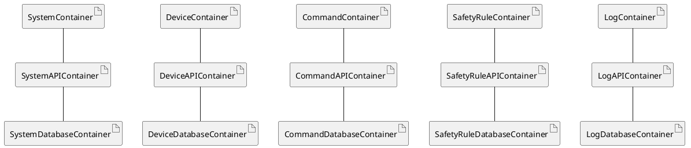