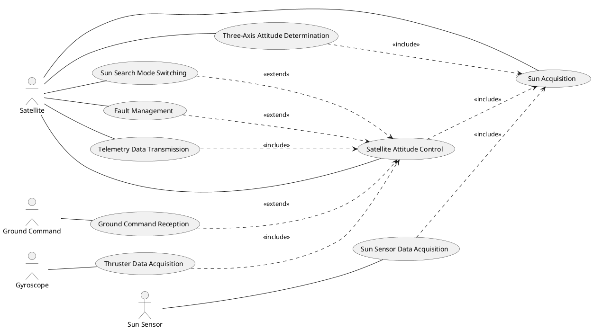
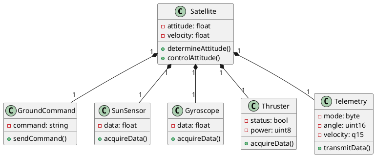
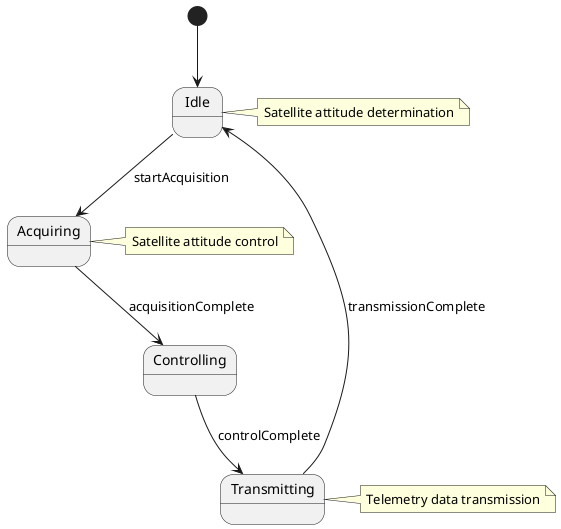
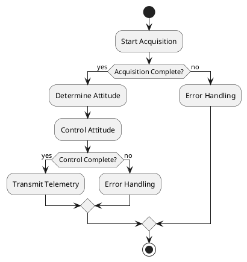
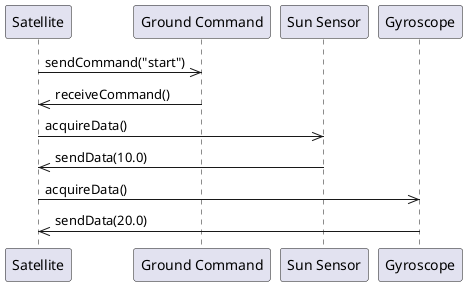
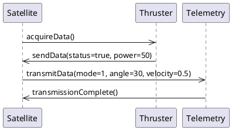
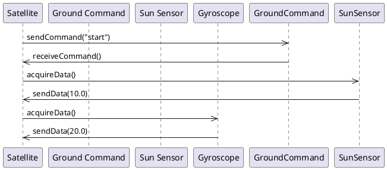
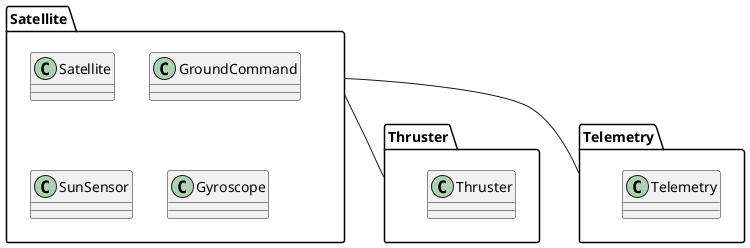
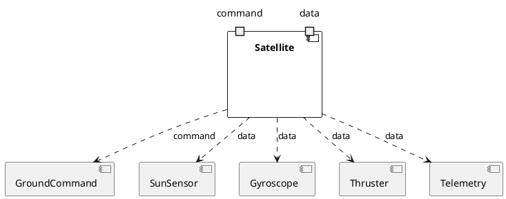
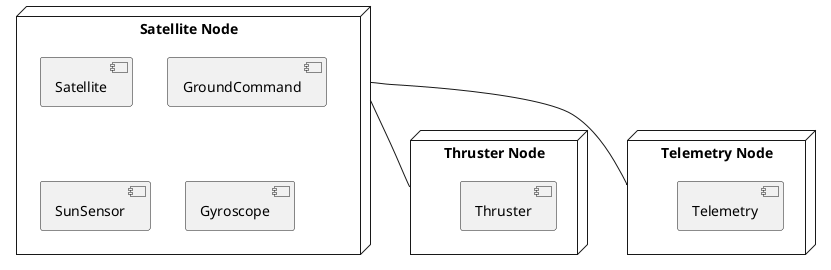

## ScenarioView
1. UseCase — Scenario View: Use Case Diagram


## LogicView
2. Class — Logic View: Class Diagram


3. Object — Logic View: Object Diagram
```plantuml
@startuml ObjectDiagram
object satellite1 : Satellite
object groundCommand1 : GroundCommand
object sunSensor1 : SunSensor
object gyroscope1 : Gyroscope
object thruster1 : Thruster
object telemetry1 : Telemetry

satellite1 : attitude = 0.0
satellite1 : velocity = 0.0
groundCommand1 : command = "start"
sunSensor1 : data = 10.0
gyroscope1 : data = 20.0
thruster1 : status = true
thruster1 : power = 50
telemetry1 : mode = 1
telemetry1 : angle = 30
telemetry1 : velocity = 0.5

satellite1 -- groundCommand1
satellite1 -- sunSensor1
satellite1 -- gyroscope1
satellite1 -- thruster1
satellite1 -- telemetry1
@enduml
```

4. State — Logic View: State Diagram


## ProcessView
5. Activity — Process View: Activity Diagram


6. Sequence — Process View: Sequence Diagram 




7. Collaboration — Process View: Collaboration Diagram 



## DevelopmentView
8. Package — Development View: Package Diagram


9. Component — Development View: Component Diagram


## PhysicalView
10. Deployment — Physical View: Deployment Diagram


11. Container — Physical View: Container Diagram
```plantuml
@startuml ContainerDiagram
container "Satellite Container" as satelliteContainer {
  component Satellite
  component GroundCommand
  component SunSensor
  component Gyroscope
}

container "Thruster Container" as thrusterContainer {
  component Thruster
}

container "Telemetry Container" as telemetryContainer {
  component Telemetry
}

satelliteContainer -- thrusterContainer
satelliteContainer -- telemetryContainer
@enduml
```