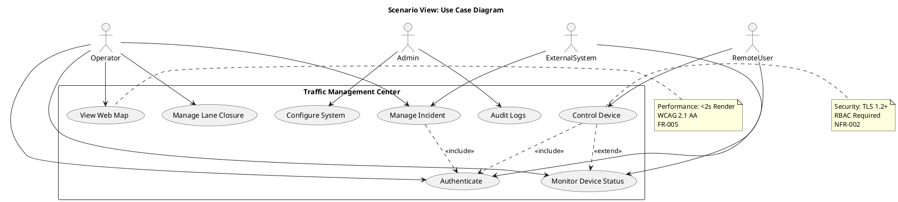
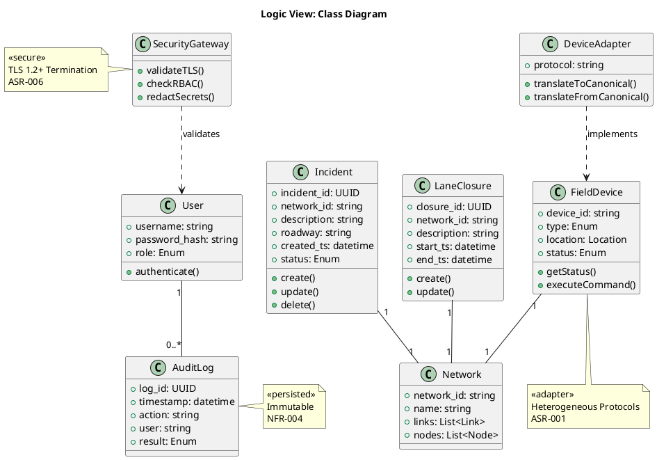
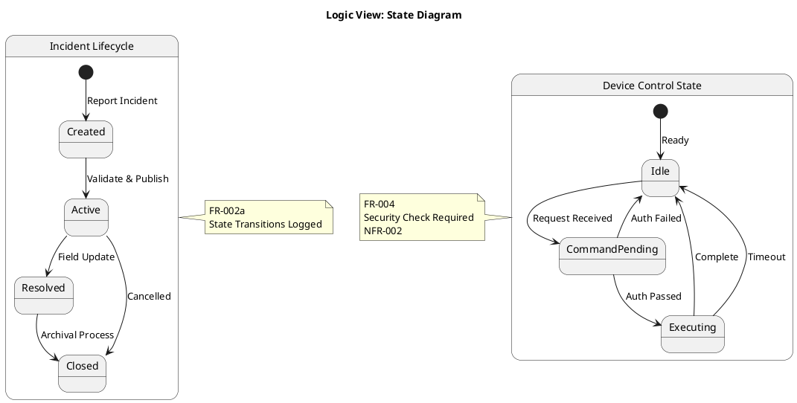
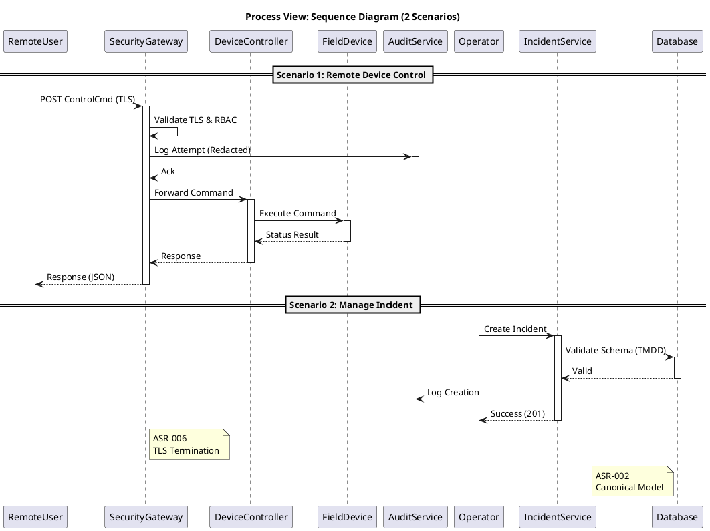
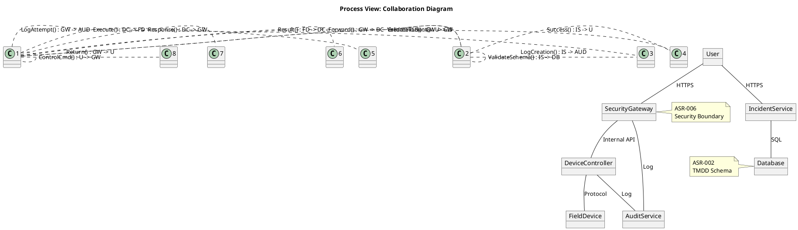
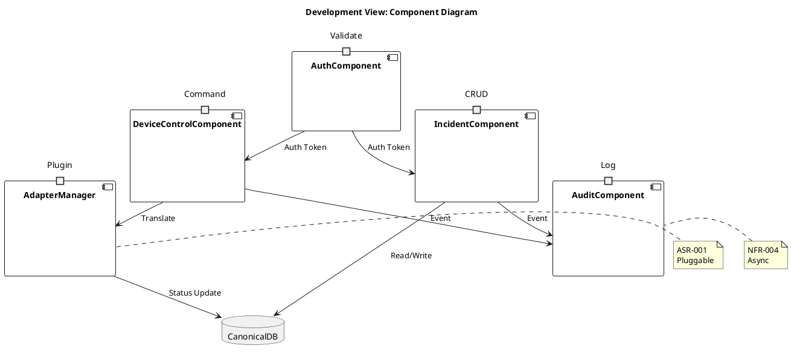

# Architecture Summary & Quality-Attribute Analysis

**Proposed Architecture:**
The system adopts a **Hybrid Microkernel and Layered Architecture** with a **Security Gateway** pattern. The core logic resides in a legacy-compliant Microkernel (C/C++ on Windows NT) responsible for TMDD canonical data processing and repository federation. A modern **API Security Gateway** sits in front of the legacy core to enforce TLS 1.2+, RBAC, and audit logging, mitigating the risks associated with the legacy OS (ASR-005, ASR-006). Heterogeneous field device connections are handled via a **Pluggable Adapter Layer** (ASR-001). The UI is separated into a Web Map (ESRI ARC IMS) and a Remote Control GUI, both communicating through the secure gateway.

**Quality Attribute Analysis:**
1.  **Security (High Priority):**
    *   *Risk:* Legacy Windows NT lacks modern TLS support (ASR-005).
    *   *Trade-off:* Introduce a modern Security Gateway proxy to terminate TLS 1.2+ and enforce RBAC before requests reach the legacy core (ASR-006).
    *   *Tactic:* Network Segmentation, Proxy Enforcement, Password Redaction in logs (NFR-002).
2.  **Interoperability:**
    *   *Risk:* Dissimilar traffic management systems (ASR-001).
    *   *Trade-off:* Adapter Pattern increases development effort but isolates core from protocol changes.
    *   *Tactic:* Canonical Data Model (TMDD v3.0) internal representation; Adapters for external protocols (ASR-002).
3.  **Reliability & Auditability:**
    *   *Risk:* Data loss or untraceable actions in Test Mode (NFR-004).
    *   *Tactic:* Event-Driven Audit Logging (async) to prevent blocking core operations; Immutable Audit Logs (FR-008).
4.  **Performance:**
    *   *Risk:* Map rendering latency >2s (FR-005).
    *   *Tactic:* Caching strategy for static network data; Asynchronous loading of incident icons.
5.  **Modifiability:**
    *   *Risk:* Hard-coded agency configurations (ASR-004).
    *   *Tactic:* Externalized Configuration (Config Files/Env Vars); Microkernel plugin architecture.

# Architectural Style & Rationale

**Recommended Style:** **Hybrid Microkernel + Layered + SOA**
1.  **Microkernel:** Addresses ASR-004 (Configurable Building Blocks) and ASR-001 (Heterogeneous Interconnection). The core system remains stable while adapters/plugins handle specific agency protocols or device types.
2.  **Layered:** Separates UI (FR-005, FR-006), Business Logic (FR-002, FR-004), and Data (FR-007). This aligns with the legacy C/C++ structure while allowing the UI to evolve independently.
3.  **SOA (Service Oriented):** The Center-to-Center communication (FR-001, FR-003) relies on standardized message sets (TMDD/DATEX), functioning as services exposed via the Gateway.

**Rationale:** This combination supports the legacy constraints (Windows NT/C++) while introducing modern security boundaries (Gateway) and extensibility (Adapters). It balances the need for strict standards compliance (TMDD) with the reality of heterogeneous field devices.

# Architecture Patterns & Tactics

1.  **Adapter Pattern:**
    *   *Application:* Field Device Interfaces (FR-003, FR-004).
    *   *Reason:* Isolates system-specific protocols from the canonical TMDD core (ASR-001).
2.  **API Gateway / Proxy Pattern:**
    *   *Application:* Public Network Interface (FR-006, ASR-006).
    *   *Reason:* Enforces TLS 1.2+ and RBAC before traffic reaches the legacy Windows NT server (NFR-002).
3.  **Repository Pattern:**
    *   *Application:* Data Storage (FR-007).
    *   *Reason:* Abstracts the hierarchical federation logic (Local->Regional->Statewide) from business logic (ASR-003).
4.  **Event-Driven Audit:**
    *   *Application:* Logging (FR-008, NFR-004).
    *   *Reason:* Decouples high-latency audit writing from critical control paths to ensure performance.
5.  **Canonical Data Model:**
    *   *Application:* Internal Data Representation (ASR-002).
    *   *Reason:* Ensures TMDD v3.0 compliance and simplifies federation.

## ScenarioView
1. UseCase — Scenario View: Use Case Diagram



## LogicView
2. Class — Logic View: Class Diagram



3. Object — Logic View: Object Diagram

```plantuml
@startuml ObjectDiagram
title Logic View: Object Diagram

object "inc1 : Incident" as inc1 [ManageIncident] {
  incident_id = "550e8400-e29b"
  network_id = "NET-01"
  description = "Vehicle Breakdown"
  status = "Active"
}

object "dev1 : FieldDevice" as dev1 [ControlDevice] {
  device_id = "DMS-101"
  type = "DMS"
  status = "active"
}

object "user1 : User" as user1 [Authenticate] {
  username = "operator_01"
  role = "Controller"
}

object "log1 : AuditLog" as log1 [AuditLogs] {
  action = "DEVICE_CONTROL"
  result = "SUCCESS"
}

object "net1 : Network" as net1 {
  network_id = "NET-01"
  name = "I-95 Corridor"
}

inc1 -- net1
dev1 -- net1
user1 ..> log1 : creates
dev1 ..> log1 : triggers

note right of inc1
  FR-002a
  Required Fields Validated
end note

note left of dev1
  FR-003/004
  Status Enum Validated
end note

@enduml
```

4. State — Logic View: State Diagram



## ProcessView
5. Activity — Process View: Activity Diagram

```plantuml
@startuml ActivityDiagram
title Process View: Activity Diagram

start
:RemoteUser Sends Command;
partition "Security Gateway" {
  :Validate TLS 1.2+;
  :Authenticate User (RBAC);
  if (Auth Failed?) then (yes)
    :Return 401 Unauthorized;
    stop
  else (no)
    :Redact Passwords;
    :Log Request (Audit);
  endif
}
partition "Legacy Core" {
  :Translate Command (Adapter);
  :Validate Device State;
  if (Valid?) then (yes)
    :Execute Control Command;
    :Update Device Status;
  else (no)
    :Return Error Message;
    stop
  endif
}
:Log Completion (Async);
:Return Status Response;
stop

note right of Validate TLS 1.2+
  NFR-002
  ASR-006
end note

note left of Log Request
  NFR-004
  Passwords Redacted
end note

@enduml
```

6. Sequence — Process View: Sequence Diagram



7. Collaboration — Process View: Collaboration Diagram



## DevelopmentView
8. Package — Development View: Package Diagram

```plantuml
@startuml PackageDiagram
title Development View: Package Diagram

package "UI Layer" {
  package "WebMap" [FR-005]
  package "RemoteGUI" [FR-006]
}

package "Integration Layer" {
  package "Adapters" [ASR-001]
  package "SecurityGateway" [ASR-006]
}

package "Core Logic" {
  package "IncidentMgr" [FR-002]
  package "DeviceCtrl" [FR-004]
  package "DataCollector" [FR-007]
}

package "Data Layer" {
  package "Repository" [ASR-003]
  package "AuditStore" [NFR-004]
}

UI Layer --> Integration Layer : HTTPS
Integration Layer --> Core Logic : Internal API
Core Logic --> Data Layer : SQL/ORM
Adapters ..> Core Logic : Plugins

note right of SecurityGateway
  TLS 1.2+
  RBAC
end note

note left of Repository
  Federation
  TMDD Model
end note

@enduml
```

9. Component — Development View: Component Diagram



## PhysicalView
10. Deployment — Physical View: Deployment Diagram

```plantuml
@startuml DeploymentDiagram
title Physical View: Deployment Diagram

node "Client Network" {
  node "Web Browser" {
    component "WebMap"
  }
  node "Remote Workstation" {
    component "RemoteGUI"
  }
}

node "DMZ" {
  node "Security Gateway Appliance" [FIPS 140-2] {
    component "TLS Terminator"
    component "RBAC Filter"
  }
}

node "Legacy Center Network" {
  node "Windows NT Server" [ASR-005] {
    component "C2C Core"
    component "ESRI ARC IMS"
  }
  node "Database Server" {
    component "TMDD Repository"
  }
}

"Web Browser" -- "TLS Terminator" : HTTPS
"Remote Workstation" -- "TLS Terminator" : HTTPS
"TLS Terminator" -- "C2C Core" : Internal TLS
"C2C Core" -- "TMDD Repository" : ODBC

note right of Security Gateway Appliance
  ASR-006
  Public Network Boundary
end note

note left of Windows NT Server
  Legacy OS
  Network Segmented
end note

@enduml
```

11. Container — Physical View: Container Diagram

```plantuml
@startuml ContainerDiagram
title Physical View: Container Diagram

container "Web UI" [HTTPS/JS] {
  responsibility "Map Visualization"
  responsibility "Incident Entry"
}

container "API Gateway" [Nginx/Proxy] {
  responsibility "TLS Termination"
  responsibility "Authentication"
}

container "Core Service" [C/C++] {
  responsibility "Business Logic"
  responsibility "Protocol Translation"
}

container "Database" [SQL] {
  responsibility "TMDD Data Store"
  responsibility "Audit Logs"
}

container "Cache" [Redis] {
  responsibility "Session Store"
  responsibility "Map Data Cache"
}

"Web UI" --> "API Gateway" : HTTPS
"API Gateway" --> "Core Service" : Internal API
"Core Service" --> "Database" : SQL
"Core Service" --> "Cache" : Redis Protocol

note right of API Gateway
  ASR-006
  Security Boundary
end note

note left of Core Service
  ASR-005
  Legacy Compatible
end note

@enduml
```