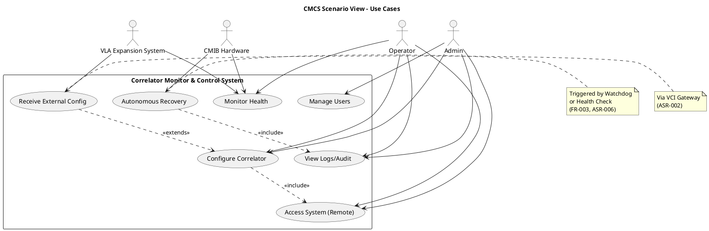
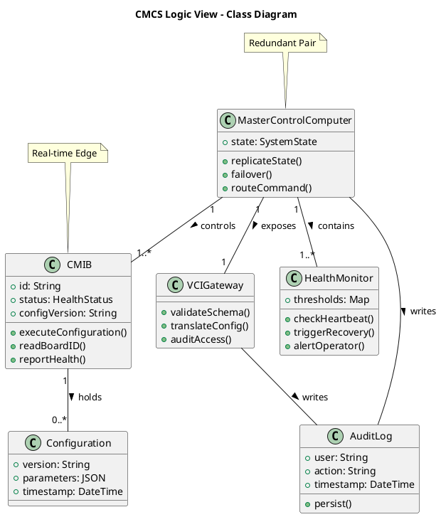
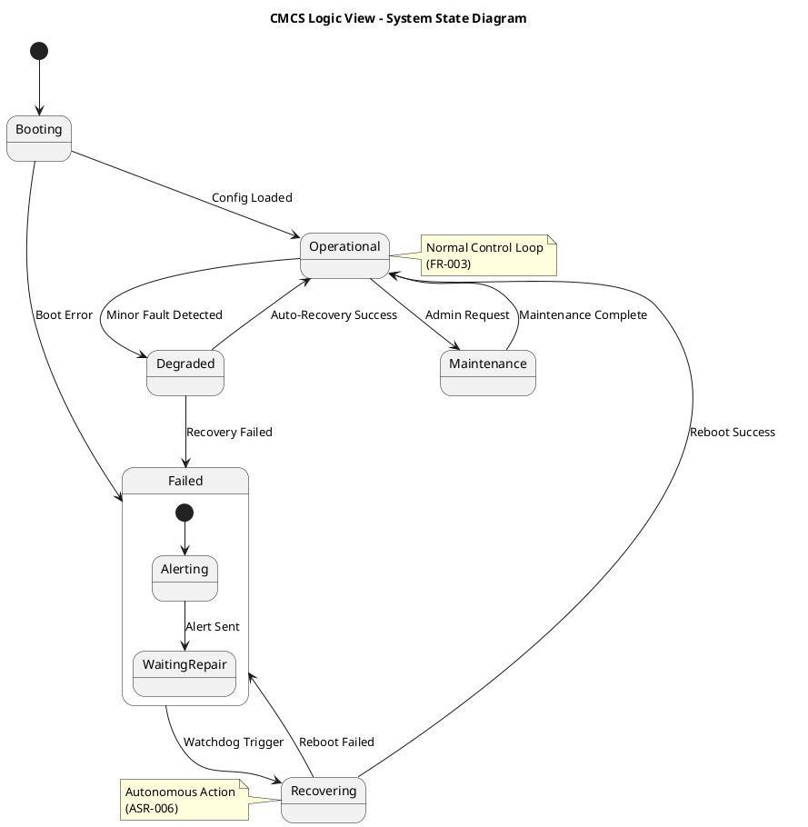
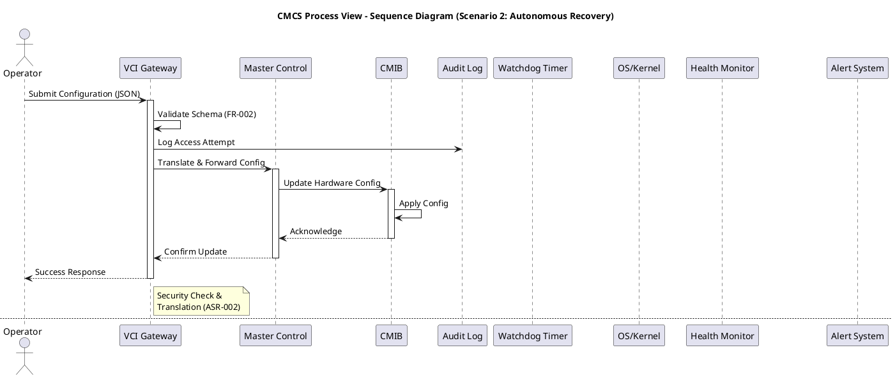
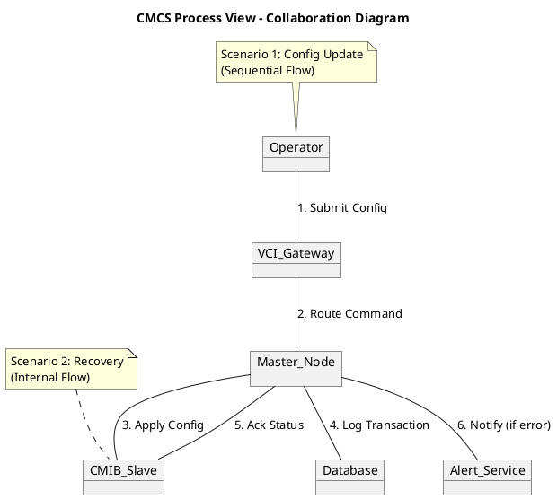
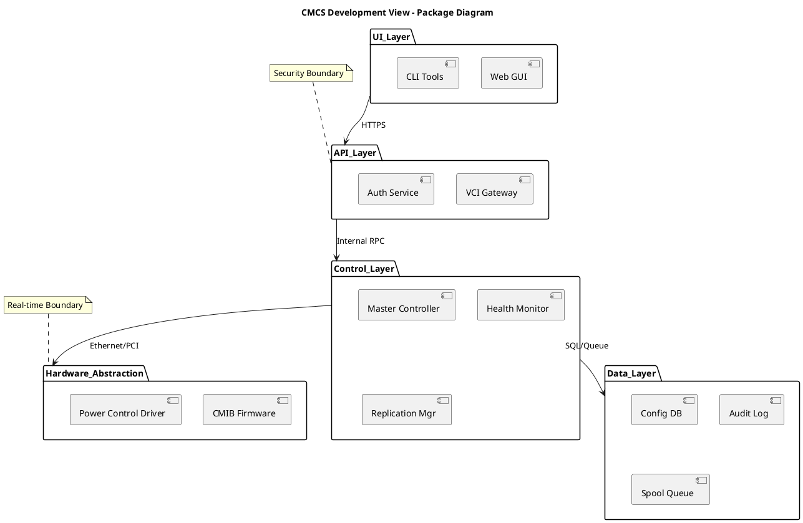
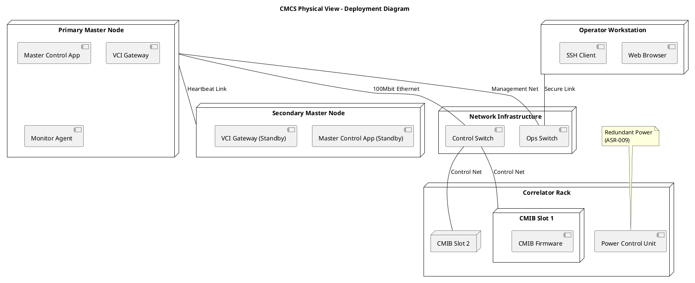

## Architecture Summary & Quality-Attribute Analysis

**Architecture Summary**
The proposed architecture for the Correlator Monitor and Control System (CMCS) is a **Hierarchical Master/Slave System with a Secure Gateway**. It features redundant Master Control Computers (Primary/Secondary) that manage intelligent slave nodes (CMIBs) responsible for real-time hardware interaction. A Virtual Correlator Interface (VCI) acts as the single secure entry point for all external configurations and commands, enforcing security and translation logic. The system is segmented into distinct network zones (Control, Power, Operations) to ensure determinism and security. Autonomous health monitoring agents reside on all nodes, utilizing hardware watchdogs and UPS integration for self-healing and graceful degradation.

**Quality-Attribute Analysis**
*   **Availability & Reliability**: Driven by ASR-003 (Redundant Masters) and ASR-009 (Watchdog/UPS).
    *   *Risk*: State replication lag between masters could cause data inconsistency during failover.
    *   *Mitigation*: Synchronous replication for critical state, asynchronous for logs.
*   **Security**: Driven by ASR-002 (VCI Gateway) and ASR-008 (Audit/Access).
    *   *Risk*: VCI becomes a single point of failure or bottleneck.
    *   *Mitigation*: VCI is clustered behind a load balancer; strict network segmentation (ASR-005).
*   **Performance & Determinism**: Driven by ASR-004 (Load Separation).
    *   *Risk*: Network chaos on Master affecting Slave real-time deadlines.
    *   *Mitigation*: Physical network separation and local buffering on CMIBs (FR-010).
*   **Maintainability**: Driven by FR-020 (Modular Replaceability) and FR-027 (Source Availability).
    *   *Trade-off*: Hot-swap capability increases hardware complexity and cost.

**Recommended Architecture Style**
**Layered Master/Slave with Event-Driven Monitoring**.
*   **Justification**:
    *   **Master/Slave (ASR-001)**: Directly maps to the physical control hierarchy (Master Computer -> CMIB -> Hardware).
    *   **Layered**: Separates UI (GUI), Business Logic (VCI/Control), and Hardware Abstraction (CMIB), addressing Maintainability and Security.
    *   **Event-Driven**: Used for Health Monitoring and Alerting (FR-003, FR-013), allowing asynchronous processing of faults without blocking control loops.

## Architectural Style & Rationale

**Primary Style: Hierarchical Master/Slave**
*   **Rationale**: The requirements explicitly demand a Master/Slave topology (ASR-001) where the Master coordinates activities and Slaves (CMIBs) handle intelligent hardware control. This supports the **Scalability** (add more CMIBs) and **Reliability** (Master manages state) needs.
*   **Link to Requirements**: ASR-001, FR-001, FR-024.

**Secondary Style: Layered (n-tier)**
*   **Rationale**: Separation of concerns is critical.
    *   *Presentation Layer*: Human GUI (FR-008) & Remote Login (FR-019).
    *   *Application Layer*: VCI Gateway (ASR-002), Control Logic.
    *   *Data Layer*: Configuration DB, Log Storage (FR-020).
    *   *Device Layer*: CMIBs, Power Control.
*   **Link to Requirements**: ASR-002, FR-005, FR-018.

**Hybrid Interaction**: The Master/Slave structure exists primarily in the lower two layers (Application/Device). The upper layers interact with the "Master" node via the VCI, abstracting the underlying topology.

## Architecture Patterns & Tactics

**1. Gateway Pattern (VCI)**
*   **Application**: All external requests pass through the Virtual Correlator Interface.
*   **Addresses**: Security (ASR-008), Translation (FR-001), Interoperability (ASR-002).
*   **Tactic**: Centralized authentication and schema validation before commands reach the control logic.

**2. Active-Passive Redundancy (Failover)**
*   **Application**: Primary and Secondary Master Control Computers.
*   **Addresses**: Availability (ASR-003), Reliability (NFR-011).
*   **Tactic**: Heartbeat monitoring between Masters; automatic IP rerouting (FR-016) upon failure detection.

**3. Observer Pattern (Health Monitoring)**
*   **Application**: Health Monitor subsystem observing CMIBs and OS metrics.
*   **Addresses**: Reliability (ASR-006), Observability (FR-003).
*   **Tactic**: Polling/Interrupts trigger alerts and recovery scripts autonomously.

**4. Bulkhead Pattern (Network Segmentation)**
*   **Application**: Separate physical interfaces for Control, Power, and Ops networks.
*   **Addresses**: Security (ASR-005), Performance (NFR-004).
*   **Tactic**: Physical isolation prevents traffic spikes or attacks on one network from affecting critical control loops.

## 4+1 View Diagrams

## ScenarioView
1. UseCase — Scenario View: Use Case Diagram



## LogicView
2. Class — Logic View: Class Diagram



3. Object — Logic View: Object Diagram

```plantuml
@startuml ObjectDiagram
title CMCS Logic View - Object Diagram

object "PrimaryMaster" as Master1 [MasterControlComputer] {
  state = "Active"
  role = "Primary"
}

object "SecondaryMaster" as Master2 [MasterControlComputer] {
  state = "Standby"
  role = "Secondary"
}

object "CMIB_01" as CMIB1 [CMIB] {
  id = "CMIB-001"
  status = "Operational"
  configVersion = "v2.1"
}

object "CurrentConfig" as C1 [Configuration] {
  version = "v2.1"
  timestamp = "2023-10-27T10:00:00Z"
}

object "VCI_Service" as VCI1 [VCIGateway] {
  status = "Listening"
}

Master1 --> CMIB1 : controls
Master1 --> VCI1 : exposes
Master1 --> Master2 : replicates state
CMIB1 --> C1 : uses
VCI1 --> Master1 : routes

note "Scenario: Normal Operation\n[MonitorHealth]" as N1
N1 .. Master1

@enduml
```

4. State — Logic View: State Diagram



## ProcessView
5. Activity — Process View: Activity Diagram

```plantuml
@startuml ActivityDiagram
title CMCS Process View - Health Monitoring & Recovery

start

:Receive Heartbeat/Status;
:Check Thresholds (CPU, Temp, Error Rate);
if (Threshold Exceeded?) then (Yes)
  :Log Fault Event;
  :Attempt Autonomous Recovery (Reboot/Reconfig);
  if (Recovery Success?) then (Yes)
    :Update State to Operational;
    :Log Recovery Success;
  else (No)
    :Send Alert to Operator (Email/SMS);
    :Update State to Failed;
    :Trigger Failover (if Master);
  endif
else (No)
  :Update State to Operational;
endif

:Wait for Next Interval (10s);
stop

note right of Attempt Autonomous Recovery
  Must complete within 60s
  (FR-003)
end note

note bottom of Send Alert
  Log to audit.log
  (FR-020)
end note

@enduml
```

6. Sequence — Process View: Sequence Diagram



7. Collaboration — Process View: Collaboration Diagram



## DevelopmentView
8. Package — Development View: Package Diagram



9. Component — Development View: Component Diagram

```plantuml
@startuml ComponentDiagram
title CMCS Development View - Component Diagram

component "VCI Service" as VCI {
  port "REST_API" as P1
  port "Auth" as P2
}

component "Control Service" as Control {
  port "Command Bus" as P3
  port "State DB" as P4
}

component "Monitor Service" as Monitor {
  port "Heartbeat" as P5
  port "Alerts" as P6
}

component "CMIB Agent" as Agent {
  port "Hardware Bus" as P7
}

VCI P1 --> Control P3 : Commands
Control P4 ..> "ConfigDB" : Persists
Monitor P5 ..> Agent P7 : Polls
Monitor P6 --> "AlertManager" : Pushes

note "High Availability\n(Active-Passive)" as HA
HA .. Control

note "Deterministic\n(Real-time)" as RT
RT .. Agent

@enduml
```

## PhysicalView
10. Deployment — Physical View: Deployment Diagram



11. Container — Physical View: Container Diagram

```plantuml
@startuml ContainerDiagram
title CMCS Physical View - Container Diagram

rectangle "External Systems" {
  container "VLA Expansion M&C" as VLA
  container "Operator Browser" as Browser
}

rectangle "Correlator M&C System Boundary" {
  container "VCI Web App" as WebApp
  container "Control API" as API
  container "State Database" as DB
  container "Message Queue" as Queue
  container "CMIB Controller" as Controller
}

Browser --> WebApp : HTTPS
WebApp --> API : JSON/REST
API --> DB : SQL
API --> Queue : Publish Config
Controller --> Queue : Subscribe Config
Controller --> "CMIB Hardware" : TCP/IP
VLA --> API : External Config

note "Spooling for\nOffline Operation\n(ASR-007)" as N1
N1 .. Queue

note "99.99% Availability\n(NFR-016)" as N2
N2 .. DB

@enduml
```