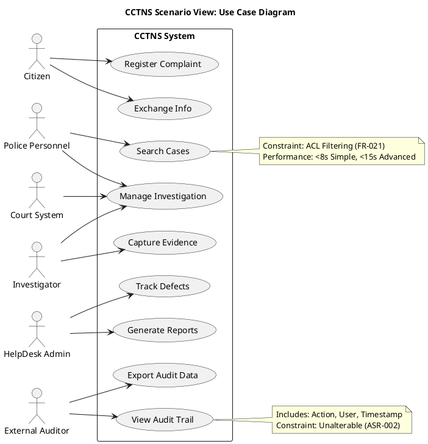
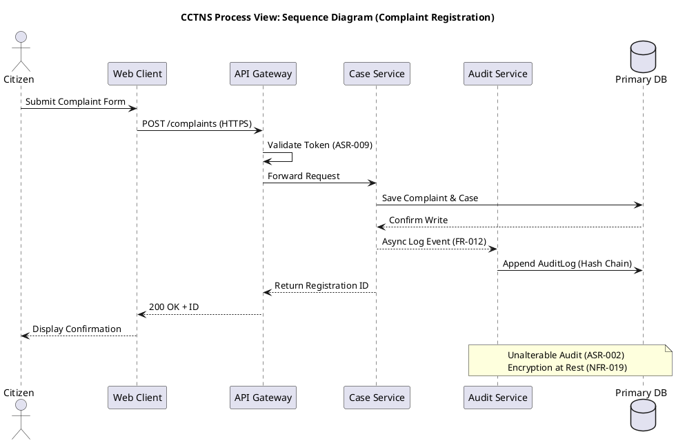
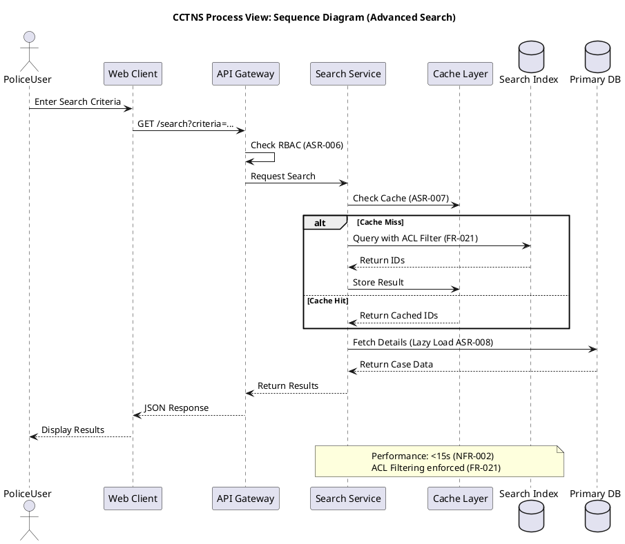
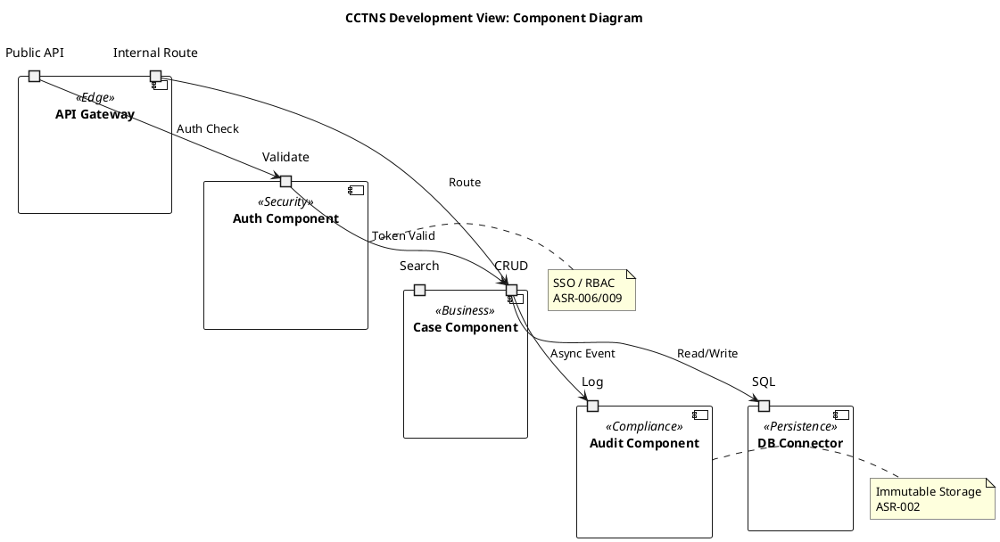
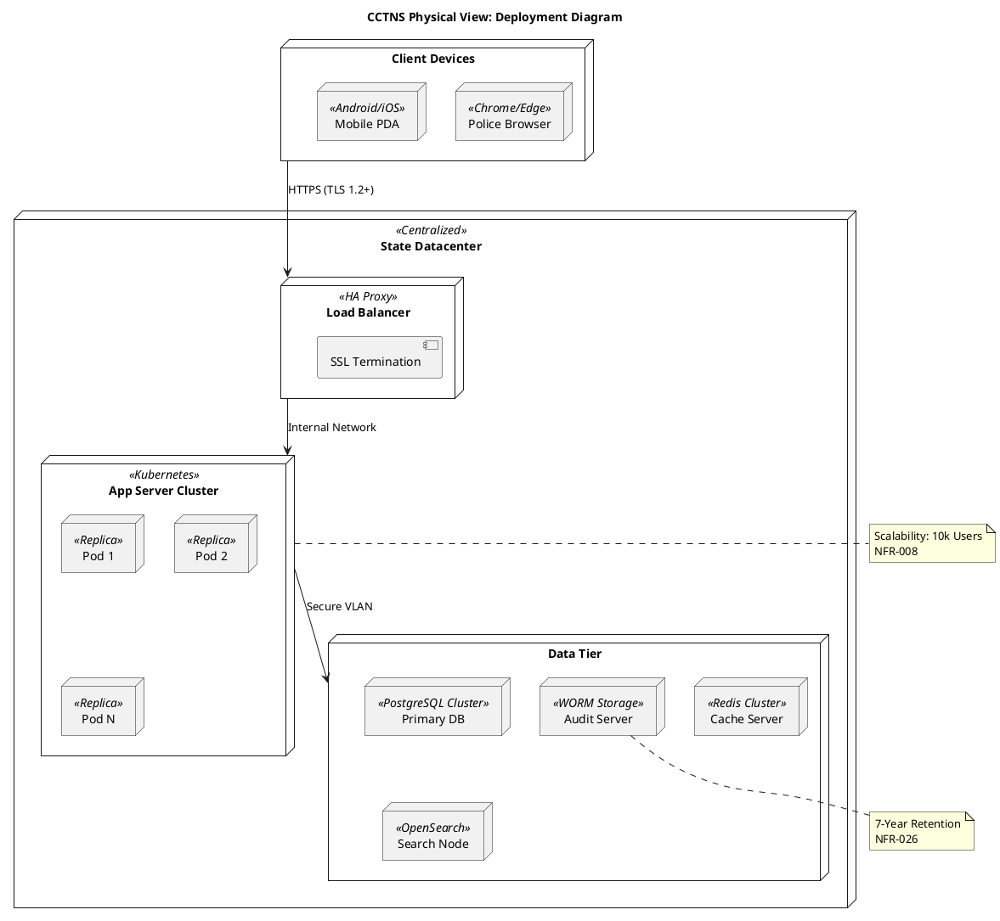

# Architecture Summary & Quality-Attribute Analysis

## High-Level Architecture Summary
The proposed architecture for the Crime and Criminal Tracking Network & Systems (CCTNS) is a **Service-Oriented Architecture (SOA)** deployed in a **Centralized 3-Tier Datacenter** configuration, adhering to the **Core-Configuration-Customization (3C)** principle. The system is logically divided into Presentation (Browser-based), Business (Service Layer), and Data (Persistence & Indexing) tiers. Security and Audit are cross-cutting concerns implemented via middleware and dedicated services. Asynchronous processing handles notifications and audit logging to ensure performance isolation.

## Quality Attribute Analysis
1.  **Security (Critical)**:
    *   **Requirements**: ASR-002 (Unalterable Audit), ASR-006 (RBAC), NFR-015 to NFR-020 (Encryption, XSS/SQLi prevention).
    *   **Risks**: Data leakage via search, audit tampering, unauthorized access.
    *   **Mitigation**: Hash-chained audit logs (WORM storage), Query-time ACL filtering, TLS 1.2+, Input Sanitization Middleware.
2.  **Performance**:
    *   **Requirements**: NFR-001/002 (Search <8s/15s), NFR-003/004 (Retrieval <8s/20s), NFR-011 (Low Bandwidth).
    *   **Risks**: Latency spikes under load, slow search on large datasets.
    *   **Mitigation**: Hierarchical Caching (ASR-007), Search Index (OpenSearch/Elasticsearch), Pagination (ASR-008), CDN for static assets.
3.  **Availability & Reliability**:
    *   **Requirements**: NFR-005 (99.9% Uptime), NFR-010 (Offline Mode), NFR-007 (RTO 8h).
    *   **Risks**: Network failure, Database downtime.
    *   **Mitigation**: Clustered App Servers, DB Replication, Local Encrypted Cache for offline ops (ASR-003 reconciliation), Auto-failover.
4.  **Scalability**:
    *   **Requirements**: NFR-008 (10k concurrent users), ASR-001 (SOA).
    *   **Risks**: Monolithic bottlenecks.
    *   **Mitigation**: Stateless Services, Horizontal Scaling, Async Messaging for Notifications/Audit.
5.  **Modifiability**:
    *   **Requirements**: ASR-014 (3C Architecture).
    *   **Risks**: State-specific customizations breaking core upgrades.
    *   **Mitigation**: Plugin Architecture, Configuration-driven UI, Separation of Core vs. Customization layers.

## Architectural Style & Rationale
**Recommended Style: Hybrid SOA + Layered + Event-Driven**

1.  **Service-Oriented Architecture (SOA)**:
    *   **Justification**: Mandated by **ASR-001**. Allows modular decomposition (Case Mgmt, Search, Audit, User Mgmt) enabling independent scaling and maintenance. Supports the 3C model (ASR-014) where core services are standard and customization is plugged in.
2.  **3-Tier Layered Architecture**:
    *   **Justification**: Mandated by **ASR-003**. Separates Presentation (Browser), Business Logic (Services), and Data Access. Ensures maintainability and security boundaries (e.g., no direct DB access from UI).
3.  **Event-Driven Architecture (EDA)**:
    *   **Justification**: Required for **FR-010 (Notifications)** and **ASR-002 (Audit Trail)**. Decouples high-latency tasks (email/SMS, audit writing) from the critical user path to meet performance NFRs (NFR-001/002).

## Architecture Patterns & Tactics
| Pattern/Tactic | Description | Mapped Requirements |
| :--- | :--- | :--- |
| **RBAC + ACL** | Role-Based Access Control with Case-level Access Control Lists. | ASR-006, FR-016, FR-021 |
| **Append-Only Log** | Cryptographic hash-chaining for audit records to ensure immutability. | ASR-002, FR-012, NFR-026 |
| **CQRS (Search)** | Separate Write Model (SQL) and Read Model (Search Index) for performance. | NFR-001, NFR-002, ASR-008 |
| **Hierarchical Cache** | Multi-level caching (Browser, App, Distributed) for frequent data. | ASR-007, NFR-003, NFR-004 |
| **Offline-First Sync** | Local encrypted storage with conflict resolution queue. | NFR-010, ASR-003 |
| **Gateway Aggregation** | API Gateway for routing, rate limiting, and SSL termination. | NFR-015, NFR-030, ASR-011 |
| **Plugin Architecture** | Extension points for State-specific customizations. | ASR-014 |

## ScenarioView
1. UseCase — Scenario View: Use Case Diagram



## LogicView
2. Class — Logic View: Class Diagram

```plantuml
@startuml ClassDiagram
title CCTNS Logic View: Class Diagram

class "User" {
    +userId: String
    +username: String
    +passwordHash: String
    +status: Enum
    +login()
    +logout()
}

class "Role" {
    +roleId: String
    +roleName: String
    +permissions: List
}

class "Case" {
    +caseId: String
    +registrationDate: Date
    +status: Enum
    +crimeType: String
    +narrative: String
    +create()
    +updateStatus()
    +close()
}

class "Complaint" {
    +complaintId: String
    +complainantName: String
    +contact: String
    +narrative: String
    +registrationId: String
}

class "Evidence" {
    +evidenceId: String
    +fileRef: String
    +captureDate: Date
    +chainOfCustody: List
    +upload()
    +verifyHash()
}

class "AuditLog" «immutable» «persisted» {
    +logId: String
    +eventType: String
    +entityId: String
    +userId: String
    +timestamp: DateTime
    +prevHash: String
    +currentHash: String
    +ipAddress: String
    +validateChain()
}

class "SearchIndex" «cacheable» {
    +indexDocId: String
    +caseSummary: String
    +keywords: List
    +aclMask: String
    +reindex()
}

class "Notification" {
    +notifId: String
    +channel: Enum
    +message: String
    +status: Enum
    +send()
}

User "1" -- "*" Role : assigned
User "1" -- "*" Case : owns
Case "1" -- "*" Evidence : contains
Case "1" -- "1" Complaint : originates
Case "1" -- "*" AuditLog : generates
SearchIndex "1" -- "1" Case : indexes

note on link "Case"
  Access controlled by FR-016
  Soft delete per NFR-021
end note

note on AuditLog
  Hash-chained per ASR-002
  Retained 7 years per NFR-026
end note

@enduml
```

3. Object — Logic View: Object Diagram

```plantuml
@startuml ObjectDiagram
title CCTNS Logic View: Object Diagram

object "user1 : User" [RegisterComplaint] {
    userId = "U-1001"
    username = "constable_raj"
    status = "Active"
}

object "case1 : Case" [RegisterComplaint] {
    caseId = "C-2023-001"
    status = "Registered"
    crimeType = "Theft"
}

object "complaint1 : Complaint" [RegisterComplaint] {
    complaintId = "CP-500"
    complainantName = "John Doe"
    registrationId = "REG-999"
}

object "audit1 : AuditLog" [RegisterComplaint] {
    logId = "LOG-001"
    eventType = "CREATE"
    entityId = "C-2023-001"
    prevHash = "0x000"
    currentHash = "0xABC"
}

user1 --> case1 : creates
case1 --> complaint1 : links
case1 --> audit1 : triggers

note right of audit1
  Immutable Record
  Hash Verified
end note

@enduml
```

4. State — Logic View: State Diagram

```plantuml
@startuml StateDiagram
title CCTNS Logic View: Case State Diagram

[*] --> Registered : Complaint Filed
Registered --> Assigned : Task Assigned (FR-002B)
Assigned --> Investigating : Investigation Started
Investigating --> Prosecution : Evidence Submitted (FR-002A)
Investigating --> Closed : Case Resolved
Prosecution --> Court : Court Interface (FR-003)
Court --> Closed : Verdict Reached
Court --> Investigating : Further Inquiry
Closed --> [*]

state "Audit Capture" as Audit {
    [*] --> Logging : On Transition
    Logging --> [*] : Hash Signed (ASR-002)
}

Registered ..> Audit : Triggers
Assigned ..> Audit : Triggers
Closed ..> Audit : Triggers

note right of Prosecution
  Court Interface Active
  FR-003
end note

@enduml
```

## ProcessView
5. Activity — Process View: Activity Diagram

```plantuml
@startuml ActivityDiagram
title CCTNS Process View: Complaint Registration Activity

start
:Complaints Module Access;
if (User Authenticated?) then (Yes)
    :Display Registration Form;
    :Input Complainant Details;
    :Input Crime Narrative;
    if (Validate Input?) then (Valid)
        :Generate Registration ID;
        :Save Complaint (Soft Create);
        :Create Case Entity;
        fork
            :Trigger Audit Log (ASR-002);
        fork again
            :Send Acknowledgement (FR-010);
        end fork
        :Display Confirmation;
    else (Invalid)
        :Show Error Message (FR-023);
    endif
else (No)
    :Redirect to Login;
endif
stop

note right of Save Complaint
  Offline Queue if Network Down (NFR-010)
  Encrypt PII (NFR-019)
end note

@enduml
```

6. Sequence — Process View: Sequence Diagram





7. Collaboration — Process View: Collaboration Diagram

```plantuml
@startuml CollaborationDiagram1
title CCTNS Process View: Collaboration Diagram (Registration)

object "1 : Citizen"
object "2 : Web Client"
object "3 : API Gateway"
object "4 : Case Service"
object "5 : Audit Service"
object "6 : Primary DB"

1 -> 2 : Submit Complaint
2 -> 3 : POST /complaints
3 -> 4 : Forward Request
4 -> 6 : Save Data
4 -> 5 : Log Event
5 -> 6 : Write Audit
4 --> 3 : Response
3 --> 2 : 200 OK
2 --> 1 : Confirm

note right of 5
  Async Audit
  ASR-002
end note

@enduml
```

```plantuml
@startuml CollaborationDiagram2
title CCTNS Process View: Collaboration Diagram (Search)

object "1 : PoliceUser"
object "2 : Web Client"
object "3 : Search Service"
object "4 : Cache Layer"
object "5 : Search Index"
object "6 : Primary DB"

1 -> 2 : Search Query
2 -> 3 : Request Search
3 -> 4 : Check Cache
4 -> 3 : Miss
3 -> 5 : Query ACL Filtered
5 -> 3 : Result IDs
3 -> 6 : Fetch Details
6 -> 3 : Case Data
3 -> 2 : Results
2 -> 1 : Display

note left of 5
  ACL Enforcement
  FR-021
end note

@enduml
```

## DevelopmentView
8. Package — Development View: Package Diagram

```plantuml
@startuml PackageDiagram
title CCTNS Development View: Package Diagram

package "Presentation Layer" [Browser Based] {
    package "UI Components" <<React/Angular>>
    package "Static Assets" <<CDN>>
}

package "Service Layer" [SOA Core] {
    package "Case Management" <<Core>>
    package "User Management" <<Security>>
    package "Search Service" <<Performance>>
    package "Audit Service" <<Compliance>>
    package "Notification Service" <<Integration>>
}

package "Data Layer" [Persistence] {
    package "Relational DB" <<SQL>>
    package "Search Index" <<NoSQL>>
    package "Audit Store" <<WORM>>
}

"Presentation Layer" --> "Service Layer" : HTTPS/JSON
"Service Layer" --> "Data Layer" : JDBC/REST
"Case Management" ..> "Audit Service" : Event
"User Management" ..> "Case Management" : Auth Check

note top of "Service Layer"
  ASR-001: SOA
  ASR-014: 3C Model
end note

@enduml
```

9. Component — Development View: Component Diagram



## PhysicalView
10. Deployment — Physical View: Deployment Diagram



11. Container — Physical View: Container Diagram

```plantuml
@startuml ContainerDiagram
title CCTNS Physical View: Container Diagram

rectangle "System Boundary" {
    container "Web Application" <<SPA>> "HTML5/JS" <<Browser>>
    container "API Gateway" <<Reverse Proxy>> "Nginx/Kong" <<DMZ>>
    container "Core Services" <<Microservices>> "Java/Spring" <<App Tier>>
    container "Auth Service" <<IAM>> "Keycloak/OIDC" <<App Tier>>
    container "Primary Database" <<RDBMS>> "PostgreSQL" <<Data Tier>>
    container "Search Engine" <<Index>> "OpenSearch" <<Data Tier>>
    container "Cache" <<Memory>> "Redis" <<Data Tier>>
    container "Audit Store" <<Log>> "Immutable DB" <<Data Tier>>
}

rectangle "External Systems" {
    container "SMS Gateway" <<Telecom>>
    container "Email Server" <<SMTP>>
    container "Court System" <<External>>
}

"Web Application" --> "API Gateway" : HTTPS
"API Gateway" --> "Core Services" : REST/JSON
"API Gateway" --> "Auth Service" : OIDC
"Core Services" --> "Primary Database" : JDBC
"Core Services" --> "Search Engine" : REST
"Core Services" --> "Cache" : TCP
"Core Services" --> "Audit Store" : Append Only
"Core Services" --> "SMS Gateway" : API
"Core Services" --> "Court System" : Secure Link

note right of "Audit Store"
  ASR-002: Unalterable
  NFR-026: Retention
end note

@enduml
```