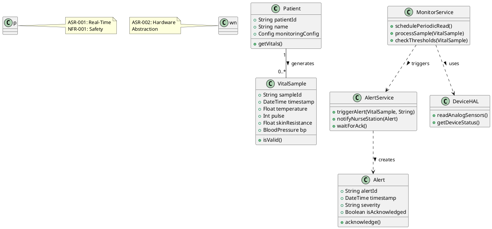
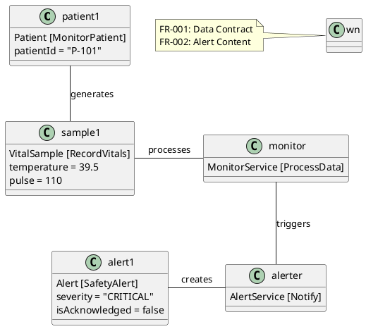
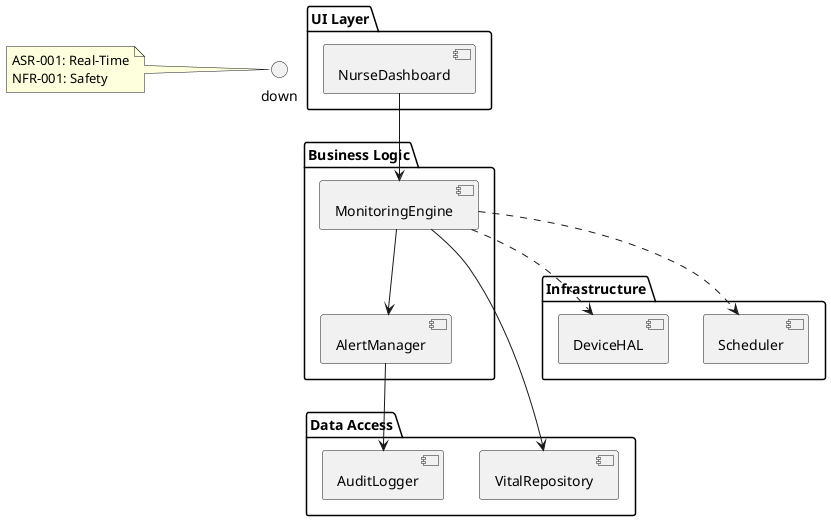

# Architecture Summary & Quality-Attribute Analysis

**Architecture Summary**:
The proposed architecture is for the **Patient Monitoring System** (derived from FR-001, FR-002, NFR-001, ASR-001, ASR-005). While the input requirements contain disjoint domains (Traffic, Library, Sluice), architectural coherence dictates isolating the Safety-Critical Medical domain. The system adopts a **Layered Architecture** with a **Real-Time Cyclic Executive** core (per Reference Knowledge) to satisfy deterministic timing (ASR-001). A **Hardware Abstraction Layer (HAL)** isolates analog device drivers (ASR-002). An **Event-Driven** mechanism handles safety alerts (FR-002) to ensure low-latency notification (NFR-001).

**Quality Attributes & Trade-offs**:
1.  **Reliability & Safety (Critical)**: Driven by NFR-001 and ASR-005.
    *   *Tactic:* Watchdog timers, Heartbeat monitoring, and Acknowledgment protocols for alerts.
    *   *Risk:* High coupling between sampling and alerting could cause missed deadlines. *Mitigation:* Separate threads/tasks for Data Acquisition vs. Alerting.
2.  **Performance (Timing)**: Driven by ASR-001 (Periodic Read ±50ms).
    *   *Tactic:* Time-Triggered Architecture (TTA) or RTOS with priority scheduling.
    *   *Trade-off:* Reduced flexibility for dynamic task addition vs. guaranteed deadlines.
3.  **Modifiability**: Driven by ASR-003 (Config).
    *   *Tactic:* Strategy Pattern for alert rules, HAL for hardware changes.
4.  **Security**: Driven by NFR-005 (General Security principles applied to Patient Data).
    *   *Tactic:* Encryption at rest/transit for Vitals, Role-Based Access Control (Nurse vs. Admin).

# Architectural Style & Rationale

**Recommended Style**: **Layered Architecture** combined with **Event-Driven** elements for alerts.
*   **Layers**: Presentation (Nurse Station), Business Logic (Monitoring & Alerting), Data Access (Storage), Infrastructure (HAL/Drivers).
*   **Rationale**:
    *   **Layering** supports separation of concerns (FR-001 Storage vs. FR-002 Alerting).
    *   **Event-Driven** is necessary for FR-002 (Alert on Violation) to ensure immediate reaction independent of the polling cycle.
    *   **Real-Time Executive** (from Reference Knowledge) is embedded in the Logic layer to satisfy ASR-001 (Deterministic Timing).

# Architecture Patterns & Tactics

1.  **Publisher-Subscriber (Event Channel)**:
    *   *Application:* VitalSigns are published; AlertService subscribes.
    *   *Addresses:* FR-002 (Alerting), NFR-001 (Reliability). Decouples data collection from safety logic.
2.  **Hardware Abstraction Layer (HAL)**:
    *   *Application:* Interface between Software and Analog Devices.
    *   *Addresses:* ASR-002 (Hardware Interface), ASR-003 (Config). Allows hardware changes without logic rewrite.
3.  **Cyclic Executive (Scheduler)**:
    *   *Application:* Main control loop for reading sensors.
    *   *Addresses:* ASR-001 (Periodic Data Acquisition). Ensures deterministic timing.
4.  **Repository Pattern**:
    *   *Application:* Data access for Vitals and Alerts.
    *   *Addresses:* FR-001 (Storage), NFR-001 (Audit Trail).

## ScenarioView
1. UseCase — Scenario View: Use Case Diagram

```plantuml
@startuml UseCaseDiagram
left "Nurse" as Nurse
right "System Admin" as Admin
"Patient Monitoring System" as System

Nurse -- (View Patient Vitals)
Nurse -- (Acknowledge Alert)
Nurse -- (Configure Monitoring Schedule)
Admin -- (Manage User Access)
Admin -- (Export Audit Logs)

(View Patient Vitals) ..> (Authenticate User) : <<include>>
(Acknowledge Alert) ..> (Log Alert Event) : <<include>>
(Configure Monitoring Schedule) ..> (Validate Configuration) : <<include>>

note "FR-001, FR-002\nNFR-001 Safety" as Note1
Note1 -down: System

@enduml
```

## LogicView
2. Class — Logic View: Class Diagram



3. Object — Logic View: Object Diagram



4. State — Logic View: State Diagram

```plantuml
@startuml StateDiagram
[*] --> Idle : System Start

state "Monitoring" as Monitoring {
  [*] --> Sampling : Timer Tick
  Sampling --> Processing : Sample Ready
  Processing --> Storing : Valid Data
  Storing --> Checking : Stored
  Checking --> Monitoring : Normal
  Checking --> Alerting : Threshold Violation
}

state "Alerting" as Alerting {
  [*] --> Notifying : Violation Detected
  Notifying --> WaitingAck : Notification Sent
  WaitingAck --> Logged : Nurse Ack (FR-002)
  Logged --> Monitoring : Resume
}

Monitoring --> Alerting : FR-002 Trigger
Alerting --> Monitoring : Auto-Resume

note "ASR-005: Fault Detection\nNFR-001: 3s Limit" as Note1
Note1 -right: Alerting

@enduml
```

## ProcessView
5. Activity — Process View: Activity Diagram

```plantuml
@startuml ActivityDiagram
start
:Load Patient Config;
partition "Real-Time Cycle" {
  :Read Analog Sensors;
  note "ASR-001: Periodic"
  :Validate Data Range;
  if (Data Invalid?) then (Yes)
    :Trigger Device Failure Alert;
    stop
  else (No)
    :Store Vital Sample;
    :Check Safety Thresholds;
    if (Out of Range?) then (Yes)
      :Generate Alert Event;
      :Send to Nurse Station;
      :Wait for Ack (Max 3s);
    else (No)
      endif
    endif
  endif
}
:Update Audit Log;
stop
@enduml
```

6. Sequence — Process View: Sequence Diagram (1. Normal Monitoring)

```plantuml
@startuml SequenceDiagram_Normal
actor Nurse
participant "Nurse Station UI" as UI
participant "MonitorService" as Service
participant "DeviceHAL" as HAL
database "VitalDB" as DB

loop "Periodic Cycle (ASR-001)"
  Service ->> HAL : readSensors()
  HAL -->> Service : VitalData
  Service ->> DB : storeSample()
  Service ->> UI : updateDisplay()
end
note "FR-001: Periodic Read\nNFR-001: Reliability" as Note1
Note1 -down: Service
@enduml
```

7. Sequence — Process View: Sequence Diagram (2. Safety Alert)

```plantuml
@startuml SequenceDiagram_Alert
participant "MonitorService" as Service
participant "AlertService" as Alerter
participant "Nurse Station" as Station
database "AuditLog" as Log

Service ->> Alerter : triggerAlert(vital)
activate Alerter
Alerter ->> Station : displayAlert()
note "NFR-001: < 3s Latency"
Station ->> Alerter : acknowledge()
Alerter ->> Log : recordEvent()
deactivate Alerter
note "FR-002: Ack Required"
@enduml
```

8. Collaboration — Process View: Collaboration Diagram

```plantuml
@startuml CollaborationDiagram
object monitor : MonitorService
object alerter : AlertService
object station : Nurse Station
object log : AuditLog

monitor -> alerter : 1. triggerAlert()
alerter -> station : 2. displayAlert()
station -> alerter : 3. acknowledge()
alerter -> log : 4. recordEvent()

note "FR-002: Alert Flow\nNFR-001: Audit Trail" as Note1
Note1 -down: log
@enduml
```

## DevelopmentView
8. Package — Development View: Package Diagram



9. Component — Development View: Component Diagram

```plantuml
@startuml ComponentDiagram
component "Sensor Adapter" as Sensor {
  port in "RawData"
}

component "Rule Engine" as Rules {
  port in "Vitals"
  port out "Alerts"
}

component "Alert Dispatcher" as Dispatcher {
  port in "Alerts"
  port out "HTTP/SMS"
}

component "Persistence" as DB {
  port in "SQL"
}

Sensor --> Rules : VitalStream
Rules --> Dispatcher : CriticalEvent
Rules --> DB : StoreSample
Dispatcher --> DB : LogAlert

note "ASR-002: Hardware Interface" as Note1
Note1 -up: Sensor
note "FR-002: Notification" as Note2
Note2 -up: Dispatcher
@enduml
```

## PhysicalView
10. Deployment — Physical View: Deployment Diagram

```plantuml
@startuml DeploymentDiagram
node "Nurse Station" {
  node "Web Browser" {
    component "Dashboard UI"
  }
}

node "Monitoring Server" {
  node "App Server" {
    component "MonitorService"
    component "AlertService"
  }
  node "Database Server" {
    component "VitalDB"
  }
}

node "Patient Room" {
  node "Gateway Device" {
    component "DeviceHAL"
  }
  device "Analog Sensors"
}

"Dashboard UI" -[HTTP]-> "MonitorService"
"MonitorService" -[JDBC]-> "VitalDB"
"MonitorService" -[TCP/IP]-> "DeviceHAL"
"DeviceHAL" -[GPIO]-> "Analog Sensors"

note "NFR-001: 99.99% Uptime" as Note1
Note1 -down: Monitoring Server
@enduml
```

11. Container — Physical View: Container Diagram

```plantuml
@startuml ContainerDiagram
Person "Nurse" as Nurse
System_Boundary "Patient Monitoring System" {
  Container "Web App", "React", "Nurse Interface"
  Container "Backend API", "Spring Boot", "Vital Processing & Alerting"
  ContainerDb "Database", "PostgreSQL", "Vital Records & Audit Logs"
  Container_Ext "SMS/Email Gateway", "External", "Emergency Notifications"
}

Rel(Nurse, "Web App", "Uses", "HTTPS")
Rel("Web App", "Backend API", "REST/JSON", "Vitals & Alerts")
Rel("Backend API", "Database", "JDBC", "Store/Retrieve")
Rel("Backend API", "SMS/Email Gateway", "API Call", "Critical Alerts")

note "ASR-001: Low Latency\nNFR-005: Encryption" as Note1
Note1 -down: Backend API
@enduml
```