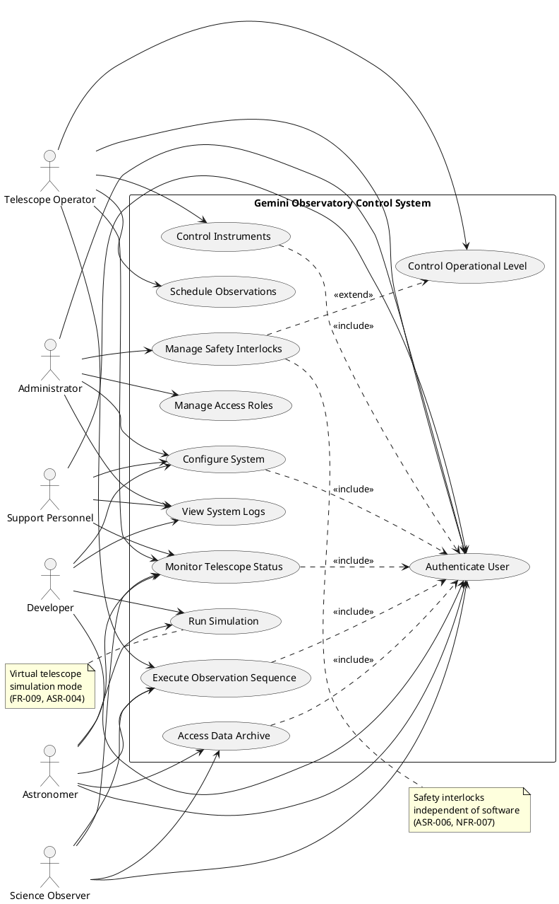
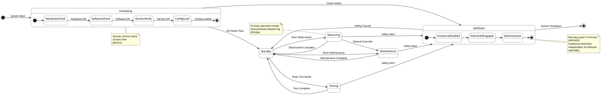
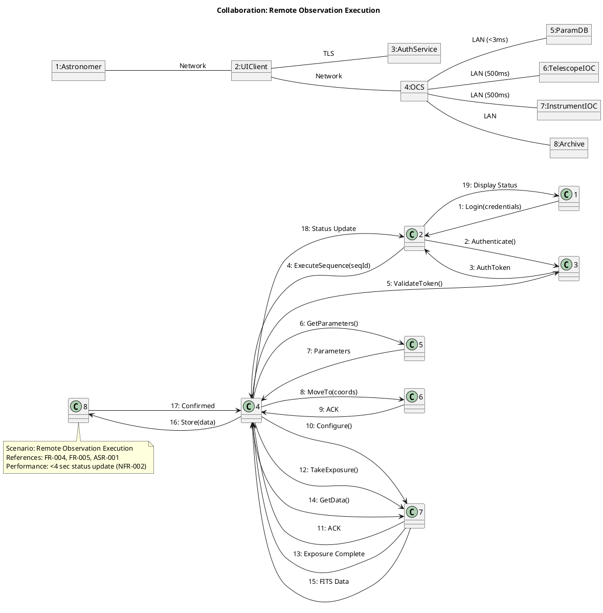
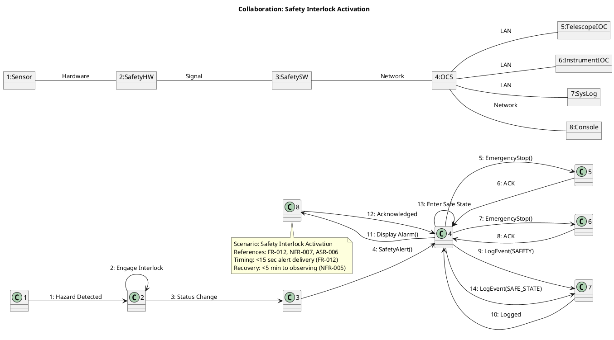
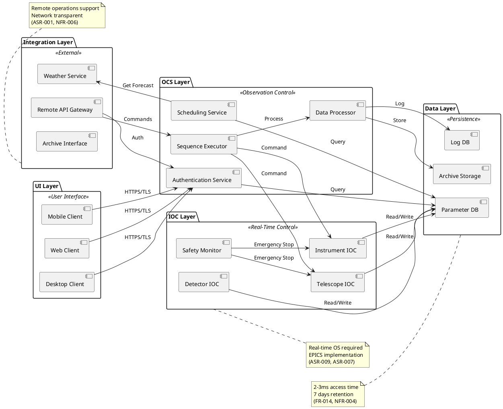
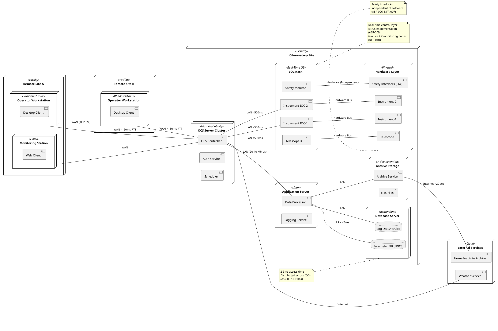

# Architecture Summary & Quality-Attribute Analysis

## Proposed Architecture Summary

The Gemini Observatory Control System requires a **Distributed Layered Architecture with Event-Driven Elements**. The system is organized into four primary layers:

1. **User Interface Layer** - Remote/local operator consoles, web interfaces
2. **Observation Control System (OCS) Layer** - Command coordination, scheduling, sequencing
3. **Instrument Object Controller (IOC) Layer** - Real-time hardware control, EPICS-based
4. **Hardware/Safety Layer** - Physical instruments, detectors, safety interlocks

This architecture supports distributed remote operations (ASR-001), real-time control at IOC level (ASR-009), and modular subsystem independence (ASR-008).

## Quality Attribute Analysis

| Quality Attribute | Key Requirements | Architectural Risks | Trade-offs |
|------------------|------------------|---------------------|------------|
| **Security** | NFR-001, ASR-001 | Remote access increases attack surface | TLS overhead vs. security |
| **Performance** | NFR-002, NFR-003, NFR-009 | Network latency for remote ops | Local caching vs. data freshness |
| **Reliability** | NFR-005, NFR-018 | Distributed failure modes | Redundancy vs. complexity |
| **Safety** | NFR-007, ASR-006 | Software-independent interlocks required | Hardware cost vs. risk mitigation |
| **Maintainability** | NFR-008, ASR-008 | Module interface governance | Strict contracts vs. flexibility |
| **Scalability** | NFR-010 | 10 active nodes max | Fixed capacity vs. growth |

## Recommended Architecture Style

**Hybrid: Layered + Event-Driven + Distributed**

**Justification:**
- **Layered**: Matches the natural hierarchy (UI → OCS → IOC → Hardware) per ASR-009
- **Event-Driven**: Supports logging (ASR-005), safety alerts (ASR-006), and monitoring (FR-006)
- **Distributed**: Required for remote operations (ASR-001, FR-005)

---

## Architecture Patterns & Tactics

| Pattern/Tactic | Purpose | Addresses |
|---------------|---------|-----------|
| **Broker Pattern** | Message routing between distributed components | ASR-001, FR-018 |
| **Repository Pattern** | Parameter database access | FR-014, ASR-007 |
| **State Pattern** | Operational level management | FR-002, FR-003 |
| **Observer Pattern** | Multi-point monitoring | FR-006, NFR-018 |
| **Circuit Breaker** | Fault isolation | NFR-018, NFR-005 |
| **Hardware Abstraction** | Simulation support | FR-009, ASR-004, NFR-017 |
| **RBAC** | Role-based access control | FR-001, NFR-001 |
| **Publisher-Subscriber** | Logging and events | ASR-005, FR-011 |

---

## ScenarioView

### 1. UseCase — Scenario View: Use Case Diagram



---

## LogicView

### 2. Class — Logic View: Class Diagram

```plantuml
@startuml ClassDiagram
left to right direction
skinparam classAttributeIconSize 0

class User {
    -userId: String
    -username: String
    -role: UserRole
    -sessionToken: String
    +login(credentials): AuthToken
    +logout(): void
    +getPermissions(): List<Permission>
}

class UserRole {
    -roleName: String
    -privileges: List<Privilege>
    +hasAccess(subsystem): boolean
    +getAccessMode(): AccessMode
}

class AccessMode {
    -modeName: String
    -capabilities: List<Capability>
    +isEnabled(feature): boolean
}

class OperationalLevel {
    -levelName: String
    -allowedModes: List<AccessMode>
    +transition(newLevel): boolean
    +getCurrentLevel(): OperationalLevel
}

class Instrument {
    -instrumentId: String
    -instrumentType: String
    -status: InstrumentStatus
    -isMounted: boolean
    +getStatus(): InstrumentStatus
    +configure(config): void
    +takeExposure(params): Data
}

class Telescope {
    -telescopeId: String
    -position: Coordinates
    -focus: Double
    -currentInstrument: Instrument
    +moveTo(coords): void
    +setFocus(value): void
    +getBeamAccess(): Instrument
}

class ObservationSequence {
    -sequenceId: String
    -steps: List<ObservationStep>
    -priority: Integer
    -weatherConstraints: WeatherRule
    +execute(): void
    +pause(): void
    +resume(): void
}

class DataAcquisition {
    -detectorId: String
    -compressionMethod: String
    -format: DataFormat
    +acquireData(): FITSData
    +compress(data): byte[]
    +store(data, location): void
}

class «persisted» ParameterDatabase {
    -dbName: String
    -accessLatency: Long
    +getParameter(name): Value
    +setParameter(name, value): void
    +getAtomic(name): Value
}

class SafetyInterlock {
    -interlockId: String
    -hazardLevel: HazardLevel
    -isHardwareBased: boolean
    -status: InterlockStatus
    +check(): boolean
    +engage(): void
    +getStatus(): InterlockStatus
}

class SystemLog {
    -logId: String
    -timestamp: DateTime
    -eventType: EventType
    -severity: LogSeverity
    -source: String
    +log(event): void
    +getLogs(filter): List<SystemLog>
    +flushBuffer(): void
}

class Simulator {
    -simulatedComponent: String
    -simulationMode: SimMode
    +executeCommand(cmd): Response
    +getSimulatedData(): Data
    +validateAgainstHardware(): boolean
}

User "1" -- "1" UserRole : has
UserRole "1" -- "1..*" AccessMode : grants
OperationalLevel "1" -- "1..*" AccessMode : allows
Telescope "1" -- "0..*" Instrument : mounts
ObservationSequence "1" -- "1" Telescope : controls
DataAcquisition "1" -- "1" Instrument : reads from
ParameterDatabase "1" -- "1..*" Telescope : configures
ParameterDatabase "1" -- "1..*" Instrument : configures
SafetyInterlock "1" -- "1" Telescope : protects
SafetyInterlock "1" -- "1..*" Instrument : protects
SystemLog "1" -- "1..*" User : tracks
SystemLog "1" -- "1..*" Instrument : monitors
Simulator "1" -- "1" Instrument : simulates
Simulator "1" -- "1" Telescope : simulates

note right of SafetyInterlock
  Hardware-independent
  for critical hazards
  (ASR-006, NFR-007)
end note

note left of ParameterDatabase
  2-3ms access time
  EPICS at IOC level
  (FR-014, ASR-007)
end note

note right of SystemLog
  200Hz short-term
  1Hz long-term
  (NFR-013, ASR-005)
end note

@enduml
```

---

### 3. Object — Logic View: Object Diagram

```plantuml
@startuml ObjectDiagram
left to right direction

object user1 : User [AuthenticateUser] {
    userId = "USR-001"
    username = "astro_jones"
    role = "Astronomer"
    sessionToken = "tok_abc123"
}

object role1 : UserRole [AuthenticateUser] {
    roleName = "Astronomer"
    privileges = ["OBSERVE", "MONITOR", "DATA_ACCESS"]
}

object mode1 : AccessMode [AuthenticateUser] {
    modeName = "Observing"
    capabilities = ["ExecuteSequence", "MonitorStatus"]
}

object telescope1 : Telescope [ExecuteObservation] {
    telescopeId = "GEMINI-N"
    position = "RA:12h30m DEC:+45°"
    focus = 15.2
    currentInstrument = "instrument1"
}

object instrument1 : Instrument [ExecuteObservation] {
    instrumentId = "NIRI-01"
    instrumentType = "Near-Infrared"
    status = "READY"
    isMounted = true
}

object sequence1 : ObservationSequence [ExecuteObservation] {
    sequenceId = "SEQ-2024-001"
    priority = 1
    weatherConstraints = "CLEAR"
}

object interlock1 : SafetyInterlock [ExecuteObservation] {
    interlockId = "SAFE-001"
    hazardLevel = "CRITICAL"
    isHardwareBased = true
    status = "ENGAGED"
}

object db1 : ParameterDatabase [ExecuteObservation] {
    dbName = "TELEMETRY_DB"
    accessLatency = 2
}

user1 --> role1 : has
role1 --> mode1 : grants
telescope1 --> instrument1 : mounts
sequence1 --> telescope1 : controls
interlock1 --> telescope1 : protects
db1 --> telescope1 : configures
db1 --> instrument1 : configures

note right of interlock1
  Hardware interlock
  engaged for safety
end note

note left of db1
  Access latency: 2ms
  within SLO
end note

@enduml
```

---

### 4. State — Logic View: State Diagram



---

## ProcessView

### 5. Activity — Process View: Activity Diagram

```plantuml
@startuml ActivityDiagram
left to right direction
skinparam activity {
    BackgroundColor white
    BorderColor black
}

start

:User Login;
note right: TLS1.2+ required
(NFR-001)

partition "Authentication" {
    :Validate Credentials;
    if (Valid?) then (yes)
        :Generate Auth Token;
        :Assign Role & Privileges;
    else (no)
        :Log Failed Attempt;
        if (Attempts >= 5?) then (yes)
            :Lock Account;
            :Alert Security;
        else (no)
            :Return Error;
        endif
        stop
    endif
}

:Select Operational Level;
note right: Observing/Maintenance/Test
(FR-002)

partition "Safety Check" {
    :Check Hardware Interlocks;
    note right: Independent of software
    (ASR-006)
    if (All Safe?) then (yes)
        :Clear for Operation;
    else (no)
        :Enter Safe State;
        :Issue Alarms;
        stop
    endif
}

partition "Observation Execution" {
    :Load Observation Sequence;
    :Verify Instrument Availability;
    fork
        :Configure Telescope;
        :Set Instrument Parameters;
    fork again
        :Monitor Weather;
        :Track Schedule Priority;
    end fork
    
    :Execute Exposure;
    note right: <3min readout
    (NFR-009)
    
    :Acquire Data;
    :Compress (Lossless);
    note right: FITS format
    (NFR-011)
    
    :Store to Archive;
    note right: 7 days retention
    (NFR-004)
}

:Log All Events;
note right: 200Hz short-term
(NFR-013)

:Update Status Display;
note right: <4 sec update
(NFR-002)

if (Sequence Complete?) then (yes)
    :Notify User;
    :Archive Final Data;
else (no)
    :Continue Next Step;
endif

stop

@enduml
```

---

### 6. Sequence — Process View: Sequence Diagram

```plantuml
@startuml SequenceDiagram1
title Sequence: Remote Observation Execution (FR-004, FR-005, ASR-001)
left to right direction
skinparam sequence {
    LifeLineBorderColor black
    LifeLineBackgroundColor white
}

actor "Remote Astronomer" as Astronomer
participant "UI Client" as UIClient
participant "Auth Service" as AuthService
participant "OCS Controller" as OCS
participant "Instrument IOC" as InstrumentIOC
participant "Telescope IOC" as TelescopeIOC
participant "Parameter DB" as ParamDB
participant "Data Archive" as Archive

Astronomer -> UIClient : Login(credentials)
UIClient -> AuthService : Authenticate(username, password)
AuthService --> UIClient : AuthToken + Role
note right: TLS1.2+ (NFR-001)

Astronomer -> UIClient : Submit Observation Sequence
UIClient -> OCS : ExecuteSequence(seqId, token)
OCS -> AuthService : ValidateToken(token)
AuthService --> OCS : Role=Astronomer, Privileges=[...]

OCS -> ParamDB : GetParameters(telescope, instrument)
note right: <3ms access (FR-014)
ParamDB --> OCS : Parameters

OCS -> TelescopeIOC : MoveTo(coordinates)
TelescopeIOC --> OCS : ACK (<500ms)
note right: 500ms timeout (FR-018)

OCS -> InstrumentIOC : Configure(exposureParams)
InstrumentIOC --> OCS : ACK

OCS -> InstrumentIOC : TakeExposure()
InstrumentIOC --> OCS : Exposure Complete
note right: <3min readout (NFR-009)

OCS -> InstrumentIOC : GetData()
InstrumentIOC --> OCS : FITS Data

OCS -> OCS : Compress(Lossless)
note right: FITS format (NFR-011)

OCS -> Archive : Store(data, metadata)
Archive --> OCS : Storage Confirmed
note right: 7 days retention (NFR-004)

OCS --> UIClient : Sequence Progress Update
note right: <4 sec update (NFR-002)
UIClient --> Astronomer : Display Status

Astronomer -> UIClient : Request Quick-Look Data
UIClient -> OCS : GetQuickLook(exposureId)
OCS --> UIClient : Processed Data
note right: Within exposure sequence (FR-019)

@enduml
```

---

```plantuml
@startuml SequenceDiagram2
title Sequence: Safety Interlock Activation (FR-012, NFR-007, ASR-006)
left to right direction
skinparam sequence {
    LifeLineBorderColor black
    LifeLineBackgroundColor white
}

participant "Hardware Sensor" as Sensor
participant "Safety Interlock HW" as SafetyHW
participant "Safety Monitor SW" as SafetySW
participant "OCS Controller" as OCS
participant "Instrument IOC" as InstrumentIOC
participant "Telescope IOC" as TelescopeIOC
participant "System Log" as SysLog
participant "Ops Console" as Console

Sensor -> SafetyHW : Hazard Detected
note right: Hardware-independent\n(ASR-006)
SafetyHW -> SafetyHW : Engage Interlock

SafetyHW -> SafetySW : Interlock Status Change
SafetySW -> OCS : SafetyAlert(hazardId, severity)
note right: <15 sec delivery (FR-012)

OCS -> TelescopeIOC : EmergencyStop()
TelescopeIOC --> OCS : ACK

OCS -> InstrumentIOC : EmergencyStop()
InstrumentIOC --> OCS : ACK

OCS -> SysLog : LogEvent(SAFETY_ALERT, hazardId)
note right: Timestamp + source (FR-011)
SysLog --> OCS : Logged

OCS -> Console : Display Alarm(alarmId, message)
note right: All ops consoles (FR-012)
Console --> OCS : Alarm Acknowledged

OCS -> OCS : Enter Safe State
note right: <5 min recovery (NFR-005)

OCS -> SysLog : LogEvent(SAFE_STATE_ENTRY)
SysLog --> OCS : Logged

SafetyHW -> SafetyHW : Test Interlock (periodic)
note right: Every 168h (NFR-007)
SafetyHW -> SysLog : Log Test Result

alt Test Failed
    SafetyHW -> SafetyHW : Hard Shutdown
    SafetyHW -> SysLog : Log Interlock Failure
else Test Passed
    SafetyHW -> SysLog : Log Interlock OK
end

@enduml
```

---

### 7. Collaboration — Process View: Collaboration Diagram



---



---

## DevelopmentView

### 8. Package — Development View: Package Diagram



---

### 9. Component — Development View: Component Diagram

```plantuml
@startuml ComponentDiagram
left to right direction
skinparam component {
    BackgroundColor white
    BorderColor black
}

component "AuthComponent" <<Authentication>> {
    [Login Handler] as LoginHandler
    [Token Manager] as TokenManager
    [Role Validator] as RoleValidator
}

component "OCS Controller" <<Command Control>> {
    [Command Router] as CmdRouter
    [Sequence Manager] as SeqManager
    [Scheduler] as Scheduler
}

component "Instrument Manager" <<Resource Mgmt>> {
    [Instrument Registry] as InstRegistry
    [Beam Arbitrator] as BeamArb
    [Calibration Handler] as CalibHandler
}

component "Data Handler" <<Acquisition>> {
    [FITS Encoder] as FITSEncoder
    [Compressor] as Compressor
    [Archive Writer] as ArchiveWriter
}

component "Safety Controller" <<Safety>> {
    [Interlock Monitor] as InterlockMon
    [Emergency Handler] as EmergHandler
    [Alarm Manager] as AlarmMgr
}

component "Logging Service" <<Logging>> {
    [Event Logger] as EventLogger
    [Buffer Manager] as BufferMgr
    [Log Retention] as LogRetention
}

component "Simulator" <<Simulation>> {
    [Hardware Simulator] as HWSim
    [Virtual Telescope] as VirtTel
    [Test Validator] as TestVal
}

component "Parameter DB" <<EPICS>> {
    [IOC Channel] as IOCChannel
    [Host DB] as HostDB
    [Sync Manager] as SyncMgr
}

LoginHandler --> TokenManager : Generate
TokenManager --> RoleValidator : Validate
CmdRouter --> SeqManager : Route
SeqManager --> Scheduler : Query
SeqManager --> BeamArb : Request Access
BeamArb --> InstRegistry : Check Status
InstRegistry --> CalibHandler : Coordinate

FITSEncoder --> Compressor : Compress
Compressor --> ArchiveWriter : Write
InterlockMon --> EmergHandler : Trigger
EmergHandler --> AlarmMgr : Notify

EventLogger --> BufferMgr : Buffer (200Hz)
BufferMgr --> LogRetention : Flush

HWSim --> VirtTel : Simulate
TestVal --> HWSim : Validate

CmdRouter --> IOCChannel : Command
IOCChannel --> HostDB : Sync

note right of Safety Controller
  Hardware-independent
  interlocks for critical hazards
  (ASR-006, NFR-007)
end note

note left of Parameter DB
  EPICS at IOC level
  2-3ms access latency
  (ASR-007, FR-014)
end note

note bottom of Simulator
  No hardware required
  Pass 100% test suite
  (FR-009, ASR-004)
end note

@enduml
```

---

## PhysicalView

### 10. Deployment — Physical View: Deployment Diagram



---

### 11. Container — Physical View: Container Diagram

```plantuml
@startuml ContainerDiagram
left to right direction
skinparam container {
    BackgroundColor white
    BorderColor black
}

rectangle "Remote Operations" <<External>> {
    container "Web Browser" <<HTML5/JavaScript>> as WebBrowser {
        Responsibility: Remote UI access
        Technology: HTTPS, WebSocket
        Scale: 100 concurrent sessions (ASR-001)
    }
    
    container "Desktop Application" <<Qt/C++>> as DesktopApp {
        Responsibility: Full operator console
        Technology: TLS1.2+, Local cache
        Scale: Multi-site deployment
    }
}

rectangle "Observatory Backend" <<On-Premise>> {
    container "API Gateway" <<Nginx/Node>> as APIGateway {
        Responsibility: Request routing, auth proxy
        Technology: TLS termination, rate limiting
        Security: TLS1.2+, 100 sessions min (ASR-001)
    }
    
    container "OCS Application" <<Java/Python>> as OCSApp {
        Responsibility: Observation coordination
        Technology: Message queue, async processing
        Performance: <2s command response (NFR-002)
    }
    
    container "Auth Service" <<Java>> as AuthSvc {
        Responsibility: Authentication, RBAC
        Technology: JWT, OAuth2
        Security: 180-day audit log (NFR-001)
    }
    
    container "Data Processor" <<Python/C>> as DataProc {
        Responsibility: FITS encoding, compression
        Technology: Lossless compression
        Performance: <20 sec transmission (NFR-011)
    }
    
    container "Parameter Database" <<EPICS/PostgreSQL>> as ParamDB {
        Responsibility: System parameters
        Technology: EPICS channels, SQL
        Performance: 2-3ms access (FR-014)
        Capacity: 10 active nodes (NFR-010)
    }
    
    container "Log Database" <<SYBASE>> as LogDB {
        Responsibility: Event logging
        Technology: Relational DBMS
        Performance: 200Hz short-term (NFR-013)
        Retention: 30 days minimum
    }
    
    container "Archive Storage" <<File System>> as Archive {
        Responsibility: Data retention
        Technology: FITS format, compression
        Capacity: 7 days (NFR-004)
        Interactive: 3 days on disk
    }
    
    container "IOC Controller" <<EPICS RTOS>> as IOC {
        Responsibility: Real-time hardware control
        Technology: EPICS, RTOS
        Performance: 500ms timeout (FR-018)
        Readout: 0.1s focus, 3min full (NFR-009)
    }
}

rectangle "External Services" <<Cloud>> {
    container "Weather API" <<REST>> as WeatherAPI {
        Responsibility: Weather data
        Integration: Scheduling decisions
    }
    
    container "Home Institute" <<FTP/HTTPS>> as HomeInst {
        Responsibility: Data transfer
        Performance: <20 sec (NFR-011)
        Format: FITS NOST 100-1.0
    }
}

WebBrowser --> APIGateway : HTTPS/WSS
DesktopApp --> APIGateway : TLS1.2+

APIGateway --> AuthSvc : Validate Token
APIGateway --> OCSApp : Route Commands

OCSApp --> ParamDB : Read/Write Params
OCSApp --> LogDB : Log Events
OCSApp --> DataProc : Process Data
OCSApp --> IOC : Hardware Commands

DataProc --> Archive : Store FITS
DataProc --> HomeInst : Transfer Data

OCSApp --> WeatherAPI : Query Forecast
AuthSvc --> LogDB : Audit Log (180 days)

note right of "API Gateway"
  Network transparency
  Remote operations support
  (ASR-001, NFR-006)
end note

note left of "IOC Controller"
  Real-time boundary
  Hardware abstraction
  (ASR-009, ASR-004)
end note

note bottom of "Archive Storage"
  7 days total retention
  3 days interactive
  (NFR-004)
end note

@enduml
```