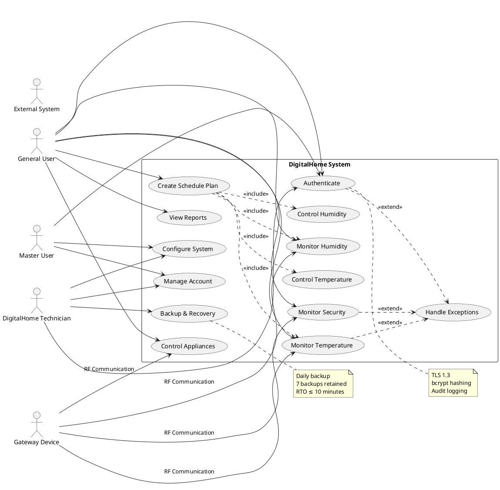
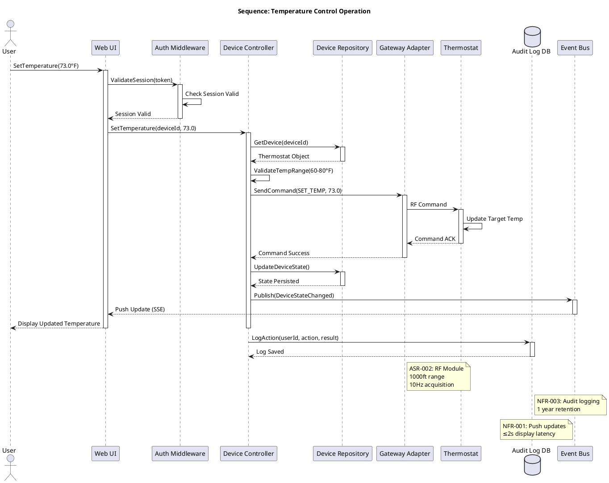
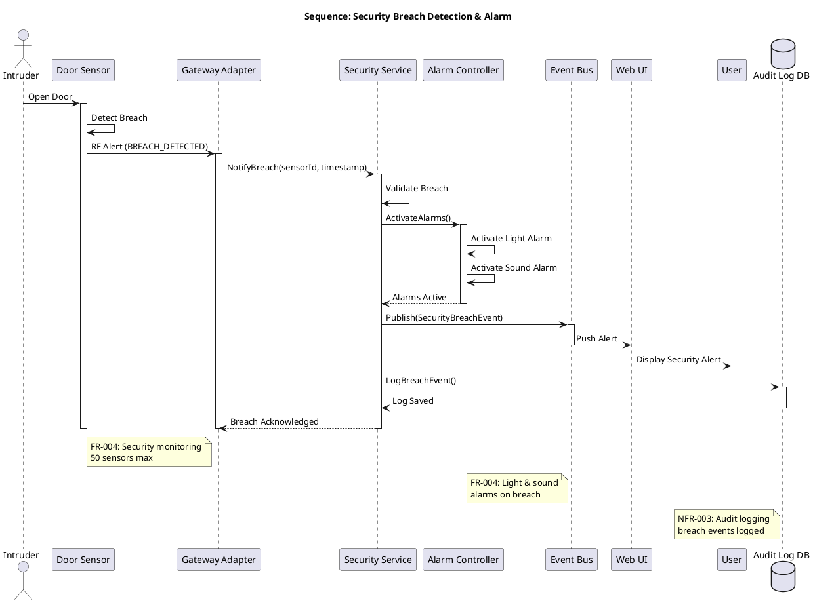
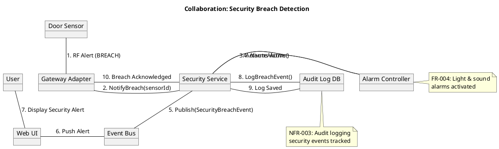
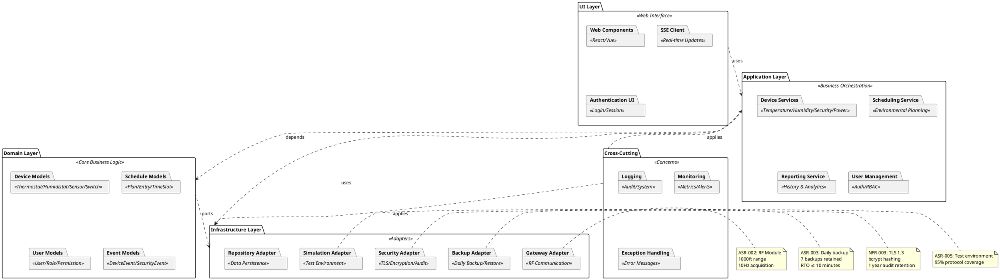

## Architecture Summary & Quality-Attribute Analysis

**Proposed Architecture: Modular Monolith with Hexagonal (Ports & Adapters) Architecture**

The DigitalHome System will be deployed as a **local home server** (ASR-001) running on customer-premise hardware, communicating with IoT devices through a **Gateway Device** (ASR-002) using RF protocols. The architecture follows a **modular monolith** pattern with clear domain boundaries to balance cost constraints (NFR-007) with commercial extensibility (ASR-004).

### Quality Attribute Analysis

| Quality Attribute | Requirements | Architectural Risks | Trade-offs |
|------------------|--------------|---------------------|------------|
| **Performance** | NFR-001 (2s display, 10Hz acquisition) | Local server resource constraints | Push-based UI (SSE/WebSocket) vs polling |
| **Reliability** | NFR-002 (1 failure/10,000 hrs), ASR-003 | Single-point failure on home server | Daily backup with 7-day retention, RTO ≤10min |
| **Security** | NFR-003 (TLS 1.3, bcrypt, audit logs) | Exposing home server to Internet | Local deployment reduces attack surface |
| **Maintainability** | NFR-005 (UML 2.0, OO), ASR-004 | Monolith codebase growth | Hexagonal boundaries enable module isolation |
| **Scalability** | FR-002-005 (device counts) | Fixed device limits per home | Horizontal scaling not required for prototype |
| **Usability** | NFR-004 (Web UI, WCAG 2.1 AA) | Browser compatibility | Standard web technologies reduce risk |

### Recommended Architecture Style

**Hybrid: Layered + Hexagonal (Ports & Adapters) + Event-Driven**

- **Layered**: Separation of concerns (UI, Business Logic, Data Access)
- **Hexagonal**: Domain logic isolated from infrastructure (Gateway, Database, Web)
- **Event-Driven**: Device state changes propagate through event bus for real-time updates

**Justification:**
- ASR-001 requires local deployment → Monolith reduces operational complexity
- NFR-001 requires 10Hz acquisition → Event-driven architecture supports async processing
- ASR-004 requires OO/UML → Layered architecture maps cleanly to UML diagrams
- NFR-007 cost constraints → Single deployment unit minimizes infrastructure costs

---

## Architectural Style & Rationale

### Primary Style: Modular Monolith with Hexagonal Architecture

**Rationale:**
1. **ASR-001 (Home Web Server)**: Local deployment on home computer favors single deployment unit over distributed microservices
2. **NFR-007 (Cost/Schedule)**: 12-month prototype with minimized cost → reduced operational overhead
3. **ASR-004 (Development Standards)**: OO design with UML 2.0 → clean module boundaries support documentation
4. **NFR-001 (Performance)**: 10Hz sensor acquisition requires efficient internal communication → in-process event bus
5. **FR-006 (Scheduling)**: Complex business logic benefits from isolated domain layer

### Secondary Style: Event-Driven for Device Communication

**Rationale:**
1. **FR-002/003/004/005**: Multiple device types need asynchronous state updates
2. **NFR-001**: 2-second display update latency requires push-based UI updates (SSE/WebSocket)
3. **ASR-002**: Gateway communication may have intermittent connectivity → event buffering

### Style Interaction

```
┌─────────────────────────────────────────────────────────┐
│                    Web UI Layer                          │
│              (REST API + SSE/WebSocket)                  │
└─────────────────────────────────────────────────────────┘
                          ↓
┌─────────────────────────────────────────────────────────┐
│              Application Services Layer                  │
│         (Orchestration, Transaction Management)          │
└─────────────────────────────────────────────────────────┘
                          ↓
┌─────────────────────────────────────────────────────────┐
│                 Domain Layer (Hexagonal)                 │
│    (Core Business Logic, Device Control, Scheduling)     │
└─────────────────────────────────────────────────────────┘
                          ↓
┌─────────────────────────────────────────────────────────┐
│              Infrastructure Adapters                     │
│  (Gateway RF, Database, Backup, Authentication, Events)  │
└─────────────────────────────────────────────────────────┘
```

---

## Architecture Patterns & Tactics

### Architectural Patterns

| Pattern | Application | Addresses |
|---------|-------------|-----------|
| **Repository** | Data access abstraction for all entities | NFR-005 (Maintainability), ASR-004 (OO Design) |
| **Observer/Event Bus** | Device state changes propagate to UI | NFR-001 (Performance), FR-006 (Scheduling) |
| **Strategy** | Different device types (Thermostat, Humidistat, Sensor, Switch) | FR-002/003/004/005 (Device polymorphism) |
| **Command** | Device control operations (set temperature, toggle switch) | FR-002/003/005 (Action encapsulation) |
| **Factory** | Device instance creation based on type | ASR-002 (Gateway device abstraction) |
| **Middleware** | Authentication, Authorization, Audit Logging | FR-001, NFR-003 (Security) |

### Quality Attribute Tactics

| Quality Attribute | Tactic | Maps To |
|------------------|--------|---------|
| **Performance** | Push-based UI updates (SSE), In-memory caching for device states | NFR-001 (2s update) |
| **Reliability** | Daily automated backups, Heartbeat monitoring, Graceful degradation | NFR-002, ASR-003 |
| **Security** | TLS 1.3, bcrypt password hashing, RBAC, Audit logging | NFR-003, FR-001 |
| **Maintainability** | Hexagonal boundaries, Repository pattern, UML documentation | NFR-005, ASR-004 |
| **Usability** | WCAG 2.1 AA compliance, Error message localization | NFR-004, FR-010 |
| **Testability** | Simulation adapter for Gateway, Contract testing | ASR-005 |

---

## ScenarioView

### 1. UseCase — Scenario View: Use Case Diagram



---

## LogicView

### 2. Class — Logic View: Class Diagram

```plantuml
@startuml Class_Diagram

set namespaceSeparator ::

class User {
  -userId: String
  -email: String
  -passwordHash: String
  -role: UserRole
  -createdAt: DateTime
  -lastLogin: DateTime
  +authenticate(credentials): Boolean
  +updatePassword(newPassword): void
  +getPermissions(): List<Permission>
}

class UserRole {
  +GENERAL: UserRole
  +MASTER: UserRole
  +TECHNICIAN: UserRole
  +getPermissions(): List<Permission>
}

class Device {
  -deviceId: String
  -deviceType: DeviceType
  -location: String
  -status: DeviceStatus
  -lastUpdate: DateTime
  +getState(): DeviceState
  +setState(state: DeviceState): void
  +isOnline(): Boolean
}

class Thermostat <<persisted>> {
  -currentTemp: Float
  -targetTemp: Float
  -minTemp: Float = 60.0
  -maxTemp: Float = 80.0
  +setTemperature(temp: Float): void
  +getTemperature(): Float
  +getSchedule(): List<ScheduleEntry>
}

class Humidistat <<persisted>> {
  -currentHumidity: Float
  -targetHumidity: Float
  -minHumidity: Float = 30.0
  -maxHumidity: Float = 60.0
  +setHumidity(level: Float): void
  +getHumidity(): Float
  +getSchedule(): List<ScheduleEntry>
}

class SecuritySensor <<persisted>> {
  -sensorType: SensorType
  -isTriggered: Boolean
  -lastBreach: DateTime
  +detectBreach(): Boolean
  +reset(): void
  +getBreachHistory(): List<BreachEvent>
}

class PowerSwitch <<persisted>> {
  -isOn: Boolean
  -voltage: Float = 115.0
  -maxAmps: Float = 10.0
  +toggle(): void
  +turnOn(): void
  +turnOff(): void
  +getState(): Boolean
}

class SchedulePlan <<persisted>> {
  -planId: String
  -userId: String
  -startDate: Date
  -endDate: Date
  -entries: List<ScheduleEntry>
  +createEntry(entry: ScheduleEntry): void
  +modifyEntry(entryId: String, newEntry: ScheduleEntry): void
  +getEntriesForDay(day: Date): List<ScheduleEntry>
}

class ScheduleEntry {
  -entryId: String
  -timeSlot: TimeSlot
  -deviceType: DeviceType
  -targetValue: Float
  +isValid(): Boolean
  +conflictsWith(other: ScheduleEntry): Boolean
}

class AuditLog <<persisted>> {
  -logId: String
  -timestamp: DateTime
  -userId: String
  -action: String
  -ipAddress: String
  -result: String
  +log(action: String, result: String): void
  +getLogsByUser(userId: String): List<AuditLog>
}

class SystemBackup <<persisted>> {
  -backupId: String
  -timestamp: DateTime
  -backupType: BackupType
  -dataSize: Long
  -status: BackupStatus
  +createBackup(): Boolean
  +restore(): Boolean
  +getRetentionCount(): Integer
}

class Report {
  -reportId: String
  -startDate: Date
  -endDate: Date
  -temperatureData: List<TempReading>
  -humidityData: List<HumidityReading>
  -securityEvents: List<SecurityEvent>
  +generate(): void
  +exportJSON(): String
  +exportCSV(): String
}

User "1" -- "1" UserRole
User "1" -- "*" AuditLog
User "1" -- "*" SchedulePlan

Device <|-- Thermostat
Device <|-- Humidistat
Device <|-- SecuritySensor
Device <|-- PowerSwitch

SchedulePlan "1" -- "*" ScheduleEntry
Report "1" -- "*" TempReading
Report "1" -- "*" HumidityReading
Report "1" -- "*" SecurityEvent

note right of User
  NFR-003: Password ≥12 chars
  bcrypt hashing
  Audit logging
end note

note right of Thermostat
  FR-002: 60-80°F range
  8 thermostats max
  24 hourly settings/day
end note

note right of SystemBackup
  ASR-003: Daily backup
  7 backups retained
  RTO ≤ 10 minutes
end note

note right of AuditLog
  NFR-003: 1 year retention
  Fields: timestamp, user_id
  action, ip_address, result
end note

@enduml
```



### 3. Object — Logic View: Object Diagram

```plantuml
@startuml Object_Diagram

object masterUser : User {
  userId = "USR-001"
  email = "master@digitalhome.com"
  role = UserRole.MASTER
  lastLogin = "2024-01-15T10:30:00Z"
} [ManageAccount]

object generalUser : User {
  userId = "USR-002"
  email = "user@digitalhome.com"
  role = UserRole.GENERAL
  lastLogin = "2024-01-15T09:15:00Z"
} [MonitorTemperature]

object livingRoomThermostat : Thermostat {
  deviceId = "THRM-001"
  currentTemp = 72.5
  targetTemp = 73.0
  status = DeviceStatus.ONLINE
} [ControlTemperature]

object bedroomHumidistat : Humidistat {
  deviceId = "HUMD-001"
  currentHumidity = 45.0
  targetHumidity = 50.0
  status = DeviceStatus.ONLINE
} [ControlHumidity]

object frontDoorSensor : SecuritySensor {
  deviceId = "SENS-001"
  sensorType = SensorType.DOOR
  isTriggered = false
  status = DeviceStatus.ONLINE
} [MonitorSecurity]

object livingRoomLight : PowerSwitch {
  deviceId = "SWCH-001"
  isOn = true
  voltage = 115.0
  status = DeviceStatus.ONLINE
} [ControlAppliances]

object monthlyPlan : SchedulePlan {
  planId = "PLAN-2024-01"
  userId = "USR-002"
  startDate = "2024-01-01"
  endDate = "2024-01-31"
} [CreateSchedulePlan]

object scheduleEntry1 : ScheduleEntry {
  entryId = "ENTRY-001"
  timeSlot = "06:00-08:00"
  deviceType = DeviceType.THERMOSTAT
  targetValue = 70.0
} [CreateSchedulePlan]

masterUser --> livingRoomThermostat : manages
generalUser --> livingRoomThermostat : monitors
generalUser --> monthlyPlan : owns
monthlyPlan --> scheduleEntry1 : contains
livingRoomThermostat --> scheduleEntry1 : follows

note right of masterUser
  Master can manage
  user accounts (FR-001)
end note

note right of livingRoomThermostat
  Temperature range: 60-80°F
  FR-002 constraints
end note

note right of monthlyPlan
  Up to 4 daily time periods
  FR-006 scheduling
end note

@enduml
```

### 4. State — Logic View: State Diagram

```plantuml
@startuml State_Diagram

state DeviceStateDiagram {
  
  [*] --> Offline : System Start
  
  state Online {
    state "Idle" as Idle
    state "Active" as Active
    state "Error" as ErrorState
    
    Idle --> Active : Command Received
    Active --> Idle : Command Complete
    Idle --> ErrorState : Device Fault
    Active --> ErrorState : Device Fault
    ErrorState --> Idle : Error Resolved
  }
  
  Offline --> Online : Gateway Connect
  Online --> Offline : Gateway Disconnect
  Online --> Offline : Heartbeat Timeout
  
  state "Alarm Triggered" as Alarm {
    entry / activateLightSound()
    exit / resetAlarm()
  }
  
  note right of Alarm
    FR-004: Security breach
    activates light & sound
  end note
  
  Offline : Device offline\nNo communication
  Online : Device online\nRF connected
  Idle : Ready for commands\nMonitoring active
  Active : Executing command\nState changing
  ErrorState : Device fault\nRequires attention
  
}

state SecuritySensorState <<choice>> as BreachCheck

SecuritySensor : SecuritySensor {
  [*] --> Armed : System Enabled
  Armed --> BreachCheck : Sensor Triggered
  BreachCheck --> Armed : No Breach [isTriggered=false]
  BreachCheck --> Alarm : Breach Detected [isTriggered=true]
  Alarm --> Armed : Reset Command
}

note bottom of DeviceStateDiagram
  NFR-002: Reliability
  Heartbeat monitoring
  >10s loss = outage
end note

note bottom of SecuritySensorState
  FR-004: Security monitoring
  50 sensors max supported
end note

@enduml
```

---

## ProcessView

### 5. Activity — Process View: Activity Diagram

```plantuml
@startuml Activity_Diagram

start
:User Login Request;

partition "Authentication Layer" {
  :Validate Credentials;
  if (Credentials Valid?) then (yes)
    :Check Account Status;
    if (Account Locked?) then (yes)
      :Return Lockout Message;
      stop
    else (no)
      :Generate Session Token;
      :Log Authentication Event;
    endif
  else (no)
    :Increment Failed Attempts;
    if (Attempts >= 5?) then (yes)
      :Lock Account 10 Minutes;
    endif
    :Return Authentication Error;
    stop
  endif
}

partition "Authorization Layer" {
  :Load User Role & Permissions;
  :Validate Resource Access;
}

partition "Session Management" {
  :Create Session;
  :Set 15-minute Timeout;
}

:Redirect to Dashboard;

fork
  :Start SSE Connection;
  :Subscribe to Device Events;
fork again
  :Load User Preferences;
  :Load Device States;
end fork

:Display Dashboard;

while (Session Active?) is (yes)
  if (User Action?) then (yes)
    :Process User Request;
    if (Action Requires Device Control?) then (yes)
      :Send Command to Gateway;
      :Wait for Acknowledgment;
      if (Timeout > 2s?) then (yes)
        :Display Error Message;
      else (no)
        :Update Device State;
      endif
    else (no)
      :Process Local Action;
    endif
  else (no)
    if (Session Timeout?) then (yes)
      :Revoke Session;
      :Log Session End;
      stop
    else (no)
      :Wait for Events;
    endif
  endif
endwhile (no)

:Cleanup Session Resources;
:Log Session Summary;
stop

note right of Validate Credentials
  NFR-003: TLS 1.3
  bcrypt password verification
end note

note right of Set 15-minute Timeout
  FR-001: Session timeout
  15-minute inactivity
end note

note right of Wait for Acknowledgment
  NFR-001: Display update
  ≤2 seconds latency
end note

@enduml
```

### 6. Sequence — Process View: Sequence Diagram





### 7. Collaboration — Process View: Collaboration Diagram

```plantuml
@startuml Collaboration_Diagram_TemperatureControl

title Collaboration: Temperature Control Operation

object :User as User
object "Web UI" as UI
object "Auth Middleware" as Auth
object "Device Controller" as Controller
object "Device Repository" as Repo
object "Gateway Adapter" as Gateway
object "Thermostat" as Device
object "Event Bus" as EventBus
object "Audit Log DB" as AuditDB

User -down- UI : 1. SetTemperature(73.0°F)
UI -right- Auth : 2. ValidateSession(token)
Auth -right- UI : 3. Session Valid
UI -down- Controller : 4. SetTemperature(deviceId, 73.0)
Controller -right- Repo : 5. GetDevice(deviceId)
Repo -right- Controller : 6. Thermostat Object
Controller -down- Gateway : 7. SendCommand(SET_TEMP, 73.0)
Gateway -right- Device : 8. RF Command
Device -right- Gateway : 9. Command ACK
Gateway -up- Controller : 10. Command Success
Controller -left- Repo : 11. UpdateDeviceState()
Repo -left- Controller : 12. State Persisted
Controller -down- EventBus : 13. Publish(DeviceStateChanged)
EventBus -left- UI : 14. Push Update (SSE)
UI -up- User : 15. Display Updated Temperature
Controller -right- AuditDB : 16. LogAction(userId, action, result)

note right of Gateway
  ASR-002: RF communication
  FR-002: Temperature control
end note

note bottom of EventBus
  NFR-001: Real-time updates
  ≤2 second latency
end note

@enduml
```



---

## DevelopmentView

### 8. Package — Development View: Package Diagram



### 9. Component — Development View: Component Diagram

```plantuml
@startuml Component_Diagram

component "Web UI Component" <<Web Interface>> as WebUI {
  port "HTTP/REST" as httpPort
  port "SSE Stream" as ssePort
}

component "API Gateway" <<Request Router>> as APIGateway {
  port "REST API" as restPort
  port "WebSocket" as wsPort
}

component "Authentication Component" <<Security>> as AuthComponent {
  port "Auth API" as authPort
  port "Session Store" as sessionPort
}

component "Device Control Component" <<Business Logic>> as DeviceControl {
  port "Device API" as devicePort
  port "Event Publisher" as eventPort
}

component "Scheduling Component" <<Business Logic>> as Scheduling {
  port "Schedule API" as schedulePort
}

component "Reporting Component" <<Analytics>> as Reporting {
  port "Report API" as reportPort
}

component "Gateway Adapter" <<Hardware Interface>> as GatewayAdapter {
  port "RF Protocol" as rfPort
  port "Device Commands" as cmdPort
}

component "Repository Component" <<Data Access>> as Repository {
  port "CRUD Operations" as crudPort
  port "Query Interface" as queryPort
}

component "Backup Component" <<Reliability>> as BackupComponent {
  port "Backup API" as backupPort
  port "Restore API" as restorePort
}

component "Event Bus" <<Messaging>> as EventBus {
  port "Publish" as pubPort
  port "Subscribe" as subPort
}

component "Audit Logger" <<Compliance>> as AuditLogger {
  port "Log API" as logPort
}

database "PostgreSQL" <<Persistence>> as Database
database "Redis" <<Cache/Session>> as Cache
database "Backup Storage" <<Archive>> as BackupStore

WebUI:httpPort --> APIGateway:restPort
APIGateway:wsPort --> EventBus:subPort
APIGateway:restPort --> AuthComponent:authPort
APIGateway:restPort --> DeviceControl:devicePort
APIGateway:restPort --> Scheduling:schedulePort
APIGateway:restPort --> Reporting:reportPort

AuthComponent:sessionPort --> Cache
AuthComponent --> AuditLogger:logPort

DeviceControl:eventPort --> EventBus:pubPort
DeviceControl --> GatewayAdapter:cmdPort
DeviceControl --> Repository:crudPort

Scheduling --> Repository:crudPort
Scheduling --> DeviceControl:devicePort

Reporting --> Repository:queryPort
Reporting --> AuditLogger:logPort

GatewayAdapter:rfPort --> "External Devices" <<RF>> as Devices

Repository:crudPort --> Database
Repository:queryPort --> Database

BackupComponent:backupPort --> Database
BackupComponent:backupPort --> BackupStore
BackupComponent:restorePort --> Database

EventBus:subPort --> WebUI:ssePort
EventBus:subPort --> AuditLogger:logPort

note right of AuthComponent
  NFR-003: Security
  TLS 1.3, bcrypt
  RBAC enforcement
end note

note right of GatewayAdapter
  ASR-002: Gateway
  RF communication
  10Hz acquisition
end note

note right of BackupComponent
  ASR-003: Backup
  Daily, 7 retained
  RTO ≤ 10 minutes
end note

note right of EventBus
  NFR-001: Performance
  Real-time updates
  ≤2s latency
end note

@enduml
```

---

## PhysicalView

### 10. Deployment — Physical View: Deployment Diagram

```plantuml
@startuml Deployment_Diagram

node "Home Computer" <<Home Server>> as HomeServer {
  node "Docker Container" <<Application>> as AppContainer {
    component "DigitalHome Application" as App
  }
  
  node "PostgreSQL Container" <<Database>> as DBContainer {
    database "DigitalHome DB" as AppDB
  }
  
  node "Redis Container" <<Cache>> as CacheContainer {
    database "Session Cache" as SessionCache
  }
  
  node "Backup Volume" <<Storage>> as BackupVolume {
    folder "Daily Backups" as Backups
  }
}

node "Gateway Device" <<Hardware>> as Gateway {
  component "RF Module" as RFModule
  component "Broadband Interface" as Broadband
}

node "IoT Devices" <<Sensors/Controllers>> as Devices {
  node "Thermostats (8 max)" as Thermostats
  node "Humidistats (8 max)" as Humidistats
  node "Security Sensors (50 max)" as SecuritySensors
  node "Power Switches (100 max)" as PowerSwitches
}

node "User Devices" <<Clients>> as UserDevices {
  node "Web Browser" as Browser
  node "Mobile Device" as Mobile
}

node "External Services" <<Internet>> as External {
  node "NTP Server" as NTP
  node "Update Server" as UpdateServer
}

AppContainer -[thickness=2]- DBContainer : Internal Network
AppContainer -[thickness=2]- CacheContainer : Internal Network
AppContainer -[thickness=2]- BackupVolume : Local Storage

Gateway -[thickness=3, RF]> Thermostats : RF 1000ft
Gateway -[thickness=3, RF]> Humidistats : RF 1000ft
Gateway -[thickness=3, RF]> SecuritySensors : RF 1000ft
Gateway -[thickness=3, RF]> PowerSwitches : RF 1000ft

Gateway -[thickness=4, TCP/IP]> HomeServer : Broadband/Ethernet
HomeServer -[thickness=4, HTTPS]> UserDevices : Web Interface

External -[thickness=2, HTTPS]> HomeServer : Security Updates
External -[thickness=2, NTP]> HomeServer : Time Sync

note right of HomeServer
  ASR-001: Home Web Server
  Local deployment
  ≥99% uptime
end note

note right of Gateway
  ASR-002: Gateway Device
  RF Module 1000ft
  Broadband connection
end note

note right of BackupVolume
  ASR-003: Backup Storage
  7 daily backups
  RTO ≤ 10 minutes
end note

note right of UserDevices
  NFR-004: Web Interface
  WCAG 2.1 AA
  ≤60s task completion
end note

@enduml
```

### 11. Container — Physical View: Container Diagram

```plantuml
@startuml Container_Diagram

rectangle "DigitalHome System Boundary" {
  
  container "Web Application" <<Container>> as WebApp {
    Responsible for: User interface, REST API, SSE streaming
    Technology: React/Vue, Node.js/Spring Boot
    Constraints: NFR-004 (WCAG 2.1 AA), NFR-001 (≤2s updates)
  }
  
  container "Business Logic Service" <<Container>> as BusinessLogic {
    Responsible for: Device control, Scheduling, Reporting
    Technology: Java/Spring, Python
    Constraints: ASR-004 (OO Design), NFR-005 (Maintainability)
  }
  
  container "Gateway Service" <<Container>> as GatewaySvc {
    Responsible for: RF communication, Device polling, Command routing
    Technology: C/C++, Python
    Constraints: ASR-002 (10Hz acquisition), NFR-001 (Performance)
  }
  
  container "Database" <<Container>> as Database {
    Responsible for: Persistent storage, Device states, Audit logs
    Technology: PostgreSQL
    Constraints: ASR-003 (Backup), NFR-003 (1 year retention)
  }
  
  container "Cache/Session Store" <<Container>> as Cache {
    Responsible for: Session management, Real-time state cache
    Technology: Redis
    Constraints: NFR-001 (Low latency), NFR-003 (Session security)
  }
  
  container "Backup Service" <<Container>> as BackupSvc {
    Responsible for: Daily backups, Recovery operations
    Technology: Shell scripts, pg_dump
    Constraints: ASR-003 (RTO ≤10min, 7 backups)
  }
  
}

rectangle "External Systems" {
  container "IoT Devices" <<External>> as IoT {
    Thermostats, Humidistats, Security Sensors, Power Switches
    Protocol: RF (1000ft range)
  }
  
  container "User Browser" <<External>> as Browser {
    Web interface access
    Protocol: HTTPS, SSE
  }
  
  container "Update Server" <<External>> as UpdateServer {
    Security patches, Application updates
    Protocol: HTTPS
  }
}

WebApp --> BusinessLogic : REST API
BusinessLogic --> GatewaySvc : Command/Status
GatewaySvc --> IoT : RF Protocol
WebApp --> Database : CRUD Operations
BusinessLogic --> Database : CRUD Operations
BusinessLogic --> Cache : Session/State
WebApp --> Cache : Session Validation
BackupSvc --> Database : Backup/Restore
WebApp --> BackupSvc : Backup Management

Browser -[thickness=3, HTTPS]> WebApp : Web Interface
UpdateServer -[thickness=2, HTTPS]> WebApp : Security Updates

note right of WebApp
  NFR-004: Usability
  NFR-001: Performance
  FR-001: Authentication
end note

note right of GatewaySvc
  ASR-002: Gateway
  NFR-001: 10Hz acquisition
  FR-002/003/004/005: Device control
end note

note right of Database
  ASR-003: Backup
  NFR-003: Audit logs
  FR-007: Reporting data
end note

note right of BackupSvc
  ASR-003: Recovery
  RTO ≤ 10 minutes
  7 daily backups
end note

@enduml
```