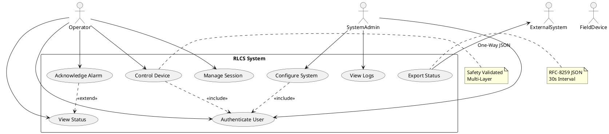
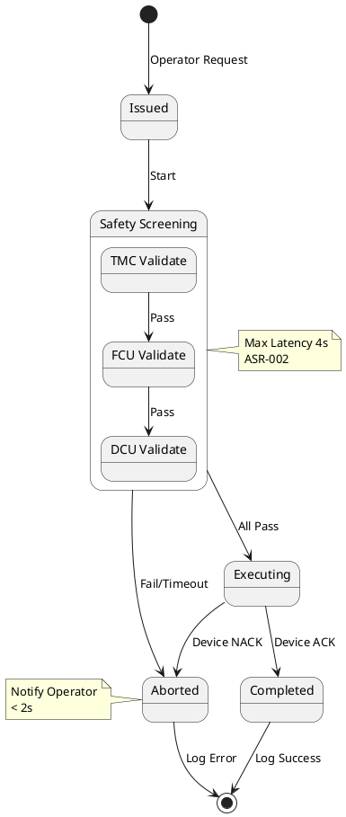
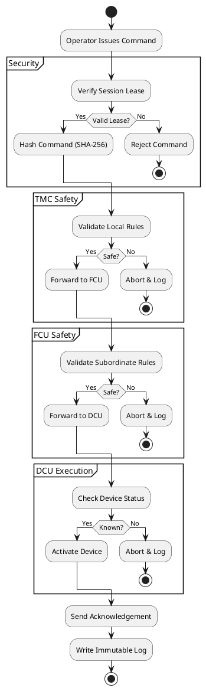
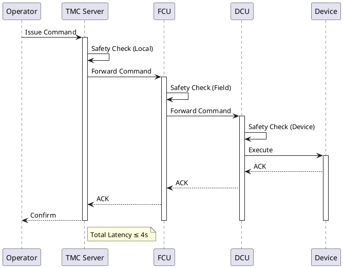
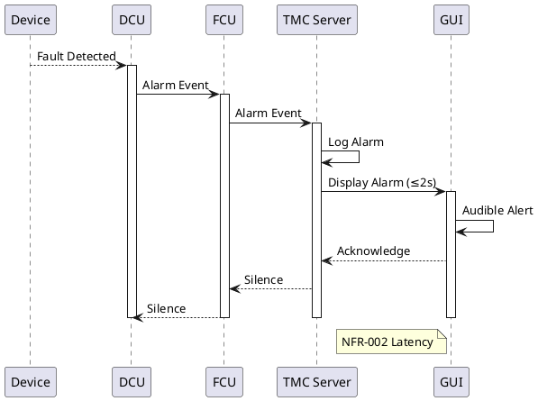
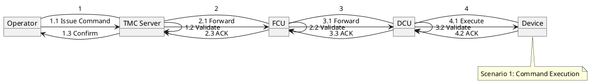
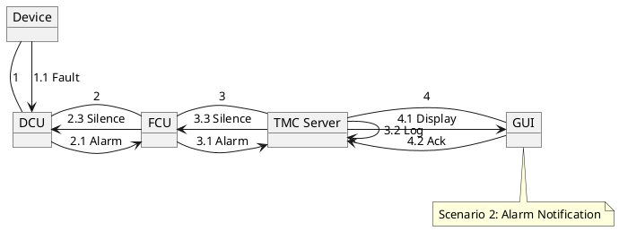
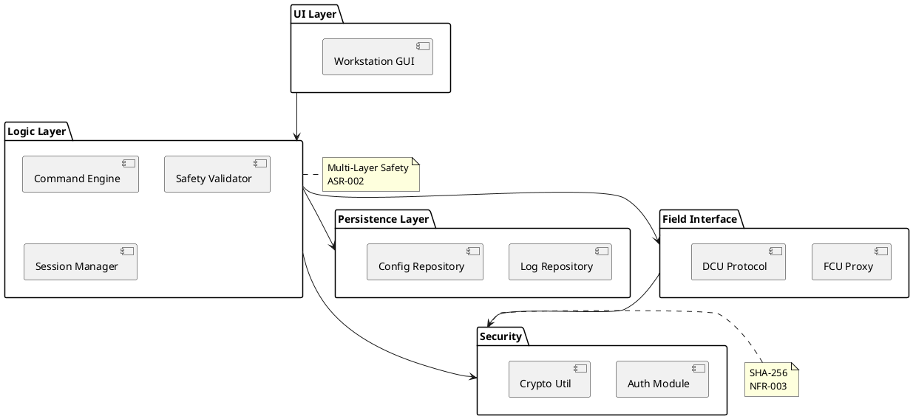
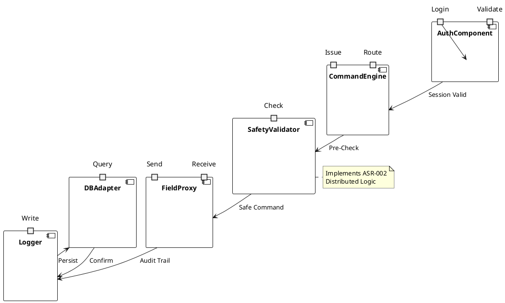
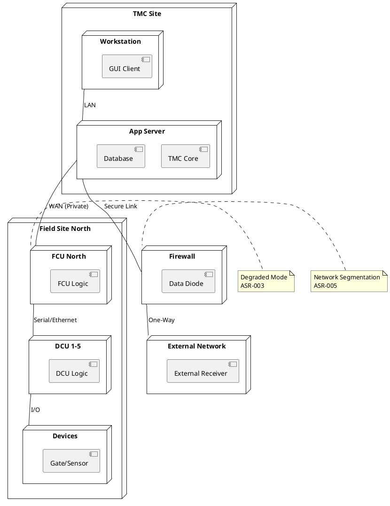

## Architecture Summary & Quality-Attribute Analysis

The proposed architecture for the Reversible Lane Control System (RLCS) is a **Hierarchical Event-Driven Architecture** with a strong emphasis on **Defense-in-Depth Safety**. The system is structured around the physical topology (TMC → FCU → DCU) to satisfy ASR-001, ensuring commands flow strictly top-down. Status updates flow bottom-up via an event mechanism to meet FR-002 and NFR-002 (2-second update rate).

**Key Quality Attributes & Trade-offs:**
1.  **Safety (Critical):** Addressed by ASR-002 (Multi-Layer Safety Screening). Every command is validated at TMC, FCU, and DCU.
    *   *Trade-off:* Increased latency. Mitigated by strict latency budgets (≤4s total) and abort mechanisms (NFR-002).
2.  **Availability:** Addressed by ASR-003 (Degraded Mode). Field units (FCU/DCU) possess local logic and non-volatile memory (ASR-004) to operate independently if TMC fails.
    *   *Trade-off:* Complexity in state synchronization between central and field units.
3.  **Security:** Addressed by ASR-005 (Network Segmentation) and NFR-003 (SHA-256). A firewall separates the private RLCS network from external systems.
    *   *Trade-off:* Restricted external access (one-way data export only).
4.  **Performance:** NFR-002 mandates ≤2s status updates and ≤12s command response.
    *   *Risk:* Multi-layer screening consumes time. Tactics include optimized local validation and asynchronous logging.
5.  **Maintainability:** NFR-005 mandates COTS DB and Reporting. A layered architecture isolates persistence logic.

## Architectural Style & Rationale

**Primary Style: Hierarchical Control**
*   **Justification:** Directly implements ASR-001 (TSU > FCU > DCU). Prevents peer-to-peer unsafe commands. Matches physical infrastructure.
*   **Requirements:** ASR-001, FR-003, FR-009.

**Secondary Style: Event-Driven**
*   **Justification:** Required for real-time status updates (FR-002, FR-007) and Alarm Notifications (NFR-002 latency). Decouples field devices from the GUI.
*   **Requirements:** FR-002, FR-007, NFR-002.

**Tertiary Style: Layered (N-Tier)**
*   **Justification:** Supports NFR-005 (COTS DB, Reporting) and separation of concerns (GUI, Logic, Data).
*   **Requirements:** NFR-005, FR-008.

**Interaction:** The Hierarchical style governs the command path (Safety), while the Event-Driven style governs the status path (Performance/Usability). The Layered style organizes the software within the TMC nodes.

## Architecture Patterns & Tactics

**Patterns:**
1.  **Model-View-Controller (MVC):** Used in the Workstation GUI (FR-001, FR-002). Separates user input from status display.
2.  **Repository:** Manages access to the COTS Database (FR-005, NFR-005). Ensures data integrity and immutability of logs.
3.  **Broker/Proxy:** Field Controllers (FCU) act as brokers between TMC and DCUs (ASR-001).
4.  **Leader Election (Leasing):** Implements Single Operator Command Control (ASR-006). Only one active session holds the "command lease".

**Tactics:**
1.  **Replication (Availability):** Safety rules and config replicated to Non-Volatile Memory in FCU/DCU (ASR-003, ASR-004).
2.  **Heartbeat/Watchdog (Reliability):** Monitors process uptime (NFR-006) and device connectivity (FR-010).
3.  **Cryptographic Hashing (Security):** SHA-256 for integrity checks and passwords (NFR-003, ASR-004).
4.  **Firewall/DMZ (Security):** Enforces one-way data export (ASR-005, FR-006).
5.  **Timeout/Abort (Safety):** Commands abort if safety screening exceeds 4s (ASR-002).

## ScenarioView
1. UseCase — Scenario View: Use Case Diagram



## LogicView
2. Class — Logic View: Class Diagram

```plantuml
@startuml Class_Diagram
class User {
  +id: int
  +username: string
  +passwordHash: string
  +role: Enum
  +login()
  +logout()
}

class Session {
  +id: int
  +userId: int
  +startTime: Timestamp
  +hasCommandControl: boolean
  +acquireControl()
  +releaseControl()
}

class Command {
  +id: int
  +type: Enum
  +targetDeviceId: int
  +status: Enum
  +timestamp: Timestamp
  +validate()
  +execute()
}

class Device {
  +id: int
  +type: Enum
  +status: Enum
  +location: string
  +updateStatus()
}

class SafetyRule {
  +id: int
  +condition: string
  +action: string
  +isViolated(cmd: Command): boolean
}

class LogEntry «immutable» {
  +id: int
  +type: Enum
  +message: string
  +timestamp: Timestamp
  +operatorId: int
}

class Config {
  +key: string
  +value: string
  +lastModified: Timestamp
}

class Alarm {
  +id: int
  +severity: Enum
  +isActive: boolean
  +acknowledge()
}

class FCU {
  +id: int
  +location: string
  +validateCommand(): boolean
}

class DCU {
  +id: int
  +parentId: int
  +executeCommand(): boolean
}

User "1" -- "0..*" Session
Session "1" -- "0..*" Command
Command "1" -- "1" Device
Command "1" -- "0..*" SafetyRule
Device "1" -- "0..*" LogEntry
FCU "1" -- "1..*" DCU
DCU "1" -- "1..*" Device

note right of LogEntry
  Append Only
  SHA-256 Integrity
end note

note left of Session
  Single Operator
  Leasing Mechanism
end note
@enduml
```

3. Object — Logic View: Object Diagram

```plantuml
@startuml Object_Diagram
object op1 : User [Authenticate] {
  id := 101
  username := "J Doe"
  role := OPERATOR
}

object sess1 : Session [ManageSession] {
  id := 5001
  hasCommandControl := true
}

object cmd1 : Command [ControlDevice] {
  id := 9001
  type := OPEN_GATE
  status := VALIDATED
}

object dev1 : Device [ControlDevice] {
  id := 201
  status := CLOSED
  location := "I-15 NB"
}

object alarm1 : Alarm [AcknowledgeAlarm] {
  id := 301
  severity := CRITICAL
  isActive := true
}

op1 --> sess1
sess1 --> cmd1
cmd1 --> dev1
dev1 --> alarm1

note right of cmd1
  Scenario 1: 
  Command Execution
end note

note left of alarm1
  Scenario 2: 
  Alarm Notification
end note
@enduml
```

4. State — Logic View: State Diagram



## ProcessView
5. Activity — Process View: Activity Diagram



6. Sequence — Process View: Sequence Diagram 





7. Collaboration — Process View: Collaboration Diagram





## DevelopmentView
8. Package — Development View: Package Diagram



9. Component — Development View: Component Diagram



## PhysicalView
10. Deployment — Physical View: Deployment Diagram



11. Container — Physical View: Container Diagram

```plantuml
@startuml Container_Diagram
rectangle "System Boundary" {
  container "Web Client" "HTML/JS" "Operator Interface" {
    component "Status Display"
    component "Command Panel"
  }
  container "App Server" "Java/C++" "Core Logic & Routing" {
    component "Safety Engine"
    component "Session Mgr"
  }
  container "Database" "Oracle/Postgres" "Persistence & Logs" {
    component "Log Tables"
    component "Config Tables"
  }
  container "Field Controller" "Embedded" "FCU/DCU Logic" {
    component "Local Safety"
    component "Device Driver"
  }
  container "External API" "JSON/HTTPS" "Data Export" {
    component "Status Publisher"
  }
}

"Web Client" --> "App Server" : HTTPS
"App Server" --> "Database" : SQL
"App Server" --> "Field Controller" : TCP/Serial
"App Server" --> "External API" : Push JSON

note right of "Field Controller"
  Non-Volatile Memory
  ASR-004
end note
note left of "External API"
  RFC-8259 JSON
  FR-006
end note
@enduml
```