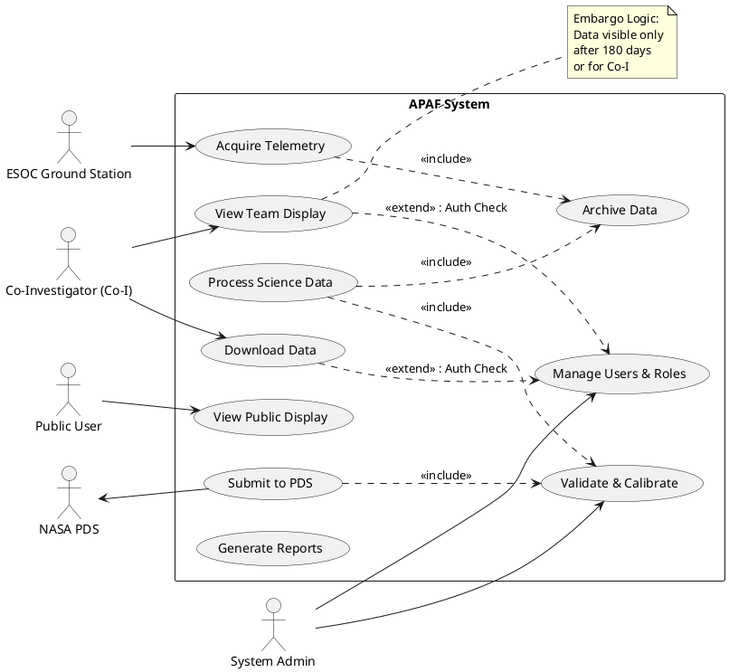
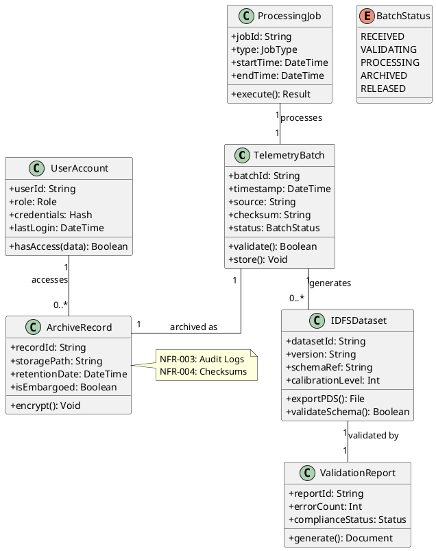
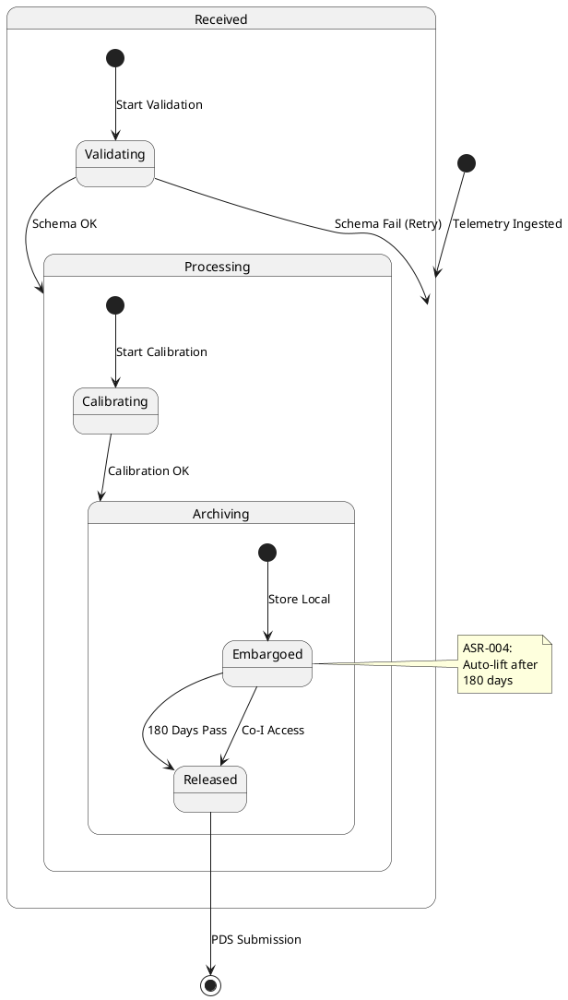
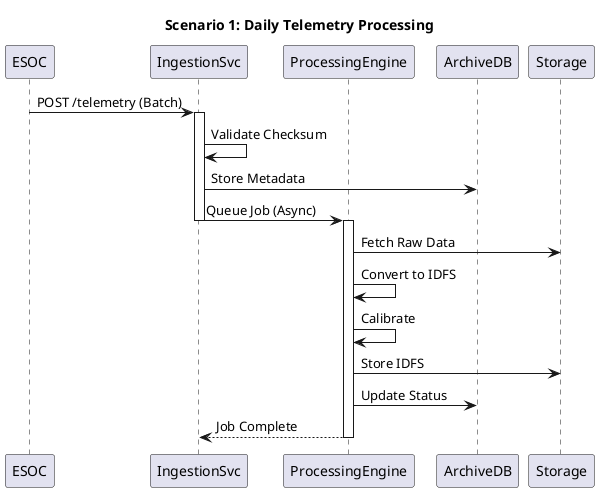
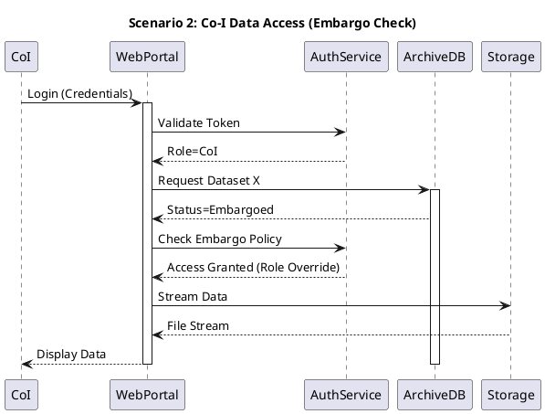
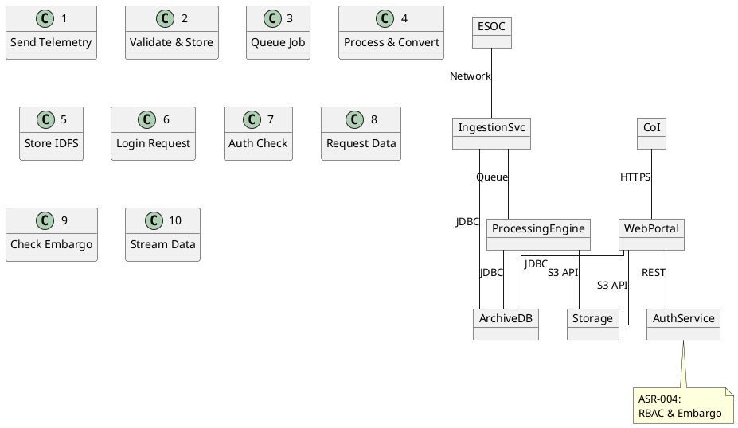

# Architecture Summary & Quality-Attribute Analysis

**Architecture Summary**
The proposed architecture for the APAF (ASPERA-3 Processing and Archiving Facility) system is a **Modular Monolith** deployed on an on-premise Kubernetes cluster. This design consolidates core domain logic (Telemetry Acquisition, Science Processing, Archiving, Distribution) into a single codebase with clearly defined internal modules, while leveraging container orchestration for scalability and reliability. The system follows a **Layered Architecture** pattern (Interface, Application, Domain, Infrastructure) to enforce separation of concerns. Key subsystems include an Automated Ingestion Pipeline (triggered daily), a Schema-First Validation Engine (for PDS/IDFS compliance), a Secure Web Portal (with RBAC and Embargo logic), and a Durable Archive Storage layer (S3/NAS).

**Quality-Attribute Analysis**
1.  **Performance & Latency (NFR-001, ASR-005):** The 24-hour delivery deadline requires asynchronous processing.
    *   *Risk:* Batch processing bottlenecks.
    *   *Mitigation:* Horizontal scaling of worker nodes (Celery/Redis), parallel processing pipelines.
2.  **Security & Confidentiality (NFR-003, ASR-004):** Embargoed data and Co-I access require strict controls.
    *   *Risk:* Unauthorized data leakage.
    *   *Mitigation:* RBAC, TLS 1.2+, Audit Logging, Automated Embargo Expiry.
3.  **Reliability & Integrity (NFR-004, NFR-008):** Data must not be corrupted; system must be available (>99.5%).
    *   *Risk:* Data loss during transfer or processing.
    *   *Mitigation:* End-to-end checksums, Idempotent operations, Dead Letter Queues for failed jobs.
4.  **Compliance (NFR-005, ASR-003):** PDS standards are strict.
    *   *Risk:* Data rejection by NASA PDS.
    *   *Mitigation:* Schema-First Validation (Protobuf/OpenAPI) before persistence.
5.  **Maintainability (NFR-007):** Documentation and modularity.
    *   *Risk:* Monolith becoming a "Big Ball of Mud".
    *   *Mitigation:* Strict module boundaries, CI/CD pipelines, Automated Testing.

# Architectural Style & Rationale

**Recommended Style: Modular Monolith with Layered Architecture**
*   **Justification:**
    *   **ASR-001 (Automated Pipeline):** A monolithic codebase simplifies transaction management and state tracking for the daily batch pipeline compared to distributed microservices, reducing operational overhead for the SwRI team.
    *   **ASR-002 (Local Archival):** Tight coupling between processing and storage logic ensures data lineage is preserved without complex distributed tracing.
    *   **ASR-004 (Security/Embargo):** Centralized security logic in a monolith ensures consistent enforcement of embargo rules across Web and API interfaces.
    *   **NFR-008 (Portability):** Containerization (Kubernetes) addresses the "installable on 2+ OS" requirement while maintaining the monolith's internal simplicity.
    *   **Trade-off:** Scalability is limited to vertical scaling or coarse-grained horizontal scaling of the whole app, but this is acceptable given the predictable daily batch load.

# Architecture Patterns & Tactics

**Architectural Patterns**
1.  **Pipeline/Filter Pattern:** Used for the Data Processing Chain (FR-002, FR-003). Data flows through Acquisition -> Validation -> Calibration -> Archiving.
    *   *Addresses:* ASR-001, NFR-004.
2.  **Repository Pattern:** Abstracts storage logic (Local Archive, DB) from domain logic.
    *   *Addresses:* ASR-002, NFR-008.
3.  **Role-Based Access Control (RBAC):** Centralized authorization service.
    *   *Addresses:* NFR-003, ASR-004.
4.  **Schema-First Validation:** Data structures defined via Protobuf/OpenAPI before implementation.
    *   *Addresses:* ASR-003, NFR-005.

**Tactics**
1.  **Async Queues (Redis/Celery):** Decouples ingestion from heavy processing to meet 24h latency (NFR-001).
2.  **Checksums & Hashing:** SHA-256 on all files for integrity (NFR-004).
3.  **Audit Logging:** Write-once logs for security events (NFR-003).
4.  **Health Checks & Probes:** Kubernetes liveness/readiness probes for 99.5% uptime (NFR-008).

## ScenarioView
1. UseCase — Scenario View: Use Case Diagram



## LogicView
2. Class — Logic View: Class Diagram



3. Object — Logic View: Object Diagram

```plantuml
@startuml ObjectDiagram
skinparam linetype ortho

object "batch20231001 : TelemetryBatch" as b1 [AcquireTelemetry] {
  batchId = "MEX-2023-10-01"
  status = RECEIVED
  checksum = "sha256:abc..."
}

object "jobProc001 : ProcessingJob" as j1 [ProcessScienceData] {
  type = SCIENCE_CONVERSION
  startTime = "2023-10-01T01:00"
}

object "datasetASPERA : IDFSDataset" as d1 [ArchiveData] {
  datasetId = "ASPERA-3-IDFS-v1"
  calibrationLevel = 2
}

object "rec001 : ArchiveRecord" as a1 [ArchiveData] {
  storagePath = "/s3/swri/mex/2023/"
  isEmbargoed = true
}

object "adminUser : UserAccount" as u1 [ManageUsers] {
  role = ADMIN
  userId = "swri_admin_01"
}

b1 --> j1 : triggers
j1 --> d1 : produces
d1 --> a1 : stored in
u1 --> a1 : manages

@enduml
```

4. State — Logic View: State Diagram



## ProcessView
5. Activity — Process View: Activity Diagram

```plantuml
@startuml ActivityDiagram
start
:Acquire Telemetry from ESOC;
if (Format Valid?) then (Yes)
  :Store Raw Batch;
  :Trigger Processing Job;
  fork
    :Convert to IDFS;
    :Calibrate Data;
  fork again
    :Validate PDS Schema;
  end fork
  if (Validation Pass?) then (Yes)
    :Archive to SwRI Storage;
    :Update Catalog;
    if (Embargo Expired?) then (Yes)
      :Mark Public;
    else (No)
      :Keep Embargoed;
    endif
    :Notify Co-Is;
  else (No)
    :Log Error;
    :Alert SRE;
    stop
  endif
else (No)
  :Reject Batch;
  :Alert ESOC;
  stop
endif
:Submit to NASA PDS (Monthly);
stop

note right of :Validate PDS Schema
  ASR-003:
  Compliance Gate
end note

@enduml
```

6. Sequence — Process View: Sequence Diagram 





7. Collaboration — Process View: Collaboration Diagram



## DevelopmentView
8. Package — Development View: Package Diagram

```plantuml
@startuml PackageDiagram
skinparam packageStyle rectangle

package "API Layer" [HighAvailability] {
  class RESTController
  class WebSocketHandler
}

package "Domain Logic" [CoreBusiness] {
  class TelemetryProcessor
  class CalibrationEngine
  class ValidationService
}

package "Security" [Compliance] {
  class RBACManager
  class AuditLogger
  class EmbargoPolicy
}

package "Infrastructure" [Scalability] {
  class ArchiveRepository
  class QueueAdapter
  class PDSConnector
}

"API Layer" --> "Domain Logic" : Uses
"Domain Logic" --> "Security" : Enforces
"Domain Logic" --> "Infrastructure" : Persists
"Security" ..> "Infrastructure" : Logs To

note right of "Security"
  NFR-003:
  TLS 1.2+
  Audit Logs
end note

@enduml
```

9. Component — Development View: Component Diagram

```plantuml
@startuml ComponentDiagram
skinparam componentStyle uml2

component "IngestionModule" [RealTime] {
  port "IngestPort" as IP
}

component "ProcessingModule" [Batch] {
  port "JobPort" as JP
}

component "ArchiveModule" [Durable] {
  port "StorePort" as SP
}

component "WebModule" [Interactive] {
  port "HTTPPort" as HP
}

component "SecurityModule" [Critical] {
  port "AuthPort" as AP
}

IP --> JP : Job Trigger
JP --> SP : Write Data
HP --> AP : Verify Token
HP --> SP : Read Data
SP --> JP : Read Raw

note right of SecurityModule
  ASR-004:
  Embargo Logic
end note

@enduml
```

## PhysicalView
10. Deployment — Physical View: Deployment Diagram

```plantuml
@startuml DeploymentDiagram
skinparam nodeStyle uml2

node "Kubernetes Cluster" as K8s {
  node "Worker Node 1" as W1
  node "Worker Node 2" as W2
  container "APAF Pod (Replica 1)" as P1
  container "APAF Pod (Replica 2)" as P2
}

node "Storage Array" as Store {
  database "PostgreSQL" as DB
  storage "S3 Bucket (SwRI)" as S3
}

node "External Network" as Ext {
  node "ESOC" as ESOC
  node "NASA PDS" as PDS
  node "CoI Browser" as CoI
}

P1 -- DB : JDBC
P2 -- DB : JDBC
P1 -- S3 : S3 API
P2 -- S3 : S3 API
K8s -- Ext : HTTPS/TLS

note right of K8s
  NFR-008:
  >99.5% Uptime
  Auto-Scaling
end note

@enduml
```

11. Container — Physical View: Container Diagram

```plantuml
@startuml ContainerDiagram
skinparam containerStyle uml2

rectangle "APAF System Boundary" {
  container "Web Application" [React/Nginx] {
    Responsible for Public/Team Displays
  }
  container "Backend API" [Spring Boot/Java] {
    Responsible for Business Logic & Auth
  }
  container "Background Worker" [Celery/Python] {
    Responsible for Batch Processing
  }
  container "Database" [PostgreSQL] {
    Responsible for Metadata & User Data
  }
  container "Object Store" [MinIO/S3] {
    Responsible for Telemetry & IDFS Files
  }
}

"Web Application" --> "Backend API" : HTTP/JSON
"Backend API" --> "Database" : SQL
"Backend API" --> "Object Store" : S3 API
"Background Worker" --> "Database" : SQL
"Background Worker" --> "Object Store" : S3 API
"Backend API" --> "Background Worker" : Redis Queue

note left of "Background Worker"
  ASR-001:
  Daily Pipeline
end note

@enduml
```