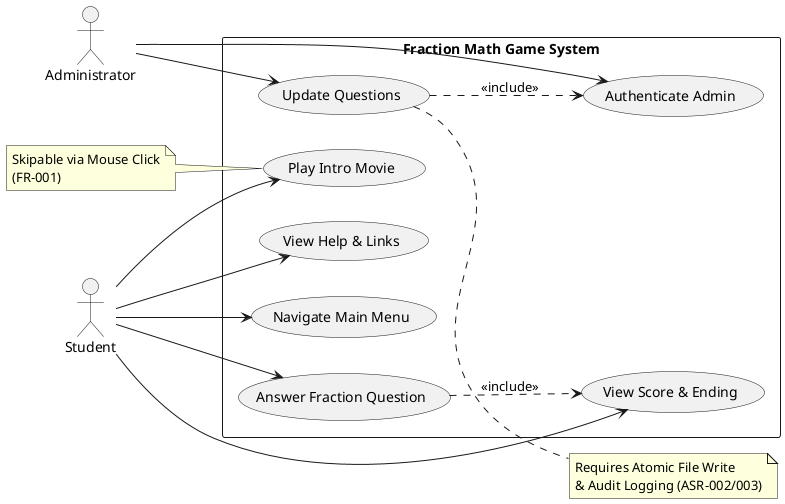
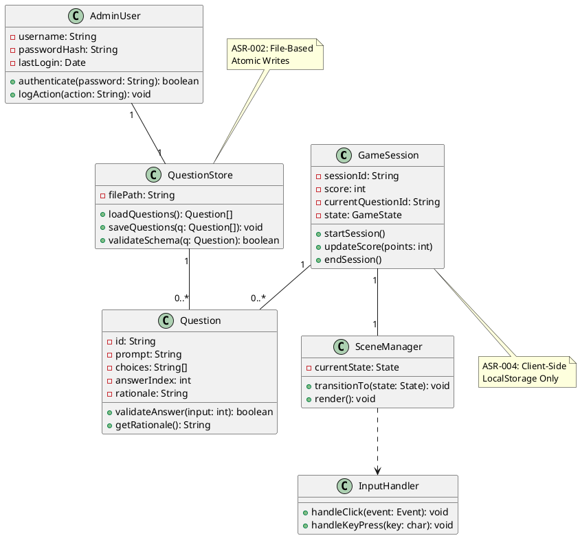
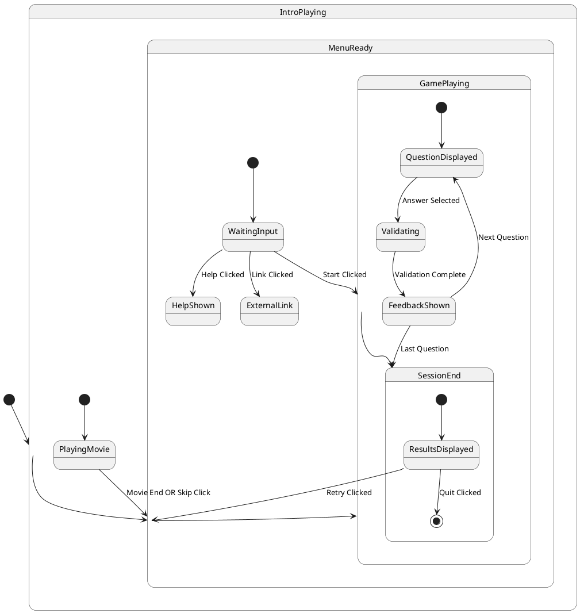
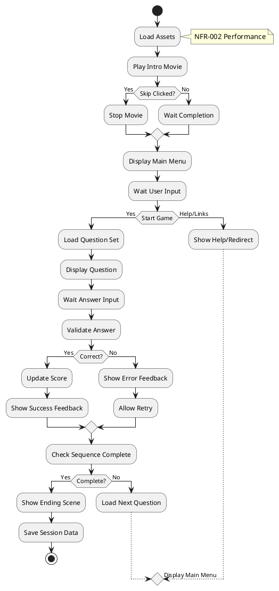
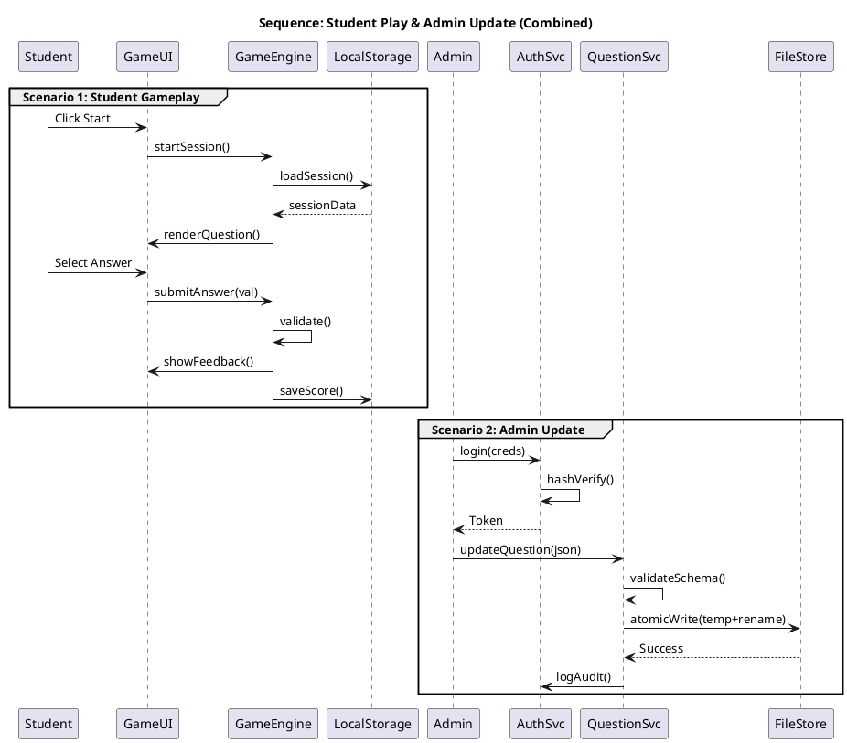
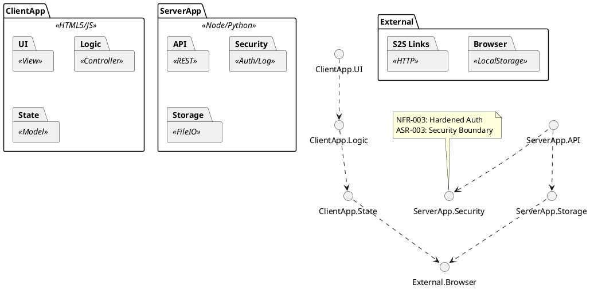
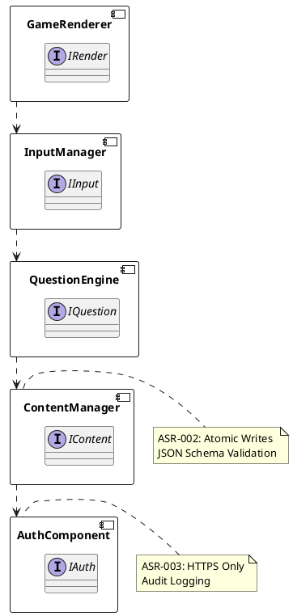
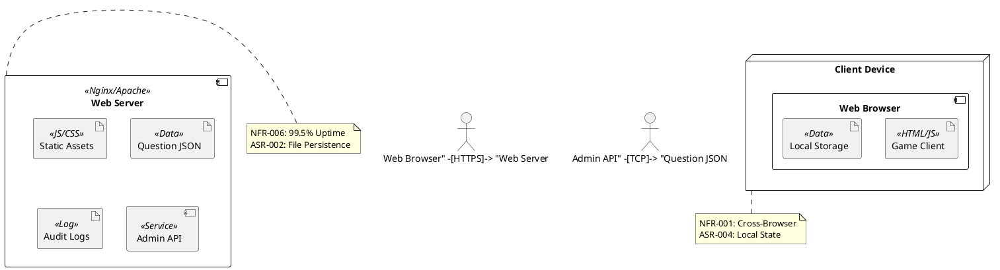

# Architecture Summary & Quality-Attribute Analysis

**Architecture Summary:**
The system is designed as a **Layered Web Architecture** with a clear separation between the Client-Side Game Engine and the Server-Side Content Management System. The client is a Single Page Application (SPA) using HTML5, CSS, and JavaScript, responsible for rendering, game logic, and local state management. The server acts as a static content host for the game assets and a secure API for administrative question updates. Data persistence is hybrid: game sessions are stored locally (browser memory/localStorage) per ASR-004, while question banks are stored as JSON files on the server per ASR-002.

**Quality Attributes & Trade-offs:**
1.  **Portability & Compatibility (NFR-001, ASR-001):**
    *   *Decision:* HTML5/JS stack replaces Flash.
    *   *Trade-off:* Loss of legacy Flash asset compatibility; requires modern browser APIs for audio/animation.
    *   *Risk:* Browser inconsistency mitigated by cross-browser testing suites.
2.  **Security (NFR-003, ASR-003):**
    *   *Decision:* HTTPS enforcement, salted hashing for admin auth, audit logging.
    *   *Trade-off:* Increased server complexity for admin module; client-side score validation is vulnerable to tampering (accepted risk for educational tool).
3.  **Maintainability (NFR-004, ASR-002):**
    *   *Decision:* Content (JSON) separated from Code (JS). Atomic file writes.
    *   *Trade-off:* File-based storage limits concurrent admin edits compared to a database; requires locking mechanisms.
4.  **Performance (NFR-002):**
    *   *Decision:* Asset optimization for low bandwidth (56Kbps simulation).
    *   *Trade-off:* Visual fidelity may be reduced to meet load time constraints.
5.  **Usability (NFR-005):**
    *   *Decision:* Mouse-only input, accessibility compliance (axe).
    *   *Trade-off:* Limits interaction complexity to ensure accessibility for low-literacy users.

# Architectural Style & Rationale

**Primary Style: Layered Architecture (Client-Server)**
*   **Justification:** Clearly separates user interaction (Client) from content persistence and security (Server). Aligns with ASR-001 (Web-Based) and ASR-003 (Security Boundary).
*   **Interaction:** Client requests questions/assets; Server serves static files or handles authenticated admin updates.

**Secondary Style: Model-View-Controller (MVC) [Client-Side]**
*   **Justification:** Organizes client code into Game State (Model), Rendering (View), and Input Handling (Controller). Supports NFR-005 (Usability) by isolating logic from UI.
*   **Interaction:** User input triggers Controller, updates Model, notifies View.

# Architecture Patterns & Tactics

1.  **Repository Pattern (Data Access):**
    *   *Application:* `QuestionRepository` abstracts JSON file access.
    *   *Rationale:* Supports ASR-002 (File-Based Content) and allows swapping storage mechanisms later without changing game logic.
2.  **State Pattern (Game Flow):**
    *   *Application:* `GameState` manages transitions (Intro -> Menu -> Play -> End).
    *   *Rationale:* Encapsulates complex transition logic defined in FR-001, FR-002, FR-006.
3.  **Command Pattern (User Input):**
    *   *Application:* Input actions (Skip, Select Answer) encapsulated as commands.
    *   *Rationale:* Supports undo/retry logic (FR-004) and decouples input from execution.
4.  **Security Tactics:**
    *   *Authentication:* Bcrypt/Argon2 hashing (NFR-003).
    *   *Transport:* HTTPS-only for admin endpoints (ASR-003).
    *   *Audit:* Immutable log files for admin actions (ASR-003).
5.  **Reliability Tactics:**
    *   *Atomic Writes:* Temp-file + Rename for question updates (ASR-002).
    *   *Local Persistence:* localStorage for session survival across refreshes (FR-005).

## ScenarioView
1. UseCase — Scenario View: Use Case Diagram



## LogicView
2. Class — Logic View: Class Diagram



3. Object — Logic View: Object Diagram

```plantuml
@startuml ObjectDiagram
object session1 : GameSession [PlayGame] {
  sessionId = "sess_123"
  score = 15
  currentState = Playing
}

object q1 : Question [MultipleChoice] {
  id = "q_001"
  prompt = "1/2 + 1/2 = ?"
  choices = ["1", "2", "1/4"]
  answerIndex = 0
}

object store : QuestionStore [ContentMgr] {
  filePath = "/data/questions.json"
}

object admin : AdminUser [AdminUpdate] {
  username = "superadmin"
  lastLogin = "2023-10-27"
}

session1 --> q1
store --> q1
admin --> store
@enduml
```

4. State — Logic View: State Diagram



## ProcessView
5. Activity — Process View: Activity Diagram



6. Sequence — Process View: Sequence Diagram 



7. Collaboration — Process View: Collaboration Diagram

```plantuml
@startuml CollaborationDiagram
title Collaboration: Student Play & Admin Update

object "1: Student" as Student
object "2: GameUI" as UI
object "3: GameEngine" as Engine
object "4: Storage" as Storage
object "5: Admin" as Admin
object "6: QuestionSvc" as QSvc
object "7: Files" as Files

Student -[1: Click Start]-> UI
UI -[2: startSession]-> Engine
Engine -[3: loadSession]-> Storage
Engine -[4: render]-> UI
Student -[5: Submit]-> UI
UI -[6: validate]-> Engine
Engine -[7: saveScore]-> Storage

Admin -[8: Login]-> QSvc
Admin -[9: Update]-> QSvc
QSvc -[10: Write]-> Files
QSvc -[11: Log]-> Files

note right of Student
  Scenario 1: Gameplay
end note
note left of Admin
  Scenario 2: Maintenance
end note
@enduml
```

## DevelopmentView
8. Package — Development View: Package Diagram



9. Component — Development View: Component Diagram



## PhysicalView
10. Deployment — Physical View: Deployment Diagram



11. Container — Physical View: Container Diagram

```plantuml
@startuml ContainerDiagram
title System Container Overview

Person "Student" as S
Person "Admin" as A

Container_Boundary "System" {
  Container "Web App" <<HTML5/JS>> {
    +Render Game
    +Handle Input
    +Local Storage
  }
  Container "Admin API" <<HTTPS/JSON>> {
    +Auth Admin
    +Validate Schema
    +Write Files
  }
  Container "File Store" <<JSON Files>> {
    +Questions
    +Audit Logs
  }
}

S --> "Web App" : Mouse/Click
A --> "Admin API" : HTTPS Request
"Admin API" --> "File Store" : Read/Write
"Web App" --> "File Store" : Read Questions (Static)

note right of "Web App"
  ASR-001: No Plugins
  NFR-005: Accessible
end note
@enduml
```