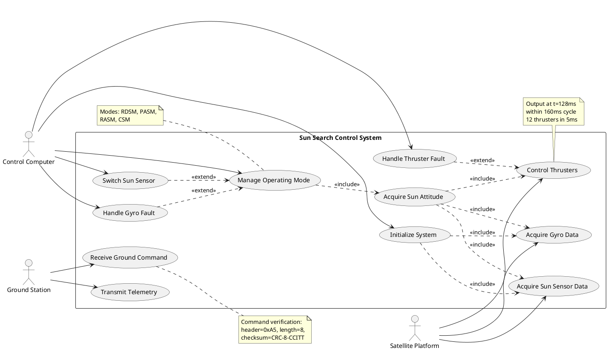
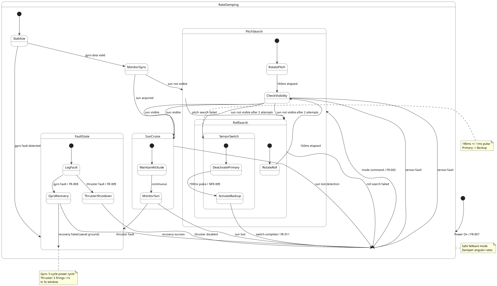
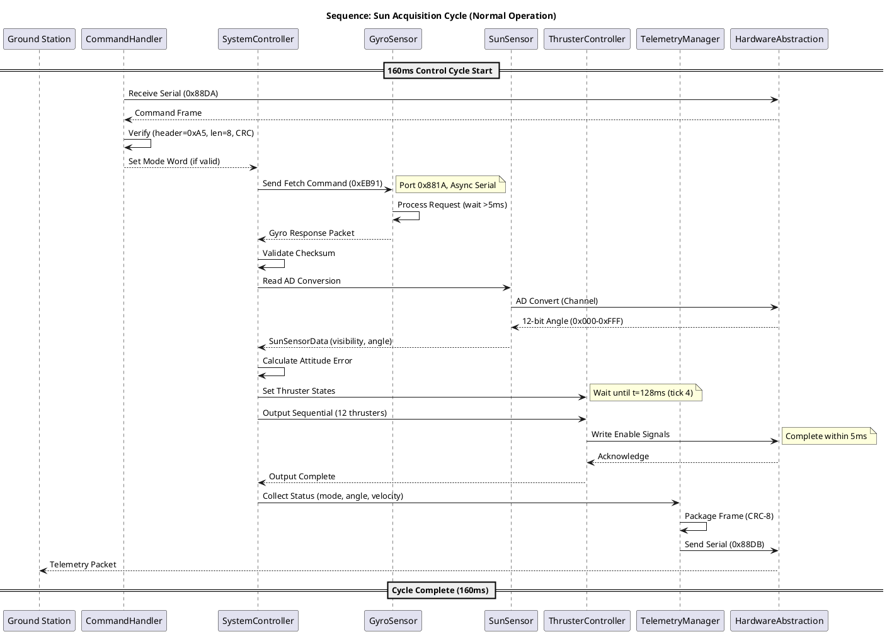
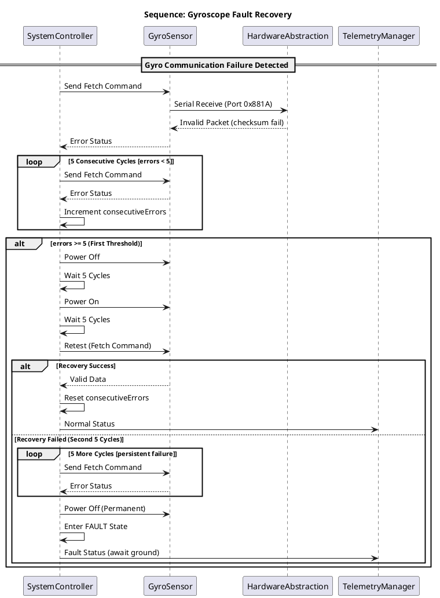
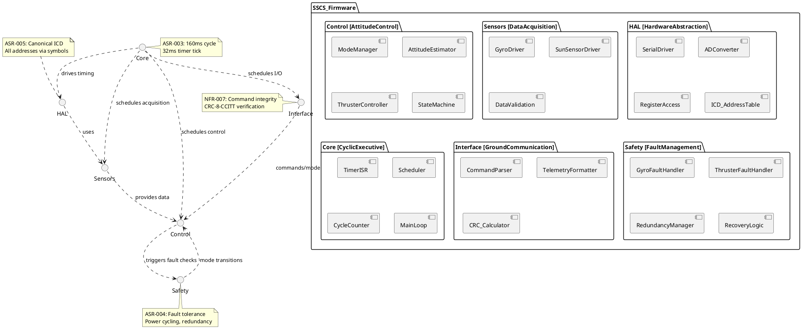
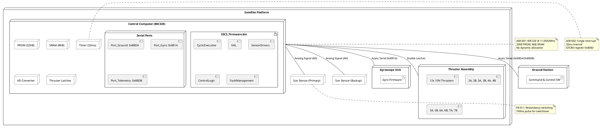

# Architecture Summary & Quality-Attribute Analysis

## Proposed Architecture Summary

The Sun Search Control System (SSCS) employs a **Time-Triggered Cyclic Executive** architecture on bare-metal 80C32E MCU. A single 32ms timer interrupt drives a 160ms hyper-cycle (5 ticks), with deterministic task scheduling. The architecture decomposes into: Hardware Abstraction Layer (HAL), Sensor Acquisition, Mode Management, Fault Management, Actuator Control, and Telemetry modules. All hardware addresses are centralized in a canonical Interface Contract (ICD).

## Quality-Attribute Analysis

| Quality Attribute | Requirements Source | Architectural Risks | Trade-offs |
|------------------|---------------------|---------------------|------------|
| **Performance/Timing** | NFR-001, NFR-002, NFR-003, ASR-003 | ISR overrun, cycle deadline miss | Determinism over flexibility; no RTOS |
| **Reliability** | FR-008, FR-009, NFR-007, ASR-004 | Fault detection latency, recovery failure | Explicit state machine adds complexity but ensures verifiable transitions |
| **Safety** | FR-008, FR-009, FR-011, ASR-004 | Single point of failure (MCU) | Redundancy at sensor level; rate damping fallback mode |
| **Maintainability** | ASR-005, NFR-008 | Hardware address drift, tight memory | Canonical ICD table; no dynamic allocation |
| **Resource Efficiency** | ASR-001, NFR-008 | 8KB SRAM constraint | Static allocation; fixed-size buffers; no heap |
| **Determinism** | ASR-002, ASR-003 | Interrupt jitter, scheduling variance | Single interrupt; cyclic executive eliminates preemption uncertainty |

## Recommended Architecture Style

**Time-Triggered Cyclic Executive (Bare-Metal Embedded)**

**Justification:**
- ASR-001 mandates 80C32E with severe resource constraints (32KB PROM, 8KB SRAM)
- ASR-002 restricts to single 32ms interrupt (no RTOS, no multi-ISR)
- ASR-003 requires 160ms cycle with hard deadline at t=128ms for thruster output
- FR-006 requires explicit mode state machine (RDSM→PASM→RASM→CSM)
- NFR-002 demands ISR execution ≤500us with ≤5us jitter

This style provides deterministic timing analysis, predictable worst-case execution time (WCET), and eliminates concurrency hazards from interrupt nesting or thread scheduling.

---

# Architectural Style & Rationale

## Primary Style: Time-Triggered Cyclic Executive

| Requirement | Style Support |
|-------------|---------------|
| ASR-001 (80C32E, 32KB/8KB) | Bare-metal C99, no OS overhead |
| ASR-002 (Single 32ms ISR) | One timer tick drives all scheduling |
| ASR-003 (160ms cycle, 128ms thruster) | 5-tick hyper-cycle with slot allocation |
| FR-006 (Mode Management) | State machine evaluated per cycle |
| NFR-003 (Thruster latency) | Dedicated tick 4 output slot |

## Secondary Style: Layered Architecture

| Layer | Responsibility |
|-------|----------------|
| Hardware Abstraction Layer (HAL) | Register access, serial ports, AD conversion (ASR-005) |
| Service Layer | Sensor acquisition, fault detection, mode transitions |
| Control Layer | Attitude determination, thruster command generation |
| Interface Layer | Command reception, telemetry transmission |

**Interaction:** The cyclic executive (time-triggered) orchestrates calls through the layered components. HAL isolates hardware dependencies; Service Layer encapsulates business logic; Control Layer implements control algorithms.

---

# Architecture Patterns & Tactics

| Pattern/Tactic | Applied To | Addresses |
|----------------|------------|-----------|
| **Cyclic Executive** | Main scheduler | ASR-003, NFR-001, NFR-002 |
| **State Machine** | Mode management | FR-006, ASR-004 |
| **Hardware Abstraction Layer** | I/O access | ASR-005, FR-003, FR-004 |
| **Watchdog/Fault Ladder** | Gyro/Thruster faults | FR-008, FR-009 |
| **Redundancy Switching** | Sun sensor backup | FR-011, NFR-009 |
| **Static Allocation** | All data structures | ASR-001, NFR-008 |
| **Atomic Critical Sections** | ISR/Main data sharing | ASR-002, ASR-003 |
| **Versioned Data Contracts** | Command/Telemetry frames | ASR-005, FR-002, FR-010 |
| **Observable Metrics** | Cycle time, ISR overrun | NFR-002, NFR-004 |

## Quality Attribute Tactics Mapping

| Quality Goal | Tactic | Requirement Link |
|--------------|--------|------------------|
| Timing Determinism | Fixed time slots, no preemption | NFR-001, NFR-003, ASR-003 |
| Fault Tolerance | Power-cycle recovery, mode fallback | FR-008, FR-009, ASR-004 |
| Resource Efficiency | Static buffers, no heap | ASR-001, NFR-008 |
| Interface Stability | Canonical ICD table | ASR-005 |
| Safety | Rate damping safe mode | FR-006, ASR-004 |

---

## ScenarioView

### 1. UseCase — Scenario View: Use Case Diagram



---

## LogicView

### 2. Class — Logic View: Class Diagram

```plantuml
@startuml ClassDiagram
skinparam classAttributeIconSize 0
skinparam linetype ortho

class "SystemController" as SystemController {
    -cycleCounter: uint8
    -currentMode: OperatingMode
    -faultFlags: uint16
    +Initialize(): void
    +RunCycle(): void
    +GetMode(): OperatingMode
    +SetMode(mode: OperatingMode): void
}

class "OperatingMode" as OperatingMode {
    <<enumeration>>
    RDSM
    PASM
    RASM
    CSM
    FAULT
}

class "GyroSensor" as GyroSensor {
    -portAddress: uint16
    -lastStatus: uint8
    -consecutiveErrors: uint8
    +FetchCommand(): void
    +ReadData(): GyroData
    +ValidatePacket(): boolean
    +PowerCycle(): void
}

class "GyroData" as GyroData {
    +status: uint8
    +angleX: int16
    +angleY: int16
    +angleZ: int16
    +checksum: uint8
}

class "SunSensor" as SunSensor {
    -primaryActive: boolean
    -visibilityFlag: boolean
    -angleValue: uint16
    -consecutiveMisses: uint8
    +ReadAD(): SunSensorData
    +SwitchToBackup(): void
    +GetVisibility(): boolean
}

class "SunSensorData" as SunSensorData {
    +powerOn: boolean
    +visible: boolean
    +angle: uint16
}

class "ThrusterController" as ThrusterController {
    -thrusterStates: uint12
    -firingHistory: TimestampFIFO[12]
    -lastOutputTime: uint32
    +SetThruster(id: uint8, enable: boolean): void
    +OutputSequential(): void
    +CheckFrequentJetting(): boolean
    +EmergencyShutdown(): void
}

class "CommandHandler" as CommandHandler {
    -rejectCounter: uint16
    -portAddress: uint16
    +ReceiveCommand(): CommandFrame
    +VerifyCommand(cmd: CommandFrame): boolean
    +SetModeWord(mode: uint16): void
    +GetRejectStatus(): uint8
}

class "CommandFrame" as CommandFrame {
    +header: uint8
    +length: uint8
    +modeWord: uint16
    +data: uint8[4]
    +checksum: uint8
}

class "TelemetryManager" as TelemetryManager {
    -failCounter: uint16
    -portAddress: uint16
    +CollectStatus(): TelemetryPacket
    +Transmit(): void
    +GetFailCounter(): uint16
}

class "TelemetryPacket" as TelemetryPacket {
    +modeWord: uint16
    +orientationX: int16
    +orientationY: int16
    +orientationZ: int16
    +velocityX: int16
    +velocityY: int16
    +velocityZ: int16
    +checksum: uint8
}

class "HardwareAbstraction" as HardwareAbstraction {
    <<ICD Reference>>
    +WriteRegister(addr: uint16, value: uint8): void
    +ReadRegister(addr: uint16): uint8
    +SerialSend(port: uint16, data: uint8): void
    +SerialReceive(port: uint16): uint8
    +ADConvert(channel: uint8): uint16
}

class "TimerISR" as TimerISR {
    -tickCount: uint8
    -isrExecutionTime: uint32
    -overrunCounter: uint16
    +OnTick32ms(): void
    +GetTickCount(): uint8
    +CheckOverrun(): boolean
}

SystemController "1" -- "1" TimerISR : drives
SystemController "1" -- "1" OperatingMode : manages
SystemController "1" -- "1" GyroSensor : uses
SystemController "1" -- "1" SunSensor : uses
SystemController "1" -- "1" ThrusterController : controls
SystemController "1" -- "1" CommandHandler : receives
SystemController "1" -- "1" TelemetryManager : sends
SystemController "1" -- "1" HardwareAbstraction : accesses

GyroSensor "1" *-- "0..1" GyroData : produces
SunSensor "1" *-- "0..1" SunSensorData : produces
CommandHandler "1" *-- "0..1" CommandFrame : receives
TelemetryManager "1" *-- "1" TelemetryPacket : transmits

note top of HardwareAbstraction
  ASR-005: All addresses
  via ICD symbols only
  No literal addresses
end note

note right of TimerISR
  NFR-002: ISR <= 500us
  Jitter <= 5us
  32ms interval
end note

note bottom of ThrusterController
  NFR-003: Output at t=128ms
  FR-009: Frequent jetting
  protection
end note

@enduml
```



---

### 3. Object — Logic View: Object Diagram

```plantuml
@startuml ObjectDiagram
skinparam objectAttributeIconSize 0

object "controller1 : SystemController" as controller1 [SunAcquisition] {
    cycleCounter = 4
    currentMode = PASM
    faultFlags = 0x0000
}

object "gyro1 : GyroSensor" as gyro1 [GyroAcquire] {
    portAddress = 0x881A
    lastStatus = 0x00
    consecutiveErrors = 0
}

object "gyroData1 : GyroData" as gyroData1 {
    status = 0x00
    angleX = 150
    angleY = -45
    angleZ = 30
    checksum = 0xAB
}

object "sunSensor1 : SunSensor" as sunSensor1 [SunAcquire] {
    primaryActive = true
    visibilityFlag = false
    angleValue = 0x07FF
    consecutiveMisses = 2
}

object "sunData1 : SunSensorData" as sunData1 {
    powerOn = true
    visible = false
    angle = 2047
}

object "thruster1 : ThrusterController" as thruster1 [ThrusterControl] {
    thrusterStates = 0x00A5
    lastOutputTime = 128
}

object "timer1 : TimerISR" as timer1 [CycleTiming] {
    tickCount = 4
    isrExecutionTime = 320
    overrunCounter = 0
}

controller1 --> gyro1 : uses
controller1 --> sunSensor1 : uses
controller1 --> thruster1 : controls
controller1 --> timer1 : driven by
gyro1 --> gyroData1 : produces
sunSensor1 --> sunData1 : produces

note right of controller1
  Scenario: Pitch Search Mode
  Cycle 4 of 160ms
  Thruster output pending
end note

note left of timer1
  Tick 4 = 128ms
  Next: Thruster output
end note

@enduml
```

---

### 4. State — Logic View: State Diagram



---

## ProcessView

### 5. Activity — Process View: Activity Diagram

```plantuml
@startuml ActivityDiagram
skinparam activity {
    BackgroundColor White
    BorderColor Black
}
skinparam condition {
    BackgroundColor White
    BorderColor Black
}

start

:Power On / Reset;
:Execute System Initialization;
note right: FR-007: Initialize controllers,
power-on sensors, start 32ms timer

:Start 32ms Timer Interrupt;
:Enter Main Loop;

repeat :Wait for Cycle Boundary;
    :Increment Cycle Counter;
    :tick = tickCounter % 5;
    
    if (tick == 0) then (Command Slot)
        :Receive Ground Command;
        :Verify Command (header/length/checksum);
        if (Valid?) then (yes)
            :Set Mode Word;
        else (no)
            :Increment CMD_REJECT_COUNTER;
            :Send Telemetry Status;
        endif
    endif
    
    if (tick == 0) then (Gyro Slot)
        :Send Gyro Fetch Command 0xEB91;
        :Wait >5ms / NFR-005;
        :Read Gyro Response;
        :Validate Gyro Packet;
        if (Valid?) then (yes)
            :Reset consecutiveErrors;
            :Store Gyro Data;
        else (no)
            :Increment consecutiveErrors;
            if (errors >= 5?) then (yes)
                :Power Cycle Gyro;
                :Enter Fault Recovery;
            endif
        endif
    endif
    
    if (tick == 0) then (Sun Sensor Slot)
        :Read AD Conversion;
        :Extract Visibility & Angle;
        :Check Consecutive Misses;
        if (misses >= 4?) then (yes)
            :Switch to Backup Sensor;
            :Send 190ms Pulse / NFR-009;
            :Enter Rate Damping;
        endif
    endif
    
    if (tick == 4) then (Thruster Slot t=128ms)
        :Calculate Thruster Commands;
        :Check Frequent Jetting / FR-009;
        if (Fault Detected?) then (yes)
            :Emergency Shutdown;
            :Raise FAULT Flag;
            :Enter Rate Damping;
        else (no)
            :Output 12 Thruster Signals;
            note right: Must complete within 5ms
            :Verify Controller Acknowledge;
        endif
    endif
    
    :Update Mode State Machine;
    :Collect Telemetry Data;
    
    if (tick == 0) then (Telemetry Slot)
        :Package Telemetry Packet;
        :Transmit via Serial 0x88DB;
        if (Send Fail?) then (yes)
            :Increment TLM_FAIL_COUNTER;
        endif
    endif
    
    :Check Cycle Duration;
    note right: NFR-001: 160ms total cycle
repeat while (Cycle Counter < 5?) is (Continue)

stop

@enduml
```

---

### 6. Sequence — Process View: Sequence Diagram





---

### 7. Collaboration — Process View: Collaboration Diagram

```plantuml
@startuml CollaborationDiagram_SunAcquisition
title Collaboration: Sun Acquisition (Normal Cycle)
skinparam linetype ortho

:Ground Station: as Ground
:CommandHandler: as CmdHandler
:SystemController: as Controller
:GyroSensor: as Gyro
:SunSensor: as Sun
:ThrusterController: as Thruster
:TelemetryManager: as Telemetry
:HardwareAbstraction: as HAL

Ground -[1]:ReceiveCmd]-> CmdHandler
CmdHandler -[2]:Verify]-> CmdHandler
CmdHandler -[3]:SetMode]-> Controller
Controller -[4]:FetchGyro]-> Gyro
Gyro -[5]:ReadData]-> HAL
HAL -[6]:ReturnData]-> Gyro
Gyro -[7]:ReturnGyroData]-> Controller
Controller -[8]:ReadSun]-> Sun
Sun -[9]:ADConvert]-> HAL
HAL -[10]:ReturnAngle]-> Sun
Sun -[11]:ReturnSunData]-> Controller
Controller -[12]:CalcAttitude]-> Controller
Controller -[13]:SetThrusters]-> Thruster
Thruster -[14]:OutputSignals]-> HAL
HAL -[15]:Acknowledge]-> Thruster
Thruster -[16]:Complete]-> Controller
Controller -[17]:CollectTLM]-> Telemetry
Telemetry -[18]:SendTLM]-> HAL
HAL -[19]:Transmit]-> Ground

note bottom: 160ms cycle, thruster output at t=128ms
note right: All I/O via HAL (ASR-005)

@enduml
```



```plantuml
@startuml CollaborationDiagram_GyroFault
title Collaboration: Gyro Fault Recovery
skinparam linetype ortho

:SystemController: as Controller
:GyroSensor: as Gyro
:HardwareAbstraction: as HAL
:TelemetryManager: as Telemetry

Controller -[1]:FetchCommand]-> Gyro
Gyro -[2]:SerialRead]-> HAL
HAL -[3]:ErrorReturn]-> Gyro
Gyro -[4]:ErrorStatus]-> Controller
Controller -[5]:IncrementErrors]-> Controller

alt errors >= 5
    Controller -[6]:PowerOff]-> Gyro
    Controller -[7]:Wait5Cycles]-> Controller
    Controller -[8]:PowerOn]-> Gyro
    Controller -[9]:Wait5Cycles]-> Controller
    Controller -[10]:Retest]-> Gyro
    
    alt Recovery Failed
        Controller -[11]:PowerOffPerm]-> Gyro
        Controller -[12]:EnterFault]-> Controller
        Controller -[13]:SendFaultTLM]-> Telemetry
    end
end

note bottom: FR-008: 5-cycle power cycle policy
note right: FAULT state awaits ground command

@enduml
```

---

## DevelopmentView

### 8. Package — Development View: Package Diagram



---

### 9. Component — Development View: Component Diagram

```plantuml
@startuml ComponentDiagram
skinparam component {
    BackgroundColor White
    BorderColor Black
}
skinparam interface {
    BackgroundColor White
    BorderColor Black
}

component "TimerISR_Component" as TimerISR [TimerISR] {
    [ITimerCallback]
}

component "Scheduler_Component" as Scheduler [CyclicExecutive] {
    [IScheduler]
}

component "GyroDriver_Component" as GyroDriver [GyroAcquisition] {
    [IGyroData]
}

component "SunSensorDriver_Component" as SunDriver [SunSensorAcquisition] {
    [ISunData]
}

component "ModeManager_Component" as ModeManager [ModeManagement] {
    [IModeControl]
    [IStateMachine]
}

component "ThrusterController_Component" as ThrusterCtrl [ThrusterControl] {
    [IThrusterOutput]
}

component "GyroFaultHandler_Component" as GyroFault [GyroFaultManagement] {
    [IFaultRecovery]
}

component "ThrusterFaultHandler_Component" as ThrusterFault [ThrusterFaultManagement] {
    [IFaultRecovery]
}

component "CommandHandler_Component" as CmdHandler [CommandReception] {
    [ICommandVerify]
}

component "TelemetryManager_Component" as Telemetry [TelemetryTransmission] {
    [ITelemetryOutput]
}

component "HAL_Component" as HAL [HardwareAbstraction] {
    [ISerialIO]
    [IRegisterAccess]
    [IADConvert]
}

TimerISR --> Scheduler : triggers 32ms tick
Scheduler --> GyroDriver : schedule tick 0
Scheduler --> SunDriver : schedule tick 0
Scheduler --> ThrusterCtrl : schedule tick 4 (128ms)
Scheduler --> CmdHandler : schedule tick 0
Scheduler --> Telemetry : schedule tick 0

GyroDriver --> HAL : serial read/write
SunDriver --> HAL : AD conversion
ThrusterCtrl --> HAL : register write
CmdHandler --> HAL : serial read
Telemetry --> HAL : serial write

ModeManager --> GyroDriver : consumes gyro data
ModeManager --> SunDriver : consumes sun data
ModeManager --> ThrusterCtrl : commands thrusters

GyroFault --> GyroDriver : monitors errors
GyroFault --> ModeManager : triggers mode change
ThrusterFault --> ThrusterCtrl : monitors firing
ThrusterFault --> ModeManager : triggers shutdown

note right of HAL
  ASR-005: Single source
  for all hardware addresses
  ICD::Port_Gyro_Command
  ICD::Port_Telemetry
end note

note bottom of Scheduler
  ASR-003: 160ms hyper-cycle
  5 ticks of 32ms each
end note

note left of ModeManager
  FR-006: RDSM, PASM,
  RASM, CSM states
end note

@enduml
```

---

## PhysicalView

### 10. Deployment — Physical View: Deployment Diagram



---

### 11. Container — Physical View: Container Diagram

```plantuml
@startuml ContainerDiagram
skinparam container {
    BackgroundColor White
    BorderColor Black
}

rectangle "Satellite Boundary" {
    
    container "SSCS_ControlContainer" as SSCS [Sun Search Control System] {
        responsibility: "Attitude determination, sun acquisition, thruster control"
        technology: "80C32E Bare-Metal C99 Firmware"
        
        internal {
            component "CyclicExecutive" as CE
            component "HAL" as HAL
            component "SensorModule" as Sensors
            component "ControlModule" as Control
            component "FaultModule" as Fault
        }
    }
    
    container "GyroscopeContainer" as Gyro [Gyroscope Subsystem] {
        responsibility: "Angular rate measurement"
        technology: "Gyro Hardware + Embedded FW"
    }
    
    container "SunSensorContainer" as SunSensor [Sun Sensor Subsystem] {
        responsibility: "Sun visibility & angle measurement"
        technology: "Primary + Backup Sensors (AD Conversion)"
    }
    
    container "ThrusterContainer" as Thrusters [Thruster Assembly] {
        responsibility: "Attitude actuation (12x 10N thrusters)"
        technology: "Hardware Latches + Propulsion"
    }
}

rectangle "Ground Segment" {
    container "GroundControlContainer" as Ground [Ground Command & Control] {
        responsibility: "Command uplink, telemetry downlink"
        technology: "Ground Station Software"
    }
}

SSCS --> Gyro : Fetch Command / Gyro Data
SSCS --> SunSensor : AD Read / Sensor Data
SSCS --> Thrusters : Enable Signals / Status
SSCS <--> Ground : Command Frames / Telemetry Frames

note right of SSCS
  NFR-001: 160ms control cycle
  NFR-002: 32ms timer interrupt
  NFR-003: Thruster output at 128ms
  ASR-005: ICD address governance
end note

note left of SunSensor
  FR-011: Primary/Backup switching
  NFR-009: 190ms switch pulse
  NFR-006: 12-bit AD resolution
end note

note bottom of Ground
  FR-002: Command verification
  header=0xA5, CRC-8-CCITT
  FR-010: Telemetry every 160ms
end note

@enduml
```