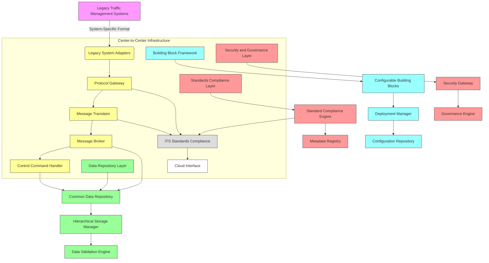

# Center-to-Center (C2C) Communications Network – High-Level System Architecture

## 1. Core Architectural Components and Their Responsibilities

### A. **Data Repository Layer**
- **Responsibility**: Store, manage, and provide access to traffic data from various TMCs.
- **Components**:
  - **Common Data Repository (CDR)**: Centralized storage for standardized ITS data using TMDD standards.
  - **Hierarchical Storage Manager**: Manages local, regional, and statewide repository linking.
  - **Data Validation Engine**: Ensures data integrity and compliance with ITS standards.

### B. **Interface Management Layer**
- **Responsibility**: Handle communication between legacy systems and the C2C infrastructure.
- **Components**:
  - **Legacy System Adapters (LSA)**: Convert system-specific formats to ITS-standard formats.
  - **Protocol Gateway**: Facilitates communication using both project-defined protocols and ITS standards.
  - **Message Translator**: Translates messages between different message sets and data elements.

### C. **Control and Communication Layer**
- **Responsibility**: Enable device control information exchange between TMCs.
- **Components**:
  - **Message Broker**: Routes and forwards messages between partners based on TMDD standards.
  - **Control Command Handler**: Processes and executes control commands from one TMC to another.
  - **Interoperability Engine**: Ensures seamless operation across dissimilar traffic management systems.

### D. **Building Block Framework**
- **Responsibility**: Provide configurable software components that can be deployed in multiple configurations.
- **Components**:
  - **Configurable Building Blocks (CBB)**: Modular, reusable software units that support various deployment scenarios.
  - **Deployment Manager**: Configures and deploys building blocks within specific agencies or regions.
  - **Configuration Repository**: Stores configuration parameters for different deployments.

### E. **Standards Compliance Layer**
- **Responsibility**: Ensure adherence to ITS standards including TMDD, ITS Data Elements, and Message Sets.
- **Components**:
  - **Standard Compliance Engine**: Validates that all data and messages conform to applicable ITS standards.
  - **Metadata Registry**: Maintains definitions and mappings for ITS standards and message sets.

### F. **Security and Governance Layer**
- **Responsibility**: Ensure secure communication and governance of the C2C network.
- **Components**:
  - **Security Gateway**: Handles authentication, authorization, and encryption.
  - **Governance Engine**: Enforces policies and manages access control for different partners and levels of repositories.

---

## 2. Component Diagram (Mermaid.js)

---

## Summary

This architecture supports the Center-to-Center project's goals of interoperability across dissimilar systems while maintaining standard compliance through ITS protocols. The modular building block framework allows for flexible deployment and scalability from local to statewide repositories. The layered approach ensures clear separation of concerns, making the system maintainable, extensible, and aligned with current ITS standards including TMDD.

The design enables:
- Seamless integration of legacy systems
- Standardized data exchange using ITS protocols
- Scalability through hierarchical repository structure
- Configurable deployment across multiple agencies
- Secure communication and governance
- Future expansion capabilities for additional ITS applications